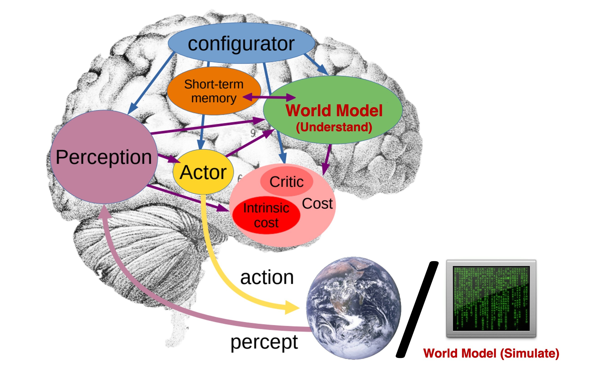
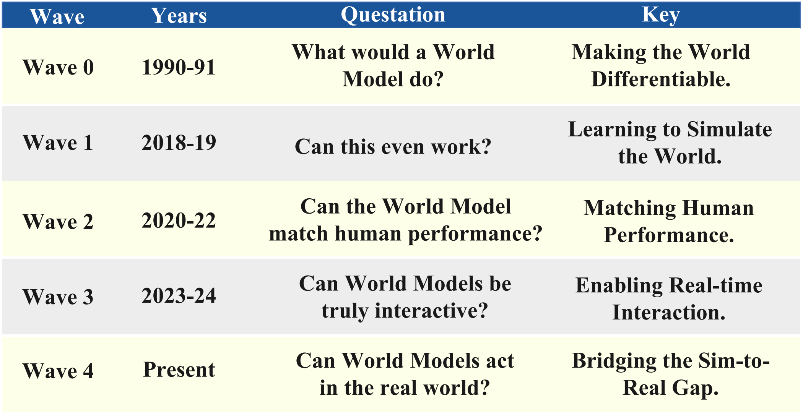
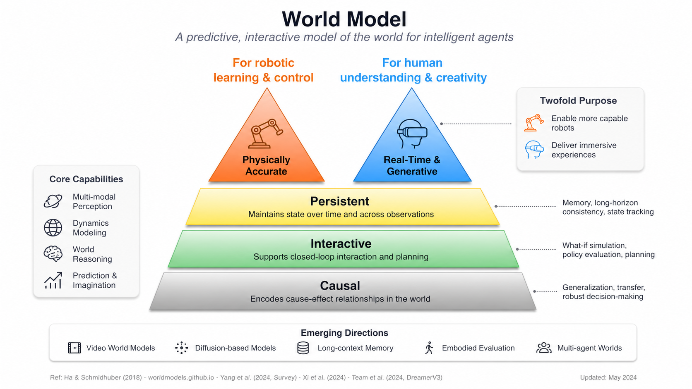

<div align="center">

# 🌍 Awesome World Models

[](https://awesome.re)
[](https://github.com/OpenEnvision/Awesome-World-Modeling/stargazers)
[](https://github.com/OpenEnvision/Awesome-World-Modeling/pulls)
[](https://github.com/OpenEnvision/Awesome-World-Modeling/blob/main/LICENSE)
[](https://github.com/OpenEnvision/Awesome-World-Modeling/commits/main/README.md)

**A scope-aware, paper-first curated list of world model research.**
Organized by paradigm first, then by domain, representation, and downstream use.

*Latest curation pass: **September 16, 2026**. See the [source audit and coverage notes](curation/2026-09-16.md).*

</div>

## 📰 News

- **[2026-09-16]** 🔎 **Research update.** We have updated the world model research list with additional papers and refreshed existing entries across the main research areas.

- **[2026-08-25]** 🧭 **Comprehensive refresh.** Handbook front-matter (how to use, reading roadmap, timeline, architecture cheat sheet, glossary, evaluation dimensions, labs, open problems, FAQ, list statistics) plus a large paper pass covering missing classics and July–August 2026 work across games, driving, robotics/WAMs, physics, JEPA, agentic systems, benchmarks, and workshops.
- **[2026-07-11]** 🎉 **[WorldFoundry](https://github.com/OpenEnvision/WorldFoundry)** and its companion repository **Awesome World Modeling** are now open source! We welcome ⭐ stars, bug reports, feature requests, discussions, and pull requests from the community.


| Internal & External "World Model" | Historical Wave Map |
| :---: | :---: |
|  |  |

---

## ⭐ Why Star This Repo?

There are many world-model paper lists. This one makes five specific commitments that the others usually do not, and it is maintained against them.

| Commitment | What it means in practice |
| --- | --- |
| **Paradigm-first taxonomy** | Entries are organized by *what the model is* — [Generative](#1--generative-world-models), [Representational](#2--representational-world-models), or [Agentic](#3--agentic-world-models), grounded in [Mind World Models](#0--mind-world-models--biological-origins--foundational-definitions) — before domain. A driving paper and a Minecraft paper that share an architecture family sit near each other conceptually; domain-first lists cannot show that. |
| **Strict inclusion heuristics** | A paper enters only when it clears the [practical boundary](#definition-and-scope): at least two of *models state*, *predicts state evolution under action or intervention*, *supports imagination, planning, evaluation, or controllable simulation*. Generic video generation, perception-only, and forecasting-only work is deliberately deprioritized — see [Deliberate non-goals](#definition-and-scope). |
| **Paper-first, primary sources, official code only** | Every entry links arXiv/venue pages, official project pages, and official repositories. Unofficial reimplementations are not badged as `GitHub` code. Blog posts are quarantined into [Selected Technical Blogs & Reports](#-selected-technical-blogs--reports) rather than mixed into the paper taxonomy. |
| **Cross-domain coverage under one definition** | Driving ([1.2](#12-autonomous-driving--generative), [2.3](#23-occupancy--bev-representations)), robotics ([1.3](#13-embodied-ai--robotics--generative)), games and interactive simulation ([1.1](#11-game--interactive-world-simulation)), science ([1.5](#15-scientific--physical-world-modeling)), 3D/4D worlds ([1.4](#14-3d--4d-scene-generation)), and LLM/GUI agents ([3.6](#36-llm--vlm--gui-agents-with-world-models)) are all held to the same working definition instead of being separate lists stapled together. |
| **Duplicate-aware curation** | A CI check (`scripts/check-arxiv-duplicates.mjs`) rejects any arXiv ID that appears twice unless it is explicitly allowlisted with a reason. Each paper has exactly one home; intentional cross-references use plain-text pointers like *(see §1.2.3)*. Large lists rot through silent duplication; this one cannot. |

Two smaller things that compound over time: every curation pass is **dated** (see the badge and the verification line at the top), and every entry carries a one-line, factual reason it matters — no entry is a bare link.

If that is the kind of map you want of this field, a star helps others find it.

[⬆ Back to Top](#-table-of-contents)

---

## 🚀 Start Here

| If you are interested in... | Start with |
| --- | --- |
| The definition and scope of world models | [Definition and Scope](#definition-and-scope), [Taxonomic Overview](#-taxonomic-overview) |
| Classic foundations and cognitive origins | [Mind World Models](#0--mind-world-models--biological-origins--foundational-definitions), [Latent Dynamics Models](#21-latent-dynamics-models-rssm--dreamer-family) |
| Video, games, and interactive simulation | [Game & Interactive World Simulation](#11-game--interactive-world-simulation), [General Video World Models](#16-general-video-world-models--rollout-backbones), [Persistent Narrative & Multi-Shot Video](#17--persistent-narrative--multi-shot-video-world-models) |
| Autonomous driving world models | [Autonomous Driving — Generative](#12-autonomous-driving--generative), [Occupancy & BEV Representations](#23-occupancy--bev-representations), [Closed-Loop Simulation & Evaluation](#33-closed-loop-simulation--evaluation) |
| Robotics, VLA, and World Action Models | [Embodied AI & Robotics](#13-embodied-ai--robotics--generative), [VLA & WAM](#134-world-model-based-vision-language-action-vla--world-action-models-wam), [World-Model-Guided Planning](#32-world-model-guided-planning) |
| Benchmarks, datasets, and open toolkits | [Evaluation Dimensions](#-evaluation-dimensions), [Benchmarks & Evaluation](#-benchmarks--evaluation), [Community Resources & Open Repositories](#-community-resources--open-repositories) |
| A guided reading order | [Reading Roadmap](#-reading-roadmap), [Historical Timeline](#-historical-timeline), [Architecture Cheat Sheet](#-architecture-cheat-sheet) |
| Terminology, labs, and open problems | [Glossary](#-glossary), [Labs, Companies & Open Stacks](#-labs-companies--open-stacks), [Open Problems](#-open-problems), [FAQ](#-faq) |

---

<a id="definition-and-scope"></a>

## 🗂️ Definition and Scope

### A short working definition

A **world model** is an internal predictive model of an environment that helps an agent answer:

> **What will happen if I act, wait, intervene, or imagine an alternative future?**

That definition is intentionally broader than model-based RL, but narrower than "any model that understands the world".

### World model vs. nearby concepts

| Concept | Core question | Typical output |
| --- | --- | --- |
| **world model** | what happens next under state, action, or intervention? | future observations, latent states, occupancy, trajectories, or executable rollouts |
| simulator | can the environment be replayed or executed? | environment transitions, often hand-built or learned |
| planner / policy | what should the agent do? | actions, plans, control sequences |
| perception model | what is in the scene now? | labels, detections, depth, segmentation |

### A practical boundary

A paper is strongest as a world-model entry when it does at least **two** of the following:
1. models state,
2. predicts state evolution under action or intervention,
3. supports imagination, planning, evaluation, or controllable simulation.

### Inclusion heuristics

- Prefer **primary sources**: arXiv, conference/journal pages, official project pages, and official repositories.
- Prefer papers with an explicit **dynamics / future / intervention** component over static perception-only work.
- Include adjacent work only when it materially improves the understanding of world models:
  latent planning, JEPA-style predictive representation learning, embodied evaluation, or physically grounded simulation.
- When a paper is domain-specific, place it by its **main technical role** first and by domain second.

### Deliberate non-goals

- This is **not** a generic list of video generation, VLA, or autonomous driving papers.
- Pure perception, segmentation, or forecasting papers without a genuine world-modeling role are deprioritized.
- Blog posts and secondary commentary are included selectively and are kept separate from the paper taxonomy.

---

## 🧭 How to Use This List

### Navigate by paradigm, then by domain

The taxonomy has one deliberate spine:

1. Decide **what kind of model** you care about. Synthesizing plausible futures → [1 · Generative](#1--generative-world-models). Learning structured internal state without pixel decoding → [2 · Representational](#2--representational-world-models). Coupling a world model to acting, planning, and evaluation → [3 · Agentic](#3--agentic-world-models). Cognitive and biological grounding → [0 · Mind World Models](#0--mind-world-models--biological-origins--foundational-definitions).
2. Then narrow by **domain or mechanism** inside that paradigm (e.g. 1.2 driving, 2.2 JEPA, 3.3 closed-loop evaluation).
3. When a paper is domain-specific, it is filed by its **main technical role first** and domain second. For example, JEPLO and GLAM live under JEPA (§2.2) because they predict latent representations, with robotics domains recorded on each entry.

The [Start Here](#-start-here) table maps common intents directly to sections. The [Taxonomic Overview](#-taxonomic-overview) shows the full tree at a glance.

### What the badges mean

| Badge | Meaning |
| --- | --- |
| `arXiv` | The arXiv paper; the badge label carries the full arXiv ID, so you can search the page for an ID you already know. |
| `GitHub` | **Official** code or the official project repository. Unofficial reimplementations are not badged. |
| `Project` | Official project page. |
| `HuggingFace` | Official model, dataset, space, or leaderboard. |
| `Blog` | Technical blog post or official research-lab write-up. |
| `Paper` | Non-arXiv primary source: DOI, OpenReview, or proceedings page. |

### Tables vs. bullets

Two entry formats coexist by design:

- **Tables** are used where a family is mature enough to compare on fixed columns: the [RSSM / Dreamer family](#21-latent-dynamics-models-rssm--dreamer-family), [MBRL](#31-model-based-reinforcement-learning-mbrl), [Surveys](#-surveys--position-papers), [Benchmarks](#-benchmarks--evaluation), and [Community Resources](#-community-resources--open-repositories).
- **Bullets with a one-line rationale** are used in fast-moving areas where entries do not yet share a comparable schema. The indented `>` line under each bullet states, factually, why the entry is in scope.

### Finding a paper you already know

Search the rendered page for the arXiv ID. Every `arXiv` badge label carries the full ID (`2408.14837`, `2608.14530`, …), so an ID search is unambiguous even when titles or acronyms collide.

### How a curation pass works

The header date is the last **full pass**, not the last commit. A pass means: (1) new in-scope papers since the previous date were considered against [Definition and Scope](#definition-and-scope); (2) arXiv IDs and metadata were checked; (3) duplicate and badge checks were run; (4) [List Statistics](#-list-statistics) were recomputed with `node scripts/check-list-stats.mjs --update README.md`; (5) search coverage and decisions were recorded under `curation/`. Structural changes are logged in [News](#-news).

### Finding code and reproducible stacks

- Skim any section for `GitHub` badges — they always mean official code.
- For end-to-end stacks (training recipes, checkpoints, serving), go straight to [Open Toolkits & Platforms](#-community-resources--open-repositories), which collects Cosmos, minWM, Matrix-Game, Genie Envisioner, DreamerV3, TD-MPC2, V-JEPA 2, OpenDWM, and others.
- Leaderboards and datasets have their own subsections under [Community Resources](#-community-resources--open-repositories).

### What this list is not

This is **not a video-generation dump**. A video model appears only when it explicitly targets control, causality, memory, or world-model conversion — that boundary is stated at the top of [§1.6 General Video World Models & Rollout Backbones](#16-general-video-world-models--rollout-backbones) and enforced even more tightly in [§1.7 Persistent Narrative & Multi-Shot Video](#17--persistent-narrative--multi-shot-video-world-models), which requires documented state, memory, or structured planning that crosses a shot boundary. Length, resolution, visual quality, and identity consistency alone never qualify a paper. If you want a broad video-generation list, several are linked in [Curated Lists & Awesome Repos](#-community-resources--open-repositories).

[⬆ Back to Top](#-table-of-contents)

---

## 📖 Table of Contents

- [⭐ Why Star This Repo?](#-why-star-this-repo)
- [🚀 Start Here](#-start-here)
- [🗂️ Definition and Scope](#definition-and-scope)
- [🧭 How to Use This List](#-how-to-use-this-list)
- [🗺️ Taxonomic Overview](#-taxonomic-overview)
- [🎓 Reading Roadmap](#-reading-roadmap)
- [⏳ Historical Timeline](#-historical-timeline)
- [🧩 Architecture Cheat Sheet](#-architecture-cheat-sheet)
- [0 · 🧠 Mind World Models — Biological Origins](#0--mind-world-models--biological-origins--foundational-definitions)
- [1 · 🎨 Generative World Models](#1--generative-world-models)
  - [1.1 🎮 Game & Interactive World Simulation](#11-game--interactive-world-simulation)
  - [1.2 🚗 Autonomous Driving — Generative](#12-autonomous-driving--generative)
  - [1.3 🤖 Embodied AI & Robotics — Generative](#13-embodied-ai--robotics--generative)
    - [1.3.4 VLA & World Action Models](#134-world-model-based-vision-language-action-vla--world-action-models-wam)
  - [1.4 🌐 3D / 4D Scene Generation](#14-3d--4d-scene-generation)
  - [1.5 🔬 Scientific & Physical World Modeling](#15-scientific--physical-world-modeling)
  - [1.6 🎞️ General Video World Models & Rollout Backbones](#16-general-video-world-models--rollout-backbones)
  - [1.7 🎬 Persistent Narrative & Multi-Shot Video World Models](#17--persistent-narrative--multi-shot-video-world-models)
- [2 · 🏗️ Representational World Models](#2--representational-world-models)
  - [2.1 Latent Dynamics Models (RSSM / Dreamer Family)](#21-latent-dynamics-models-rssm--dreamer-family)
  - [2.2 Joint Embedding Predictive Architectures (JEPA)](#22-joint-embedding-predictive-architectures-jepa)
  - [2.3 Occupancy & BEV Representations](#23-occupancy--bev-representations)
  - [2.4 Multimodal, Text, Acoustic & Memory-Oriented World Models](#24-multimodal-text-acoustic--memory-oriented-world-models)
  - [2.5 Symbolic & Knowledge-Graph World Models](#25-symbolic--knowledge-graph-world-models)
- [3 · 🤖 Agentic World Models](#3--agentic-world-models)
  - [3.1 Model-Based Reinforcement Learning (MBRL)](#31-model-based-reinforcement-learning-mbrl)
  - [3.2 World-Model-Guided Planning](#32-world-model-guided-planning)
  - [3.3 Closed-Loop Simulation & Evaluation](#33-closed-loop-simulation--evaluation)
  - [3.4 Multi-Agent World Models](#34-multi-agent-world-models)
  - [3.5 Safety-Aware Agentic World Models](#35-safety-aware-agentic-world-models)
  - [3.6 LLM / VLM / GUI Agents with World Models](#36-llm--vlm--gui-agents-with-world-models)
- [📚 Surveys & Position Papers](#-surveys--position-papers)
- [🚧 Open Problems](#-open-problems)
- [🧪 Evaluation Dimensions](#-evaluation-dimensions)
- [📊 Benchmarks & Evaluation](#-benchmarks--evaluation)
- [📘 Glossary](#-glossary)
- [🔬 Workshops & Challenges](#-workshops--challenges)
- [🌐 Community Resources & Open Repositories](#-community-resources--open-repositories)
- [🏭 Labs, Companies & Open Stacks](#-labs-companies--open-stacks)
- [📝 Selected Technical Blogs & Reports](#-selected-technical-blogs--reports)
- [❓ FAQ](#-faq)
- [📊 List Statistics](#-list-statistics)
- [📖 Citation](#-citation)
- [🤝 Contribution Guide](#-contribution-guide)

---

<a id="-taxonomic-overview"></a>

## 🗺️ Taxonomic Overview

```
World Models
│
├── 0. Mind World Models (Cognitive / Biological Grounding)
│   ├── 0.1 Cognitive & neuroscientific origins (Craik → Tolman → predictive coding → JEPA)
│   └── 0.2 Formative computational papers (Schmidhuber 1990 → Dyna → DreamerV3)
│
├── 1. Generative World Models  [focus: synthesizing plausible futures]
│   │
│   ├── By Domain / Task
│   │   ├── 1.1 Game & Interactive Simulation
│   │   │     1.1.1 Pixel-space engines (GAN / CNN / diffusion)
│   │   │     1.1.2 Autoregressive transformers
│   │   │     1.1.3 Memory-augmented & long-horizon game worlds
│   │   ├── 1.2 Autonomous Driving
│   │   │     1.2.1 Multi-view camera  ·  1.2.2 Occupancy / BEV
│   │   │     1.2.3 LiDAR / 4D points  ·  1.2.4 Language-guided
│   │   ├── 1.3 Embodied AI & Robotics
│   │   │     1.3.1 Manipulation  ·  1.3.2 Navigation  ·  1.3.3 Locomotion
│   │   │     1.3.4 VLA & World Action Models (WAM)  ·  1.3.5 Real2Sim
│   │   ├── 1.4 3D / 4D Scene Generation
│   │   ├── 1.5 Scientific & Physical World Modeling
│   │   ├── 1.6 General Video World Models & Rollout Backbones
│   │   └── 1.7 Persistent Narrative & Multi-Shot Video World Models
│   │
│   └── By Architecture (cross-domain) — see Architecture Cheat Sheet
│       ├── Diffusion video WM
│       ├── Autoregressive transformer WM
│       ├── RSSM / Dreamer  ·  JEPA
│       ├── Occupancy / BEV  ·  3DGS / NeRF
│       └── LLM text WM  ·  World Action Models
│
├── 2. Representational World Models  [focus: learning structured internal state]
│   ├── 2.1 Latent Dynamics Models (RSSM / Dreamer)
│   ├── 2.2 Joint Embedding Predictive Architectures (JEPA)
│   ├── 2.3 Occupancy & BEV Representations
│   ├── 2.4 Multimodal, Text, Acoustic & Memory-Oriented World Models
│   └── 2.5 Symbolic & Knowledge-Graph World Models
│
└── 3. Agentic World Models  [focus: acting, planning, decision-making]
    │   (= World Foundation Model + Agentic Framework)
    ├── 3.1 Model-Based Reinforcement Learning (MBRL)
    ├── 3.2 World-Model-Guided Planning
    ├── 3.3 Closed-Loop Simulation & Evaluation
    ├── 3.4 Multi-Agent World Models
    ├── 3.5 Safety-Aware Agentic World Models
    └── 3.6 LLM / VLM / GUI Agents with World Models
```

### Working definitions

| Term | Definition |
|------|-----------|
| **Mind World Model** | The biological and cognitive intuition that an intelligent system carries an internal model of the world and uses it for prediction, imagination, and counterfactual reasoning. |
| **Generative World Model** | Predicts or synthesizes plausible future observations, often pixels, video, occupancy, or point clouds. |
| **Representational World Model** | Predicts future *state* or *latent structure* without requiring photorealistic decoding. |
| **World Foundation Model (WFM)** | A pretrained model of environment structure and dynamics that can support simulation, planning, forecasting, or data generation across downstream tasks. |
| **JEPA** | A joint-embedding predictive architecture: predict future or missing *representations*, not pixels. The non-generative counterpoint to Section 1; see [§2.2](#22-joint-embedding-predictive-architectures-jepa). |
| **World Action Model (WAM)** | A model that jointly predicts futures *and* actions in one backbone, typically initialized from video generation. Distinct from a VLA, which maps observation + language directly to actions. See [§1.3.4](#134-world-model-based-vision-language-action-vla--world-action-models-wam). |
| **Agentic World Model** | A WFM coupled with action selection, planning, memory, tool use, or policy optimization in a closed loop. |

[⬆ Back to Top](#-table-of-contents)

---

## 🎓 Reading Roadmap

Three tracks. Each step names papers that are already entries in this list; follow the section link to find full citations, badges, and code.

### Track 1 — Newcomer (build the concept from zero)

Goal: understand what a world model is, where the idea comes from, and what the modern instantiations look like — roughly 7 stops.

1. **The definition.** Read [Definition and Scope](#definition-and-scope) and the working definitions under [Taxonomic Overview](#-taxonomic-overview). Ten minutes that prevent months of terminology confusion.
2. **The seminal paper.** *World Models* (Ha & Schmidhuber, 2018) and its NeurIPS version *Recurrent World Models Facilitate Policy Evolution* — in [§0.1–0.2](#0--mind-world-models--biological-origins--foundational-definitions). Learn V-M-C: compress perception, predict in latent space, train a controller entirely inside the dream.
3. **Latent dynamics done right.** *PlaNet* (RSSM) and *Dream to Control* (Dreamer), then skim *DreamerV2/V3* — in [§0.2](#0--mind-world-models--biological-origins--foundational-definitions) and the comparison table in [§2.1](#21-latent-dynamics-models-rssm--dreamer-family). This is the reinforcement-learning lineage of the field.
4. **The generative-interactive turn.** *Genie: Generative Interactive Environments*, then the *Genie 2* and *Genie 3* lab reports — in [§1.1.2](#11-game--interactive-world-simulation). Latent actions learned from unlabeled video; playable worlds from a prompt.
5. **The non-generative counterpoint.** *V-JEPA* (and LeCun's *A Path Towards Autonomous Machine Intelligence*, [§0.1](#0--mind-world-models--biological-origins--foundational-definitions)) — in [§2.2](#22-joint-embedding-predictive-architectures-jepa). Predict representations, not pixels; understand why this is an argument, not just an architecture.
6. **One driving paper.** *GAIA-1* — in [§1.2.1](#12-autonomous-driving--generative). The first large-scale autoregressive driving world model; sets up everything that follows in §1.2. (*OccWorld* in [§1.2.2](#12-autonomous-driving--generative) is the natural second read for the geometry-first side.)
7. **One robotics paper.** *UniSim: Learning Interactive Real-World Simulators* — in [§1.3.1](#13-embodied-ai--robotics--generative). A learned action-conditioned simulator of real-world interaction; the conceptual bridge to WAMs.

After these seven, the [Historical Timeline](#-historical-timeline) and [Architecture Cheat Sheet](#-architecture-cheat-sheet) below will read as review rather than news.

### Track 2 — Practitioner (build something this quarter)

Goal: pick a stack with open weights or code and a known deployment story. All of these have `GitHub` badges and live under [Open Toolkits & Platforms](#-community-resources--open-repositories) plus their taxonomy homes.

| Stack | What it gives you | Where |
| --- | --- | --- |
| **NVIDIA Cosmos** (incl. Cosmos-Predict2.5, Cosmos 3) | Open world-foundation-model platform for Physical AI: pretrained video WFMs, post-training recipes, driving pipeline (Cosmos-Drive-Dreams) | [Toolkits](#-community-resources--open-repositories), [§1.6](#16-general-video-world-models--rollout-backbones) |
| **DreamerV3** | Reference latent-dynamics MBRL agent; single hyperparameter set across domains; the default baseline for imagination-based RL | [§2.1](#21-latent-dynamics-models-rssm--dreamer-family), [§3.1](#31-model-based-reinforcement-learning-mbrl) |
| **TD-MPC2** | Scalable latent MPC for continuous control (104 tasks); decoder-free, robust defaults | [§2.1](#21-latent-dynamics-models-rssm--dreamer-family), [§1.3.3](#13-embodied-ai--robotics--generative) |
| **V-JEPA 2** | Self-supervised video representation + action-conditioned latent planning; zero-shot manipulation recipes; official checkpoints on HuggingFace | [§2.2](#22-joint-embedding-predictive-architectures-jepa), [§1.3.4](#134-world-model-based-vision-language-action-vla--world-action-models-wam) |
| **Matrix-Game** (1.0 → 3.0) | Open interactive game-world stack: real-time streaming rollouts, long-horizon memory in 3.0 | [§1.1.1](#11-game--interactive-world-simulation), [Toolkits](#-community-resources--open-repositories) |
| **Genie Envisioner** | Unified robotic-manipulation world platform: imagination, policy evaluation, and data generation in one loop (AgiBot) | [§1.3.1](#13-embodied-ai--robotics--generative), [Toolkits](#-community-resources--open-repositories) |

Supporting picks, depending on the problem: **minWM** and **Causal Forcing** for converting a video backbone into a real-time interactive world model ([§1.6](#16-general-video-world-models--rollout-backbones)); **OpenDWM** for driving; **stable-worldmodel** and **Nano World Models** for controlled research baselines (all under [Toolkits](#-community-resources--open-repositories)).

### Track 3 — Researcher (find the frontier)

1. **Surveys first.** From the [Surveys & Position Papers](#-surveys--position-papers) tables: *Understanding World or Predicting Future?* for the broad taxonomy, *Is Sora a World Simulator?* for the generative debate, *World Action Models: A Survey* and *World Action Models: The Next Frontier* for the WAM consolidation, plus the domain surveys for driving and embodied AI.
2. **Theory and safety.** The [Safety & Theory](#-surveys--position-papers) table (*When Does LeJEPA Learn a World Model?*, *General Agents Contain World Models*, *Critiques of World Models*, identifiability and value-equivalence results in [§2.1](#21-latent-dynamics-models-rssm--dreamer-family)–[§2.2](#22-joint-embedding-predictive-architectures-jepa)) and [§3.5 Safety-Aware Agentic World Models](#35-safety-aware-agentic-world-models) for the attack-surface literature.
3. **Benchmarks.** Read [Evaluation Dimensions](#-evaluation-dimensions) below as the index, then go metric-shopping in [Benchmarks & Evaluation](#-benchmarks--evaluation). Pay attention to closed-loop utility benchmarks (World-in-World, WorldGym, WorldEval) versus rollout-quality benchmarks — they disagree, and that disagreement is a research topic.
4. **Open problems.** The [Open Problems](#-open-problems) section below distills what the 2025–2026 surveys actually argue about, with entry points into the taxonomy for each.

[⬆ Back to Top](#-table-of-contents)

---

## ⏳ Historical Timeline

Two eras, compact by design. Every named work below is an entry in this list — follow the section link for the full citation, badges, and one-line rationale.

### Cognitive and computational origins (1943–2018)

| Year | Milestone | Why it matters |
| --- | --- | --- |
| 1943 | Craik, *The Nature of Explanation* — [§0.1](#0--mind-world-models--biological-origins--foundational-definitions) | First articulation of the mind carrying a "small-scale model" of external reality used to try out alternatives before acting. |
| 1948 | Tolman, *Cognitive Maps in Rats and Men* — [§0.1](#0--mind-world-models--biological-origins--foundational-definitions) | Latent spatial representations inferred from behavior; the empirical ancestor of learned internal state. |
| 1978 | O'Keefe & Nadel, *The Hippocampus as a Cognitive Map* — [§0.1](#0--mind-world-models--biological-origins--foundational-definitions) | Place cells as the neural substrate of Tolman's map; foundation for spatial world-model research. |
| 1983 | Johnson-Laird, *Mental Models* — [§0.1](#0--mind-world-models--biological-origins--foundational-definitions) | Reasoning over constructed internal models of situations rather than formal logic. |
| 1989 | Occupancy Grids (Elfes) — [§0.1](#0--mind-world-models--biological-origins--foundational-definitions) | First computational spatial world model for a physical agent; ancestor of [§2.3](#23-occupancy--bev-representations). |
| 1990 | Schmidhuber, *Making the World Differentiable* — [§0.2](#0--mind-world-models--biological-origins--foundational-definitions) | Recurrent controller–model architecture cited by Ha & Schmidhuber (2018) as the direct ancestor of learned neural world models. |
| 1991 | Sutton, Dyna — [§0.2](#0--mind-world-models--biological-origins--foundational-definitions) | Learning, planning, and reacting integrated through imagined experience; "Dyna-style rollouts" survive in the [MBRL table](#31-model-based-reinforcement-learning-mbrl). |
| 1993 | Successor Representations (Dayan) — [§0.1](#0--mind-world-models--biological-origins--foundational-definitions) | Encode future occupancy of states rather than immediate reward — predictive representation before deep learning. |
| 1995 | Wolpert et al., internal models for sensorimotor integration — [§0.1](#0--mind-world-models--biological-origins--foundational-definitions) | Forward models predict sensory consequences of motor commands — the neuroscience blueprint for action-conditioned prediction. |
| 1999 | Rao & Ballard, predictive coding in visual cortex — [§0.1](#0--mind-world-models--biological-origins--foundational-definitions) | Concrete computational predictive-coding model; higher areas predict lower-level activity. |
| 2010 | Friston, free-energy principle — [§0.1](#0--mind-world-models--biological-origins--foundational-definitions) | The brain as a hierarchical prediction-error-minimizing machine. |
| 2011 | PILCO — [§0.2](#0--mind-world-models--biological-origins--foundational-definitions) | Gaussian-process dynamics with analytic uncertainty; the data-efficiency reference point for model-based policy search. |
| 2013 | Battaglia et al., mental simulation / intuitive physics — [§0.1](#0--mind-world-models--biological-origins--foundational-definitions) | Humans run fast approximate physics simulations as a world model. |
| 2015 | E2C and Action-Conditional Video Prediction — [§0.2](#0--mind-world-models--biological-origins--foundational-definitions) | Latent dynamics from pixels, and deep action-conditioned next-frame prediction at Atari scale. |
| 2017 | VPN, I2A, Successor Features — [§0.2](#0--mind-world-models--biological-origins--foundational-definitions) | Value-equivalent abstract models, imagination-augmented agents, and deep successor representations. |
| 2018 | World Models (Ha & Schmidhuber) + NeurIPS version; TDM; GQN — [§0.1–0.2](#0--mind-world-models--biological-origins--foundational-definitions) | The term enters modern ML: V-M-C, training a controller inside the dream; also goal-conditioned implicit dynamics and neural scene rendering. |

### The scaling era (2018–2026)

| Year | Milestones (all entries in this list) | Where |
| --- | --- | --- |
| 2019 | **PlaNet** (*ICML*) introduces RSSM and latent-space planning; **MBPO** (*NeurIPS*) formalizes Dyna-style model-based policy optimization; **DPI-Net** (*ICLR*) brings graph-network particle physics. | [§0.2](#0--mind-world-models--biological-origins--foundational-definitions), [§3.1](#31-model-based-reinforcement-learning-mbrl), [§1.5.1](#15-scientific--physical-world-modeling) |
| 2020 | **Dreamer** (*ICLR*) trains actor-critic fully in imagination; **MuZero** (*Nature*) plans with a learned value-equivalent dynamics model, no rules given. | [§0.2](#0--mind-world-models--biological-origins--foundational-definitions), [§3.1](#31-model-based-reinforcement-learning-mbrl) |
| 2021 | **DreamerV2** (*ICLR*) makes discrete latents work; **EfficientZero** (*NeurIPS*) reaches Atari sample-efficiency milestones; **Pathdreamer** (*ICCV*) is an early visual world model for navigation. | [§0.2](#0--mind-world-models--biological-origins--foundational-definitions), [§3.1](#31-model-based-reinforcement-learning-mbrl), [§1.3.2](#13-embodied-ai--robotics--generative) |
| 2022 | **LeCun's position paper** proposes JEPA-centered autonomous machine intelligence; **TD-MPC** (*ICML*) fuses TD learning with latent MPC; **Iso-Dream** (*NeurIPS*) disentangles controllable dynamics. | [§0.1](#0--mind-world-models--biological-origins--foundational-definitions), [§2.1](#21-latent-dynamics-models-rssm--dreamer-family) |
| 2023 | **DreamerV3** generalizes across domains with fixed hyperparameters; **I-JEPA** (*CVPR*) lands the JEPA program in vision; **GAIA-1** (Wayve) is the first large-scale generative driving world model; **UniPi** turns text-guided video generation into policies; **Pangu-Weather** (*Nature*) and **GraphCast** (*Science*) show learned earth-system dynamics beating traditional simulation. | [§0.2](#0--mind-world-models--biological-origins--foundational-definitions), [§2.2](#22-joint-embedding-predictive-architectures-jepa), [§1.2.1](#12-autonomous-driving--generative), [§1.3.4](#134-world-model-based-vision-language-action-vla--world-action-models-wam), [§1.5.2](#15-scientific--physical-world-modeling) |
| 2024 | OpenAI frames Sora as a "world simulator", igniting the debate (*Is Sora a World Simulator?* survey; *PhyWorld* physical-law critique); **Genie** learns latent actions from unlabeled video; **GameNGen** runs DOOM in a diffusion model in real time; **Oasis** generates Minecraft token-by-token; **V-JEPA** (*ICLR*) and **TD-MPC2** (*ICLR*) mature the representational side; **OccWorld** (*ECCV*) and **Copilot4D** (*ICLR*) establish occupancy/LiDAR world models; **Genie 2** (December) generates playable 3D worlds from one image; **DIAMOND** (*NeurIPS*) shows diffusion world models paying off for RL. | [Surveys](#-surveys--position-papers), [§1.5.1](#15-scientific--physical-world-modeling), [§1.1](#11-game--interactive-world-simulation), [§2.2](#22-joint-embedding-predictive-architectures-jepa), [§2.1](#21-latent-dynamics-models-rssm--dreamer-family), [§1.2.2–1.2.3](#12-autonomous-driving--generative), [§3.1](#31-model-based-reinforcement-learning-mbrl) |
| 2025 | **NVIDIA Cosmos** ships open world foundation models for Physical AI (January), extended by **Cosmos-Predict2.5** and **Cosmos-Drive-Dreams**; **GAIA-2** adds controllable multi-view driving; **V-JEPA 2** demonstrates zero-shot robot manipulation from internet-scale video pretraining; **Matrix-Game** and **Matrix-Game 2.0** open-source real-time interactive game worlds; **Genie 3** (August) reaches real-time 24 fps text-to-world generation; **Genie Envisioner** unifies robot imagination, evaluation, and data generation; **HunyuanWorld 1.0** generates explorable 3D worlds; **DreamerV4** scales agent-side world-model training; **PAN** targets general long-horizon interactive simulation. | [Toolkits](#-community-resources--open-repositories), [§1.2.1](#12-autonomous-driving--generative), [§2.2](#22-joint-embedding-predictive-architectures-jepa), [§1.1](#11-game--interactive-world-simulation), [§1.3.1](#13-embodied-ai--robotics--generative), [§1.4.1](#14-3d--4d-scene-generation), [§3.1](#31-model-based-reinforcement-learning-mbrl), [§1.6](#16-general-video-world-models--rollout-backbones) |
| 2026 | **Cosmos 3** unifies language, image, video, audio, and action in one omnimodal WFM family; **HY-World 2.0** and **Matrix-Game 3.0** push open 3D/interactive stacks; **V-JEPA 2.1** densifies JEPA video features; the **World Action Model (WAM)** wave consolidates — dedicated surveys (*World Action Models: A Survey*; *The Next Frontier*), open stacks (**DreamZero**), and a dense §1.3.4 of video-action models; memory, evaluation, and safety become first-class subfields (§1.1.3, §3.3, §3.5). | [§1.6](#16-general-video-world-models--rollout-backbones), [§1.4.1](#14-3d--4d-scene-generation), [§1.1.3](#11-game--interactive-world-simulation), [§2.2](#22-joint-embedding-predictive-architectures-jepa), [§1.3.4](#134-world-model-based-vision-language-action-vla--world-action-models-wam), [Surveys](#-surveys--position-papers), [§3.3](#33-closed-loop-simulation--evaluation), [§3.5](#35-safety-aware-agentic-world-models) |

[⬆ Back to Top](#-table-of-contents)

---

## 🧩 Architecture Cheat Sheet

Eight architecture families that account for nearly every entry in this list. "State" is what the model carries between steps; "prediction target" is what it is trained to output; "failure modes" are the documented ones, not hypotheticals. Canonical papers are all entries here — follow the section links for citations and code.

| Family | State | Prediction target | Action conditioning | Strengths | Failure modes | Canonical papers (in this list) |
| --- | --- | --- | --- | --- | --- | --- |
| **Diffusion video WM** | Implicit — a window of recent frames or video latents | Future frames (pixel or VAE-latent), denoised | Actions/trajectories/text injected as conditioning; often weak by default | Visual fidelity; inherits video-generation pretraining; multimodal futures | Compounding error over long rollouts; action conditioning ignored under classifier-free guidance; slow sampling without distillation | GameNGen, DIAMOND ([§1.1.1](#11-game--interactive-world-simulation)); Vista ([§1.2.1](#12-autonomous-driving--generative)); Cosmos family ([§1.6](#16-general-video-world-models--rollout-backbones)) |
| **AR transformer WM** | Discrete token history (VQ codes) with KV cache | Next visual tokens / frames | Interleaved action tokens or learned latent actions | Streaming and real-time by construction; unified with LLM tooling; latent actions learnable from unlabeled video | Tokenizer artifacts; finite context → spatial forgetting; exposure bias | Genie, Oasis, MineWorld ([§1.1.2](#11-game--interactive-world-simulation)); iVideoGPT ([§1.6](#16-general-video-world-models--rollout-backbones)); DrivingGPT ([§1.2.4](#12-autonomous-driving--generative)) |
| **RSSM / Dreamer family** | Compact deterministic + stochastic latent | Next latent state (+ reward, value; decoder optional) | Explicit action input to the transition function | Extremely cheap rollouts → sample-efficient RL in imagination; stable training recipes | Limited visual capacity; mostly proven at simulator scale; latent hallucination outside the data manifold | PlaNet, Dreamer, DreamerV2/V3 ([§2.1](#21-latent-dynamics-models-rssm--dreamer-family)); DreamerV4 ([§3.1](#31-model-based-reinforcement-learning-mbrl)); TD-MPC2 (decoder-free relative, [§2.1](#21-latent-dynamics-models-rssm--dreamer-family)) |
| **JEPA** | Embedding produced by a target encoder | Representation of future/masked content — no pixel decoding (energy-based objective) | Optional: action-conditioned predictor (V-JEPA 2, DUET-DINO) | Ignores unpredictable pixel detail; strong transfer; cheap planning in representation space | No renderable output for humans; representation collapse without careful regularization; evaluation is indirect | I-JEPA, V-JEPA, V-JEPA 2/2.1, LeWorldModel ([§2.2](#22-joint-embedding-predictive-architectures-jepa)) |
| **Occupancy / BEV WM** | Explicit 3D voxel occupancy or BEV grid | Future occupancy / BEV frames | Ego trajectory, agent commands, language (OccLLaMA) | Metric geometry; direct planner interface; sensor-fusion friendly | Resolution–memory trade-off; appearance-free (needs a renderer for photorealism); semantic sparsity | OccWorld, Drive-OccWorld, DOME ([§1.2.2](#12-autonomous-driving--generative)); OccSora, BEVWorld ([§2.3](#23-occupancy--bev-representations)) |
| **3DGS / NeRF worlds** | Explicit persistent 3D scene (Gaussians, fields, meshes) | Novel-view renders + scene evolution | Camera trajectory; object-level edits; physics add-ons | 3D consistency by construction; revisitable, editable, engine-loadable worlds | Dynamics usually bolted on; costly scene construction; closed-world assumption | EmerNeRF, 4D Gaussian Splatting, HunyuanWorld 1.0, LayerPano3D ([§1.4.1](#14-3d--4d-scene-generation)); GWM, GaussianWorld ([§1.3.1](#13-embodied-ai--robotics--generative), [§1.2.2](#12-autonomous-driving--generative)) |
| **LLM text WM** | Textual / symbolic state description | Next state description, transition validity, or executable program | Text actions; tool calls | Abstract and counterfactual reasoning; composable with agent frameworks; cheap | State drift and hallucination over steps; weak physical/spatial grounding; hard to verify | LLM-Sim ([§2.4](#24-multimodal-text-acoustic--memory-oriented-world-models)); RAP, WebDreamer, CWM ([§3.6](#36-llm--vlm--gui-agents-with-world-models)); Text2World, PoE-World ([§2.5](#25-symbolic--knowledge-graph-world-models)) |
| **WAM (world action model)** | Shared video–action latent | **Joint**: future video (or latent) *and* actions | Intrinsic — action is an output as much as an input | Policy and simulator in one model; transfers video pretraining into control; zero-shot policy results | Inference cost of imagining before acting; video-action generalization gap; evaluation protocols still immature | WorldVLA, UWM, UVA, DreamZero, LingBot-VA ([§1.3.4](#134-world-model-based-vision-language-action-vla--world-action-models-wam)); WAM surveys ([Surveys](#-surveys--position-papers)) |

Reading the table: the top half trades **fidelity against control** (diffusion vs. AR), the middle trades **capacity against efficiency** (RSSM/JEPA vs. pixel models), and the bottom half trades **structure against openness** (occupancy/3D worlds vs. text vs. joint video-action). Most 2026 systems are hybrids that pick one row as a backbone and borrow mechanisms from two others.

[⬆ Back to Top](#-table-of-contents)

---

<a id="0--mind-world-models--biological-origins--foundational-definitions"></a>

## 0 · 🧠 Mind World Models — Biological Origins & Foundational Definitions

> The concept of a "world model" originates in cognitive science and neuroscience. An agent's internal model of its environment allows it to predict sensory consequences of its own actions—the computational substrate of planning, imagination, and counterfactual reasoning. The papers below form the intellectual backbone of modern machine world models.

### 0.1 Foundational Cognitive & Neuroscientific Works

> Listed in chronological order, from Craik's 1943 "small-scale model" through the cognitive-map and predictive-coding traditions to Ha & Schmidhuber (2018) and LeCun's JEPA program (2022).

- **Primate Vision and Predictive Models** — "Primate vision reveals a missing principle for robust dynamic AI." *arXiv* 2608.23790 (2026). [](https://arxiv.org/abs/2608.23790)
  > Compares predictive world-model representations with human behavior and macaque cortex, identifying strengths in appearance-invariant motion coding and a remaining temporal-integration gap.

- **The Nature of Explanation (Craik)** — Craik, K.J.W. *The Nature of Explanation.* Cambridge University Press (1943). [](https://archive.org/details/natureofexplanat0000crai)
  > **Origin of the concept.** First articulation that organisms carry a "small-scale model" of external reality in their heads, enabling them to try out alternatives and react to future situations before they arise.

- **Cognitive Maps in Rats and Men (Tolman)** — Tolman, E.C. "Cognitive Maps in Rats and Men." *Psychological Review* 55(4):189–208 (1948). [](https://psychclassics.yorku.ca/Tolman/Maps/maps.htm)
  > Classic behavioral evidence that animals learn map-like internal representations of the environment rather than mere stimulus-response chains — the ancestral "world model" in psychology.

- **The Hippocampus as a Cognitive Map** — O'Keefe, J. & Nadel, L. *The Hippocampus as a Cognitive Map.* Oxford University Press (1978).
  > Landmark neuroscience synthesis identifying the hippocampus (place cells) as the neural substrate of Tolman's cognitive map; foundation for spatial world-model research.

- **Mental Models (Johnson-Laird)** — Johnson-Laird, P.N. *Mental Models: Towards a Cognitive Science of Language, Inference, and Consciousness.* Harvard University Press (1983).
  > Cognitive-science theory that reasoning operates over constructed internal models of situations rather than formal logic rules — a direct intellectual ancestor of "mental world modeling."

- **Occupancy Grids** — Elfes, A. "Using Occupancy Grids for Mobile Robot Perception and Navigation." *Computer* (1989). [](http://www.sci.brooklyn.cuny.edu/~parsons/courses/3415-fall-2011/papers/elfes.pdf)
  > First computational formalization of a spatial world model for a physical agent.

- **Successor Representations** — Dayan, P. "Improving Generalization for Temporal Difference Learning: The Successor Representation." *Neural Computation* (1993).
  > Foundational representation: encode the future occupancy of states rather than immediate reward.

- **Internal Models for Sensorimotor Integration** — Wolpert, D.M., Ghahramani, Z. & Jordan, M.I. "An Internal Model for Sensorimotor Integration." *Science* 269(5232):1880–1882 (1995). [](https://www.science.org/doi/10.1126/science.7569931)
  > Canonical evidence that the brain uses forward models to predict sensory consequences of motor commands — the neuroscience blueprint for action-conditioned prediction.

- **Predictive Coding in the Visual Cortex** — Rao, R.P.N. & Ballard, D.H. "Predictive Coding in the Visual Cortex: A Functional Interpretation of Some Extra-Classical Receptive-Field Effects." *Nature Neuroscience* 2:79–87 (1999). [](https://www.nature.com/articles/nn0199_79)
  > The concrete computational predictive-coding model (predating Friston's free-energy generalization): higher cortical areas predict lower-level activity and feed back prediction errors.

- **Predictive Coding / Free Energy Principle** — Friston, K. "The free-energy principle: a unified brain theory?" *Nature Reviews Neuroscience* (2010). [](https://www.nature.com/articles/nrn2787)
  > Neuro-scientific grounding: the brain as a hierarchical Bayesian inference machine minimizing prediction error.

- **Mental Simulation / Theory of Mind** — Battaglia, P. et al. "Simulation as an engine of physical scene understanding." *PNAS* (2013). [](https://www.pnas.org/doi/10.1073/pnas.1306572110)
  > Humans use fast approximate physics simulators as a world model for intuitive physics.

- **World Models (Ha & Schmidhuber)** — Ha, D. & Schmidhuber, J. "World Models." *arXiv* 1803.10122 (2018). [](https://arxiv.org/abs/1803.10122) [](https://worldmodels.github.io/)
  > **Seminal work.** Learn a compressed (V) perception model + recurrent (M) world model, train a small controller (C) entirely inside imagination. Introduced MDN-RNN for stochastic world model.

- **A Path Towards Autonomous Machine Intelligence (LeCun)** — LeCun, Y. "A Path Towards Autonomous Machine Intelligence." *OpenReview* (2022). [](https://openreview.net/pdf?id=BZ5a1r-kVsf)
  > Proposes a modular architecture centered on a **Joint Embedding Predictive Architecture (JEPA)** world model for energy-efficient reasoning without pixel-level generation.

### 0.2 Formative Computational World Model Papers

> Listed in chronological order. This is the computational spine that [§2.1](#21-latent-dynamics-models-rssm--dreamer-family) and [§3.1](#31-model-based-reinforcement-learning-mbrl) then scale: recurrent differentiable models (1990), Dyna-style imagination (1991), latent dynamics and action-conditional video (2011–2018), then RSSM/Dreamer (2019–2023).

- **Making the World Differentiable (Schmidhuber)** — Schmidhuber, J. "Making the World Differentiable: On Using Self-Supervised Fully Recurrent Neural Networks for Dynamic Reinforcement Learning and Planning in Non-Stationary Environments." *TR FKI-126-90, TU Munich* (1990). [](https://people.idsia.ch/~juergen/FKI-126-90_(revised)bw_ocr.pdf)
  > The 1990 recurrent controller–model architecture cited by Ha & Schmidhuber (2018) as the direct ancestor of learned neural world models for planning.

- **Dyna (Sutton)** — Sutton, R.S. "Dyna, an Integrated Architecture for Learning, Planning, and Reacting." *ACM SIGART Bulletin* 2(4):160–163 (1991). [](https://dl.acm.org/doi/10.1145/122344.122377)
  > **Foundational MBRL architecture.** Interleaves real experience with simulated experience from a learned model — the template behind MBPO-style rollouts and modern "Dyna-style" agents.

- **PILCO** — Deisenroth, M.P. & Rasmussen, C.E. "PILCO: A Model-Based and Data-Efficient Approach to Policy Search." *ICML* 2011. [](https://mlg.eng.cam.ac.uk/pub/pdf/DeiRas11.pdf)
  > Gaussian-process dynamics model with analytic uncertainty propagation; long-standing reference point for data-efficient model-based policy search.

- **Embed to Control (E2C)** — Watter, M. et al. "Embed to Control: A Locally Linear Latent Dynamics Model for Control from Raw Images." *NeurIPS* 2015. [](https://arxiv.org/abs/1506.07365)
  > Early latent dynamics model learned from pixels with locally linear transitions enabling optimal control in latent space — a precursor of PlaNet-style latent planning.

- **Action-Conditional Video Prediction** — Oh, J. et al. "Action-Conditional Video Prediction using Deep Networks in Atari Games." *NeurIPS* 2015. [](https://arxiv.org/abs/1507.08750)
  > First deep action-conditioned video prediction at scale (Atari); established the action-conditional next-frame formulation used by generative world models today.

- **Successor Features** — Barreto, A. et al. "Successor Features for Transfer in Reinforcement Learning." *NeurIPS* 2017. [](https://arxiv.org/abs/1606.05312)
  > Generalizes Dayan's successor representation to deep features; decouples environment dynamics from rewards for transfer — a key representational world-model idea.

- **Value Prediction Network (VPN)** — Oh, J., Singh, S. & Lee, H. "Value Prediction Network." *NeurIPS* 2017. [](https://arxiv.org/abs/1707.03497)
  > Plans with an abstract model that predicts future values and rewards rather than future observations — direct precursor of MuZero's value-equivalent world model.

- **Imagination-Augmented Agents (I2A)** — Racanière, S., Weber, T. et al. "Imagination-Augmented Agents for Deep Reinforcement Learning." *NeurIPS* 2017. [](https://arxiv.org/abs/1707.06203)
  > Learns to interpret imperfect learned-model rollouts as additional context for a model-free policy — an early, influential template for "imagination" in agents.

- **Temporal Difference Models (TDM)** — Pong, V., Gu, S., Dalal, M. & Levine, S. "Temporal Difference Models: Model-Free Deep RL for Model-Based Control." *ICLR* 2018. [](https://arxiv.org/abs/1802.09081)
  > Bridges model-free and model-based RL: goal-conditioned value functions trained model-free act as implicit horizon-varying dynamics models for planning.

- **Generative Query Networks (GQN)** — Eslami, S.M.A. et al. "Neural Scene Representation and Rendering." *Science* 360(6394):1204–1210 (2018). [](https://www.science.org/doi/10.1126/science.aar6170)
  > Learns implicit 3D scene representations from posed observations and renders unseen viewpoints — formative for viewpoint-consistent neural scene world models.

- **Recurrent World Models Facilitate Policy Evolution** — Ha, D. & Schmidhuber, J. *NeurIPS* 2018. [](https://papers.nips.cc/paper_files/paper/2018/hash/2de5d16682c3c35007e4bbd7153108d1-Abstract.html)
  > Conference version of *World Models* ([§0.1](#0--mind-world-models--biological-origins--foundational-definitions)): V-M-C trained entirely in imagination, with evolution of a compact controller inside the MDN-RNN dream.

- **Learning Latent Dynamics for Planning (PlaNet)** — Hafner, D. et al. *ICML* 2019. [](https://arxiv.org/abs/1811.04551) [](https://github.com/google-research/planet)
  > Introduced RSSM (Recurrent State-Space Model): separate deterministic and stochastic latent paths; latent-space cross-entropy planning.

- **Learning to Predict Without Looking Ahead** — Freeman, C. D., Metz, L. & Ha, D. "Learning to Predict Without Looking Ahead: World Models Without Forward Prediction." *NeurIPS* 2019. [](https://arxiv.org/abs/1910.13038)
  > Uses observational dropout during reinforcement learning to induce an internal world model that fills gaps in observations, without an explicit supervised forward-prediction objective.

- **SimPLe** — Kaiser, Ł. et al. "Model-Based Reinforcement Learning for Atari." *ICLR* 2020. [](https://arxiv.org/abs/1903.00374)
  > First demonstration that a learned video-prediction world model supports sample-efficient Atari agents (~100k interactions); origin of the Atari 100k evaluation protocol.

- **Dream to Control (Dreamer)** — Hafner, D. et al. *ICLR* 2020. [](https://arxiv.org/abs/1912.01603) [](https://github.com/google-research/dreamer)
  > Actor-critic entirely trained in latent-dream world; strong Atari & continuous control benchmark results.

- **The Value Equivalence Principle** — Grimm, C., Barreto, A., Singh, S. & Silver, D. "The Value Equivalence Principle for Model-Based Reinforcement Learning." *NeurIPS* 2020. [](https://arxiv.org/abs/2011.03506)
  > Formalizes when a world model only needs to be accurate for value prediction rather than observation reconstruction — theoretical backbone of MuZero-style models.

- **Mastering Atari with Discrete World Models (DreamerV2)** — Hafner, D. et al. *ICLR* 2021. [](https://arxiv.org/abs/2010.02193) [](https://github.com/danijar/dreamerv2)
  > Discrete latent variables via straight-through gradients; matches Rainbow DQN with no environment interaction during policy training.

- **Dual Stream World Model (DSWM)** — Juliani, A. & Sereno, M. "A Biologically-Inspired Dual Stream World Model." *arXiv* 2022. [](https://arxiv.org/abs/2209.08035)
  > Separates visual observations into context and content streams inspired by the medial temporal lobe, generating imagined trajectories after one exposure and supporting policy learning through Dyna-like updates.

- **Mastering Diverse Domains with World Models (DreamerV3)** — Hafner, D. et al. (2023). [](https://arxiv.org/abs/2301.04104) [](https://github.com/danijar/dreamerv3)
  > Single fixed hyperparameter set generalizing across continuous control, Atari, DMLab, Minecraft, ProcGen, and BSuite.

---

[⬆ Back to Top](#-table-of-contents)

---

<a id="1--generative-world-models"></a>

## 1 · 🎨 Generative World Models



> Generative world models explicitly synthesize sensory observations (pixels, point clouds, tokens) of plausible futures conditioned on actions or language. Their primary value is as **learned simulators** and **data augmenters**.

---

<a id="11-game--interactive-world-simulation"></a>

### 1.1 🎮 Game & Interactive World Simulation

> These models simulate game environments frame-by-frame conditioned on player actions, essentially replacing traditional game engines with neural networks.

#### 1.1.1 Pixel-Space Game Engines (GAN, CNN & Diffusion)

- **GameNGen** — Valevski, D. et al. "Diffusion Models Are Real-Time Game Engines." *arXiv* 2408.14837 (2024). [](https://arxiv.org/abs/2408.14837)
  > First real-time neural game engine simulating DOOM at >20 FPS; diffusion model conditioned on action history.

- **DIAMOND** — Alonso, E. et al. "Diffusion for World Modeling: Visual Details Matter in Atari." *NeurIPS* 2024. [](https://arxiv.org/abs/2405.12399) [](https://github.com/eloialonso/diamond)
  > Diffusion-based world model trained on Atari achieving state-of-the-art imagination quality; highlights visual fidelity for downstream RL.

- **Matrix-Game** — "Matrix-Game: Interactive World Foundation Model." *arXiv* 2506.18701 (2025). [](https://arxiv.org/abs/2506.18701) [](https://github.com/SkyworkAI/Matrix-Game)
  > Open-source interactive world foundation model for gaming; controllable action-conditioned video generation.

- **Matrix-Game 2.0** — "Matrix-Game 2.0: An Open-Source, Real-Time, and Streaming Interactive World Model." *arXiv* 2508.13009 (2025). [](https://arxiv.org/abs/2508.13009) [](https://matrix-game-v2.github.io/) [](https://github.com/SkyworkAI/Matrix-Game/tree/main/Matrix-Game-2)
  > Streaming real-time extension with improved consistency and interactivity.

- **A Frame is Worth One Token** — "A Frame is Worth One Token: Efficient Generative World Modeling with Delta Tokens." *arXiv* 2604.04913 (2026). [](https://arxiv.org/abs/2604.04913)
  > Compresses frame-to-frame change into delta tokens — a practical direction for cheaper long-horizon rollout.

- **Neural Game Engine** — Bamford, C. & Lucas, S. "Neural Game Engine: Accurate learning of generalizable forward models from pixels." *arXiv* 2003.10520 (2020). [](https://arxiv.org/abs/2003.10520) [](https://github.com/Bam4d/Neural-Game-Engine)
  > Coined the "neural game engine" framing: learns pixel-level forward models of GVGAI games (with reward prediction) that generalize to unseen level sizes and plug into MCTS and model-based RL.

- **GameGAN** — Kim, S.W. et al. "Learning to Simulate Dynamic Environments with GameGAN." *CVPR* 2020. [](https://arxiv.org/abs/2005.12126) [](https://nv-tlabs.github.io/gameGAN/)
  > GAN-era neural game engine (Pac-Man) that renders the next screen from key presses, with a memory module building an internal environment map and disentangled static/dynamic components.

- **GameGen-X** — Che, H. et al. "GameGen-X: Interactive Open-world Game Video Generation." *arXiv* 2411.00769 (2024). [](https://arxiv.org/abs/2411.00769) [](https://gamegen-x.github.io/) [](https://github.com/GameGen-X/GameGen-X)
  > Diffusion transformer for open-world game video that predicts and alters future content from the current clip via InstructNet control experts, trained on the 1M-clip OGameData corpus from 150+ games.

- **PlayGen** — Yang, M. et al. "Playable Game Generation." *arXiv* 2412.00887 (2024). [](https://arxiv.org/abs/2412.00887) [](https://github.com/GreatX3/Playable-Game-Generation)
  > Autoregressive DiT-based diffusion game engine with a playability-based evaluation framework; sustains real-time interactive mechanics simulation past 1000 frames on an RTX 2060.

- **The Matrix** — Feng, R. et al. "The Matrix: Infinite-Horizon World Generation with Real-Time Moving Control." *arXiv* 2412.03568 (2024). [](https://arxiv.org/abs/2412.03568) [](https://thematrix1999.github.io/)
  > Trained on AAA games (Forza Horizon 5, Cyberpunk 2077) plus real footage, it streams hour-long 720p rollouts at 16 FPS with real-time movement control and zero-shot game-to-real transfer.

- **Next-Frame Diffusion** — Cheng, X. et al. "Playing with Transformer at 30+ FPS via Next-Frame Diffusion." *arXiv* 2506.01380 (2025). [](https://arxiv.org/abs/2506.01380) [](https://nextframed.github.io/)
  > Block-wise causal diffusion transformer with consistency distillation and action-aware speculative sampling, reaching 30+ FPS action-conditioned Minecraft generation on a single A100.

- **PlayerOne** — Tu, Y. et al. "PlayerOne: Egocentric World Simulator." *arXiv* 2506.09995 (2025). [](https://arxiv.org/abs/2506.09995) [](https://playerone-hku.github.io/)
  > Egocentric world simulator driven by the user's real body motion (part-disentangled motion injection) with joint 4D-scene/video reconstruction to keep the simulated world consistent over long rollouts.

- **Hunyuan-GameCraft** — Li, J. et al. "Hunyuan-GameCraft: High-dynamic Interactive Game Video Generation with Hybrid History Condition." *arXiv* 2506.17201 (2025). [](https://arxiv.org/abs/2506.17201) [](https://hunyuan-gamecraft.github.io/) [](https://github.com/Tencent-Hunyuan/Hunyuan-GameCraft-1.0)
  > Unifies keyboard/mouse input into a shared camera-action space and extends rollouts autoregressively with hybrid history conditioning; distilled for real-time play, trained on 1M+ clips from 100+ AAA games.

- **Mirage** — "Research Preview: The World's First AI-Native UGC Game Engine Powered by Real-Time World Model." *Dynamics Lab Blog* (2025). [](https://blog.dynamicslab.ai/)
  > Real-time transformer-based autoregressive diffusion game engine playable at 16 FPS with frame-level prompt processing, letting players reshape the ongoing world via text, keyboard, or controller mid-rollout. (Unrelated to the §2.4 "Mirage / Latent Spatial Memory" paper.)

#### 1.1.2 Autoregressive Transformer Models

- **ActionSplice** — "ActionSplice: In-Flight Action Editing for Interactive World Models." *arXiv* 2609.08230 (2026). [](https://arxiv.org/abs/2609.08230) [](https://pardistaghavi.github.io/actionsplice-website/)
  > Edits actions during chunk sampling by transporting intermediate states toward the revised action, supporting whole-chunk retargeting or suffix-only updates without replaying completed sampler steps.

- **H3-World** — "H3-World: Turning Language Understanding into World Control." *arXiv* 2609.01560 (2026). [](https://arxiv.org/abs/2609.01560)
  > Adapts MiniMax-H3 to interactive character and camera control by expressing actions as temporally aligned language instructions and routing attention to the intended action interval.

- **GameWAM** — "GameWAM: A World Action Model for Video Games." *arXiv* 2608.26200 (2026). [](https://arxiv.org/abs/2608.26200) [](https://yunncheng.github.io/GameWAM/)
  > Jointly generates future game observations and native keyboard-mouse actions with block-causal flow matching, then executes short action blocks and replans from refreshed observations for gameplay and GUI control.

- **Genie** — Bruce, J. et al. "Genie: Generative Interactive Environments." *arXiv* 2402.15391 (2024). [](https://arxiv.org/abs/2402.15391) [](https://sites.google.com/view/genie-24/home)
  > One of the most influential post-World-Models papers; learns latent action interfaces from unlabeled internet video to generate controllable 2D environments.

- **Genie 2** — Parker-Holder, J. et al. *DeepMind Blog* (December 2024). [](https://deepmind.google/blog/genie-2-a-large-scale-foundation-world-model/)
  > Foundation world model generating an endless variety of action-controllable, playable **3D environments** from a single image prompt; playable by humans or AI agents.

- **Genie 3** — Ball, P. et al. *DeepMind Blog* (August 2025). [](https://deepmind.google/blog/genie-3-a-new-frontier-for-world-models/)
  > Real-time text-to-world generation at 24 fps / 720p with minutes of coherent play — a decisive shift from passive video generation to live interactive worlds.

- **Oasis** — "Oasis: A Universe in a Transformer." (2024). [](https://oasis-model.github.io/) [](https://github.com/etched-ai/open-oasis)
  > Transformer world model generating Minecraft interactively, token by token, without a game engine.

- **MineWorld** — "MineWorld: a Real-Time and Open-Source Interactive World Model on Minecraft." *arXiv* 2504.08388 (2025). [](https://arxiv.org/abs/2504.08388) [](https://aka.ms/mineworld)
  > Learns Minecraft transitions with interleaved visual-action tokens and parallel frame decoding for real-time player interaction.

- **Solaris** — "Solaris: Building a Multiplayer Video World Model in Minecraft." *arXiv* 2602.22208 (2026). [](https://arxiv.org/abs/2602.22208) [](https://solaris-wm.github.io/)
  > Pushes interactive world modeling from single-player rollouts toward shared **multiplayer** Minecraft dynamics.

- **GameFactory** — Wen, Y. et al. "GameFactory: Creating New Games with Generative Interactive Videos." *arXiv* 2501.08325 (2025). [](https://arxiv.org/abs/2501.08325) [](https://yujiwen.github.io/gamefactory/) [](https://github.com/KwaiVGI/GameFactory)
  > Generates entirely new game experiences via generative interactive video.

- **AnimeGamer** — "AnimeGamer: Infinite Anime Life Simulation with Next Game State Prediction." *arXiv* 2504.01014 (2025). [](https://arxiv.org/abs/2504.01014) [](https://howe125.github.io/AnimeGamer.github.io/)
  > Predicts action-aware animation-shot representations and character-state updates from language instructions and historical visual context, then decodes the predicted representations into video for interactive anime simulation.

- **Multiplayer Interactive World Models** — "Multiplayer Interactive World Models with Representation Autoencoders." *arXiv* 2607.05352 (2026). [](https://arxiv.org/abs/2607.05352)
  > Models multiple players' action streams jointly in Rocket League, extending interactive world modeling from single-agent control to tightly coupled multiplayer dynamics.

- **AlayaWorld** — "AlayaWorld: Long-Horizon and Playable Video World Generation." *arXiv* 2607.06291 (2026). [](https://arxiv.org/abs/2607.06291) [](https://arxiv.org/abs/2607.18367) [](https://arxiv.org/abs/2608.13492)
  > Interactive long-horizon world generation; the full report and v1.1 supplement develop streaming 3D point-cache memory and temporally aligned causal-VAE conditioning for more consistent exploration.

- **Playable Video Generation** — Menapace, W. et al. "Playable Video Generation." *CVPR* 2021. [](https://arxiv.org/abs/2101.12195) [](https://willi-menapace.github.io/playable-video-generation-website/)
  > Learns a discrete latent action space from unlabeled video so a user selects an action at every step of generation — the direct precursor of Genie's latent-action interface.

- **Promptable Game Models** — Menapace, W. et al. "Promptable Game Models: Text-Guided Game Simulation via Masked Diffusion Models." *ACM TOG* 2023. [](https://arxiv.org/abs/2303.13472) [](https://snap-research.github.io/promptable-game-models/)
  > Represents a game as an environment state evolved by agent actions, adds text-promptable high- and low-level control, and learns an animation "game AI" enabling a goal-directed director's mode.

- **WHAM / Muse** — Kanervisto, A. et al. "World and Human Action Models towards gameplay ideation." *Nature* 638 (2025). [](https://www.nature.com/articles/s41586-025-08600-3) [](https://www.microsoft.com/en-us/research/blog/introducing-muse-our-first-generative-ai-model-designed-for-gameplay-ideation/) [](https://huggingface.co/microsoft/wham)
  > Microsoft's 1.6B autoregressive transformer over tokenized Bleeding Edge visuals and controller actions; runs as a world model, a behavior policy, or both, and persists user mid-sequence edits — open weights plus the WHAM Demonstrator.

- **Jasmine** — Mahajan, M. et al. "Jasmine: A Simple, Performant and Scalable JAX-based World Modeling Codebase." *arXiv* 2510.27002 (2025). [](https://arxiv.org/abs/2510.27002) [](https://pdoom.org/jasmine.html)
  > Open, fully reproducible training infrastructure for Genie-style interactive world models, reproducing the Genie CoinRun case study an order of magnitude faster than prior open implementations. (Could alternatively live under Community Resources → Open Toolkits.)

- **ActionParty** — Pondaven, A. et al. "ActionParty: Multi-Subject Action Binding in Generative Video Games." *ECCV* 2026. [](https://arxiv.org/abs/2604.02330) [](https://action-party.github.io/)
  > Introduces persistent subject state tokens that bind each action to its subject, disentangling global frame rendering from per-subject updates; controls up to seven players simultaneously across 46 Melting Pot environments.

- **WanToFight** — Hu, L. et al. "WanToFight: Real-Time Generative Game Engine for Multi-Player Combat Interaction." *arXiv* 2607.12592 (2026). [](https://arxiv.org/abs/2607.12592) [](https://humanaigc.github.io/wantofight/)
  > First generative game engine combining two-player adversarial control, real-time inference, and contact physics: a streaming block-causal DiT with player-association modules binding each keyboard stream to a KOF '97 character at 30 FPS.

- **WorldWeaver (W²)** — Mo, S. et al. "Streaming Multi-Agent Autoregressive Diffusion Model with World State Registers." *arXiv* 2607.21594 (2026). [](https://arxiv.org/abs/2607.21594) [](https://vail-ucla.github.io/worldweaver/)
  > Augments streaming rollout with learnable cross-agent world-state registers — shared world information and per-agent status updated after every generated chunk — improving logical consistency in two-agent Minecraft. (Distinct from the 1.6 WorldWeaver, 2508.15720.)

- **Odyssey-1 / Odyssey-2** — "Introducing Odyssey-2: A General-Purpose World Model." *Odyssey Blog* (2026). [](https://odyssey.ml/introducing-odyssey-2) [](https://odyssey.ml/introducing-odyssey-1)
  > Frontier-lab playable world models: causal autoregressive frame prediction conditioned on state, action, and history, streaming a new frame every 40–50 ms for multi-minute interactive rollouts steered by text mid-stream.

- **Oasis 2.0** — "Oasis 2.0." *Decart* (2026). [](https://oasis2.decart.ai/)
  > Follow-up to the Oasis entry already in §1.1.2: 1080p/30fps real-time generative Minecraft shipped as a playable mod that restyles and regenerates the live game world frame-by-frame.

- **Oasis 3** — "Oasis 3: The Interactive World Model for Physical AI." *Decart* (2026). [](https://decart.ai/oasis)
  > First API-accessible interactive world model: robot/vehicle actions in, multi-camera photorealistic views out, with unbounded-length real-time generation targeted at policy training and evaluation.

#### 1.1.3 Memory-Augmented & Long-Horizon Game Worlds

- **AlayaVista** — "AlayaVista: Streaming World Modeling from Panoramic States to Perspective Video." *arXiv* 2609.14462 (2026). [](https://arxiv.org/abs/2609.14462) [](https://alaya-lab.github.io/AlayaVista)
  > Evolves a camera-conditioned panoramic latent world state and renders refined perspective observations for streaming exploration; introduces the MUGEN panoramic video dataset.

- **World in World** — "World in World: Explore the World with World Models." *arXiv* 2609.11548 (2026). [](https://arxiv.org/abs/2609.11548) [](https://chenxi-song.github.io/worldinworld)
  > Training-free control interface routes camera- and time-labelled visual evidence into a frozen causal video model for viewpoint-controlled rerendering, long-horizon revisits, and motion transfer.

- **Programmable World Model** — *arXiv* 2609.10540 (2026). [](https://arxiv.org/abs/2609.10540) [](https://alaya-lab.github.io/pwm) [](https://github.com/AlayaLab/pwm)
  > Executes explicit entity-state programs and persistent transition rules, then compiles state-augmented 3D boxes into conditioning for a video renderer; evaluates playable mechanics and off-screen state on CombatStateBench.

- **SolarWM** — "SolarWM: Open Data and Scalable Training for Long-Horizon Video World Models." *arXiv* 2609.02886 (2026). [](https://arxiv.org/abs/2609.02886) [](https://junchao-cs.github.io/SolarWM-Web/)
  > Open data engine and shared training recipe adapt multiple video backbones into camera-conditioned causal simulators, using unified clips, autoregressive initialization, and distillation for long-horizon interaction.

- **Matrix-Game 3.5** — "Matrix-Game 3.5: Enhancing Real-Time Streaming Interactive World Models with Patch Memory." *arXiv* 2608.29910 (2026). [](https://arxiv.org/abs/2608.29910) [](https://matrix-game-v3-5.github.io/)
  > Combines explicit 3D patch memory and projective camera conditioning with static-dynamic factorization and progressive distillation for long-horizon streaming world generation.

- **ABot-World-0** — "ABot-World-0: Infinite Interactive World Rollout on a Single Desktop GPU." *arXiv* 2607.19191 (2026). [](https://arxiv.org/abs/2607.19191)
  > Combines keyboard-conditioned causal generation, long-rollout alignment, and character memory for desktop interactive world simulation.

- **Wonder** — Xu, J. et al. "Wonder: Video World Model Done Better." *arXiv* 2607.26037 (2026). [](https://arxiv.org/abs/2607.26037) [](https://wonder-world-model.github.io/)
  > General-purpose video world model for real-time, camera-controllable exploration. Uses sparse attention-based memory to support minute-scale interactive rollouts while preserving geometry, appearance, and dynamics.

- **WorldMem** — "WorldMem: Long-term Consistent World Simulation with Memory." *arXiv* 2504.12369 (2025). [](https://arxiv.org/abs/2504.12369) [](https://xizaoqu.github.io/worldmem/) [](https://github.com/xizaoqu/WorldMem)
  > Addresses long-term consistency through an explicit memory module; enables coherent multi-minute gameplay.

- **Matrix-Game 3.0** — "Matrix-Game 3.0: Real-Time and Streaming Interactive World Model with Long-Horizon Memory." *arXiv* 2604.08995 (2026). [](https://arxiv.org/abs/2604.08995) [](https://matrix-game-v3.github.io/)
  > Extends open interactive world models with real-time streaming and explicit long-horizon memory.

- **WorldCam** — "WorldCam: Interactive Autoregressive 3D Gaming Worlds with Camera Pose as a Unifying Geometric Representation." *arXiv* 2603.16871 (2026). [](https://arxiv.org/abs/2603.16871) [](https://cvlab-kaist.github.io/WorldCam/)
  > Brings 3D camera geometry into game-world autoregression for more stable interactive navigation.

- **MagicWorld** — "MagicWorld: Towards Long-Horizon Stability for Interactive Video World Exploration." *arXiv* 2511.18886 (2025). [](https://arxiv.org/abs/2511.18886)
  > Stabilizes long interactive video rollouts with flow-guided motion preservation, retrieval from a history cache, and multi-shot aggregated distillation; introduces the RealWM120K city-walk dataset.

- **LIVE** — "LIVE: Long-horizon Interactive Video World Modeling." *arXiv* 2602.03747 (2026). [](https://arxiv.org/abs/2602.03747) [](https://junchao-cs.github.io/LIVE-demo/)
  > Focuses directly on long-horizon interactive consistency, a core bottleneck for usable video world models.

- **Infinite-World** — "Infinite-World: Scaling Interactive World Models to 1000-Frame Horizons via Pose-Free Hierarchical Memory." *arXiv* 2602.02393 (2026). [](https://arxiv.org/abs/2602.02393) [](https://rq-wu.github.io/projects/infinite-world/index.html)
  > Pushes interactive world models to 1000+ frame horizons with pose-free hierarchical memory, targeting real-world long-term consistency beyond short synthetic rollouts.

- **SANA-WM** — "SANA-WM: Efficient Minute-Scale World Modeling with Hybrid Linear Diffusion Transformer." *arXiv* 2605.15178 (2026). [](https://arxiv.org/abs/2605.15178) [](https://nvlabs.github.io/Sana/WM/) [](https://github.com/NVlabs/Sana)
  > Open 2.6B minute-scale video world model with 720p generation and 6-DoF camera control.

- **minWM** — "minWM: A Full-Stack Open-Source Framework for Real-Time Interactive Video World Models." *arXiv* 2605.30263 (2026). [](https://arxiv.org/abs/2605.30263) [](https://github.com/shengshu-ai/minWM)
  > Converts bidirectional T2V/TI2V video foundation models into controllable, causal, few-step autoregressive world models for low-latency interaction.

- **DreamForge-World 0.1** — "DreamForge-World 0.1 Preview: A Low-Compute Real-Time Controllable World Model." *arXiv* 2606.30292 (2026). [](https://arxiv.org/abs/2606.30292) [](https://trydreamforge.com/)
  > A low-compute interactive world-model preview supporting keyboard/mouse control, multimodal initialization, reprompting, and minute-scale rollouts on consumer GPUs.

- **WorldDirector** — "WorldDirector: Building Controllable World Simulators with Persistent Dynamic Memory." *arXiv* 2607.02517 (2026). [](https://arxiv.org/abs/2607.02517) [](https://worlddirector.github.io/)
  > Decouples semantic motion orchestration from video generation to support controllable simulators with persistent dynamic-object memory and unrestricted viewpoint exploration.

- **MemLearner** — "MemLearner: Learning to Query Context Memory for Video World Models." *arXiv* 2606.31734 (2026). [](https://arxiv.org/abs/2606.31734) [](https://yujiwen.github.io/)
  > Learns adaptive context queries for long-horizon video world models, targeting scene consistency under occlusion and dynamic-object changes.

- **DreamX-World 1.0** — "DreamX-World 1.0: A General-Purpose Interactive World Model." *arXiv* 2606.16993 (2026). [](https://arxiv.org/abs/2606.16993) [](https://amap-ml.github.io/DreamX_World/) [](https://github.com/AMAP-ML/DreamX-World)
  > General-purpose interactive world model with camera control, geometry-guided memory retrieval, promptable events, and efficient long-horizon rollouts.

- **From Zero to Hero / SPAWN** — "From Zero to Hero: Training-Free Custom Concept Spawning in World Models." *arXiv* 2606.02575 (2026). [](https://arxiv.org/abs/2606.02575)
  > Adds training-free concept spawning for autoregressive interactive world models, improving user control over unseen regions.

- **SCOPE** — "SCOPE: Simulating Cross-game Operations in Playable Environments for FPS World Models." *arXiv* 2605.23345 (2026). [](https://arxiv.org/abs/2605.23345) [](https://z2tong.github.io/SCOPE/) [](https://github.com/z2tong/SCOPE)
  > Expands playable FPS world models toward cross-game operation and transfer rather than one-map imitation.

- **WorldCraft** — "WorldCraft: From Camera Navigation to Object Manipulation in Interactive Video World Models." *arXiv* 2605.25077 (2026). [](https://arxiv.org/abs/2605.25077)
  > Focuses on controllable creation and editing of interactive worlds rather than passive action-conditioned playback.

- **DecMem** — "DecMem: Towards Minute-Long Consistent World Generation with Decoupled Memory." *arXiv* 2605.31336 (2026). [](https://arxiv.org/abs/2605.31336)
  > Separates short-term and long-term memory for minute-scale world generation consistency.

- **GIM-World** — "Geometry-Aware Implicit Memory for Video World Models." *arXiv* 2606.02436 (2026). [](https://arxiv.org/abs/2606.02436)
  > Adds geometry-aware implicit memory to improve spatial consistency in video world rollouts.

- **ActWorld** — "ActWorld: From Explorable to Interactive World Model via Action-Aware Memory." *arXiv* 2606.17730 (2026). [](https://arxiv.org/abs/2606.17730) [](https://interactwm.github.io/ActWorld/)
  > Moves beyond navigation-only exploration by supporting mid-rollout object interaction through hierarchical action-aware memory.

- **RealPlay** — "From Virtual Games to Real-World Play." *arXiv* 2506.18901 (2025). [](https://arxiv.org/abs/2506.18901) [](https://wenqsun.github.io/RealPlay/) [](https://github.com/wenqsun/Real-Play)
  > Bridges game-world training and real-world embodied play through shared world representations.

- **Unbounded** — "Unbounded: A Generative Infinite Game of Character Life Simulation." *arXiv* 2410.18975 (2024). [](https://arxiv.org/abs/2410.18975)
  > Tracks a set of character attributes (hunger, energy, fun, hygiene) plus the current environment and interaction history across game turns, updates them with a distilled real-time LLM game engine in response to open-ended player actions, and renders each turn with regionally consistent image generation, yielding an open-ended playable character-life simulation.

- **Waypoint-1** — "The Path to Real-Time Worlds and Why It Matters." *Over.world Blog* (2025). [](https://over.world/blog/the-path-to-real-time-worlds-and-why-it-matters)

- **StatePlay** — Lin, Z. et al. "StatePlay: State-Aware Game World Models for Mechanics-Consistent Generation." *arXiv* 2607.26754 (2026). [](https://arxiv.org/abs/2607.26754)
  > Jointly predicts visual content and explicit game states such as health points, skill meters, and timers, allowing predicted states to guide frame generation and improve mechanics consistency.

- **ActSWM** — Gan, Z. et al. "ActSWM: Action-Sensitive World Models for Long-Horizon Planning in Open-World Games." *arXiv* 2607.26712 (2026). [](https://arxiv.org/abs/2607.26712)
  > Enforces transition separation in autoregressive latent rollouts so that alternative-action futures remain distinguishable, improving long-horizon planning and action recovery in Minecraft and other games.

- **EDELINE** — Lee, J.-H. et al. "EDELINE: Enhancing Memory in Diffusion-based World Models via Linear-Time Sequence Modeling." *arXiv* 2502.00466 (2025). [](https://arxiv.org/abs/2502.00466)
  > Direct DIAMOND follow-up: unifies state-space sequence models with diffusion world models to lift the fixed-context memory limit, improving RL agents on Atari-100k, memory-demanding Crafter, and ViZDoom.

- **Yume** — Mao, X. et al. "Yume: An Interactive World Generation Model." *arXiv* 2507.17744 (2025). [](https://arxiv.org/abs/2507.17744) [](https://stdstu12.github.io/YUME-Project/) [](https://github.com/stdstu12/YUME)
  > Creates an explorable dynamic world from one image with quantized keyboard camera actions and a Masked Video Diffusion Transformer carrying a memory module for infinite autoregressive rollouts.

- **Memory Forcing** — Huang, J. et al. "Memory Forcing: Spatio-Temporal Memory for Consistent Scene Generation on Minecraft." *arXiv* 2510.03198 (2025). [](https://arxiv.org/abs/2510.03198)
  > Pairs hybrid/chained-rollout training with geometry-indexed spatial memory (point-to-frame retrieval over an incrementally reconstructed 3D cache) so Minecraft rollouts explore freely yet stay consistent on revisits.

- **RELIC** — Hong, Y. et al. "RELIC: Interactive Video World Model with Long-Horizon Memory." *arXiv* 2512.04040 (2025). [](https://arxiv.org/abs/2512.04040)
  > 14B real-time (16 FPS) interactive model storing the entire history as highly compressed camera-aware latent tokens in the KV cache, trained with a memory-efficient self-forcing paradigm for full-context distillation over long rollouts.

- **WorldPlay** — Sun, W. et al. "WorldPlay: Towards Long-Term Geometric Consistency for Real-Time Interactive World Modeling." *arXiv* 2512.14614 (2025). [](https://arxiv.org/abs/2512.14614) [](https://3d-models.hunyuan.tencent.com/world/) [](https://github.com/Tencent-Hunyuan/HY-WorldPlay)
  > Tencent's streaming world model with dual action representation, reconstituted context memory (temporal reframing keeps geometrically important past frames addressable), and memory-aligned "context forcing" distillation for 720p/24 FPS rollouts.

- **Yume-1.5** — Mao, X. et al. "Yume-1.5: A Text-Controlled Interactive World Generation Model." *arXiv* 2512.22096 (2025). [](https://arxiv.org/abs/2512.22096)
  > Adds unified context compression with linear attention, bidirectional-attention distillation for real-time streaming, and text-controlled in-world events to the Yume line of keyboard-explorable worlds.

- **MultiGen** — Po, R. et al. "MultiGen: Level-Design for Editable Multiplayer Worlds in Diffusion Game Engines." *arXiv* 2603.06679 (2026). [](https://arxiv.org/abs/2603.06679) [](https://ryanpo.com/multigen/)
  > Decomposes the diffusion game engine into Memory/Observation/Dynamics modules around a persistent, user-editable external memory, enabling reproducible level design and coherent real-time multiplayer rollouts.

- **Incantation** — Zhu, S. et al. "Incantation: Natural Language as the Action Interface for Multi-Entity Video World Models." *arXiv* 2605.18601 (2026). [](https://arxiv.org/abs/2605.18601)
  > Per-latent-frame (0.25 s) natural-language action conditioning gives simultaneous multi-entity control and cross-entity concept transfer in Elden Ring and KOF worlds, streaming at 19.7 FPS with stable two-hour rollouts.

- **LingBot-World 2.0** — Gao, Z. et al. "Infinite Worlds with Versatile Interactions." *arXiv* 2607.07534 (2026). [](https://arxiv.org/abs/2607.07534) [](https://technology.robbyant.com/lingbot-world-v2) [](https://github.com/robbyant/lingbot-world-v2)
  > Open interactive world model with unbounded interaction horizon via causal pretraining, a 60 fps/720p real-time distilled variant, rich action and text-event interfaces, a pilot/director agentic harness, and a multiplayer interface. (LingBot-World v1 already appears under Open Toolkits.)

- **AlayaRenderer-Flash** — Lin, G. et al. "Generative World Renderer at the Speed of Play." *arXiv* 2607.18703 (2026). [](https://arxiv.org/abs/2607.18703) [](https://alaya-renderer-flash.alayalab.ai/)
  > Few-step autoregressive streaming renderer that synthesizes RGB from structured physics-engine world states at 31.5 FPS, composing with a real engine into a fully playable generative world where dynamics live in explicit state.

- **HelloWorld** — Ouyang, L. et al. "HelloWorld: Enabling Socially Interactive Characters in Video World Models." *arXiv* 2608.05070 (2026). [](https://arxiv.org/abs/2608.05070) [](https://github.com/AlayaLab/HelloWorld)
  > Adds button-press social interventions on in-world characters during an ongoing rollout, using self-distilled interaction data and press-window cross-attention masking to localize the character's response in time.

- **Alaya-EVOKE** — Yin, Y. et al. "Alaya-EVOKE: From Linear-Scaling Supervision to Endless World." *arXiv* 2608.13546 (2026). [](https://arxiv.org/abs/2608.13546)
  > Externalizes persistent world state into a camera-indexed bank with view-relevant retrieval and redesigns the teacher for linear-scaling long-horizon supervision, yielding a 3-step student supporting open-ended, prompt/event-controllable generation.

- **Marionette** — Meng, Z. et al. "Marionette: Predicting World States, Rendering Geometry, Painting Appearance." *arXiv* 2608.14530 (2026). [](https://arxiv.org/abs/2608.14530) [](https://alayalab.github.io/Marionette/)
  > Autoregressively predicts an explicit, interpretable 276-dim 3D world state (articulated skeletons, metric trajectories), renders geometry with a zero-parameter graphics bridge, and paints appearance with control-conditioned diffusion — long-horizon behavior can be repaired by rules imposed directly on the state.

- **WorldMind** — Deng, Z. et al. "WorldMind: Decoupled Game World Model for State-Aware NPC Behavior." *arXiv* 2608.21439 (2026). [](https://arxiv.org/abs/2608.21439) [](https://teawhite.cn/worldmind_projectpage/)
  > Decouples interactive world modeling into understanding/decision/control/generation layers reconnected in a closed loop, grounding NPC actions in an explicit compact game state; ships the BOSS-140K gameplay+state dataset.

- **ReWorld** — Chen, Z. et al. "ReWorld: An Interactive World Model with Long-Horizon Memory." *arXiv* 2608.23565 (2026). [](https://arxiv.org/abs/2608.23565) [](https://zhifeichen097.github.io/ReWorld/)
  > Separates control (windowed heads) from memory (global heads over a bounded, pose-indexed landmark KV bank) with a metric-scale-aligned data engine; regenerates the starting view after minute-long out-and-back rollouts where sliding windows have evicted the evidence.

<a id="12-autonomous-driving--generative"></a>

### 1.2 🚗 Autonomous Driving — Generative

> Generative driving world models synthesize future sensor observations (camera, LiDAR, radar) conditioned on ego trajectory, agent behaviors, weather, or language commands. They serve as learned simulators for data augmentation, safety evaluation, and closed-loop training.

#### 1.2.1 Multi-View Video Generation (Camera-Based)

- **SimGen** — "SimGen: Simulator-conditioned Driving Scene Generation." *arXiv* 2406.09386 (2024). [](https://arxiv.org/abs/2406.09386)
  > Conditions scene generation on simulator layouts and real-world driving data to bridge visual domain gaps and synthesize safety-critical scenarios.

- **Unleashing Generalization of End-to-End Autonomous Driving with Controllable Long Video Generation** — *arXiv* 2406.01349 (2024). [](https://arxiv.org/abs/2406.01349)
  > Generates controllable long multi-view driving videos and targets failure cases to improve end-to-end driving planning.

- **SubjectDrive** — "SubjectDrive: Scaling Generative Data in Autonomous Driving via Subject Control." *arXiv* 2403.19438 (2024). [](https://arxiv.org/abs/2403.19438)
  > Adds subject control to driving data generation to improve synthetic-data diversity for downstream perception.

- **DrivingDiffusion** — "DrivingDiffusion: Layout-Guided multi-view driving scene video generation with latent diffusion model." *arXiv* 2310.07771 (2023). [](https://arxiv.org/abs/2310.07771)
  > Generates temporally consistent multi-camera driving videos conditioned on 3D layouts for synthetic driving data.

- **GAIA-1** — Hu, A. et al. "GAIA-1: A Generative World Model for Autonomous Driving." *Wayve* (2023). [](https://arxiv.org/abs/2309.17080) [](https://wayve.ai/thinking/introducing-gaia1/)
  > Models tokenized video, text, and actions autoregressively to generate driving scenes with control over ego-vehicle behavior and scene attributes.

- **GAIA-2** — "GAIA-2: A Controllable Multi-View Generative World Model for Autonomous Driving." *arXiv* 2503.20523 (2025). [](https://arxiv.org/abs/2503.20523) [](https://wayve.ai/thinking/gaia-2)
  > Multi-view extension with fine-grained controllability over agent behaviors and scene attributes.

- **Xiaomi Auto World Model** — "Xiaomi Auto World Model: A Joint World Model Integrating Reconstruction and Generation for Autonomous Driving." *arXiv* 2605.18137 (2026). [](https://arxiv.org/abs/2605.18137)
  > Integrates feed-forward 3D Gaussian reconstruction with online causal video generation for closed-loop simulation and data synthesis.

- **Drive-WM** — "Driving into the Future: Multiview Visual Forecasting and Planning with World Model for Autonomous Driving." *CVPR* 2024. [](https://arxiv.org/abs/2311.17918) [](https://github.com/BraveGroup/Drive-WM)
  > One of the early representative driving world models that tightly couples future visual forecasting and planning.

- **DriveDreamer** — "DriveDreamer: Towards Real-world-driven World Models for Autonomous Driving." *ECCV* 2024. [](https://arxiv.org/abs/2309.09777) [](https://github.com/JeffWang987/DriveDreamer)
  > Learns structured traffic constraints and future driving states through a two-stage diffusion training pipeline, supporting controllable driving-video generation and driving-policy generation from real-world data.

- **MagicDrive** — "MagicDrive: Street View Generation with Diverse 3D Geometry Control." *ICLR* 2024. [](https://arxiv.org/abs/2310.02601) [](https://github.com/cure-lab/MagicDrive)
  > A widely cited controllable street-scene generation baseline close to practical driving world modeling.

- **DriveDreamer-2** — "DriveDreamer-2: LLM-Enhanced World Models for Diverse Driving Video Generation." *arXiv* 2403.06845 (2024). [](https://arxiv.org/abs/2403.06845) [](https://drivedreamer2.github.io/)
  > Adds language-enhanced control for more diverse and editable driving rollouts.

- **Vista** — "Vista: A Generalizable Driving World Model with High Fidelity and Versatile Controllability." *NeurIPS* 2024. [](https://arxiv.org/abs/2405.17398) [](https://github.com/OpenDriveLab/Vista)
  > A strong 2024 driving baseline with a good balance of fidelity, control, and downstream usefulness.

- **Cosmos-Drive-Dreams** — "Cosmos-Drive-Dreams: Scalable Synthetic Driving Data Generation with World Foundation Models." *arXiv* 2506.09042 (2025). [](https://arxiv.org/abs/2506.09042) [](https://research.nvidia.com/labs/toronto-ai/cosmos_drive_dreams)
  > NVIDIA's Cosmos-based large-scale synthetic data pipeline for autonomous driving.

- **NVIDIA OmniDreams** — "NVIDIA OmniDreams: Real-Time Generative World Model for Closed-Loop Autonomous Vehicle Simulation." *arXiv* 2606.03159 (2026). [](https://arxiv.org/abs/2606.03159) [](https://research.nvidia.com/labs/sil/shared/index.html?target=projects%2Fomnidreams-blog)
  > Cosmos-based real-time, action-conditioned driving simulator for closed-loop policy evaluation under novel weather, traffic, and long-tail dynamics.

- **OmniDrive** — "OmniDrive: An LLM-Choreographed Multi-Agent World Model with Unified Latent Co-Compression for Multi-View Driving Video Generation." *arXiv* 2606.17536 (2026). [](https://arxiv.org/abs/2606.17536)
  > Uses LLM agents as a symbolic control interlingua for view-consistent, multi-agent driving video generation.

- **GEM** — "GEM: A Generalizable Ego-Vision Multimodal World Model for Fine-Grained Ego-Motion, Object Dynamics, and Scene Composition Control." *arXiv* 2412.11198 (2024). [](https://arxiv.org/abs/2412.11198) [](https://vita-epfl.github.io/GEM.github.io/)
  > Predicts paired RGB and depth futures conditioned on reference frames, sparse features, human poses, and ego-trajectories, with autoregressive noise schedules for long-horizon control of ego-motion and object dynamics.

- **MAD** — "MAD: Motion Appearance Decoupling for efficient Driving World Models." *arXiv* 2601.09452 (2026). [](https://arxiv.org/abs/2601.09452) [](https://vita-epfl.github.io/MAD-World-Model/)
  > Separates motion learning from appearance rendering — a useful efficiency recipe for controllable driving rollouts.

- **ReconDreamer** — "ReconDreamer: Crafting World Models for Driving Scene Reconstruction via Online Restoration." *arXiv* 2411.19548 (2024). [](https://arxiv.org/abs/2411.19548) [](https://recondreamer.github.io/) [](https://github.com/GigaAI-research/ReconDreamer)
  > Integrates world-model priors into driving-scene reconstruction through online artifact restoration and progressive data updates, improving rendering along novel trajectories and large lane-change maneuvers.

- **InfinityDrive** — "InfinityDrive: Breaking Time Limits in Driving World Models." *arXiv* 2412.01522 (2024). [](https://arxiv.org/abs/2412.01522) [](https://metadrivescape.github.io/papers_project/InfinityDrive/page.html)
  > Combines spatiotemporal modeling, extended temporal training, and memory injection and retention with an adaptive memory loss to reduce accumulated errors in long driving-video rollouts.

- **LongDWM** — "LongDWM: Cross-Granularity Distillation for Building a Long-Term Driving World Model." *arXiv* 2506.01546 (2025). [](https://arxiv.org/abs/2506.01546) [](https://wang-xiaodong1899.github.io/longdwm/)
  > Decouples large-motion and continuous-motion learning and distills fine-grained video flows into coarse-grained flows to improve temporal coherence in long driving-world-model rollouts.

- **Out of Sight but Not Out of Mind** — "Out of Sight but Not Out of Mind: Hybrid Memory for Dynamic Video World Models." *arXiv* 2603.25716 (2026). [](https://arxiv.org/abs/2603.25716) [](https://github.com/H-EmbodVis/HyDRA)
  > A recent memory-centric update for preserving off-screen dynamics in long driving rollouts.

- **MiLA** — "MiLA: Multi-view Intensive-fidelity Long-term Video Generation World Model for Autonomous Driving." *arXiv* 2503.15875 (2025). [](https://arxiv.org/abs/2503.15875) [](https://github.com/xiaomi-mlab/mila.github.io)
  > Uses coarse-to-refine generation, a temporal progressive denoising schedule, and joint denoising and correction to reduce dynamic-object distortions and accumulated errors in long multi-view driving videos.

- **PosePilot** — "PosePilot: Steering Camera Pose for Generative World Models with Self-supervised Depth." *arXiv* 2505.01729 (2025). [](https://arxiv.org/abs/2505.01729)
  > Adds self-supervised depth and camera-pose readouts, pose-aware frame warping, and geometric losses to improve camera-pose control in diffusion and autoregressive world models.

- **DiST-4D** — "DiST-4D: Disentangled Spatiotemporal Diffusion with Metric Depth for 4D Driving Scene Generation." *ICCV* 2025. [](https://arxiv.org/abs/2503.15208) [](https://github.com/royalmelon0505/dist4d)


- **DriveDreamer4D** — "DriveDreamer4D: World Models Are Effective Data Machines for 4D Driving Scene Representation." *arXiv* 2410.13571 (2024). [](https://arxiv.org/abs/2410.13571)

- **SimWorld** — "SimWorld: A Unified Benchmark for Simulator-Conditioned Scene Generation via World Model." *arXiv* 2503.13952 (2025). [](https://arxiv.org/abs/2503.13952) [](https://github.com/Li-Zn-H/SimWorld)

- **UniFuture** — "UniFuture: A 4D Driving World Model for Future Generation and Perception." *ICRA* 2026. [](https://arxiv.org/abs/2503.13587) [](https://github.com/dk-liang/UniFuture)

- **UniDriveDreamer** — "UniDriveDreamer: A Single-Stage Multimodal World Model for Autonomous Driving." *arXiv* 2602.02002 (2026). [](https://arxiv.org/abs/2602.02002)
  > Unifies multi-camera video and LiDAR generation in a single-stage multimodal driving world model.

- **STAGE** — "STAGE: A Stream-Centric Generative World Model for Long-Horizon Driving-Scene Simulation." *arXiv* 2506.13138 (2025). [](https://arxiv.org/abs/2506.13138)

- **ReSim** — "ReSim: Reliable World Simulation for Autonomous Driving." *arXiv* 2506.09981 (2025). [](https://arxiv.org/abs/2506.09981) [](https://github.com/OpenDriveLab/ReSim) [](https://opendrivelab.com/ReSim)

- **DriVerse** — "DriVerse: Navigation World Model for Driving Simulation via Multimodal Trajectory Prompting and Motion Alignment." *arXiv* 2504.18576 (2025). [](https://arxiv.org/abs/2504.18576)

- **Epona** — "Epona: Autoregressive Diffusion World Model for Autonomous Driving." *arXiv* 2506.24113 (2025). [](https://arxiv.org/abs/2506.24113) [](https://kevin-thu.github.io/Epona/) [](https://github.com/Kevin-thu/Epona/)

- **MaskGWM** — "MaskGWM: A Generalizable Driving World Model with Video Mask Reconstruction." *arXiv* 2502.11663 (2025). [](https://arxiv.org/abs/2502.11663) [](https://github.com/SenseTime-FVG/OpenDWM)

- **ResWorld** — "ResWorld: Temporal Residual World Model for End-to-End Autonomous Driving." *arXiv* 2602.10884 (2026). [](https://arxiv.org/abs/2602.10884) [](https://github.com/mengtan00/ResWorld)
  > Introduces residual temporal modeling for end-to-end driving, targeting better long-range rollout stability.

- **Dreamland** — "Dreamland: Controllable World Creation with Simulator and Generative Models." *arXiv* 2506.08006 (2025). [](https://arxiv.org/abs/2506.08006) [](https://metadriverse.github.io/dreamland/)

- **X-World** — "X-World: Controllable Ego-Centric Multi-Camera World Models for Scalable End-to-End Driving." *arXiv* 2603.19979 (2026). [](https://arxiv.org/abs/2603.19979)
  > Recent large-scale multi-camera driving world model with strong controllability emphasis.

- **InfiniCube** — "InfiniCube: Unbounded and Controllable Dynamic 3D Driving Scene Generation with World-Guided Video Models." *arXiv* 2412.03934 (2024). [](https://arxiv.org/abs/2412.03934) [](https://research.nvidia.com/labs/toronto-ai/infinicube/)

- **Physical Informed Driving WM** — "Physical Informed Driving World Model." *arXiv* 2412.08410 (2024). [](https://arxiv.org/abs/2412.08410) [](https://metadrivescape.github.io/papers_project/DrivePhysica/page.html)

- **GenAD (OpenDriveLab)** — "GenAD: Generalized Predictive Model for Autonomous Driving." *CVPR* 2024 Highlight. [](https://arxiv.org/abs/2403.09630) [](https://github.com/OpenDriveLab/DriveAGI)
  > Large-scale video prediction model trained on ~2000 hours of web driving videos (OpenDV-2K); zero-shot generalization to unseen scenes and action-conditioned prediction.

- **DriveGAN** — "DriveGAN: Towards a Controllable High-Quality Neural Simulation." *CVPR* 2021. [](https://arxiv.org/abs/2104.15060) [](https://research.nvidia.com/labs/toronto-ai/DriveGAN/)
  > Early action-conditioned neural driving simulator learned directly in pixel space from unannotated videos; a pre-diffusion classic of controllable driving simulation.

- **UniSim (Waabi)** — "UniSim: A Neural Closed-Loop Sensor Simulator." *CVPR* 2023 Highlight. [](https://arxiv.org/abs/2308.01898) [](https://waabi.ai/unisim/)
  > Reconstructs logged drives into an editable neural closed-loop simulator that re-renders camera and LiDAR under new ego actions and actor behaviors. Distinct from the identically named UniSim (2310.06114) in §1.3.2.

- **Panacea** — "Panacea: Panoramic and Controllable Video Generation for Autonomous Driving." *CVPR* 2024. [](https://arxiv.org/abs/2311.16813) [](https://panacea-ad.github.io/)
  > Generates BEV-layout-controlled panoramic multi-view driving videos for annotation-aligned data augmentation.

- **WoVoGen** — "WoVoGen: World Volume-aware Diffusion for Controllable Multi-camera Driving Scene Generation." *ECCV* 2024. [](https://arxiv.org/abs/2312.02934) [](https://github.com/fudan-zvg/WoVoGen)
  > Uses an explicit predicted 4D world volume as a prior to keep multi-camera video generation cross-view and temporally consistent.

- **DriveArena** — "DriveArena: A Closed-loop Generative Simulation Platform for Autonomous Driving." *arXiv* 2408.00415 (2024). [](https://arxiv.org/abs/2408.00415) [](https://pjlab-adg.github.io/DriveArena/) [](https://github.com/PJLab-ADG/DriveArena)
  > Closed-loop generative simulation platform coupling a traffic manager with a conditional world model so driving agents can be evaluated interactively on realistic imagery.

- **DrivingDojo** — "DrivingDojo Dataset: Advancing Interactive and Knowledge-Enriched Driving World Model." *NeurIPS* 2024 D&B. [](https://arxiv.org/abs/2410.10738) [](https://github.com/Robertwyq/Drivingdojo)
  > Dataset built specifically for training interactive driving world models, with dense ego actions, multi-agent interplay, and rare-event clips; also defines an action-instruction-following benchmark.

- **MagicDrive-V2** — "MagicDrive-V2: High-Resolution Long Video Generation for Autonomous Driving with Adaptive Control." *arXiv* 2411.13807 (2024). [](https://arxiv.org/abs/2411.13807) [](https://gaoruiyuan.com/magicdrive-v2/)
  > Scales the MagicDrive line to high-resolution, minute-scale multi-view driving video with geometric control via a DiT backbone.

- **ProphetDWM** — "ProphetDWM: A Driving World Model for Rolling Out Future Actions and Videos." *arXiv* 2505.18650 (2025). [](https://arxiv.org/abs/2505.18650)
  > Jointly rolls out future actions and future video, linking action prediction and video generation in one driving world model.

- **World Engine** — "World Engine: Towards the Era of Post-Training for Autonomous Driving." *arXiv* 2606.19836 (2026). [](https://arxiv.org/abs/2606.19836)
  > Uses generative world simulation to synthesize safety-critical long-tail interactions at scale for post-training end-to-end driving policies.

- **CausalDrive** — "CausalDrive: Real-time Causal World Models for Autonomous Driving." *arXiv* 2606.15341 (2026). [](https://arxiv.org/abs/2606.15341)
  > Real-time interactive driving simulator with reactive background agents, addressing the non-reactivity of layout-conditioned renderers and the weak semantic control of pure action-conditioned predictors.

- **CVD-STORM** — "CVD-STORM: Cross-View Video Diffusion with Spatial-Temporal Reconstruction Model for Autonomous Driving." *arXiv* 2510.07944 (2025). [](https://arxiv.org/abs/2510.07944)
  > Cross-view video diffusion with a spatial-temporal reconstruction VAE that additionally outputs depth alongside future multi-view video.

- **WorldSplat** — "WorldSplat: Gaussian-Centric Feed-Forward 4D Scene Generation for Autonomous Driving." *arXiv* 2509.23402 (2025). [](https://arxiv.org/abs/2509.23402)
  > Feed-forward 4D Gaussian generation for driving scenes, bridging generative video world models and explicit 4D scene representations.

- **PhiGenesis (Stereo Forcing)** — "4D Driving Scene Generation With Stereo Forcing." *arXiv* 2509.20251 (2025). [](https://arxiv.org/abs/2509.20251)
  > Extends video-generation world models to 4D driving scene generation with geometric stereo constraints across time.

- **InstaDrive** — "InstaDrive: Instance-Aware Driving World Models for Realistic and Consistent Video Generation." *arXiv* 2602.03242 (2026). [](https://arxiv.org/abs/2602.03242)
  > Adds instance-level temporal and geometric constraints to driving video world models for identity-consistent agents.

- **ConsisDrive** — "ConsisDrive: Identity-Preserving Driving World Models for Video Generation by Instance Mask." *arXiv* 2602.03213 (2026). [](https://arxiv.org/abs/2602.03213)
  > Uses instance masks to suppress identity drift (objects changing appearance or category across frames) in generated driving videos.

- **UniDWM** — "UniDWM: Towards a Unified Driving World Model via Multifaceted Representation Learning." *arXiv* 2602.01536 (2026). [](https://arxiv.org/abs/2602.01536)
  > Builds a structure- and dynamics-aware latent world representation that jointly grounds geometry, appearance, and planning.

- **X-Cache** — "X-Cache: Cross-Chunk Block Caching for Few-Step Autoregressive World Models Inference." *arXiv* 2604.20289 (2026). [](https://arxiv.org/abs/2604.20289)
  > Inference acceleration tailored to few-step autoregressive driving world models, targeting real-time closed-loop simulation.

- **Infrastructure-Centric World Models** — "Infrastructure-Centric World Models: Bridging Temporal Depth and Spatial Breadth for Roadside Perception." *arXiv* 2604.17651 (2026). [](https://arxiv.org/abs/2604.17651)
  > Argues for roadside (infrastructure-viewpoint) driving world models with persistent bird's-eye multi-sensor coverage, complementing ego-centric approaches.

- **HorizonDrive** — "HorizonDrive: Self-Corrective Autoregressive World Model for Long-horizon Driving Simulation." *arXiv* 2605.11596 (2026). [](https://arxiv.org/abs/2605.11596)
  > Self-corrective autoregressive rollout for closed-loop driving simulation, addressing drift under fast ego-motion where frame-sink distillation transfers poorly.

- **EponaV2** — "EponaV2: Driving World Model with Comprehensive Future Reasoning." *arXiv* 2605.14696 (2026). [](https://arxiv.org/abs/2605.14696)
  > Successor to Epona (already listed); adds future reasoning to a perception-free driving world model to improve annotation-free trajectory planning.

- **Instant NuRec** — "Instant NuRec: Feed-Forward 3D Gaussian Reconstruction for Driving Scene Simulation." *arXiv* 2607.14203 (2026). [](https://arxiv.org/abs/2607.14203)
  > Feed-forward, tuning-free 3D Gaussian reconstruction for neural driving simulation, removing per-scene optimization from reconstruction-based simulators.

- **Training-Free Norm Injection** — "Is Energy Guidance All You Need? Training-Free Norm Injection for Driving World Models." *arXiv* 2607.10781 (2026). [](https://arxiv.org/abs/2607.10781)
  > Enforces traffic norms in rectified-flow driving world models at inference time, without retraining or hand-built layout conditioning.

- **RealWeather** — "RealWeather: Realistic and Scene-Faithful Weather Translation with Driving World Models." *arXiv* 2608.02953 (2026). [](https://arxiv.org/abs/2608.02953)
  > Uses a driving world model to translate logged drives across weather conditions while preserving scene identity, for robustness evaluation without paired data.

- **muSync-GS** — "muSync-GS: Physics-Synchronized Driving Video Synthesis for Weather and Geometric Road Hazards." *arXiv* 2608.04412 (2026). [](https://arxiv.org/abs/2608.04412)
  > Couples weather and road-geometry edits with tire-road friction and vehicle dynamics so synthesized hazard videos stay physically consistent with the edited conditions.

- **Counterfactual Prediction in DWMs** — "How Can Driving World Models Do Counterfactual Prediction?" *arXiv* 2608.11601 (2026). [](https://arxiv.org/abs/2608.11601)
  > Identifies a mismatch between direct action-conditioned prediction and true counterfactual simulation of logged episodes, and proposes a fix; core to using DWMs as what-if simulators.

- **DriveCache** — "DriveCache: Action-Aware Caching for Driving World Model Inference." *arXiv* 2608.16354 (2026). [](https://arxiv.org/abs/2608.16354)
  > Action-aware diffusion caching designed for driving world model backbones, improving generation throughput for simulation and data generation.

#### 1.2.2 Occupancy & BEV-Based Generative Models

- **GenAD** — "GenAD: Generative End-to-End Autonomous Driving." *arXiv* 2402.11502 (2024). [](https://arxiv.org/abs/2402.11502) [](https://github.com/wzzheng/GenAD)
  > Jointly generates ego and traffic-agent futures using instance tokens, a structural latent trajectory distribution, and temporal dynamics.

- **OccWorld** — "OccWorld: Learning a 3D Occupancy World Model for Autonomous Driving." *ECCV* 2024. [](https://arxiv.org/abs/2311.16038) [](https://github.com/wzzheng/OccWorld)
  > Autoregressive generation of 3D occupancy grids as a spatiotemporal world model.

- **Drive-OccWorld** — "Driving in the Occupancy World: Vision-Centric 4D Occupancy Forecasting and Planning via World Models for Autonomous Driving." *arXiv* 2408.14197 (2024). [](https://arxiv.org/abs/2408.14197)
  > A useful bridge between occupancy simulation and planning-oriented driving world models.

- **GaussianWorld** — "GaussianWorld: Gaussian World Model for Streaming 3D Occupancy Prediction." *arXiv* 2412.10373 (2024). [](https://arxiv.org/abs/2412.10373) [](https://github.com/zuosc19/GaussianWorld)
  > 3D Gaussian representation for streaming occupancy prediction; spatially structured world model.

- **UniScene** — "UniScene: Unified Occupancy-centric Driving Scene Generation." *CVPR* 2025. [](https://arxiv.org/abs/2412.05435) [](https://arlo0o.github.io/uniscene/)
  > Uses semantic occupancy as a shared geometric and semantic world representation, progressively generating controllable occupancy sequences, multi-view driving videos, and LiDAR point clouds from BEV layouts.

- **DynamicCity** — "DynamicCity: Large-Scale 4D Occupancy Generation from Dynamic Scenes." *arXiv* 2410.18084 (2024). [](https://arxiv.org/abs/2410.18084) [](https://dynamic-city.github.io) [](https://github.com/3DTopia/DynamicCity)

- **SparseWorld** — "SparseWorld: A Flexible, Adaptive, and Efficient 4D Occupancy World Model Powered by Sparse and Dynamic Queries." *arXiv* 2510.17482 (2025). [](https://arxiv.org/abs/2510.17482) [](https://github.com/MSunDYY/SparseWorld)

- **COME** — "COME: Adding Scene-Centric Forecasting Control to Occupancy World Model." *arXiv* 2506.13260 (2025). [](https://arxiv.org/abs/2506.13260) [](https://github.com/synsin0/COME)

- **DOME** — "DOME: Taming Diffusion Model into High-Fidelity Controllable Occupancy World Model." *arXiv* 2410.10429 (2024). [](https://arxiv.org/abs/2410.10429) [](https://gusongen.github.io/DOME)
  > Important occupancy-side diffusion baseline with controllability emphasis.

- **D$^2$-World** — "D$^2$-World: An Efficient World Model through Decoupled Dynamic Flow." *arXiv* 2411.17027 (2024). [](https://arxiv.org/abs/2411.17027)
  > Decouples dynamic voxel flow from static scene transformation, giving a fast occupancy forecasting baseline for predictive driving world modeling.

- **DLWM** — "DLWM: Dual Latent World Models enable Holistic Gaussian-centric Pre-training in Autonomous Driving." *CVPR* 2026. [](https://arxiv.org/abs/2604.00969)
  > Splits latent dynamics for perception and planning rather than forcing one shared rollout space.

- **OccSim** — "OccSim: Multi-kilometer Simulation with Long-horizon Occupancy World Models." *arXiv* 2603.28887 (2026). [](https://arxiv.org/abs/2603.28887)
  > Pushes occupancy world models from clip-scale prediction toward open-ended, map-free, multi-kilometer traffic simulation.

- **EOT-WM** — "Other Vehicle Trajectories Are Also Needed: A Driving World Model Unifies Ego-Other Vehicle Trajectories in Video Latent Space." *arXiv* 2503.09215 (2025). [](https://arxiv.org/abs/2503.09215)

- **Semi-Supervised Occupancy WM** — "Semi-Supervised Vision-Centric 3D Occupancy World Model for Autonomous Driving." *arXiv* 2502.07309 (2025). [](https://arxiv.org/abs/2502.07309) [](https://github.com/getterupper/PreWorld)

- **Temporal Triplane Transformers** — "Delta-Triplane Transformers as Occupancy World Models." *arXiv* 2503.07338 (2025). [](https://arxiv.org/abs/2503.07338)

- **NRSeg** — "NRSeg: Noise-Resilient Learning for BEV Semantic Segmentation via Driving World Models." *arXiv* 2507.04002 (2025). [](https://arxiv.org/abs/2507.04002) [](https://github.com/lynn-yu/NRSeg)

- **MUVO** — "MUVO: A Multimodal Generative World Model for Autonomous Driving with Geometric Representations." *arXiv* 2311.11762 (2023). [](https://arxiv.org/abs/2311.11762) [](https://github.com/fzi-forschungszentrum-informatik/muvo)
  > Early multimodal driving world model predicting future camera, LiDAR, and 3D occupancy jointly from raw sensor data.

- **RenderWorld** — "RenderWorld: World Model with Self-Supervised 3D Label." *arXiv* 2409.11356 (2024). [](https://arxiv.org/abs/2409.11356)
  > Vision-only driving framework that self-supervises Gaussian-based 3D occupancy labels and forecasts occupancy with an autoregressive world model for planning.

- **DFIT-OccWorld** — "An Efficient Occupancy World Model via Decoupled Dynamic Flow and Image-assisted Training." *arXiv* 2412.13772 (2024). [](https://arxiv.org/abs/2412.13772)
  > Non-autoregressive occupancy forecasting via decoupled voxel flow warping plus image-assisted training; an efficient 4D scene forecasting baseline.

- **OccProphet** — "OccProphet: Pushing Efficiency Frontier of Camera-Only 4D Occupancy Forecasting with Observer-Forecaster-Refiner Framework." *arXiv* 2502.15180 (2025). [](https://arxiv.org/abs/2502.15180) [](https://github.com/JLChen-C/OccProphet)
  > Lightweight observer-forecaster-refiner pipeline making camera-only 4D occupancy forecasting tractable on edge compute.

- **I²-World** — "I²-World: Intra-Inter Tokenization for Efficient Dynamic 4D Scene Forecasting." *arXiv* 2507.09144 (2025). [](https://arxiv.org/abs/2507.09144)
  > Decouples intra-scene and inter-scene tokenization to make occupancy-based 4D scene forecasting efficient and scalable.

- **OccTENS** — "OccTENS: 3D Occupancy World Model via Temporal Next-Scale Prediction." *arXiv* 2509.03887 (2025). [](https://arxiv.org/abs/2509.03887)
  > Reformulates occupancy generation as temporal next-scale prediction for controllable long-horizon occupancy rollout at lower cost than token-by-token autoregression.

- **IR-WM** — "Vision-Centric 4D Occupancy Forecasting and Planning via Implicit Residual World Models." *arXiv* 2510.16729 (2025). [](https://arxiv.org/abs/2510.16729)
  > Forecasts only the residual change of the scene instead of fully reconstructing future frames, saving capacity spent on static backgrounds.

- **SparseWorld-TC** — "SparseWorld-TC: Trajectory-Conditioned Sparse Occupancy World Model." *arXiv* 2511.22039 (2025). [](https://arxiv.org/abs/2511.22039)
  > End-to-end trajectory-conditioned multi-frame occupancy forecasting directly from image features, avoiding discrete VAE occupancy tokens.

- **GenieDrive** — "GenieDrive: Towards Physics-Aware Driving World Model with 4D Occupancy Guided Video Generation." *arXiv* 2512.12751 (2025). [](https://arxiv.org/abs/2512.12751)
  > Factorizes action-to-video generation through 4D occupancy prediction, improving physical consistency of generated driving futures.

- **ForecastOcc** — "ForecastOcc: Vision-based Semantic Occupancy Forecasting." *arXiv* 2602.08006 (2026). [](https://arxiv.org/abs/2602.08006)
  > Forecasts full semantic occupancy (not just motion classes) directly from camera input without requiring past occupancy estimates.

- **GEM (Gaussian Evolution Model)** — "GEM: Gaussian Evolution Model for Occupancy Forecasting and Motion Planning." *arXiv* 2605.17682 (2026). [](https://arxiv.org/abs/2605.17682)
  > Evolves a 3D Gaussian scene state continuously over time for occupancy forecasting and planning, avoiding fixed-step token autoregression. Unrelated to the ego-vision GEM (2412.11198) already listed.

- **OWMDrive** — "OWMDrive: Causality-Aware End-to-End Autonomous Driving via 4D Occupancy World Model." *arXiv* 2606.30421 (2026). [](https://arxiv.org/abs/2606.30421)
  > End-to-end driving that plans over explicit future occupancy rollouts with temporal causal modeling of traffic interactions.

- **CascadeOcc** — "CascadeOcc: Rethinking 3D Occupancy World Models with Cascaded VQ Representations." *arXiv* 2606.27644 (2026). [](https://arxiv.org/abs/2606.27644)
  > Cascaded vector-quantized occupancy representation exploiting structural hierarchy instead of auxiliary modalities or large language models.

- **InterOCF** — "InterOCF: Spatio-Temporal 2D-3D Interaction for Camera-Only 4D Occupancy Forecasting." *arXiv* 2607.24431 (2026). [](https://arxiv.org/abs/2607.24431)
  > Strengthens spatio-temporal 2D-3D interaction across input multi-view frames for camera-only forecasting of future semantic occupancy.

- **Geometry-Aware 4D Occupancy Forecasting** — "Geometry-Aware Spatio-Temporal Context Modeling for 4D Occupancy Forecasting." *arXiv* 2608.15279 (2026). [](https://arxiv.org/abs/2608.15279)
  > Targets geometric distortion of static structures and temporal drift in tokenize-then-autoregress occupancy forecasting pipelines.

#### 1.2.3 LiDAR & 4D Point Cloud Generative Models

- **Copilot4D** — "Copilot4D: Learning Unsupervised World Models for Autonomous Driving via Discrete Diffusion." *ICLR* 2024. [](https://arxiv.org/abs/2311.01017)
  > Discrete diffusion for LiDAR point cloud prediction; unsupervised 4D world model.

- **LiDARCrafter** — "LiDARCrafter: Dynamic 4D World Modeling from LiDAR Sequences." *arXiv* 2508.03692 (2025). [](https://arxiv.org/abs/2508.03692) [](https://lidarcrafter.github.io) [](https://github.com/lidarcrafter/toolkit)

- **FASTopoWM** — "FASTopoWM: Fast-Slow Lane Segment Topology Reasoning with Latent World Models." *arXiv* 2507.23325 (2025). [](https://arxiv.org/abs/2507.23325) [](https://github.com/YimingYang23/FASTopoWM)

- **Towards Foundational LiDAR World Models** — "Towards foundational LiDAR world models with efficient latent flow matching." *arXiv* 2506.23434 (2025). [](https://arxiv.org/abs/2506.23434)

- **ViDAR** — "Visual Point Cloud Forecasting enables Scalable Autonomous Driving." *CVPR* 2024 Highlight. [](https://arxiv.org/abs/2312.17655) [](https://github.com/OpenDriveLab/ViDAR)
  > Visual point cloud forecasting as a scalable pre-training task: predicts future LiDAR from historical camera input, jointly learning semantics, geometry, and dynamics.

- **LidarDM** — "LidarDM: Generative LiDAR Simulation in a Generated World." *arXiv* 2404.02903 (2024). [](https://arxiv.org/abs/2404.02903) [](https://github.com/vzyrianov/lidardm) [](https://www.zyrianov.org/lidardm/)
  > Layout-conditioned generation of realistic, temporally coherent 4D LiDAR sequences by first generating an underlying 4D world.

- **GEM (Deformable Mamba)** — "GEM: Generating LiDAR World Model via Deformable Mamba." *arXiv* 2605.07326 (2026). [](https://arxiv.org/abs/2605.07326)
  > Deformable Mamba architecture for LiDAR world modeling, tackling point cloud disorder and dynamic-static separation. Unrelated to the other GEM entries.

- **U4D** — "U4D: Uncertainty-Aware 4D World Modeling from LiDAR Sequences." *arXiv* 2512.02982 (2025). [](https://arxiv.org/abs/2512.02982)
  > Allocates generative capacity by spatial uncertainty when modeling dynamic 3D environments from LiDAR sequences, reducing artifacts in ambiguous regions.

#### 1.2.4 Language-Guided & Multimodal Driving World Models

- **SV-WAM** — "SV-WAM: An Efficient Surround-View World-Action Model for End-to-End Autonomous Driving." *arXiv* 2609.03602 (2026). [](https://arxiv.org/abs/2609.03602)
  > Trains a six-camera driving world-action model with future-video supervision and an action-centered causal mask, allowing action-only inference; adds a differentiable drivable-boundary regularizer.

- **Drive-HWM** — "Drive-HWM: Hierarchical World Models for Dynamic-Latent Guided Autonomous Driving." *arXiv* 2609.03572 (2026). [](https://arxiv.org/abs/2609.03572)
  > Couples a slow predictor of multi-step, optical-flow-informed future latents with a fast model that jointly predicts the next frame and immediate driving action.

- **HyWorldVLA** — Yu, Q. et al. "HyWorldVLA: A Vision-Language-Action Model with Hybrid World Modeling for Autonomous Driving." *arXiv* 2607.20988 (2026). [](https://arxiv.org/abs/2607.20988)
  > Hybrid world-VLA framework that combines pixel-level video supervision with latent world modeling. Predicted latent futures are consumed by an action expert to generate autonomous-driving trajectories, improving robustness over purely pixel- or latent-based baselines.
  
- **M⁴World** — "M$^\text{4}$World: A Multi-view Multimodal Driving World Model for Interactive Object Manipulation and Minute-long Streaming." *arXiv* 2607.14005 (2026). [](https://arxiv.org/abs/2607.14005)

- **DrivingGPT** — "DrivingGPT: Unifying Driving World Modeling and Planning with Multi-modal Autoregressive Transformers." *arXiv* 2412.18607 (2024). [](https://arxiv.org/abs/2412.18607) [](https://rogerchern.github.io/DrivingGPT/)

- **DrivingWorld** — "DrivingWorld: Constructing World Model for Autonomous Driving via Video GPT." *arXiv* 2412.19505 (2024). [](https://arxiv.org/abs/2412.19505) [](https://github.com/YvanYin/DrivingWorld) [](https://huxiaotaostasy.github.io/DrivingWorld/index.html)

- **OccLLaMA** — "OccLLaMA: An Occupancy-Language-Action Generative World Model for Autonomous Driving." *arXiv* 2409.03272 (2024). [](https://arxiv.org/abs/2409.03272)
  > One of the clearest attempts to unify occupancy, language, and action in a single autoregressive driving world model.

- **OccDirector** — "OccDirector: Language-Guided Behavior and Interaction Generation in 4D Occupancy Space." *arXiv* 2604.22240 (2026). [](https://arxiv.org/abs/2604.22240)
  > Uses language to steer multi-agent behavior and interaction generation directly in 4D occupancy space, closing a gap between text control and traffic simulation.

- **HERMES** — "HERMES: A Unified Self-Driving World Model for Simultaneous 3D Scene Understanding and Generation." *ICCV* 2025. [](https://arxiv.org/abs/2501.14729) [](https://github.com/LMD0311/HERMES)

- **HERMES++** — "HERMES++: Toward a Unified Driving World Model for 3D Scene Understanding and Generation." *arXiv* 2604.28196 (2026). [](https://arxiv.org/abs/2604.28196) [](https://h-embodvis.github.io/HERMESV2/) [](https://github.com/H-EmbodVis/HERMESV2)
  > Extended 2026 update of HERMES that more tightly couples 3D scene understanding with future geometry prediction.

- **UniMLVG** — "UniMLVG: Unified Framework for Multi-view Long Video Generation with Comprehensive Control Capabilities for Autonomous Driving." *arXiv* 2412.04842 (2024). [](https://arxiv.org/abs/2412.04842) [](https://github.com/SenseTime-FVG/OpenDWM) [](https://sensetime-fvg.github.io/UniMLVG/)

- **UniDrive-WM** — "UniDrive-WM: Unified Understanding, Planning and Generation World Model for Autonomous Driving." *arXiv* 2601.04453 (2026). [](https://arxiv.org/abs/2601.04453) [](https://unidrive-wm.github.io/UniDrive-WM)
  > Recent unified driving world model spanning understanding, generation, and planning.

- **ExploreVLA** — "ExploreVLA: Dense World Modeling and Exploration for End-to-End Autonomous Driving." *arXiv* 2604.02714 (2026). [](https://arxiv.org/abs/2604.02714)

- **LMGenDrive** — "LMGenDrive: Bridging Multimodal Understanding and Generative World Modeling for End-to-End Driving." *arXiv* 2604.08719 (2026). [](https://arxiv.org/abs/2604.08719)

- **Learning Vision-Language-Action World Models for Autonomous Driving** — *arXiv* 2604.09059 (2026). [](https://arxiv.org/abs/2604.09059)
  > A VLA-flavored formulation that explicitly frames driving as joint perception, action, and imagination.

- **Latent-WAM** — "Latent-WAM: Latent World Action Modeling for End-to-End Autonomous Driving." *arXiv* 2603.24581 (2026). [](https://arxiv.org/abs/2603.24581)
  > Builds a driving-specific world-action model in latent space to improve planning efficiency while preserving spatial and temporal structure.

- **Discrete-WAM** — "Discrete-WAM: Unified Discrete Vision-Action Token Editing for World-Policy Learning." *arXiv* 2606.05645 (2026). [](https://arxiv.org/abs/2606.05645)
  > Uses discrete vision-action tokens for autonomous driving, making action-conditioned dynamics more compositional and editable than continuous latent rollouts alone.

- **ReWorld** — "ReWorld: Representation Learning for World Action Models." *arXiv* 2606.27504 (2026). [](https://arxiv.org/abs/2606.27504)
  > Directly shapes intermediate video and action representations in driving WAMs with future-predictive, cross-modal, and safety-boundary supervision.

- **Geographic Diversity for JEPA Driving WMs** — "Geographic Diversity Beats Data Volume for Cross-Domain Generalization in Zero-Label JEPA Driving World Models." *arXiv* 2607.04500 (2026). [](https://arxiv.org/abs/2607.04500)
  > Shows that geographic diversity can improve cross-domain generalization of zero-label JEPA driving world models more effectively than simply increasing data volume from one region.

- **UNIVERSE** — "UNIVERSE: Unified Video Action Models for Autonomous Driving with Flexible Mask-Modulated Modality Generation." *arXiv* 2607.05133 (2026). [](https://arxiv.org/abs/2607.05133)
  > Unifies future-video and ego-trajectory generation in a mask-modulated diffusion transformer, with trajectory-only inference for efficient driving planning.

- **DriveWAM** — "DriveWAM: Video Generative Priors Enable Scalable World-Action Modeling for Autonomous Driving." *arXiv* 2605.28544 (2026). [](https://arxiv.org/abs/2605.28544)
  > Converts video-generation priors into an action-facing driving world model with chunk-level intent guidance and long-horizon memory.

- **DAWN** — "The DAWN of World-Action Interactive Models." *arXiv* 2605.11550 (2026). [](https://arxiv.org/abs/2605.11550)
  > Uses predictive latent tokens and action denoising for interactive autonomous-driving world-action modeling without requiring pixel-space future rendering.

- **WCog-VLA** — "WCog-VLA: A Dual-Level World-Cognitive Vision-Language-Action Model for End-to-End Autonomous Driving." *arXiv* 2607.08375 (2026). [](https://arxiv.org/abs/2607.08375)
  > Couples semantic world forecasting with a generative world model for physically plausible multi-agent trajectory synthesis and proactive driving.

- **OmniNWM** — "OmniNWM: Omniscient Driving Navigation World Models." *arXiv* 2510.18313 (2025). [](https://arxiv.org/abs/2510.18313) [](https://arlo0o.github.io/OmniNWM/)

- **FutureSightDrive** — "FutureSightDrive: Thinking Visually with Spatio-Temporal CoT for Autonomous Driving." *arXiv* 2505.17685 (2025). [](https://arxiv.org/abs/2505.17685) [](https://github.com/MIV-XJTU/FSDrive)

- **SceneDiffuser++** — "SceneDiffuser++: City-Scale Traffic Simulation via a Generative World Model." *arXiv* 2506.21976 (2025). [](https://arxiv.org/abs/2506.21976)

- **Orbis** — "Orbis: Overcoming Challenges of Long-Horizon Prediction in Driving World Models." *arXiv* 2507.13162 (2025). [](https://arxiv.org/abs/2507.13162) [](https://lmb-freiburg.github.io/orbis.github.io/)

- **GeoDrive** — "GeoDrive: 3D Geometry-Informed Driving World Model with Precise Action Control." *arXiv* 2505.22421 (2025). [](https://arxiv.org/abs/2505.22421) [](https://github.com/antonioo-c/GeoDrive)

- **Imagine-2-Drive** — "Imagine-2-Drive: Leveraging High-Fidelity World Models via Multi-Modal Diffusion Policies." *arXiv* 2411.10171 (2024). [](https://arxiv.org/abs/2411.10171) [](https://anantagrg.github.io/Imagine-2-Drive.github.io/)
  > Trains a multimodal diffusion policy inside DiffDreamer, which predicts multiple future observations jointly to reduce compounding rollout error for CARLA driving.

- **Drive-JEPA** — "Drive-JEPA: Video JEPA Meets Multimodal Trajectory Distillation for End-to-End Driving." *arXiv* 2601.22032 (2026). [](https://arxiv.org/abs/2601.22032)
  > Adapts V-JEPA pretraining to the driving domain; achieves SoTA on NAVSIM v1/v2 with a single front-view camera by learning planning-aligned predictive representations.

- **WorldDreamer** — "WorldDreamer: Towards General World Models for Video Generation via Predicting Masked Tokens." *arXiv* 2401.09985 (2024). [](https://arxiv.org/abs/2401.09985) [](https://world-dreamer.github.io/)
  > Frames world modeling as unsupervised visual sequence modeling; maps visual inputs to discrete tokens and predicts masked ones with multi-modal prompts.

- **Occ-LLM** — "Occ-LLM: Enhancing Autonomous Driving with Occupancy-Based Large Language Models." *arXiv* 2502.06419 (2025). [](https://arxiv.org/abs/2502.06419)
  > Encodes 3D occupancy as LLM input for occupancy forecasting, self-ego planning, and scene question answering in one model.

- **GaussianDWM** — "GaussianDWM: 3D Gaussian Driving World Model for Unified Scene Understanding and Multi-Modal Generation." *arXiv* 2512.23180 (2025). [](https://arxiv.org/abs/2512.23180)
  > Uses a 3D Gaussian scene representation as the shared substrate for driving scene understanding, reasoning, and multi-modal future generation.

- **SparseOccVLA** — "SparseOccVLA: Bridging Occupancy and Vision-Language Models via Sparse Queries for Unified 4D Scene Understanding and Planning." *arXiv* 2601.06474 (2026). [](https://arxiv.org/abs/2601.06474)
  > Sparse occupancy queries feed a VLM to combine fine-grained 4D geometry with high-level language reasoning and planning without token explosion.

- **Driver-WM** — "Driver-WM: A Driver-Centric Traffic-Conditioned Latent World Model for In-Cabin Dynamics Rollout." *arXiv* 2605.05092 (2026). [](https://arxiv.org/abs/2605.05092)
  > Rolls out in-cabin driver dynamics conditioned on external traffic; extends driving world models from the environment to the human in the loop for L2/L3 shared control.

- **DeepSight** — "DeepSight: Long-Horizon World Modeling via Latent States Prediction for End-to-End Autonomous Driving." *arXiv* 2605.10564 (2026). [](https://arxiv.org/abs/2605.10564)
  > Adds driving-tailored long-horizon latent-state prediction to VLM-based end-to-end driving instead of general-domain reasoning adaptations.

- **SparseWorld (E2E driving)** — "SparseWorld: Enhancing End-to-End Autonomous Driving via World Models with Sparse Scene Representation." *arXiv* 2605.24354 (2026). [](https://arxiv.org/abs/2605.24354)
  > Lightweight world model over sparse scene representations for end-to-end driving; distinct from the 4D occupancy SparseWorld (2510.17482) already listed.

- **GeoWorldAD** — "GeoWorldAD: Geometry World Action Model for Autonomous Driving." *arXiv* 2607.17521 (2026). [](https://arxiv.org/abs/2607.17521)
  > Grounds trajectory planning in ego-aligned 3D space and anticipates short-horizon scene evolution, adding geometric grounding to vision/video-action driving policies.

- **Orbis 2** — "Orbis 2: A Hierarchical World Model for Driving." *arXiv* 2607.15898 (2026). [](https://arxiv.org/abs/2607.15898)
  > Companion to the listed Orbis: factorizes future prediction into a high-level semantic predictor and a low-level perceptual generator operating at different temporal scales.

- **Auto-JEPA** — "Auto-JEPA: A Latent World Model of Continuous Intent for End-to-End Autonomous Driving." *arXiv* 2607.29031 (2026). [](https://arxiv.org/abs/2607.29031)
  > Action-oriented latent world model that predicts only planning-relevant future features instead of dense video, occupancy, or BEV reconstruction.

- **4D-WAM** — "4D-WAM: 4D Consistent World Modeling for Autonomous Driving." *arXiv* 2608.10107 (2026). [](https://arxiv.org/abs/2608.10107)
  > Uses geometric foundation models at training time to make world-action-model predictions 4D-consistent rather than merely visually plausible.

- **BrainWAM** — "BrainWAM: Action-Space Coordination of Semantic Priors and Predictive Dynamics for Autonomous Driving." *arXiv* 2608.12854 (2026). [](https://arxiv.org/abs/2608.12854)
  > Coordinates VLA semantic priors and world-action-model predictive dynamics in action space, avoiding the attention-allocation mismatch of naive token-level fusion.

- **GaussianDWM++** — "GaussianDWM++: Language-Grounded 3D Gaussian Driving World Model for Unified Scene Understanding, Editing, and Multi-Modal Generation." *arXiv* 2608.16234 (2026). [](https://arxiv.org/abs/2608.16234)
  > Extends GaussianDWM with language-grounded reasoning and controllable 4D editing on the 3D Gaussian scene state.

- **DA-WAM** — "DA-WAM: Decision-Aligned Future Latents for Driving World Models." *arXiv* 2608.19085 (2026). [](https://arxiv.org/abs/2608.19085)
  > Makes predicted futures decision-informative: future latents are aligned so they directly shape trajectory selection rather than being merely predictive.

- **GeoWAM** — "GeoWAM: Visual Geometry World Action Models for Autonomous Driving." *arXiv* 2608.23486 (2026). [](https://arxiv.org/abs/2608.23486)
  > Moves world-action modeling from pixel space to visual geometry, disentangling 3D scene dynamics from appearance, texture, and illumination.

<a id="13-embodied-ai--robotics--generative"></a>

### 1.3 🤖 Embodied AI & Robotics — Generative

> Generative world models in embodied AI simulate the visual or physical consequences of robot actions, enabling policy training in imagination and data-efficient learning. Subsections: [manipulation](#13-embodied-ai--robotics--generative) (1.3.1), navigation (1.3.2), locomotion (1.3.3), [VLA / WAM](#134-world-model-based-vision-language-action-vla--world-action-models-wam) (1.3.4), and Real2Sim (1.3.5).

#### 1.3.1 Robotic Manipulation

- **Pelican-Sim 1.0** — "Pelican-Sim 1.0: A General World Model Simulator for Embodied Intelligence." *arXiv* 2609.12036 (2026). [](https://arxiv.org/abs/2609.12036) [](https://github.com/ZouShilong1024/Pelican-Sim1.0) [](https://zoushilong1024.github.io/Pelican-Sim1.0/)
  > Combines unified numerical actions, URDF-rendered visual controls, sparse mixture-of-experts dynamics, and causal distillation for multi-embodiment simulation and policy learning.

- **SyncWorld** — "SyncWorld: Visual Calibration Enables World Models as Zero-Shot Simulators." *arXiv* 2609.09155 (2026). [](https://arxiv.org/abs/2609.09155) [](https://github.com/UMass-Embodied-AGI/SyncWorld) [](https://umass-embodied-agi.github.io/SyncWorld/)
  > Uses a short paired visual-calibration episode to infer the action-to-image mapping in context, enabling action-conditioned simulation and candidate selection in unseen robotic setups.

- **WM-Craftnet** — "WM-Craftnet: World Synesthesia Model for Generalizable and Robust Dexterous In-Hand Manipulation." *arXiv* 2609.07002 (2026). [](https://arxiv.org/abs/2609.07002) [](https://wmcraftnet.github.io/)
  > Learns action-conditioned proprioceptive, depth, and tactile latent dynamics as recurrent policy context, supporting dexterous rotation, disturbance recovery, and transfer across objects.

- **Habit, Physics, and Nuisance** — "Identifying Habit, Physics, and Nuisance in Robot World Models." *arXiv* 2609.09210 (2026). [](https://arxiv.org/abs/2609.09210)
  > Separates demonstrator action habits, shared dynamics, and observation nuisance, using intervention diagnostics and a frozen physics readout with lightweight adaptation for robot transfer.

- **Sparse Residual World Models** — "Modeling What Changes: Sparse, Residual World Models for Object-Centric Manipulation." *arXiv* 2609.02046 (2026). [](https://arxiv.org/abs/2609.02046)
  > Predicts per-object change gates and residual pose updates, reducing drift and testing the additional distributional coverage needed to turn accurate tabletop dynamics into useful planning.

- **IMPACT** — "IMPACT: Attention Is the Interaction Map for Scalable Interaction-Aware World Model Training." *arXiv* 2609.00161 (2026). [](https://arxiv.org/abs/2609.00161)
  > Uses manipulated-object cross-attention and local prediction errors to allocate denoising supervision to interaction regions in action-conditioned robot and human-hand world models.

- **CAER** — "CAER: Causal Action Effect Reweighting for World Model Training." *arXiv* 2608.30897 (2026). [](https://arxiv.org/abs/2608.30897) [](https://manifoldai-research.github.io/CAER/)
  > Reweights video-world-model training toward regions whose predictions change under action conditioning, targeting causal interaction effects without external annotations or inference-time modules.

- **AnyWorld** — "AnyWorld: Factorized Egocentric World Models for Cross-Embodiment Generalization." *arXiv* 2608.29242 (2026). [](https://arxiv.org/abs/2608.29242) [](https://xpeng-robotics.github.io/anyworld/)
  > Factorizes action, camera motion, and embodiment to recompose unpaired human interactions into controllable robot-domain rollouts and video-action data for manipulation learning.

- **AcrossVAM1.0** — "AcrossVAM1.0: Particle World Modeling for Text-Assisted Robot Video Prediction." *arXiv* 2608.28491 (2026). [](https://arxiv.org/abs/2608.28491)
  > Separates object-centric particle dynamics from last-frame appearance for text-assisted robot-video prediction, reporting both motion gains and remaining perceptual and language-grounding limitations.

- **CLAP** — "CLAP: Cross-Embodiment Video World Models are Zero-Shot Physical Simulators." *arXiv* 2608.27406 (2026). [](https://arxiv.org/abs/2608.27406) [](https://omni-clap.github.io)
  > Aligns latent actions, language, and end-effector controls through a cross-embodiment curriculum, turning heterogeneous human and robot video into reusable action-conditioned simulators.

- **WALL-SS** — "WALL-SS: Scaling Long-horizon World Models via Next-Scale Autoregression." *arXiv* 2608.26239 (2026). [](https://arxiv.org/abs/2608.26239)
  > Uses action-conditioned next-scale autoregression, compressed interaction memory, and on-policy alignment to generate controllable long-horizon robotic rollouts with bounded memory.

- **ConfAL-WM** — "ConfAL-WM: Confidence-Guided Active Learning for Action-Conditioned World Models." *arXiv* 2608.25572 (2026). [](https://arxiv.org/abs/2608.25572) [](https://ConfAL-WM.github.io)
  > Uses dense confidence estimates to select target-domain tasks and weight local training regions when adapting action-conditioned robotic world models.

- **WorldEcho / WorldSync** — "Do Robotic World Models Really Follow Actions? Diagnosing and Aligning Action-Conditioned Generation for Policy Learning." *arXiv* 2608.24885 (2026). [](https://arxiv.org/abs/2608.24885)
  > Diagnoses off-expert action-following failures and aligns generated robot futures through broader action coverage, grounded dynamics features, and intervention-effect supervision.

- **NVIDIA Cosmos-H-Dreams** — "NVIDIA Cosmos-H-Dreams: Real-Time Generative Physics Simulation for Surgical Robotics." *arXiv* 2608.24199 (2026). [](https://arxiv.org/abs/2608.24199)
  > Distills an action-conditioned surgical-video model into a causal streaming simulator supporting live kinematic control from human interfaces and robot policies.

- **PhysisForcing** — "PhysisForcing: Physics Reinforced World Simulator for Robotic Manipulation." *arXiv* 2606.28128 (2026). [](https://arxiv.org/abs/2606.28128)
  > Aligns video-world-model features with physical trajectories and interaction relations to improve manipulation simulation and control.

- **Hand2World** — "Hand2World: Autoregressive Egocentric Interaction Generation via Free-Space Hand Gestures." *arXiv* 2602.09600 (2026). [](https://arxiv.org/abs/2602.09600)
  > Generates autoregressive egocentric interactions under hand-gesture and camera control with explicit geometric conditioning.

- **RoDyn (formerly iMoWM)** — "RoDyn: Taming Interactive Robot-Dynamic 2.5D World Model for Robotic Manipulation." *arXiv* 2510.09036 (2025). [](https://arxiv.org/abs/2510.09036)
  > Couples RGB, geometric, and robot-mask priors in an autoregressive 2.5D latent simulator for manipulation learning.

- **Learning Video Generation for Robotic Manipulation with Collaborative Trajectory Control** — *arXiv* 2506.01943 (2025). [](https://arxiv.org/abs/2506.01943) [](https://fuxiao0719.github.io/projects/robomaster/)
  > Models manipulation videos with phase-specific collaborative trajectories to preserve robot-object interaction dynamics.

- **FlowDreamer** — "FlowDreamer: A RGB-D World Model with Flow-based Motion Representations for Robot Manipulation." *arXiv* 2505.10075 (2025). [](https://arxiv.org/abs/2505.10075)
  > Predicts action-conditioned 3D scene flow before RGB-D frame synthesis to improve visual manipulation planning.

- **ManipDreamer** — "ManipDreamer: Boosting Robotic Manipulation World Model with Action Tree and Visual Guidance." *arXiv* 2504.16464 (2025). [](https://arxiv.org/abs/2504.16464)
  > Conditions manipulation video prediction on structured action trees and depth-semantic guidance for instruction-following control.

- **Towards Suturing World Models** — "Towards Suturing World Models: Learning Predictive Models for Robotic Surgical Tasks." *arXiv* 2503.12531 (2025). [](https://arxiv.org/abs/2503.12531) [](https://mkturkcan.github.io/suturingmodels/)
  > Trains diffusion predictors of fine-grained surgical suturing actions as a basis for controllable surgical simulation and evaluation.

- **Surgical Vision World Model** — *arXiv* 2503.02904 (2025). [](https://arxiv.org/abs/2503.02904) [](https://github.com/bhattarailab/Surgical-Vision-World-Model)
  > Learns latent actions from unlabeled surgical videos to generate controllable surgical rollouts.

- **Multi-Stage Manipulation with Demonstration-Augmented Reward, Policy, and World Model Learning** — *arXiv* 2503.01837 (2025). [](https://arxiv.org/abs/2503.01837)
  > Combines demonstration-augmented rewards, policies, and visual dynamics for sparse-reward multi-stage manipulation.

- **RoboHorizon** — "RoboHorizon: An LLM-Assisted Multi-View World Model for Long-Horizon Robotic Manipulation." *arXiv* 2501.06605 (2025). [](https://arxiv.org/abs/2501.06605)
  > Combines language-derived dense rewards and multi-view predictive representations for long-horizon robotic manipulation.

- **Representing Positional Information in Generative World Models for Object Manipulation** — *arXiv* 2409.12005 (2024). [](https://arxiv.org/abs/2409.12005)
  > Studies positional and object-centric latent goal conditioning to improve world-model-based object manipulation.

- **Factored World Models for Zero-Shot Generalization in Robotic Manipulation** — *arXiv* 2202.05333 (2022). [](https://arxiv.org/abs/2202.05333)
  > Models continuous robot actions with object-factored graph dynamics and plans pick-and-place sequences that generalize to new object arrangements.

- **FeelWorld** — Ma, W. et al. "FeelWorld: Visuo-Tactile World Model for Hierarchical Contact Prediction and Planning." *arXiv* 2607.24267 (2026). [](https://arxiv.org/abs/2607.24267)
  > Hierarchical visuo-tactile world model that jointly predicts visual latents, contact states, force-related tactile latents, and slip states. Its imagined futures support contact-aware CEM planning for grasping and insertion.

- **Robot-Factored World Models** — Kim, B. et al. "Robot-Factored World Models via Robot Rendering." *arXiv* 2607.22535 (2026). [](https://arxiv.org/abs/2607.22535)
  > Factors robot-specific action realization, geometry, kinematics, and appearance out of the learned world model through controller rollouts and URDF-based robot rendering, improving cross-view and cross-embodiment manipulation prediction.

- **ViTacWorld** — Huang, Y. et al. "ViTacWorld: Scaling Visuo-Tactile World Models for Contact-Rich Robot Manipulation." *arXiv* 2607.22530 (2026). [](https://arxiv.org/abs/2607.22530) [](https://vitacworld.github.io/)
  > Action-conditioned visuo-tactile world model that predicts aligned visual observations and tactile feedback. It generates synthetic manipulation rollouts for policy training and evaluates policies through predicted contact-rich outcomes.

- **Robotic Ultrasound World Model** — Fan, S. et al. "Action-Conditioned World Model for Goal Plane Probe Guidance in Robotic Ultrasound." *arXiv* 2607.21918 (2026). [](https://arxiv.org/abs/2607.21918)
  > Uses a latent conditional diffusion world model to predict future ultrasound observations from context frames and probe motions, then trains a goal-conditioned temporal transformer with rewards supplied by the frozen world model.

- **PhysCoRe** — Yin, H. et al. "PhysCoRe: Physics-Corrected Residual World Models for Material-Aware Deformable Dynamics." *arXiv* 2607.20653 (2026). [](https://arxiv.org/abs/2607.20653)
  > Couples a differentiable Material Point Method simulator with learned material-refinement and residual-correction modules, enabling material-aware prediction and online identification for deformable-object manipulation.

- **DriftWorld** — "DriftWorld: Fast World Modeling through Drifting." *arXiv* 2607.15065 (2026). [](https://arxiv.org/abs/2607.15065) [](https://susie-lu.github.io/driftworld/)
  > Replaces iterative diffusion rollouts with a fast drifting formulation for action-conditioned robot world modeling, supporting real-time future prediction, planning, and offline policy ranking.

- **Xiaomi-Robotics-U0** — "Xiaomi-Robotics-U0: Unified Embodied Synthesis with World Foundation Model." *arXiv* 2607.11643 (2026). [](https://arxiv.org/abs/2607.11643)
  > A unified embodied world foundation model spanning scene synthesis, embodied video generation, cross-embodiment transfer, and multi-view physical-world generation for robot learning.

- **UniSim** — Yang, S. et al. "Learning Interactive Real-World Simulators." *ICLR* 2024. [](https://arxiv.org/abs/2310.06114) [](https://universal-simulator.github.io/)
  > Universal neural simulator of real-world physics; trained on diverse action-conditioned data to generalize across robot morphologies.

- **IRASim** — "IRASim: A Fine-Grained World Model for Robot Manipulation." *arXiv* 2406.14540 (2024). [](https://arxiv.org/abs/2406.14540) [](https://github.com/bytedance/IRASim)
  > Uses frame-level action conditioning in a diffusion transformer to simulate robot manipulation, supporting policy evaluation, model-based planning and interactive control.

- **RoboDreamer** — "RoboDreamer: Learning Compositional World Models for Robot Imagination." *arXiv* 2404.12377 (2024). [](https://arxiv.org/abs/2404.12377) [](https://github.com/rainbow979/robodreamer)

- **AVID** — "AVID: Adapting Video Diffusion Models to World Models." *arXiv* 2410.12822 (2024). [](https://arxiv.org/abs/2410.12822) [](https://sites.google.com/view/avid-world-model-adapters/home)
  > Adapts pretrained video diffusion models into action-conditioned world models for both games and real-world robotics when action-labeled data is scarce.

- **DreamDojo** — "DreamDojo: A Generalist Robot World Model from Large-Scale Human Videos." *arXiv* 2602.06949 (2026). [](https://arxiv.org/abs/2602.06949) [](https://dreamdojo-world.github.io/)
  > A large-scale robot world model explicitly targeting generalist transfer from human videos.

- **PlayWorld** — "PlayWorld: Learning Robot World Models from Autonomous Play." *arXiv* 2603.09030 (2026). [](https://arxiv.org/abs/2603.09030) [](https://robot-playworld.github.io/)
  > Stands out for learning a robot world model from unsupervised autonomous play rather than success-biased demonstrations.

- **DexWorldModel** — "DexWorldModel: Causal Latent World Modeling towards Automated Learning of Embodied Tasks." *arXiv* 2604.16484 (2026). [](https://arxiv.org/abs/2604.16484)
  > Targets dexterous embodied learning with a more explicitly causal latent dynamics design.

- **IRL-VLA** — "IRL-VLA: Training an Vision-Language-Action Policy via Reward World Model." *arXiv* 2508.06571 (2025). [](https://arxiv.org/abs/2508.06571)

- **Mask World Model** — "Mask World Model: Predicting What Matters for Robust Robot Policy Learning." *arXiv* 2604.19683 (2026). [](https://arxiv.org/abs/2604.19683)
  > Focuses robot world modeling on task-relevant prediction targets rather than pixel-complete reconstruction.

- **Hi-WM** — "Hi-WM: Human-in-the-World-Model for Scalable Robot Post-Training." *arXiv* 2604.21741 (2026). [](https://arxiv.org/abs/2604.21741)
  > Connects human feedback and world-model rollouts for scalable robot post-training.

- **EnerVerse** — Huang, S. et al. "EnerVerse: Envisioning Embodied Future Space for Robotics Manipulation." *NeurIPS* 2025. [](https://arxiv.org/abs/2501.01895) [](https://sites.google.com/view/enerverse)
  > Generative robotics foundation model (AgiBot) using chunk-wise autoregressive video diffusion + 4D Gaussian splatting data engine; enables robotic policy via the EnerVerse-A policy head.

- **EnerVerse-AC** — Jiang, Y. et al. "EnerVerse-AC: Envisioning Embodied Environments with Action Condition." *arXiv* 2505.09723 (2025). [](https://arxiv.org/abs/2505.09723) [](https://github.com/AgibotTech/EnerVerse-AC)
  > Action-conditioned extension of EnerVerse; multi-level action conditioning + multi-view generation for robot policy testing without physical robots.

- **Genie Envisioner** — "Genie Envisioner: A Unified World Foundation Platform for Robotic Manipulation." *arXiv* 2508.05635 (2025). [](https://arxiv.org/abs/2508.05635) [](https://genie-envisioner.github.io/) [](https://github.com/AgibotTech/Genie-Envisioner)
  > Unified manipulation platform that combines world-model imagination, evaluation, and robot data generation.

- **OSCAR** — "OSCAR: Omni-Embodiment Action-Conditioned World Model for Robotics." *arXiv* 2606.04463 (2026). [](https://arxiv.org/abs/2606.04463) [](https://wuzy2115.github.io/oscar-project-page/)
  > Action-conditioned robot video world model that uses kinematic skeleton conditioning to generalize policy evaluation across robot embodiments.

- **IOI** — "IOI: Decoupling Kinematics and Physics for Interactive World Models." *arXiv* 2606.23296 (2026). [](https://arxiv.org/abs/2606.23296)
  > Hybrid interactive robot world model that injects analytical kinematic priors into video generation, improving control alignment, OOD generalization, policy evaluation, and real-world data synthesis.

- **RynnWorld-4D** — "RynnWorld-4D: 4D Embodied World Models for Robotic Manipulation." *arXiv* 2607.06559 (2026). [](https://arxiv.org/abs/2607.06559)
  > Jointly predicts RGB, depth, and optical flow, then exposes the learned 4D representation to a closed-loop policy for dexterous manipulation.

- **RynnWorld-Teleop** — "RynnWorld-Teleop: An Action-Conditioned World Model for Digital Teleoperation." *arXiv* 2607.06558 (2026). [](https://arxiv.org/abs/2607.06558)
  > Turns hand-pose streams into embodiment-agnostic action-conditioned robot videos, enabling real-time digital teleoperation and scalable imitation data generation.

- **SurgVista** — "SurgVista: Long-Horizon Surgical World Modeling with Plausible Instrument-Tissue Dynamics." *arXiv* 2606.19889 (2026). [](https://arxiv.org/abs/2606.19889)
  > Action-conditioned surgical world model targeting spatially coherent instrument-tissue deformation and stable long-horizon rollouts.

- **TouchWorld** — "TouchWorld: A Predictive and Reactive Tactile Foundation Model for Dexterous Manipulation." *arXiv* 2607.07287 (2026). [](https://arxiv.org/abs/2607.07287)
  > Treats tactile signals as both predictive contact references and fast feedback, combining tactile world-model prediction with visuo-tactile action generation and residual correction.

- **Mask2Real-WM** — "Mask2Real-WM: Segmentation Masks as a Sim-to-Real Bridge for Controllable Dexterous World Models." *arXiv* 2607.04546 (2026). [](https://arxiv.org/abs/2607.04546) [](https://srl-ethz.github.io/)
  > Separates dynamics prediction in segmentation space from photorealistic rendering, reducing the sim-to-real gap for fine-grained dexterous control.

- **WoW** — "WoW: Towards a World omniscient World model Through Embodied Interaction." *arXiv* 2509.22642 (2025). [](https://arxiv.org/abs/2509.22642) [](https://wow-world-model.github.io) [](https://github.com/wow-world-model/wow-world-model)
  > Large embodied-interaction world model that targets broad scene and object dynamics through active interaction.

- **PointWorld** — "PointWorld: Scaling 3D World Models for In-The-Wild Robotic Manipulation." *arXiv* 2601.03782 (2026). [](https://arxiv.org/abs/2601.03782) [](https://point-world.github.io)
  > Pretrained 3D world model that represents robot actions as 3D point flows for cross-embodiment manipulation.

- **DexWM** — "World Models for Learning Dexterous Hand-Object Interactions from Human Videos." *arXiv* 2512.13644 (2025). [](https://arxiv.org/abs/2512.13644) [](https://raktimgg.github.io/dexwm/)
  > Learns dexterous hand-object interaction dynamics from human videos via keypoint-conditioned latent prediction.

- **FLARE** — "FLARE: Robot Learning with Implicit World Modeling." *arXiv* 2505.15659 (2025). [](https://arxiv.org/abs/2505.15659) [](https://research.nvidia.com/labs/gear/flare/)
  > Uses implicit world modeling to improve robot learning without requiring a full explicit pixel simulator.

- **AgiBot World Colosseo** — "AgiBot World Colosseo: A Large-scale Manipulation Platform for Scalable and Intelligent Embodied Systems." *arXiv* 2503.06669 (2025). [](https://arxiv.org/abs/2503.06669) [](https://agibot-world.com/) [](https://github.com/OpenDriveLab/AgiBot-World)
  > Large-scale manipulation platform and dataset resource supporting embodied world-model training and evaluation.

- **DreamGen** — "DreamGen: Unlocking Generalization in Robot Learning through Video World Models." *arXiv* 2505.12705 (2025). [](https://arxiv.org/abs/2505.12705) [](https://research.nvidia.com/labs/gear/dreamgen/) [](https://github.com/nvidia/GR00T-dreams)
  > Uses video world models to synthesize robot experience and improve policy generalization.

- **WEAVER** — "WEAVER, Better, Faster, Longer: An Effective World Model for Robotic Manipulation." *arXiv* 2606.13672 (2026). [](https://arxiv.org/abs/2606.13672) [](https://arnavkj1995.github.io/WEAVER/) [](https://github.com/arnavkj1995/WEAVER)
  > Multi-view latent robot world model built for policy evaluation, policy improvement, and test-time planning with faster long-horizon rollouts.

- **WVM** — "World Value Models for Robotic Manipulation." *arXiv* 2606.24742 (2026). [](https://arxiv.org/abs/2606.24742)
  > Marries world-model temporal prediction with value estimation, introducing Suboptimal-Value-Bench for learning from mixed-quality manipulation trajectories.

- **Primitive World Models** — "Learning Primitive Embodied World Models: Towards Scalable Robotic Learning." *arXiv* 2508.20840 (2025). [](https://arxiv.org/abs/2508.20840) [](https://qiaosun22.github.io/PrimitiveWorld/)
  > Decomposes embodied prediction into primitive-level world-model units for scalable robot learning.

- **GWM** — "GWM: Towards Scalable Gaussian World Models for Robotic Manipulation." *arXiv* 2508.17600 (2025). [](https://arxiv.org/abs/2508.17600) [](https://gaussian-world-model.github.io/) [](https://github.com/Gaussian-World-Model/gaussianwm)
  > Uses Gaussian scene representations as a scalable manipulation world model.

- **ORV** — "ORV: 4D Occupancy-centric Robot Video Generation." *arXiv* 2506.03079 (2025). [](https://arxiv.org/abs/2506.03079) [](https://orangesodahub.github.io/ORV/) [](https://github.com/OrangeSodahub/ORV)
  > Brings 4D occupancy structure into robot video generation for more spatially grounded prediction.

- **LaDi-WM** — "LaDi-WM: A Latent Diffusion-based World Model for Predictive Manipulation." *arXiv* 2505.11528 (2025). [](https://arxiv.org/abs/2505.11528) [](https://guhuangai.github.io/LaDiWM.github.io/) [](https://github.com/GuHuangAI/LaDiWM)
  > Latent diffusion world model for predictive robot manipulation.

- **AdaWorld** — "AdaWorld: Learning Adaptable World Models with Latent Actions." *arXiv* 2503.18938 (2025). [](https://arxiv.org/abs/2503.18938) [](https://adaptable-world-model.github.io/) [](https://github.com/Little-Podi/AdaWorld)
  > Learns latent actions that make the world model adaptable across tasks and embodiments.

- **DyWA** — "DyWA: Dynamics-adaptive World Action Model for Generalizable Non-prehensile Manipulation." *arXiv* 2503.16806 (2025). [](https://arxiv.org/abs/2503.16806) [](https://pku-epic.github.io/DyWA/) [](https://github.com/jiangranlv/DyWA)
  > Dynamics-adaptive WAM for contact-rich, non-prehensile manipulation.

- **KeyWorld** — "KeyWorld: Key Frame Reasoning Enables Effective and Efficient World Models." *arXiv* 2509.21027 (2025). [](https://arxiv.org/abs/2509.21027)
  > Uses key-frame reasoning to reduce manipulation rollout cost while keeping action-relevant futures.

- **SAMPO** — "SAMPO: Scale-wise Autoregression with Motion Prompt for Generative World Models." *arXiv* 2509.15536 (2025). [](https://arxiv.org/abs/2509.15536)
  > Adds scale-wise autoregression and motion prompts for controllable generative world modeling.

- **3DFlowAction** — "3DFlowAction: Learning Cross-Embodiment Manipulation from 3D Flow World Model." *arXiv* 2506.06199 (2025). [](https://arxiv.org/abs/2506.06199) [](https://github.com/Hoyyyaard/3DFlowAction/)
  > Uses 3D flow world modeling as a cross-embodiment manipulation interface.

- **WoMAP** — "WoMAP: World Models For Embodied Open-Vocabulary Object Localization." *arXiv* 2506.01600 (2025). [](https://arxiv.org/abs/2506.01600) [](https://robot-womap.github.io)
  > Applies embodied world modeling to open-vocabulary object localization.

- **OSVI-WM** — "OSVI-WM: One-Shot Visual Imitation for Unseen Tasks using World-Model-Guided Trajectory Generation." *arXiv* 2505.20425 (2025). [](https://arxiv.org/abs/2505.20425)
  > Uses world-model-guided trajectory generation for one-shot imitation on unseen tasks.

- **LUMOS** — "LUMOS: Language-Conditioned Imitation Learning with World Models." *arXiv* 2503.10370 (2025). [](https://arxiv.org/abs/2503.10370) [](http://lumos.cs.uni-freiburg.de/) [](https://github.com/nematoli/lumos)
  > Language-conditioned imitation learning with a predictive world-model component.

- **Object-Centric World Model** — "Object-Centric World Model for Language-Guided Manipulation." *arXiv* 2503.06170 (2025). [](https://arxiv.org/abs/2503.06170)
  > Object-centric state abstraction for language-guided manipulation planning.

- **WHALE** — "WHALE: Towards Generalizable and Scalable World Models for Embodied Decision-making." *arXiv* 2411.05619 (2024). [](https://arxiv.org/abs/2411.05619)
  > Scalable embodied world model aimed at generalizable decision making.

- **VisualPredicator** — "VisualPredicator: Learning Abstract World Models with Neuro-Symbolic Predicates for Robot Planning." *arXiv* 2410.23156 (2024). [](https://arxiv.org/abs/2410.23156)
  > Learns abstract predicate-level world models for robot planning.

- **ParticleFormer** — "ParticleFormer: A 3D Point Cloud World Model for Multi-Object, Multi-Material Robotic Manipulation." *CoRL* 2025. [](https://arxiv.org/abs/2506.23126) [](https://suninghuang19.github.io/particleformer_page/)
  > A strong 3D manipulation world model built directly on point clouds rather than only RGB latent video.

- **RoboScape** — "RoboScape: Physics-informed Embodied World Model." *arXiv* 2506.23135 (2025). [](https://arxiv.org/abs/2506.23135) [](https://github.com/tsinghua-fib-lab/RoboScape)
  > Brings explicit physics-aware supervision into embodied video world modeling for contact-rich robot scenarios.

- **RoboDream** — "RoboDream: Compositional World Models for Scalable Robot Data Synthesis." *arXiv* 2606.02577 (2026). [](https://arxiv.org/abs/2606.02577) [](https://junjieye.com/RoboDream/)
  > Uses embodiment-aware video generation to synthesize robot demonstrations with novel objects, scenes, and views for data scaling.

- **3D-VLA** — "3D-VLA: A 3D Vision-Language-Action Generative World Model." *ICML* 2024. [](https://arxiv.org/abs/2403.09631)
  > Unifies 3D scene understanding, language, and action in a single generative world model; predicts goal images and point clouds for embodied planning.

- **EVA** — Chi, X. et al. "EVA: An Embodied World Model for Future Video Anticipation." *ICML* 2025. [](https://arxiv.org/abs/2410.15461) [](https://github.com/litwellchi/EmbodiedVideoAnticipator)
  > Decomposes video prediction into four meta-tasks; introduces EVA-Bench for evaluating world models in embodied scenarios.

- **STARRY** — "STARRY: Spatial-Temporal Action-Centric World Modeling for Robotic Manipulation." *arXiv* 2604.26848 (2026). [](https://arxiv.org/abs/2604.26848)
  > A recent action-centric manipulation model that explicitly aligns spatial-temporal prediction with downstream action generation.

- **SKIP** — "SKIP: Sparse Keyframe Interpolation Paradigm for Efficient Embodied World Models." *arXiv* 2606.00664 (2026). [](https://arxiv.org/abs/2606.00664)
  > Reduces pixel-space rollout cost by generating sparse task-relevant keyframes before dense interpolation.

- **Embody4D** — "Embody4D: A Generalist Data Engine for Embodied 4D World Modeling." *arXiv* 2605.01799 (2026). [](https://arxiv.org/abs/2605.01799)
  > Synthesizes novel camera views from monocular robot videos using 3D-aware compositional training data, confidence-routed latent experts and interaction-aware attention to augment embodied planning and learning.

- **TesserAct** — "TesserAct: Learning 4D Embodied World Models." *arXiv* 2504.20995 (2025). [](https://arxiv.org/abs/2504.20995) [](https://tesseractworld.github.io/)
  > Learns action-conditioned 4D embodied world models from RGB-DN videos, making dynamic 3D scene evolution explicit for embodied prediction and control.

- **PAIWorld** — "PAIWorld: A 3D-Consistent World Foundation Model for Robotic Manipulation." *arXiv* 2606.18375 (2026). [](https://arxiv.org/abs/2606.18375)
  > Adds geometry-aware cross-view attention and 3D priors to improve multi-view consistency for manipulation world models and policy post-training.

- **Mem-World** — "Mem-World: Memory-Augmented Action-Conditioned World Models for Persistent Robot Manipulation." *arXiv* 2606.18960 (2026). [](https://arxiv.org/abs/2606.18960)
  > Uses 4D wrist-view-centered surfel memory for persistent, action-conditioned manipulation rollouts under occlusion and fast camera motion.

- **WorldScape** — "WorldScape: A Unified Real-time World Model Integrating Locomotion and Manipulation." *Manifold AI Blog* (2025). [](https://manifoldai.cn/blogs/WorldScape.html)

- **SWIM** — "Structured World Models from Human Videos." *RSS* 2023. [](https://arxiv.org/abs/2308.10901) [](https://human-world-model.github.io)
  > Trains a world model over a structured, affordance-grounded action space extracted from internet human videos, then fine-tunes with under an hour of real robot interaction for efficient real-world manipulation skill learning.

- **ManiGaussian** — "ManiGaussian: Dynamic Gaussian Splatting for Multi-task Robotic Manipulation." *ECCV* 2024. [](https://arxiv.org/abs/2403.08321) [](https://guanxinglu.github.io/ManiGaussian/) [](https://github.com/GuanxingLu/ManiGaussian)
  > Builds a dynamic Gaussian Splatting world model that predicts future scene reconstruction to supervise scene-level spatiotemporal dynamics for language-conditioned multi-task action prediction.

- **ManiGaussian++** — "ManiGaussian++: General Robotic Bimanual Manipulation with Hierarchical Gaussian World Model." *arXiv* 2506.19842 (2025). [](https://arxiv.org/abs/2506.19842) [](https://github.com/April-Yz/ManiGaussian_Bimanual)
  > Extends ManiGaussian with a hierarchical Gaussian world model that captures multi-body spatiotemporal dynamics for dual-arm collaboration in multi-task bimanual manipulation.

- **DreMa** — "Dream to Manipulate: Compositional World Models Empowering Robot Imitation Learning with Imagination." *ICLR* 2025. [](https://arxiv.org/abs/2412.14957) [](https://dreamtomanipulate.github.io/)
  > Constructs learnable digital-twin world models by combining Gaussian Splatting with physics simulators, letting robots imagine novel object configurations and generate imagination-augmented demonstrations for imitation learning.

- **PIVOT-R** — "PIVOT-R: Primitive-Driven Waypoint-Aware World Model for Robotic Manipulation." *NeurIPS* 2024. [](https://arxiv.org/abs/2410.10394) [](https://github.com/abliao/PIVOT-R)
  > Restricts world-model prediction to task-relevant waypoints via primitive action parsing, pairing a waypoint-aware world model with a lightweight action decoder for language-guided manipulation.

- **GAF** — "GAF: Gaussian Action Field as a 4D Representation for Dynamic World Modeling in Robotic Manipulation." *arXiv* 2506.14135 (2025). [](https://arxiv.org/abs/2506.14135) [](https://ChaiYing1.github.io/projects/GAF/)
  > Extends 3D Gaussian Splatting with learnable motion attributes into a Gaussian Action Field, jointly reconstructing the current scene, predicting future frames, and reasoning actions from motion-aware 4D representations.

- **RoboTransfer** — "RoboTransfer: Controllable Geometry-Consistent Video Diffusion for Manipulation Policy Transfer." *arXiv* 2505.23171 (2025). [](https://arxiv.org/abs/2505.23171) [](https://horizonrobotics.github.io/robot_lab/robotransfer)
  > Geometry-consistent multi-view video diffusion framework that synthesizes robot manipulation data with fine-grained control over backgrounds and object appearance, improving downstream policy transfer.

- **DreamX-Phi 1.0** — "DreamX-Phi 1.0: Action-Conditioned Video World Model for Robotic Manipulation." *arXiv* 2608.13489 (2026). [](https://arxiv.org/abs/2608.13489) [](https://github.com/AMAP-ML/DreamX-Phi)
  > Action-conditioned manipulation video world model that injects per-arm SE(3) transformations via PRoPE-style geometric attention encoding, plus a depth branch and V-JEPA-teacher mask supervision for faithful arm and object dynamics.

- **GeniWorld** — "GeniWorld: A Generalizable Interactive World Model for Robotic Manipulation via Visual Actions." *arXiv* 2608.06332 (2026). [](https://arxiv.org/abs/2608.06332)
  > Renders numerical robot actions into URDF-based visual action representations to condition a pretrained video generator, decoupling embodiment kinematics from environment dynamics for out-of-distribution policy interaction and evaluation.

- **ABot-PhysWorld** — "ABot-PhysWorld: Interactive World Foundation Model for Robotic Manipulation with Physics Alignment." *arXiv* 2603.23376 (2026). [](https://arxiv.org/abs/2603.23376) [](https://github.com/amap-cvlab/ABot-PhysWorld)
  > A 14B action-controllable manipulation world model trained on three million physics-annotated clips with DPO-based post-training and decoupled discriminators that suppress object penetration and anti-gravity artifacts, evaluated on the training-independent EZSbench.

- **EmbodiedVAE** — "EmbodiedVAE: Disentangled Video VAE for Efficient and Controllable Embodied Manipulation." *ECCV* 2026. [](https://arxiv.org/abs/2608.02990)
  > Dual-encoder video VAE with asymmetric spatio-temporal compression that disentangles robot-arm motion from scene content, giving manipulation world models compact and controllable latents.

- **S2-HWM** — "S2-HWM: Sparse Event-Structured Hierarchical World Model for Long-Horizon Surgical Robot Manipulation." *arXiv* 2608.13103 (2026). [](https://arxiv.org/abs/2608.13103)
  > Learns sparse event evidence from latent trajectories to coordinate an event-level manager and a primitive-step worker, with an event transition model enabling variable-duration imagination for sparse-reward surgical manipulation.

- **EgoGenesis** — "EgoGenesis: Egocentric World-Action Modeling with Online Anchored Projective Memory and Action-3D RoPE." *arXiv* 2607.28243 (2026). [](https://arxiv.org/abs/2607.28243) [](https://egogenesis.github.io/)
  > Egocentric world-action simulator that synthesizes controllable manipulation videos using a first-frame 3D scene anchor memory and camera-aware 3D rotary action encoding for precise end-effector control during autoregressive generation.

---

#### 1.3.2 Navigation & Scene Understanding

- **CST-WM** — "CST-WM: A Causally Structured World Model for Embodied Visual Tracking." *arXiv* 2609.06302 (2026). [](https://arxiv.org/abs/2609.06302)
  > Factorizes target evidence, robot motion, and observation dynamics to prevent spurious direct action effects, then uses predictive control for visual tracking and target reacquisition.

- **Hydra** — "Hydra: A Navigation World Action Model with Discrete Latent Planning and Continuous Flow-Matching Execution." *arXiv* 2608.28995 (2026). [](https://arxiv.org/abs/2608.28995) [](https://robotixx.github.io/hydra)
  > Plans and evaluates discrete kinodynamic intents inside a shared visual-state-action representation, then uses conditional flow matching to produce continuous robot-navigation trajectories.

- **Compatibility-Prediction LWM** — "Predicting Consequences and Reinforcing Navigation Policies with Latent World Models." *arXiv* 2608.26190 (2026). [](https://arxiv.org/abs/2608.26190) [](https://wzm206.github.io/latent-world-model-nav)
  > Predicts action-conditioned latent goal compatibility to train navigation policies from unlabeled video and improve them through reinforcement learning inside the learned model.

- **Deep Active Inference with Diffusion Policy and Multiple Timescale World Model for Real-World Exploration and Navigation** — *arXiv* 2510.23258 (2025). [](https://arxiv.org/abs/2510.23258)
  > Combines diffusion action proposals and multi-timescale latent dynamics for active-inference exploration and navigation.

- **Towards Unified World Models for Visual Navigation via Memory-Augmented Planning and Foresight** — *arXiv* 2510.08713 (2025). [](https://arxiv.org/abs/2510.08713) [](https://github.com/UWMILab/UniWM)
  > Combines visual foresight, hierarchical memory, and action planning in one autoregressive navigation model.

- **Imaginative World Modeling with Scene Graphs for Embodied Agent Navigation** — *arXiv* 2508.06990 (2025). [](https://arxiv.org/abs/2508.06990) [](https://github.com/UMich-CURLY/SGImagineNav)
  > Maintains an evolving scene graph and imagines unseen regions to support semantic navigation and target search.

- **WMNav** — "WMNav: Integrating Vision-Language Models into World Models for Object Goal Navigation." *arXiv* 2503.02247 (2025). [](https://arxiv.org/abs/2503.02247) [](https://b0b8k1ng.github.io/WMNav/)
  > Predicts navigation outcomes with a vision-language world model and updates a curiosity map using discrepancies between prediction and observation.

- **X-MOBILITY** — "X-MOBILITY: End-To-End Generalizable Navigation via World Modeling." *arXiv* 2410.17491 (2024). [](https://arxiv.org/abs/2410.17491)
  > Learns autoregressive latent dynamics and decoupled navigation policies using both expert and non-expert trajectories.

- **Rapid Exploration for Open-World Navigation with Latent Goal Models** — *arXiv* 2104.05859 (2021). [](https://arxiv.org/abs/2104.05859) [](https://sites.google.com/view/recon-robot)
  > Combines latent goal, distance, and action models with topological visual memory for real-world exploration and navigation.

- **NWM (Navigation World Model)** — "Navigation World Models." *CVPR* 2025. [](https://arxiv.org/abs/2412.03572) [](https://www.amirbar.net/nwm/)
  > Predicts future egocentric observations conditioned on proposed waypoints; supports planning in novel environments without task-specific fine-tuning.

- **EfficientNWM** — "An Efficient and Multi-Modal Navigation System with One-Step World Model." *arXiv* 2601.12277 (2026). [](https://arxiv.org/abs/2601.12277) [](https://robotnav-bot.github.io/nav-onestepwm/) [](https://github.com/robotnav-bot/NOW)
  > Compresses navigation prediction into a one-step multi-modal world model for faster planning.

- **NavWM** — "NavWM: A Unified Navigation World Model for Foresight-Driven Planning." *ECCV* 2026. [](https://arxiv.org/abs/2606.24101)
  > Unifies latent world reasoning, multimodal trajectory forecasting, and controllable visual generation so navigation policies can plan through visual foresight.

- **MUN** — "Learning World Models for Unconstrained Goal Navigation." *NeurIPS* 2024. [](https://arxiv.org/abs/2411.02446) [](https://github.com/RU-Automated-Reasoning-Group/MUN)
  > A clean goal-navigation formulation where the learned world model supports unconstrained goal reaching rather than one fixed task.

- **Learning 3D Persistent Embodied World Models** — *arXiv* 2505.05495 (2025). [](https://arxiv.org/abs/2505.05495)
  > Important for persistent scene memory and long-horizon embodied interaction in 3D environments.

- **World-Ego Modeling** — "World-Ego Modeling for Long-Horizon Evolution in Hybrid Embodied Tasks." *arXiv* 2605.19957 (2026). [](https://arxiv.org/abs/2605.19957)
  > Separates persistent world evolution from robot-centric ego dynamics for hybrid navigation-manipulation tasks.

- **MWM** — "MWM: Mobile World Models for Action-Conditioned Consistent Prediction." *arXiv* 2603.07799 (2026). [](https://arxiv.org/abs/2603.07799)
  > Learns action-conditioned mobile-environment transitions for GUI/navigation agents, bridging embodied and app-world modeling.

- **WorldVLN** — "WorldVLN: Autoregressive World Action Model for Aerial Vision-Language Navigation." *arXiv* 2605.15964 (2026). [](https://arxiv.org/abs/2605.15964) [](https://embodiedcity.github.io/WorldVLN/)
  > Brings explicit world-model prediction into instruction-conditioned navigation rather than treating VLN as pure policy learning.

- **WorldFly** — "WorldFly: A World-Model-Based Vision-Language-Action Model for UAV Navigation." *arXiv* 2606.06147 (2026). [](https://arxiv.org/abs/2606.06147)
  > Couples future video prediction and navigation actions for UAVs, targeting severe occlusion and sharp-viewpoint changes in urban canyon traversal.

- **AirDreamer** — "AirDreamer: Generalist Drone Navigation with World Models." *arXiv* 2606.03252 (2026). [](https://arxiv.org/abs/2606.03252)
  > Uses a world-model-based environment-understanding module to transfer drone navigation to unseen cluttered environments without deployment tuning.

- **MAD / Mapping-Aware Dreamer** — "MAD: Mapping-Aware World Models for Agile Quadrotor Flight." *arXiv* 2606.04534 (2026). [](https://arxiv.org/abs/2606.04534)
  > Adds geometry-aware memory to Dreamer-style quadrotor flight, improving agile control under partial visibility and tight latency.

- **Quadrotor WM Generalization** — "Generalization of World Models under Environmental Variability for Vision-based Quadrotor Navigation." *arXiv* 2606.05015 (2026). [](https://arxiv.org/abs/2606.05015)
  > Systematic sim-to-real study showing that SSL-stage world-model robustness predicts real quadrotor deployment better than simulation reward alone.

- **3D Isovist World Model** — "A 3D Isovist World Model: Revealing a City's Unseen Geometry and Its Emergent Cross-City Signature." *arXiv* 2606.03609 (2026). [](https://arxiv.org/abs/2606.03609)
  > Predicts navigable negative space rather than appearance, giving city-scale agents a lightweight geometric world state for spatial reasoning.

- **RAE-NWM** — "RAE-NWM: Navigation World Model in Dense Visual Representation Space." *arXiv* 2603.09241 (2026). [](https://arxiv.org/abs/2603.09241) [](https://github.com/20robo/raenwm)
  > Replaces heavily compressed VAE latents with denser visual representations, improving navigation rollouts that depend on fine structural details.

- **MindJourney** — "MindJourney: Test-Time Scaling with World Models for Spatial Reasoning." *arXiv* 2507.12508 (2025). [](https://arxiv.org/abs/2507.12508) [](https://umass-embodied-agi.github.io/MindJourney)
  > Uses world-model rollouts at test time for spatial reasoning and navigation-style lookahead.

- **NavMorph** — "NavMorph: A Self-Evolving World Model for Vision-and-Language Navigation in Continuous Environments." *arXiv* 2506.23468 (2025). [](https://arxiv.org/abs/2506.23468) [](https://github.com/Feliciaxyao/NavMorph)
  > Adds self-evolving memory and foresight to continuous-environment VLN, making the navigation world model adaptive online.

- **Language-Conditioned World Modeling for Visual Navigation** — *arXiv* 2603.26741 (2026). [](https://arxiv.org/abs/2603.26741) [](https://github.com/F1y1113/LCVN)
  > Frames instruction-following visual navigation itself as language-conditioned world modeling, adding an explicit benchmark and open-loop prediction setup.

- **Policy-Guided World Model Planning for Language-Conditioned Visual Navigation** — *arXiv* 2603.25981 (2026). [](https://arxiv.org/abs/2603.25981)
  > Combines policy priors with latent world-model planning to stabilize long-horizon instruction-conditioned navigation.

- **3D-Anchored Lookahead Planning** — "3D-Anchored Lookahead Planning for Persistent Robotic Scene Memory via World-Model-Based MCTS." *arXiv* 2604.11302 (2026). [](https://arxiv.org/abs/2604.11302)
  > Couples persistent 3D scene memory with lookahead planning, useful for long-horizon robotic exploration.

- **GenEx** — "GenEx: Generating an Explorable World." *arXiv* 2412.09624 (2024). [](https://arxiv.org/abs/2412.09624)
  > Generates a panoramic environment from a single image, rolls it forward with panoramic video diffusion under agent movement commands, and feeds the imagined observations back to update a GPT-driven agent's beliefs for exploration and planning, with spatial coherence measured via loop-closure consistency.

- **Pathdreamer** — "Pathdreamer: A World Model for Indoor Navigation." *ICCV* 2021. [](https://arxiv.org/abs/2105.08756)
  > Maintains an accumulating 3D point-cloud of previously observed views across navigation steps, uses it to synthesize the next 360° panorama under trajectory actions with reprojection-consistent revisits, and demonstrates look-ahead rollouts that improve vision-and-language navigation planning.

- **SIMA** — "Scaling Instructable Agents Across Many Simulated Worlds." *Google DeepMind* (2024). [](https://deepmind.google/discover/blog/sima-generalist-ai-agent-for-3d-virtual-environments/) [](https://arxiv.org/abs/2404.10179)
  > A language-instructable agent across simulated worlds that combines image-text and video-prediction representations, recurrent memory and behavioral cloning to produce keyboard and mouse actions.

- **WNM-3D** — "WNM-3D: A World Navigation Model with 3D Scene Conditioning for Closed-Loop VLN." *arXiv* 2608.07267 (2026). [](https://arxiv.org/abs/2608.07267)
  > Conditions joint future-view and action generation on geometry-aware representations extracted by a frozen feed-forward geometry encoder from the observed history, targeting closed-loop continuous vision-language navigation.

- **UniNav** — "UniNav: A Unified World-Action Diffusion Model for Visual Navigation." *arXiv* 2608.03244 (2026). [](https://arxiv.org/abs/2608.03244)
  > Jointly denoises future visual observations and continuous waypoint trajectories in a single diffusion transformer with geometry-aware camera tokens, co-training on trajectory-labeled navigation data and video-only data.

- **SC²-WM** — "SC²-WM: A Self-Correcting World Model with Closed-Loop Feedback for Vision-and-Language Navigation in Continuous Environments." *ICML* 2026. [](https://arxiv.org/abs/2608.07548) [](https://github.com/sunrise-ikun/SC2_WM)
  > Derives internal feedback from world-model foresight to refine navigation plans before execution and selectively updates the world model at test time when feedback reveals model capacity insufficiency.

- **UA-NWM** — "Uncertainty-Aware World Model for Aerial Image-Goal Navigation." *arXiv* 2608.05597 (2026). [](https://arxiv.org/abs/2608.05597) [](https://duryi.github.io/UA-NWM-Project-Page)
  > Formulates UAV trajectory scoring as conditional out-of-distribution detection, representing plausible futures with an uncertainty subspace and ranking candidates by the unexplainable residual of the prediction-goal discrepancy.

- **FlowPilot** — "FlowPilot: Real-Time World-Action Modeling for Agile UAV Navigation." *arXiv* 2608.00635 (2026). [](https://arxiv.org/abs/2608.00635)
  > Compact UAV world-action model that jointly denoises future depth observations and Bernstein-polynomial trajectories with flow matching, running action-centrically onboard for agile real-time navigation.

- **EndoWAM** — "EndoWAM: A Grounded World-Action Model for Generalizable Endoscopic Navigation." *arXiv* 2608.01221 (2026). [](https://arxiv.org/abs/2608.01221)
  > First world-action model for robotic endoscopy, adding future grounding that predicts task-relevant target regions in future observations to handle tissue deformation, occlusion, and rapid viewpoint change.

- **Monotone-Cost Latent Nav-WM** — "Latent World Models with Monotone Planning Costs for Image-Goal Navigation." *arXiv* 2608.09073 (2026). [](https://arxiv.org/abs/2608.09073)
  > Trains a DINO-based latent navigation world model with an autoregressive rollout loss and a Monotone Cost Ranking loss so that CEM planners receive planning costs that reliably order candidate action sequences.

- **DF³** — "DF³: World Modeling via Decoder-Free Feature Forecasting in Autonomous Navigation." *arXiv* 2608.02428 (2026). [](https://arxiv.org/abs/2608.02428)
  > Forecasts future states entirely in the latent space of a frozen vision foundation model via learnable spatial queries and derives navigation task outputs directly, eliminating pixel decoders from the world-modeling loop.

- **PEF Endovascular WM** — "Progressive Experience Fusion for Multi-Task World Model Control in Endovascular Navigation." *arXiv* 2608.18647 (2026). [](https://arxiv.org/abs/2608.18647)
  > Trains a multi-task TD-MPC2 controller with progressive experience fusion and adaptive-horizon MPPI planning, achieving 90% success in held-out vasculatures for autonomous endovascular navigation.

- **Depth-Regularized JEPA-WM** — "Depth-Regularized JEPA World Models Learn More Transferable Representations from Real Outdoor Robot Data." *arXiv* 2607.16314 (2026). [](https://arxiv.org/abs/2607.16314)
  > Combines depth supervision with an isotropy-inducing latent regularizer to learn robust latent dynamics from real agricultural-robot video, improving transferability of outdoor navigation world models.

---

#### 1.3.3 Locomotion & Full-Body Control

- **DWMP** — "DWMP: Leveraging Dual World Models for Humanoid Obstacle Traversal." *arXiv* 2609.12347 (2026). [](https://arxiv.org/abs/2609.12347)
  > Combines a Koopman model of proprioceptive dynamics with an RSSM visual world model to supply complementary predictive features for humanoid obstacle traversal.

- **CAP** — "CAP: Continuously Adaptive Perception-Blind Humanoid Locomotion via Learned Denoising." *arXiv* 2609.11553 (2026). [](https://arxiv.org/abs/2609.11553)
  > Combines an action-conditioned DreamerV3 RSSM trained to denoise depth with a proprioceptive pathway, helping humanoid locomotion tolerate degraded and intermittent terrain observations.

- **WM-LOCO** — "World-Model-Augmented Visual Locomotion for Humanoids on Foothold-Constrained Terrain." *arXiv* 2609.02542 (2026). [](https://arxiv.org/abs/2609.02542)
  > Jointly learns recurrent future-observation and reward features with a PPO policy for humanoid traversal of gaps, stepping stones, and narrow footholds using onboard depth.

- **ProTerrain** — "ProTerrain: Probabilistic Physics-Informed Rough Terrain World Modeling." *arXiv* 2510.19364 (2025). [](https://arxiv.org/abs/2510.19364)
  > Models spatially correlated terrain uncertainty and propagates it through differentiable physics for probabilistic robot-motion prediction.

- **World Model-based Perception for Visual Legged Locomotion** — *arXiv* 2409.16784 (2024). [](https://arxiv.org/abs/2409.16784) [](https://wmp-loco.github.io/)
  > Learns visual dynamics that provide policy state for legged locomotion and evaluates trajectory prediction after simulation-to-real transfer.

- **Hierarchical World Models for Humanoid Control** — "Hierarchical World Models as Visual Whole-Body Humanoid Controllers." *arXiv* 2405.18418 (2024). [](https://arxiv.org/abs/2405.18418)
  > Multi-level JEPA world models controlling full humanoid body; imagination-based whole-body planning.

- **Lifting Embodied World Models for Planning and Control** — *arXiv* 2604.26182 (2026). [](https://arxiv.org/abs/2604.26182)
  > Lifts low-level action spaces into more interpretable high-level controls, making embodied world-model planning substantially easier.

- **Ego-VCP** — "Ego-Vision World Model for Humanoid Contact Planning." *arXiv* 2510.11682 (2025). [](https://arxiv.org/abs/2510.11682) [](https://ego-vcp.github.io/) [](https://github.com/HybridRobotics/Ego-VCP)
  > Egocentric world model for humanoid contact planning, a useful bridge between vision prediction and full-body control.

- **RWM-U** — "Uncertainty-Aware Robotic World Model Makes Offline Model-Based Reinforcement Learning Work on Real Robots." *arXiv* 2504.16680 (2025). [](https://arxiv.org/abs/2504.16680)
  > Propagates epistemic uncertainty through autoregressive robot-state rollouts and trains policies with uncertainty-penalized MOPO-PPO, enabling offline learning for manipulation and real-robot locomotion.

- **Denoising World Model Learning** — "Advancing Humanoid Locomotion: Mastering Challenging Terrains with Denoising World Model Learning." *arXiv* 2408.14472 (2024). [](https://arxiv.org/abs/2408.14472)
  > Uses denoising world-model learning to improve humanoid locomotion over challenging terrain.

- **DynaWM** — "DynaWM: Dynamics-Aware Distillation with World Model and Momentum Targets for Smooth Locomotion over Continuous Stairs." *IROS* 2026. [](https://arxiv.org/abs/2606.24089)
  > Uses a world-model regularizer and momentum targets to preserve terrain geometry and forward-dynamics awareness for smooth bipedal-wheeled stair locomotion.

- **Robotic World Model** — "Robotic World Model: A Neural Network Simulator for Robust Policy Optimization in Robotics." *arXiv* 2501.10100 (2025). [](https://arxiv.org/abs/2501.10100)
  > Learns a neural simulator for robot policy optimization, filling the sim-to-real gap with a learned dynamics model.

- **TD-MPC2** — "TD-MPC2: Scalable, Robust World Models for Continuous Control." *ICLR* 2024. [](https://arxiv.org/abs/2310.16828) [](https://github.com/nicklashansen/tdmpc2)
  > Temporal Difference Learning with Model Predictive Control; scales across 104 continuous control tasks.

- **1X World Model Challenge Report** — "Generative World Modelling for Humanoids: 1X World Model Challenge Technical Report." *arXiv* 2510.07092 (2025). [](https://arxiv.org/abs/2510.07092)
  > First-place solution to both tracks of the 1X humanoid world model challenge, adapting Wan-2.2 TI2V-5B for robot-state-conditioned future frame sampling and training a spatio-temporal transformer for future latent-code compression.

- **HWM** — "Humanoid World Models: Open World Foundation Models for Humanoid Robotics." *arXiv* 2506.01182 (2025). [](https://arxiv.org/abs/2506.01182)
  > Family of lightweight open-source masked-transformer and flow-matching models that forecast future egocentric video conditioned on humanoid control tokens, trained on 100 hours of humanoid demonstrations.

- **PEVA** — "Whole-Body Conditioned Egocentric Video Prediction." *arXiv* 2506.21552 (2025). [](https://arxiv.org/abs/2506.21552) [](https://dannytran123.github.io/PEVA)
  > Trains an autoregressive conditional diffusion transformer on Nymeria to predict egocentric video from relative 3D whole-body pose actions, simulating how physical human actions reshape the first-person view.

- **DreamMimic** — "DreamMimic: Learning Visuomotor Whole-Body Loco-Manipulation via World Model." *IROS* 2026. [](https://arxiv.org/abs/2608.22278) [](https://github.com/DreamMimic/DreamMimic)
  > Distills privileged teacher policies into vision-based humanoid controllers by repurposing an RSSM as an action-conditioned multi-step supervision signal and predictive feature source, with auxiliary heads for privileged state, contact, and object state.

- **GigaBrain-WBC-0.5** — "GigaBrain-WBC-0.5: A Behavior World Model for Robust Whole-Body Control with Environment Interaction." *arXiv* 2608.18234 (2026). [](https://arxiv.org/abs/2608.18234) [](https://shepherd1226.github.io/gigabrain-wbc-0.5/)
  > First Behavior World Model for humanoid whole-body control: a causal transformer jointly predicts next action, next state, and the distribution over next latent behavior commands so tracking stays robust when terrain and object contact reshape dynamics.

- **LUCID** — "LUCID: Latent-Skill Unified Control via Imagined Dynamics for Long-Horizon Humanoid Loco-Manipulation." *arXiv* 2608.07746 (2026). [](https://arxiv.org/abs/2608.07746)
  > Hierarchical MBRL framework that freezes a latent-conditioned low-level skill policy and learns a macro-dynamics world model whose imagined rollouts of temporally extended transitions optimize the high-level humanoid policy.

- **ω-0** — "$\omega$-0: A Latent Predictive World Action Model for Concurrent Humanoid Loco-Manipulation." *arXiv* 2608.06375 (2026). [](https://arxiv.org/abs/2608.06375)
  > Whole-body world-action model that predicts controller-compatible action latents for real humanoid loco-manipulation, coupling compact future-observation embeddings with diffusion-based whole-body action generation instead of reconstructing future videos.

- **DECOWAM** — "DECOWAM: Decoupled Whole-Body World-Action Model for Legged Mobile Manipulation." *arXiv* 2608.20114 (2026). [](https://arxiv.org/abs/2608.20114)
  > Separates camera ego-motion from base and arm actions through dedicated conditional interfaces on a frozen FastWAM backbone, and introduces the ARMDOG real-robot dataset synchronizing video, whole-body state/action, and language.

- **GraphOp-WM** — "Graph-Operator World Models for Morphology-Parameter Generalization in Continuous Control." *arXiv* 2608.20936 (2026). [](https://arxiv.org/abs/2608.20936)
  > Represents articulated robots as attributed graphs and factorizes transitions into a morphology-independent local dynamics basis plus a morphology-conditioned structured operator, generalizing world models to unseen link lengths, masses, and actuation.

---

- **DayDreamer** — Wu, P., Escontrela, A., Hafner, D., Abbeel, P. & Goldberg, K. "DayDreamer: World Models for Physical Robot Learning." *CoRL* 2022. [](https://arxiv.org/abs/2206.14176) [](https://danijar.com/project/daydreamer/) [](https://github.com/danijar/daydreamer)
  > Trains Dreamer directly on physical robots (quadruped walking in ~1 hour) without a simulator — the first widely cited real-robot RSSM world-model result. (Also in the [§2.1](#21-latent-dynamics-models-rssm--dreamer-family) Dreamer-family table.)

#### 1.3.4 World-Model-Based Vision-Language-Action (VLA) & World Action Models (WAM)

> World Action Models jointly predict futures *and* actions in one backbone, often initialized from video generation. This subsection also includes VLAs with an explicit world-model head, latent-action pretraining from action-free video, and predict-then-act image-editing planners. Generic VLAs that map observation + language directly to actions without a dynamics component are out of scope — see [Definition and Scope](#definition-and-scope) and the *VLA vs. WAM* glossary entry.

- **DIDO** — "DIDO: Distilling Interaction-Centric Dynamics into One-Step Denoising for World Action Models." *arXiv* 2609.15570 (2026). [](https://arxiv.org/abs/2609.15570)
  > Distills multi-step WAM denoising into one step with interaction-focused gripper and object supervision, preserving manipulation dynamics while reducing control latency.

- **MaP-WAM** — "Memory as Plans: World-Action Modeling with Memory-Grounded Planning." *arXiv* 2609.11561 (2026). [](https://arxiv.org/abs/2609.11561) [](https://sizhezhao.github.io/projects/MaP-WAM/)
  > Converts episodic visual-language memory into compact segment plans and uses joint action-progress prediction for execution with fixed context length and adaptive plan transitions.

- **HaWMPO** — "HaWMPO: Hallucination-Aware World Model-based Policy Optimization for Generalist Robot Policy." *arXiv* 2609.09941 (2026). [](https://arxiv.org/abs/2609.09941)
  > Estimates hallucination risk in action-conditioned imagined rollouts and discounts unreliable action chunks during reinforcement-learning post-training of VLA policies.

- **JEPA Policy** — "JEPA Policy: Diffusion-Free Imitation Learning via Paired Action and Future Representation Prediction." *arXiv* 2609.09630 (2026). [](https://arxiv.org/abs/2609.09630) [](https://github.com/jiejie567/JEPA-Policy) [](https://jiejie567.github.io/JEPA-Policy/)
  > Jointly refines action chunks and their paired future representations in a shared Transformer, using predictive supervision for low-latency imitation without diffusion sampling.

- **WorldAgen** — "WorldAgen: Unified State-Action Prediction with Test-Time World Model Training." *arXiv* 2609.08162 (2026). [](https://arxiv.org/abs/2609.08162)
  > Shares state- and action-prediction machinery and adapts its world model at deployment using a small number of exploratory state transitions to improve robot policies under dynamics shifts.

- **OpenWAM** — "OpenWAM: An Open, Modular Exploration Towards Systematic World-Action Model Pretraining." *arXiv* 2609.07398 (2026). [](https://arxiv.org/abs/2609.07398) [](https://github.com/OpenWAM-Official/OpenWAM) [](https://openwam-official.github.io/)
  > Provides modular WAM training and evaluation infrastructure with controlled studies of generative priors, world-action information flow, and embodied pretraining, plus an open pretrained model.

- **ProWAM** — "Learning to Use Imagination: Progress-Conditioned Future Utilization for World Action Models." *arXiv* 2609.06578 (2026). [](https://arxiv.org/abs/2609.06578) [](https://github.com/JiuTian-VL/ProWAM)
  > Models execution progress to adapt both overall reliance on imagined futures and the relevance of individual future latents during robotic manipulation.

- **GE-Act 2.0** — "GE-Act 2.0: Pretraining and Scaling a World-Action Model for Robotic Manipulation." *arXiv* 2609.05588 (2026). [](https://arxiv.org/abs/2609.05588) [](https://ge-act-v2.github.io/)
  > Pretrains a control-oriented autoencoder, single-step visual planner, and inverse dynamics model from scratch, then selectively aligns predicted futures with action supervision across embodiments.

- **TacPAC** — "TacPAC: Tactile Prediction and Real-Time Action Correction in World-Action Models for Contact-Rich Manipulation." *arXiv* 2609.05266 (2026). [](https://arxiv.org/abs/2609.05266) [](https://github.com/LogosRoboticsGroup/TacPAC)
  > Caches predicted tactile contact and the planned action representation, then uses incoming touch observations to correct unexecuted actions without regenerating the full chunk.

- **GIFT** — "GIFT: Guided Intermediate Feature Training via Action-Oriented Structural Supervision for Robotic Manipulation." *arXiv* 2609.04193 (2026). [](https://arxiv.org/abs/2609.04193) [](https://openphoenix-team.github.io/GIFT-pages)
  > Adds training-time geometry, affordance, and goal-region supervision to intermediate VLA and WAM features, improving manipulation transfer while retaining each policy's action formulation.

- **WISE** — "WISE: World-model-guided Imagination Scheduling for Efficient Post-training of Vision-Language-Action Models." *arXiv* 2609.03681 (2026). [](https://arxiv.org/abs/2609.03681)
  > Schedules bounded multi-view imagination at interaction-relevant states and converts ranked future progress into supervision for efficient VLA policy refinement.

- **SA-WAM** — "Spatially Aware World Action Model via Geometric Latent Diffusion." *arXiv* 2609.02531 (2026). [](https://arxiv.org/abs/2609.02531)
  > Jointly predicts actions, RGB, and depth within a pretrained video-diffusion backbone, using bounded depth encoding to retain the frozen tokenizer and improve spatially grounded control.

- **REFACTOR-VLA** — "REFACTOR-VLA: Unsupervised Library Learning of Typed Motor Programs." *arXiv* 2609.01215 (2026). [](https://arxiv.org/abs/2609.01215)
  > Uses learned-world-model rollouts to group behaviorally equivalent motor fragments, admitting reusable typed skills through compression and return-preservation checks before policy execution.

- **ZimaBlue** — "ZimaBlue: Evolving Generalizable World Action Models through Scalable Video Pre-training." *arXiv* 2609.00188 (2026). [](https://arxiv.org/abs/2609.00188)
  > Transfers large-scale egocentric video dynamics into robot actions through staged video-action training and an asynchronous slow world model with a fast action-prediction branch.

- **PAVE** — "PAVE: Predictive Alignment and Value-Guided Evolution for World-Action Policies." *arXiv* 2608.30378 (2026). [](https://arxiv.org/abs/2608.30378)
  > Combines training-only multi-horizon JEPA alignment with value-conditioned policy improvement, learning dynamics from all valid trajectories while retaining efficient direct action generation.

- **Motus2** — "Motus2: A Self-Evolving General World Model for Dexterous Manipulation." *arXiv* 2608.30237 (2026). [](https://arxiv.org/abs/2608.30237)
  > Unifies policy, action-conditioned simulator, and value-evaluator interfaces in shared weights, coupling candidate imagination with policy improvement for tactile dexterous manipulation.

- **AcrossWAM1.0** — "AcrossWAM1.0:A Modular Latent World-Action Stack for Compact Robot Policies." *arXiv* 2608.29937 (2026). [](https://arxiv.org/abs/2608.29937)
  > Modularizes a latent world-action policy into adapters, retained scene-grounded prediction, and a flow-matching executor, evaluating compact backbones and auditable deployment exports.

- **LEON** — "Making Latent Evolution Explicit: Operator-Structured Transitions for World Action Models." *arXiv* 2608.27259 (2026). [](https://arxiv.org/abs/2608.27259)
  > Structures latent WAM transitions as context-dependent operator propagation plus additive forcing, testing whether evolution-specific inductive structure improves closed-loop control.

- **Riemann-1.0** — "Riemann-1.0: An Embodied World Action Model for Physical AI." *arXiv* 2608.27033 (2026). [](https://arxiv.org/abs/2608.27033)
  > Jointly autoregresses visual observations, robot states, and actions, unifying multi-embodiment simulation and policy execution through progressive human-to-robot embodied pretraining.

- **Zero-WAM** — "Zero-WAM: In-Context World-Action Modeling from Human Videos for Open-Ended Task Generalization." *arXiv* 2608.26103 (2026). [](https://arxiv.org/abs/2608.26103) [](https://robbyant-research.github.io/Zero-WAM/)
  > Conditions causal video-action prediction on human demonstrations and trains future-chunk prediction with generated human-robot pairs to generalize to unseen manipulation tasks.

- **GaussianDream++** — "GaussianDream++: Efficient 3D Gaussian World Modeling for Robotic Manipulation." *arXiv* 2608.25659 (2026). [](https://arxiv.org/abs/2608.25659)
  > Adds compact world-state and world-prediction tokens with training-only current and future Gaussian supervision, preserving efficient direct VLA execution after auxiliary components are removed.

- **LAWA** — "Latent Action as Intention Enables Efficient Future Imagination for World Action Models." *arXiv* 2608.24882 (2026). [](https://arxiv.org/abs/2608.24882)
  > Jointly denoises compact latent intentions and executable actions, retaining future imagination while omitting the future-video branch during robot-policy inference.

- **GaussianWAM** — "GaussianWAM: Distilling Geometry and Semantics from 3D Gaussian Fields into World-Action Models." *arXiv* 2608.24714 (2026). [](https://arxiv.org/abs/2608.24714)
  > Distills geometric and semantic supervision through shared 3D Gaussian primitives into WAM representations during training, leaving the deployment architecture unchanged.

- **TrAct** — "TrAct: Bridging Robot Control and Visual Prediction with Visual Tracks." *arXiv* 2608.24101 (2026). [](https://arxiv.org/abs/2608.24101)
  > Links candidate robot actions to visual tracks, predicts track-conditioned futures, and ranks their task outcomes with a vision-language reward model before execution.

- **GlanceWAM** — "GlanceWAM: Sparse Test-Time Imagination for World-Action Models." *arXiv* 2608.23927 (2026). [](https://arxiv.org/abs/2608.23927) [](https://github.com/linhanwang/GlanceWAM)
  > Runs sparse visual lookahead asynchronously while an action head operates at control rate, using isolated attention and staleness-aware training to consume aging imagined futures.

- **InternVLA-A1.5** — "InternVLA-A1.5: Unifying Understanding, Latent Foresight, and Action for Compositional Generalization." *arXiv* 2607.04988 (2026). [](https://arxiv.org/abs/2607.04988)
  > Distills future dynamics from a frozen video generator into compact latent foresight tokens for real-time robot policies.

- **Kairos** — "Kairos: A Regret-Aware Native World-Action Model Stack for Physical AI." *arXiv* 2606.16533 (2026). [](https://arxiv.org/abs/2606.16533)
  > Combines cross-embodiment pretraining and multi-timescale state maintenance for control-relevant world-action prediction.

- **GaussianDream** — "GaussianDream: A Feed-Forward 3D Gaussian World Model for Robotic Manipulation." *arXiv* 2605.20752 (2026). [](https://arxiv.org/abs/2605.20752)
  > Supervises VLA latent queries with current 3D Gaussian structure and future Gaussian evolution during training.

- **Vidarc** — "Vidarc: Embodied Video Diffusion Model for Closed-loop Control." *arXiv* 2512.17661 (2025). [](https://arxiv.org/abs/2512.17661)
  > Combines autoregressive video diffusion, action-relevant masks, and inverse dynamics for low-latency closed-loop robot control.

- **ViPRA** — "ViPRA: Video Prediction for Robot Actions." *arXiv* 2511.07732 (2025). [](https://arxiv.org/abs/2511.07732) [](https://vipra-project.github.io)
  > Predicts future observations and motion-centric latent actions from actionless videos, then decodes them into robot-specific controls.

- **VLA-RFT** — "VLA-RFT: Vision-Language-Action Reinforcement Fine-tuning with Verified Rewards in World Simulators." *arXiv* 2510.00406 (2025). [](https://arxiv.org/abs/2510.00406) [](https://vla-rft.github.io/)
  > Fine-tunes VLA policies using action-conditioned world-simulator rollouts and goal-reference rewards.

- **World-Env** — "World-Env: Leveraging World Model as a Virtual Environment for VLA Post-Training." *arXiv* 2509.24948 (2025). [](https://arxiv.org/abs/2509.24948) [](https://github.com/amap-cvlab/world-env)
  > Uses a predictive visual simulator with language-based rewards and termination detection for VLA reinforcement post-training.

- **Physical Autoregressive Model for Robotic Manipulation without Action Pretraining** — *arXiv* 2508.09822 (2025). [](https://arxiv.org/abs/2508.09822) [](https://hcplab-sysu.github.io/PhysicalAutoregressiveModel/)
  > Jointly predicts physical frame-action tokens using autoregressive video pretraining without action pretraining.

- **DreamVLA** — "DreamVLA: A Vision-Language-Action Model Dreamed with Comprehensive World Knowledge." *arXiv* 2507.04447 (2025). [](https://arxiv.org/abs/2507.04447)
  > Forecasts dynamic, spatial, and semantic world representations and uses inverse dynamics for robotic action generation.

- **Goal-VLA** — "Goal-VLA: Image-Generative VLMs as Object-Centric World Models Empowering Zero-shot Robot Manipulation." *arXiv* 2506.23919 (2025). [](https://arxiv.org/abs/2506.23919) [](https://nus-lins-lab.github.io/goalvlaweb/)
  > Uses generated object-centric goal states with iterative visual reflection to guide zero-shot manipulation.

- **Unified Vision-Language-Action Model** — *arXiv* 2506.19850 (2025). [](https://arxiv.org/abs/2506.19850)
  > Autoregressively models vision, language, and actions and uses predictive world-model post-training for robot-policy transfer.

- **UP-VLA** — "UP-VLA: A Unified Understanding and Prediction Model for Embodied Agent." *arXiv* 2501.18867 (2025). [](https://arxiv.org/abs/2501.18867)
  > Jointly trains multimodal understanding and future prediction to improve spatial reasoning and embodied action control.

- **CheckVLA** — Liu, Y. et al. "CheckVLA: Execution-Time Verification with Action-Conditioned World Model for Long-Horizon Mobile Manipulation." *arXiv* 2607.26789 (2026). [](https://arxiv.org/abs/2607.26789)
  > Restores closed-loop feedback to chunked VLA execution using a separately trained action-conditioned world model. Conformally calibrated risk estimates trigger intervention and suffix repair when observed outcomes diverge from expected action effects.
  
- **Masked Visual Actions** — Alzayer, H. et al. "Masked Visual Actions for Unified World Modeling." *arXiv* 2607.19343 (2026). [](https://arxiv.org/abs/2607.19343) [](https://masked-visual-actions.github.io/)
  > Introduces a pixel-space action interface based on partially revealed entity trajectories. The same video model supports forward dynamics, policy evaluation, model-based planning, and inverse action generation across scenes and robot embodiments.
  
- **AeroAct** — "AeroAct: Action-Centered World-Action Models for Language-Conditioned Quadrotor Flight." *arXiv* 2607.14997 (2026). [](https://arxiv.org/abs/2607.14997)
  > Extends action-centered world-action modeling to language-conditioned quadrotor flight, using future visual observations as dense training supervision while decoding dynamically executable actions directly at deployment.

- **FlowWAM** — "FlowWAM: Optical Flow as a Unified Action Representation for World Action Models." *arXiv* 2607.13017 (2026). [](https://arxiv.org/abs/2607.13017) [](https://flow-wam.github.io/)
  > Uses optical-flow videos as a shared video-native action representation, enabling one diffusion framework to perform both action prediction and flow-guided future-video generation.

- **WALA** — "WALA: Learning Executable Latent Actions from Action-Labeled Demonstrations and Action-Free Videos." *arXiv* 2607.11397 (2026). [](https://arxiv.org/abs/2607.11397) [](https://liujiahao2077.github.io/WALA.github.io/)
  > Learns executable latent actions from labeled demonstrations and action-free videos by predicting future semantic and geometric changes in DINOv3 and depth feature spaces.

- **Lumo-2** — "Towards Predictive, Aligned, and Scalable Robot Learning." *arXiv* 2607.11270 (2026). [](https://arxiv.org/abs/2607.11270)
  > A latent world-action model that generates robot actions through predictive reasoning over world dynamics, with progressive alignment across dynamics, vision, language, and action representations.

- **V-JEPA 2** — Assran, M. et al. "V-JEPA 2: Self-Supervised Video Models Enable Understanding, Prediction and Planning." *arXiv* 2506.09985 (2025). [](https://arxiv.org/abs/2506.09985) [](https://ai.meta.com/research/vjepa/) [](https://github.com/facebookresearch/vjepa2)
  > **Meta's flagship world model.** Pretrained on >1M hours of internet video, then fine-tuned on <62h of robot trajectories for zero-shot manipulation on real Franka arms — no task-specific rewards.

- **WLA** — "World-Language-Action Model for Unified World Modeling, Language Reasoning, and Action Synthesis." *arXiv* 2606.05979 (2026). [](https://arxiv.org/abs/2606.05979)
  > Defines world-language-action models that jointly predict textual subtasks, subgoal images, and robot actions, bridging WAM-style dynamics and VLA-style language reasoning.

- **WSA$_1$** — "WSA$_1$: a 3D-Centric World-Spatial-Action Model for Generalizable Robot Control." *arXiv* 2607.03941 (2026). [](https://arxiv.org/abs/2607.03941)
  > Couples 3D world-aware visual prediction with world-state/action constraints to improve data-efficient generalization across robot manipulation tasks.

- **LaWAM** — "LaWAM: Latent World Action Models for Efficient Dynamics-Aware Robot Policies." *arXiv* 2606.15768 (2026). [](https://arxiv.org/abs/2606.15768)
  > Replaces expensive future-video generation with compact latent visual subgoals, exposing predictive dynamics to low-latency robot policies.

- **A2World** — "Learning Transferable Dynamics Priors from Action to World Modeling." *arXiv* 2606.29501 (2026). [](https://arxiv.org/abs/2606.29501)
  > Pretrains an action-conditioned multi-view world model and transfers the resulting dynamics priors to both learned simulators and video-action policies.

- **Efficient Sim-to-Real WAM** — "Efficient Sim-to-Real Transfer of World-Action Models from Synthetic Priors." *arXiv* 2606.31101 (2026). [](https://arxiv.org/abs/2606.31101)
  > Studies zero-shot deployment of a world-action model trained from synthetic robot demonstrations, providing an explicit sim-to-real route for WAMs.

- **KAM-WM** — "KAM-WM: Kinematic Affordance Maps from Latent World Models for Robot Manipulation." *arXiv* 2607.04652 (2026). [](https://arxiv.org/abs/2607.04652)
  > Extracts task-conditioned directional affordances from a frozen latent video world model without rollout or world-model fine-tuning.

- **DSWAM** — "DSWAM: A Dual-System World Action Foundation Model for Fine-Grained Robot Manipulation." *arXiv* 2607.04927 (2026). [](https://arxiv.org/abs/2607.04927)
  > Combines a default WAM executor with an optional vision-language subtask planner, separating fine-grained execution from coarse instruction decomposition.

- **Worldscape-MoE** — "Worldscape-MoE: A Unified Mixture-of-Experts World Model for Scalable Heterogeneous Action Control." *arXiv* 2607.03964 (2026). [](https://arxiv.org/abs/2607.03964)
  > Uses shared and control-specific experts to unify camera, locomotion, manipulation, and hand-joint action interfaces under a common physical world model.

- **ABot-M0.5** — "ABot-M0.5: Unified Mobility-and-Manipulation World Action Model." *arXiv* 2607.00678 (2026). [](https://arxiv.org/abs/2607.00678) [](https://amap-cvlab.github.io/ABot-Manipulation)
  > Aligns temporal granularity, disentangles navigation and manipulation actions, and trains inverse dynamics on model-predicted videos for mobile manipulation.

- **AdaWAM** — "Dreaming when Necessary: Advancing World Action Models with Adaptive Multi-Modal Reasoning." *arXiv* 2606.07089 (2026). [](https://arxiv.org/abs/2606.07089) [](https://adawam.github.io/)
  > Routes between textual reasoning for task transitions and visual reasoning for precise manipulation through an adaptive WAM router.

- **AGRA** — "Making Foresight Actionable: Repurposing Representation Alignment in World Action Models." *arXiv* 2606.12217 (2026). [](https://arxiv.org/abs/2606.12217)
  > Aligns video-diffusion features with action-grounded visual representations so predicted futures focus the action decoder on task-relevant interaction regions.

- **FAWAM** — "FAWAM: Force-Aware World Action Models for Closed-Loop Contact-Rich Manipulation." *arXiv* 2606.08555 (2026). [](https://arxiv.org/abs/2606.08555)
  > Extends WAMs with force/torque prediction and force-aware action generation for closed-loop, contact-rich manipulation.

- **RoboFlow4D** — "RoboFlow4D: A Lightweight Flow World Model Toward Real-Time Flow-Guided Robotic Manipulation." *arXiv* 2605.17522 (2026). [](https://arxiv.org/abs/2605.17522)
  > Predicts lightweight 4D flow futures that guide real-time robotic manipulation without decoding full future videos.

- **Feedback-WM** — "Feedback World Model Enables Precise Guidance of Diffusion Policy." *arXiv* 2605.15705 (2026). [](https://arxiv.org/abs/2605.15705)
  > Uses observer-style latent feedback and counterfactual uncertainty to steer a diffusion policy under distribution shift.

- **EgoExo-WM** — "EgoExo-WM: Unlocking Exo Video for Ego World Models." *arXiv* 2605.15477 (2026). [](https://arxiv.org/abs/2605.15477)
  > Converts exocentric video into training signals for an egocentric, action-conditioned latent world model and goal-directed planning.

- **SWEET** — "SWEET: Sparse World Modeling with Image Editing for Embodied Task Execution." *arXiv* 2605.19319 (2026). [](https://arxiv.org/abs/2605.19319)
  > Uses sparse, task-critical edited keyframes as visual world-model futures for faster embodied task execution.

- **MoLA** — "From Imagined Futures to Executable Actions: Mixture of Latent Actions for Robot Manipulation." *arXiv* 2605.12167 (2026). [](https://arxiv.org/abs/2605.12167)
  > Represents imagined futures through multiple semantic, depth, and flow latent-action channels before decoding executable manipulation actions.

- **HarmoWAM** — "HarmoWAM: Harmonizing Generalizable and Precise Manipulation via Adaptive World Action Models." *arXiv* 2605.10942 (2026). [](https://arxiv.org/abs/2605.10942)
  > Adaptively combines a generalizable video world model with a precise reactive expert for manipulation across transit and contact phases.

- **ALAM** — "ALAM: Algebraically Consistent Latent Action Model for Vision-Language-Action Models." *arXiv* 2605.10819 (2026). [](https://arxiv.org/abs/2605.10819)
  > Learns algebraically consistent latent actions from action-free video and jointly couples those transitions with robot action generation.

##### WAM survey cross-audit additions

> The following entries were missing from this README but are part of the 109-paper WAM survey collection. They are kept in a separate audit block so the broader WAM boundary remains explicit.

- **UniPi** — "Learning Universal Policies via Text-Guided Video Generation." *arXiv* 2302.00111 (2023). [](https://arxiv.org/abs/2302.00111)

- **AVDC** — "Learning to Act from Actionless Videos through Dense Correspondences." *arXiv* 2310.08576 (2023). [](https://arxiv.org/abs/2310.08576)

- **VLP** — "Video Language Planning." *arXiv* 2310.10625 (2023). [](https://arxiv.org/abs/2310.10625)

- **GR-1** — "Unleashing Large-Scale Video Generative Pre-training for Visual Robot Manipulation." *arXiv* 2312.13139 (2023). [](https://arxiv.org/abs/2312.13139)

- **ARDuP** — "ARDuP: Active Region Video Diffusion for Universal Policies." *arXiv* 2406.13301 (2024). [](https://arxiv.org/abs/2406.13301)

- **Dreamitate** — "Dreamitate: Real-World Visuomotor Policy Learning via Video Generation." *arXiv* 2406.16862 (2024). [](https://arxiv.org/abs/2406.16862)

- **This&That** — "This&That: Language-Gesture Controlled Video Generation for Robot Planning." *arXiv* 2407.05530 (2024). [](https://arxiv.org/abs/2407.05530)

- **Im2Flow2Act** — "Flow as the Cross-Domain Manipulation Interface." *arXiv* 2407.15208 (2024). [](https://arxiv.org/abs/2407.15208)

- **GR-MG** — "GR-MG: Leveraging Partially Annotated Data via Multi-Modal Goal-Conditioned Policy." *arXiv* 2408.14368 (2024). [](https://arxiv.org/abs/2408.14368)
  > Combines language and goal-image conditioning with a progress-guided diffusion model for generating future visual goals, allowing robot-policy learning from partially annotated data.

- **Gen2Act** — "Gen2Act: Human Video Generation in Novel Scenarios enables Generalizable Robot Manipulation." *arXiv* 2409.16283 (2024). [](https://arxiv.org/abs/2409.16283)
  > Conditions robot policies on human-motion videos generated by a pretrained video model, using task-specific imagined demonstrations to generalize manipulation to novel scenarios.

- **GR-2** — "GR-2: A Generative Video-Language-Action Model with Web-Scale Knowledge for Robot Manipulation." *arXiv* 2410.06158 (2024). [](https://arxiv.org/abs/2410.06158)

- **PAD** — "Prediction with Action: Visual Policy Learning via Joint Denoising Process." *arXiv* 2411.18179 (2024). [](https://arxiv.org/abs/2411.18179)

- **VPP** — "Video Prediction Policy: A Generalist Robot Policy with Predictive Visual Representations." *arXiv* 2412.14803 (2024). [](https://arxiv.org/abs/2412.14803)
  > Extracts predictive visual representations from a video diffusion model and conditions an implicit inverse-dynamics policy on them for generalist robot manipulation.

- **VILP** — "VILP: Imitation Learning with Latent Video Planning." *arXiv* 2502.01784 (2025). [](https://arxiv.org/abs/2502.01784)

- **CoT-VLA** — "CoT-VLA: Visual Chain-of-Thought Reasoning for Vision-Language-Action Models." *arXiv* 2503.22020 (2025). [](https://arxiv.org/abs/2503.22020)

- **RoboEnvision** — "RoboEnvision: A Long-Horizon Video Generation Model for Multi-Task Robot Manipulation." *arXiv* 2506.22007 (2025). [](https://arxiv.org/abs/2506.22007)

- **RIGVid** — "Robotic Manipulation by Imitating Generated Videos Without Physical Demonstrations." *arXiv* 2507.00990 (2025). [](https://arxiv.org/abs/2507.00990)

- **4DGen** — "Geometry-aware 4D Video Generation for Robot Manipulation." *arXiv* 2507.01099 (2025). [](https://arxiv.org/abs/2507.01099)

- **Vidar** — "Vidar: Embodied Video Diffusion Model for Generalist Manipulation." *arXiv* 2507.12898 (2025). [](https://arxiv.org/abs/2507.12898)

- **Video Policy** — "Video Generators are Robot Policies." *arXiv* 2508.00795 (2025). [](https://arxiv.org/abs/2508.00795)

- **F1** — "F1: A Vision-Language-Action Model Bridging Understanding and Generation to Actions." *arXiv* 2509.06951 (2025). [](https://arxiv.org/abs/2509.06951)

- **3D-FDP** — "3D Flow Diffusion Policy: Visuomotor Policy Learning via Generating Flow in 3D Space." *arXiv* 2509.18676 (2025). [](https://arxiv.org/abs/2509.18676)

- **NovaFlow** — "NovaFlow: Zero-Shot Manipulation via Actionable Flow from Generated Videos." *arXiv* 2510.08568 (2025). [](https://arxiv.org/abs/2510.08568)

- **DUST** — "Dual-Stream Diffusion for World-Model Augmented Vision-Language-Action Model." *arXiv* 2510.27607 (2025). [](https://arxiv.org/abs/2510.27607)

- **UD-VLA** — "Unified Diffusion VLA: Vision-Language-Action Model via Joint Discrete Denoising Diffusion Process." *arXiv* 2511.01718 (2025). [](https://arxiv.org/abs/2511.01718)
  > Jointly denoises discrete future-image and robot-action tokens in a unified token space, coupling visual prediction with action generation.

- **RynnVLA-002** — "RynnVLA-002: A Unified Vision-Language-Action and World Model." *arXiv* 2511.17502 (2025). [](https://arxiv.org/abs/2511.17502)

- **TraceGen** — "TraceGen: World Modeling in 3D Trace Space Enables Learning from Cross-Embodiment Videos." *arXiv* 2511.21690 (2025). [](https://arxiv.org/abs/2511.21690)

- **Audio-WM** — "Learning Robot Manipulation from Audio World Models." *arXiv* 2512.08405 (2025). [](https://arxiv.org/abs/2512.08405)

- **HiF-VLA** — "HiF-VLA: Hindsight, Insight and Foresight through Motion Representation for Vision-Language-Action Models." *arXiv* 2512.09928 (2025). [](https://arxiv.org/abs/2512.09928)

- **CoVAR** — "CoVAR: Co-generation of Video and Action for Robotic Manipulation via Multi-Modal Diffusion." *arXiv* 2512.16023 (2025). [](https://arxiv.org/abs/2512.16023)

- **LVP** — "Large Video Planner Enables Generalizable Robot Control." *arXiv* 2512.15840 (2025). [](https://arxiv.org/abs/2512.15840)

- **Act2Goal** — "Act2Goal: From World Model To General Goal-conditioned Policy." *arXiv* 2512.23541 (2025). [](https://arxiv.org/abs/2512.23541)

- **Dream2Flow** — "Dream2Flow: Bridging Video Generation and Open-World Manipulation with 3D Object Flow." *arXiv* 2512.24766 (2025). [](https://arxiv.org/abs/2512.24766)

- **PALM** — "PALM: Progress-Aware Policy Learning via Affordance Reasoning for Long-Horizon Robotic Manipulation." *arXiv* 2601.07060 (2026). [](https://arxiv.org/abs/2601.07060)

- **Cosmos Policy** — "Cosmos Policy: Fine-Tuning Video Models for Visuomotor Control and Planning." *arXiv* 2601.16163 (2026). [](https://arxiv.org/abs/2601.16163)

- **TC-IDM** — "TC-IDM: Grounding Video Generation for Executable Zero-shot Robot Motion." *arXiv* 2601.18323 (2026). [](https://arxiv.org/abs/2601.18323)

- **BagelVLA** — "BagelVLA: Enhancing Long-Horizon Manipulation via Interleaved Vision-Language-Action Generation." *arXiv* 2602.09849 (2026). [](https://arxiv.org/abs/2602.09849)

- **MVISTA-4D** — "MVISTA-4D: View-Consistent 4D World Model with Test-Time Action Inference for Robotic Manipulation." *arXiv* 2602.09878 (2026). [](https://arxiv.org/abs/2602.09878)

- **Say-Dream-Act** — "Say, Dream, and Act: Learning Video World Models for Instruction-Driven Robot Manipulation." *arXiv* 2602.10717 (2026). [](https://arxiv.org/abs/2602.10717)

- **GigaBrain-0.5M\*** — "GigaBrain-0.5M\*: a VLA That Learns From World Model-Based Reinforcement Learning." *arXiv* 2602.12099 (2026). [](https://arxiv.org/abs/2602.12099)

- **Dex4D** — "Dex4D: Task-Agnostic Point Track Policy for Sim-to-Real Dexterous Manipulation." *arXiv* 2602.15828 (2026). [](https://arxiv.org/abs/2602.15828)

- **PhysGen** — "Learning Physics from Pretrained Video Models: A Multimodal Continuous and Sequential World Interaction Models for Robotic Manipulation." *arXiv* 2603.00110 (2026). [](https://arxiv.org/abs/2603.00110)
  > Uses shared continuous video-action tokens and autoregressive video prediction to transfer physical dynamics from pretrained video models to manipulation, with look-ahead action prediction and inverse-kinematics reasoning.

- **FRAPPE** — "FRAPPE: Infusing World Modeling into Generalist Policies via Multiple Future Representation Alignment." *arXiv* 2602.17259 (2026). [](https://arxiv.org/abs/2602.17259)

- **AdaWorldPolicy** — "AdaWorldPolicy: World-Model-Driven Diffusion Policy with Online Adaptive Learning for Robotic Manipulation." *arXiv* 2602.20057 (2026). [](https://arxiv.org/abs/2602.20057)

- **NovaPlan** — "NovaPlan: Zero-Shot Long-Horizon Manipulation via Closed-Loop Video Language Planning." *arXiv* 2602.20119 (2026). [](https://arxiv.org/abs/2602.20119)

- **EmboAlign** — "EmboAlign: Aligning Video Generation with Compositional Constraints for Zero-Shot Manipulation." *arXiv* 2603.05757 (2026). [](https://arxiv.org/abs/2603.05757)

- **AeroPlace-Flow** — "AeroPlace-Flow: Language-Grounded Object Placement for Aerial Manipulators via Visual Foresight and Object Flow." *arXiv* 2603.07744 (2026). [](https://arxiv.org/abs/2603.07744)

- **ICLR-VR** — "ICLR: In-Context Imitation Learning with Visual Reasoning." *arXiv* 2603.07530 (2026). [](https://arxiv.org/abs/2603.07530)

- **3PoinTr** — "3PoinTr: 3D Point Tracks for Learning Manipulation from Unconstrained Human Videos." *arXiv* 2603.08485 (2026). [](https://arxiv.org/abs/2603.08485)
  > Predicts dense, visibility-aware 3D point tracks from unconstrained human videos and uses them as motion priors for a closed-loop robot manipulation policy.

- **DiT4DiT** — "DiT4DiT: Jointly Modeling Video Dynamics and Actions for Generalizable Robot Control." *arXiv* 2603.10448 (2026). [](https://arxiv.org/abs/2603.10448)

- **S-VAM** — "S-VAM: Shortcut Video-Action Model by Self-Distilling Geometric and Semantic Foresight." *arXiv* 2603.16195 (2026). [](https://arxiv.org/abs/2603.16195)

- **EVA** — "EVA: Aligning Video World Models with Executable Robot Actions via Inverse Dynamics Rewards." *arXiv* 2603.17808 (2026). [](https://arxiv.org/abs/2603.17808)

- **GigaWorld-Policy-0.5** — "GigaWorld-Policy-0.5: A Faster and Stronger WAM Empowered by AutoResearch." *arXiv* 2607.13960 (2026). [](https://arxiv.org/abs/2607.13960) [](https://open-gigaai.github.io/giga-world-policy/)
  
- **GigaWorld-Policy** — "GigaWorld-Policy: An Efficient Action-Centered World–Action Model." *arXiv* 2603.17240 (2026). [](https://arxiv.org/abs/2603.17240)

- **OmniVTA** — "OmniVTA: Visuo-Tactile World Modeling for Contact-Rich Robotic Manipulation." *arXiv* 2603.19201 (2026). [](https://arxiv.org/abs/2603.19201)

- **VAMPO** — "VAMPO: Policy Optimization for Improving Visual Dynamics in Video Action Models." *arXiv* 2603.19370 (2026). [](https://arxiv.org/abs/2603.19370)

- **DDP** — "Dreaming the Unseen: World Model-regularized Diffusion Policy for Out-of-Distribution Robustness." *arXiv* 2603.21017 (2026). [](https://arxiv.org/abs/2603.21017)

- **VTAM** — "VTAM: Video-Tactile-Action Models for Complex Physical Interaction Beyond VLAs." *arXiv* 2603.23481 (2026). [](https://arxiv.org/abs/2603.23481)

- **LaMP** — "LaMP: Learning Vision-Language-Action Policy with 3D Scene Flow as Latent Motion Prior." *arXiv* 2603.25399 (2026). [](https://arxiv.org/abs/2603.25399)

- **DriveDreamer-Policy** — "DriveDreamer-Policy: A Geometry-Grounded World-Action Model for Unified Generation and Planning." *arXiv* 2604.01765 (2026). [](https://arxiv.org/abs/2604.01765)

- **SpatialVAM** — "SpatialVAM:Spatial-Aware Multi-View Video Diffusion as a Data-Efficient Robot Policy." *arXiv* 2604.03181 (2026). [](https://arxiv.org/abs/2604.03181)
  > Jointly predicts spatial heatmap and RGB videos across multiple views, injecting 3D action structure into a video diffusion model for data-efficient robot manipulation.

- **Veo-Act** — "Veo-Act: How Far Can Frontier Video Models Advance Generalizable Robot Manipulation?" *arXiv* 2604.04502 (2026). [](https://arxiv.org/abs/2604.04502)

- **GraspDreamer** — "Grasp as You Dream: Imitating Functional Grasping from Generated Human Demonstrations." *arXiv* 2604.07517 (2026). [](https://arxiv.org/abs/2604.07517)

- **VAG** — "VAG: Dual-Stream Video-Action Generation for Embodied Data Synthesis." *arXiv* 2604.09330 (2026). [](https://arxiv.org/abs/2604.09330)

- **WAV** — "World-Value-Action Model: Implicit Planning for Vision-Language-Action Systems." *arXiv* 2604.14732 (2026). [](https://arxiv.org/abs/2604.14732)

- **π₀.₇** — "${\pi}_{0.7}$: a Steerable Generalist Robotic Foundation Model with Emergent Capabilities." *arXiv* 2604.15483 (2026). [](https://arxiv.org/abs/2604.15483)

- **CKT-WAM** — "CKT-WAM: Parameter-Efficient Context Knowledge Transfer Between World Action Models." *arXiv* 2605.06247 (2026). [](https://arxiv.org/abs/2605.06247)

- **FFDC-WAM** — "When to Trust Imagination: Adaptive Action Execution for World Action Models." *arXiv* 2605.06222 (2026). [](https://arxiv.org/abs/2605.06222)

- **NoiseGate** — "NoiseGate: Learning Per-Latent Timestep Schedules as Information Gating in World Action Models." *arXiv* 2605.07794 (2026). [](https://arxiv.org/abs/2605.07794)

- **DreamAvoid** — "DreamAvoid: Critical-Phase Test-Time Dreaming to Avoid Failures in VLA Policies." *arXiv* 2605.11750 (2026). [](https://arxiv.org/abs/2605.11750)

- **CreFlow** — "CreFlow: Corrective Reflow for Sparse-Reward Embodied Video Diffusion RL." *arXiv* 2605.14274 (2026). [](https://arxiv.org/abs/2605.14274)

- **Pelican-Unify 1.0** — "Pelican-Unify 1.0: A Unified Embodied Intelligence Model for Understanding, Reasoning, Imagination and Action." *arXiv* 2605.15153 (2026). [](https://arxiv.org/abs/2605.15153)

- **HiMem-WAM** — "HiMem-WAM: Hierarchical Memory-Gated World Action Models for Robotic Manipulation." *arXiv* 2606.10363 (2026). [](https://arxiv.org/abs/2606.10363)
  > Combines motion-centric latent actions, high-level skill latents, and boundary-triggered memory updates for long-horizon manipulation.

- **$\omega$-EVA** — "$\omega$-EVA: Envision, Verify, and Act with Latent Interactive World Models." *arXiv* 2606.09457 (2026). [](https://arxiv.org/abs/2606.09457)
  > Uses an Envision–Verify–Act loop to feed proposal-conditioned latent futures back into action generation without rendering future videos at inference.

- **WAM-RL** — "WAM-RL: World-Action Model Reinforcement Learning with Reconstruction Rewards and Online Video SFT." *arXiv* 2606.17906 (2026). [](https://arxiv.org/abs/2606.17906)
  > Brings online reinforcement learning into the WAM loop, jointly improving the world model and actor for longer-horizon manipulation.

- **LaST-HD** — "LaST-HD: Learning Latent Physical Reasoning from Scalable Human Data for Robot Manipulation." *arXiv* 2606.23685 (2026). [](https://arxiv.org/abs/2606.23685)
  > Aligns human-hand and robot demonstrations through an auxiliary action-conditioned world model, using shared forward-dynamics latents to transfer physical manipulation behavior across embodiments.

- **ICWM** — "In-Context World Modeling for Robotic Control." *arXiv* 2606.26025 (2026). [](https://arxiv.org/abs/2606.26025)
  > Treats robot system identification as in-context world modeling, letting VLA policies infer camera and embodiment dynamics from short self-generated interaction histories.

- **REGEN** — "World Action Models Enable Continual Imitation Learning with Recurrent Generative Replays." *arXiv* 2606.27374 (2026). [](https://arxiv.org/abs/2606.27374)
  > Uses WAM-generated pseudo-replay trajectories to reduce catastrophic forgetting during continual imitation learning without storing old demonstrations.

- **MECo-WAM** — "Learning 4D Geometric Priors for Inference-Efficient World Action Models." *arXiv* 2607.05468 (2026). [](https://arxiv.org/abs/2607.05468)
  > Transfers action-relevant 4D geometry into a lightweight video-action pathway through auxiliary expert co-training and temporal geometric distillation.

- **WAM-TTT** — "WAM-TTT: Steering World-Action Models by Watching Human Play at Test Time." *arXiv* 2607.06988 (2026). [](https://arxiv.org/abs/2607.06988)
  > Adapts a frozen WAM using unlabeled human videos and a lightweight test-time memory, without robot actions or task-specific fine-tuning.

- **EgoWAM** — "EgoWAM: World Action Models Beyond Pixels with In-the-Wild Egocentric Human Data." *arXiv* 2607.08436 (2026). [](https://arxiv.org/abs/2607.08436)
  > Studies pixel, DINO, and 3D-flow world targets for human-to-robot transfer, showing the value of agent-invariant dynamics over appearance prediction alone.

- **Temporal Ratio** — "Understanding and Mitigating the Video-Action Generalization Gap via Temporal Ratio." *arXiv* 2607.08127 (2026). [](https://arxiv.org/abs/2607.08127)
  > Measures how strongly an action head relies on future latent rollouts and uses the signal for inference-time guidance of compositional generalization.

- **LingBot-VA 2.0** — "Native Video-Action Pretraining for Generalizable Robot Control." *arXiv* 2607.08639 (2026). [](https://arxiv.org/abs/2607.08639)
  > Builds a video-action foundation model natively for embodiment with semantic visual-action tokenization, causal pretraining, sparse MoE inference, and asynchronous closed-loop control.

- **DexAC-WM** — "Not All Actions Are Equal: Rethinking Conditioning for Dexterous World Model." *arXiv* 2606.27325 (2026). [](https://arxiv.org/abs/2606.27325)
  > Adds dimension-aware action tokenization and semantic grounding for high-DoF dexterous world models, improving action fidelity beyond global action-sequence compression.

- **MemoryWAM** — "MemoryWAM: Efficient World Action Modeling with Persistent Memory." *arXiv* 2606.20562 (2026). [](https://arxiv.org/abs/2606.20562) [](https://yangsizhe.github.io/MemoryWAM/) [](https://github.com/yangsizhe/MemoryWAM)
  > Adds hybrid persistent memory to WAMs through recent frames, event-boundary anchors, and gist tokens for efficient long-horizon manipulation.

- **ImageWAM** — "ImageWAM: Do World Action Models Really Need Video Generation, or Just Image Editing?" *arXiv* 2606.19531 (2026). [](https://arxiv.org/abs/2606.19531) [](https://zhangwenyao1.github.io/ImageWAM/)
  > Recasts WAM inference as image-editing-conditioned action prediction, using denoising cache features as a compact world-action context instead of full future video rollout.

- **Scaling Offline Model-Based RL via Jointly-Optimized World-Action Model Pretraining** — *ICLR* 2025. [](https://arxiv.org/abs/2410.00564)
  > Shows that jointly pretraining world and action models improves offline generalization, making world-action models useful beyond pure video prediction.

- **DreamZero** — "World Action Models are Zero-shot Policies." *arXiv* 2602.15922 (2026). [](https://arxiv.org/abs/2602.15922) [](https://dreamzero0.github.io/) [](https://github.com/dreamzero0/dreamzero)
  > One of the clearest recent WAM papers: jointly predicts future video and action, while demonstrating strong zero-shot transfer across tasks and embodiments.

- **VLA-JEPA** — "VLA-JEPA: Enhancing Vision-Language-Action Model with Latent World Model." *arXiv* 2602.10098 (2026). [](https://arxiv.org/abs/2602.10098) [](https://ginwind.github.io/VLA-JEPA/) [](https://github.com/ginwind/VLA-JEPA)
  > Adds a JEPA-style latent world model to VLA training, improving planning without decoding every future frame.

- **GeoSem-WAM** — "GeoSem-WAM: Geometry- and Semantic-Aware World Action Models." *arXiv* 2606.03188 (2026). [](https://arxiv.org/abs/2606.03188)
  > Adds geometry and semantic prediction branches to WAM training, emphasizing representation learning benefits without requiring test-time video rollout.

- **Dream-Tac** — "Dream-Tac: A Unified Tactile World Action Model for Contact-Rich Robot Manipulation." *arXiv* 2606.08737 (2026). [](https://arxiv.org/abs/2606.08737) [](https://github.com/LYFCLOUDFAN/Dream-Tac)
  > Extends WAMs beyond vision by jointly modeling future tactile observations, future visual observations, and actions for contact-rich manipulation.

- **Qwen-RobotWorld** — "Qwen-RobotWorld Technical Report: Unifying Embodied World Modeling through Language-Conditioned Video Generation." *arXiv* 2606.17030 (2026). [](https://arxiv.org/abs/2606.17030)
  > Uses language as a unified action interface to predict future visual trajectories across manipulation, driving, navigation, and human-to-robot transfer.

- **GAM** — "Geometric Action Model for Robot Policy Learning." *arXiv* 2606.17046 (2026). [](https://arxiv.org/abs/2606.17046) [](https://cvlab-kaist.github.io/Geometric-Action-Model/)
  > Repurposes a geometric foundation model for perception, language-conditioned future latent prediction, and action decoding in robot policies.

- **UMA** — "Unified Motion-Action Modeling for Heterogeneous Robot Learning." *arXiv* 2606.16917 (2026). [](https://arxiv.org/abs/2606.16917) [](https://uma-manipulation.github.io/)
  > Treats 3D object motion and robot actions as co-evolving variables, supporting both dynamics modeling and visuomotor control from heterogeneous data.

- **LingBot-VA** — "Causal World Modeling for Robot Control." *arXiv* 2601.21998 (2026). [](https://arxiv.org/abs/2601.21998) [](https://technology.robbyant.com/lingbot-va) [](https://github.com/Robbyant/lingbot-va)
  > LingBot-VA jointly models video and actions with a causal mixture-of-transformers architecture and autoregressive diffusion, integrating new observations during closed-loop robot control.

- **WorldVLA** — "WorldVLA: Towards Autoregressive Action World Model." *arXiv* 2506.21539 (2025). [](https://arxiv.org/abs/2506.21539) [](https://github.com/alibaba-damo-academy/WorldVLA)
  > Autoregressive action-world-model formulation for robot policies.

- **UWM** — "Unified World Models: Coupling Video and Action Diffusion for Pretraining on Large Robotic Datasets." *arXiv* 2504.02792 (2025). [](https://arxiv.org/abs/2504.02792) [](https://weirdlabuw.github.io/uwm/)
  > Couples video diffusion and action diffusion during large-scale robot pretraining.

- **UVA** — "Unified Video Action Model." *arXiv* 2503.00200 (2025). [](https://arxiv.org/abs/2503.00200) [](https://unified-video-action-model.github.io/) [](https://github.com/ShuangLI59/unified_video_action)
  > Early unified video-action model that treats action generation and world prediction as one process.

- **LDA-1B** — "LDA-1B: Scaling Latent Dynamics Action Model via Universal Embodied Data Ingestion." *arXiv* 2602.12215 (2026). [](https://arxiv.org/abs/2602.12215) [](https://pku-epic.github.io/LDA/) [](https://github.com/jiangranlv/latent-dynamics-action)
  > Scales latent dynamics action modeling with large embodied data ingestion.

- **Motus** — "Motus: A Unified Latent Action World Model." *arXiv* 2512.13030 (2025). [](https://arxiv.org/abs/2512.13030) [](https://motus-robotics.github.io/motus)
  > Unifies latent action learning and future prediction for manipulation control.

- **Ctrl-World** — "Ctrl-World: A Controllable Generative World Model for Robot Manipulation." *arXiv* 2510.10125 (2025). [](https://arxiv.org/abs/2510.10125) [](https://ctrl-world.github.io/) [](https://github.com/Robert-gyj/Ctrl-World)
  > Focuses on controllable manipulation world generation rather than passive video prediction.

- **Flow-as-Action** — "Latent Policy Steering with Embodiment-Agnostic Pretrained World Models." *arXiv* 2507.13340 (2025). [](https://arxiv.org/abs/2507.13340)
  > Uses latent flow-like controls to steer pretrained world models across embodiments.

- **MinD** — "MinD: Learning A Dual-System World Model for Real-Time Planning and Implicit Risk Analysis." *arXiv* 2506.18897 (2025). [](https://arxiv.org/abs/2506.18897) [](https://manipulate-in-dream.github.io/)
  > Pairs a low-frequency visual diffusion model with a high-frequency action policy in an asynchronous dual-system design, aligning their latent predictions for real-time planning and anticipatory failure analysis.

- **VideoVLA** — "VideoVLA: Video Generators Can Be Generalizable Robot Manipulators." *arXiv* 2512.06963 (2025). [](https://arxiv.org/abs/2512.06963) [](https://videovla-nips2025.github.io)
  > Treats video generators as generalizable robot manipulators through action-conditioned prediction.

- **VERA** — "Turning Video Models into Generalist Robot Policies." *arXiv* 2605.27817 (2026). [](https://arxiv.org/abs/2605.27817) [](https://vera.csail.mit.edu)
  > Decouples an action-free video world model from embodiment-specific inverse dynamics, showing another route to cross-embodiment robot control.

- **AHEAD** — "Intercepting the Future: Latent-Space Predictive World Model for Dynamic VLA Manipulation." *arXiv* 2606.02486 (2026). [](https://arxiv.org/abs/2606.02486)
  > Adds latent predictive interception for dynamic manipulation, addressing VLA failures when objects move during execution latency.

- **mimic-video** — "mimic-video: Video-Action Models for Generalizable Robot Control Beyond VLAs." *arXiv* 2512.15692 (2025). [](https://arxiv.org/abs/2512.15692) [](https://mimic-video.github.io)
  > A video-action modeling route for robot control that goes beyond direct VLA decoding.

- **MotuBrain** — "MotuBrain: An Advanced World Action Model for Robot Control." *arXiv* 2604.27792 (2026). [](https://arxiv.org/abs/2604.27792)
  > A recent unified multimodal WAM that emphasizes multiple inference modes and real-time robot control deployment.

- **GEM-4D** — "GEM-4D: Geometry-Enhanced Video World Models for Robot Manipulation." *arXiv* 2605.22882 (2026). [](https://arxiv.org/abs/2605.22882)
  > Supervises a video world model with dense 4D point correspondences distilled from a geometry model, then maps geometrically consistent predicted videos to executable robot trajectories with inverse dynamics.

- **JOPAT** — "Point Tracking Improves World Action Models." *arXiv* 2605.23856 (2026). [](https://arxiv.org/abs/2605.23856)
  > Adds 2D point tracks and visibility to pixel-action prediction, improving long-horizon manipulation under occlusion.

- **Action Images** — "Action Images: End-to-End Policy Learning via Multiview Video Generation." *arXiv* 2604.06168 (2026). [](https://arxiv.org/abs/2604.06168) [](https://actionimages.github.io/)
  > Represents robot actions directly as pixel-grounded multiview action images, reducing the gap between video modeling and control.

- **Fast-WAM** — "Fast-WAM: Do World Action Models Need Test-time Future Imagination?" *arXiv* 2603.16666 (2026). [](https://arxiv.org/abs/2603.16666) [](https://yuantianyuan01.github.io/FastWAM/) [](https://github.com/yuantianyuan01/FastWAM)
  > Important for teasing apart training-time world modeling from test-time imagination, while keeping real-time control practical.

- **AIM** — "AIM: Intent-Aware Unified world action Modeling with Spatial Value Maps." *arXiv* 2604.11135 (2026). [](https://arxiv.org/abs/2604.11135)
  > Adds an explicit spatial-value interface between future prediction and action decoding, which makes the WAM formulation more control-oriented.

- **X-WAM** — "Unified 4D World Action Modeling from Video Priors with Asynchronous Denoising." *arXiv* 2604.26694 (2026). [](https://arxiv.org/abs/2604.26694) [](https://sharinka0715.github.io/X-WAM/)
  > Unifies robot action execution with multi-view RGB-D future synthesis, making the 4D side of WAMs much more explicit.

- **tau0-WM** — "$\tau_0$-WM: A Unified Video-Action World Model for Robotic Manipulation." *arXiv* 2606.01027 (2026). [](https://arxiv.org/abs/2606.01027)
  > Integrates policy learning, video prediction, and action evaluation in one future-predictive manipulation model.

- **WALL-WM** — "WALL-WM: Carving World Action Modeling at the Event Joints." *arXiv* 2606.01955 (2026). [](https://arxiv.org/abs/2606.01955)
  > Adds event-grounded language labels to world-action pretraining so generated futures align more tightly with behaviorally meaningful transitions.

- **World Action Verifier** — "World Action Verifier: Self-Improving World Models via Forward-Inverse Asymmetry." *arXiv* 2604.01985 (2026). [](https://arxiv.org/abs/2604.01985) [](https://world-action-verifier.github.io/)
  > Notable for using verification-style asymmetry to self-improve a world-action model rather than only scaling generation quality.

- **Do World Action Models Generalize Better than VLAs?** — *arXiv* 2603.22078 (2026). [](https://arxiv.org/abs/2603.22078)
  > Empirical comparison of world-model-based action policies vs. direct VLA policies under distribution shift.

- **DriveVLA-W0** — "DriveVLA-W0: World Models Amplify Data Scaling Law in Autonomous Driving." *arXiv* 2510.12796 (2025). [](https://arxiv.org/abs/2510.12796) [](https://github.com/BraveGroup/DriveVLA-W0)

- **Seer** — "Predictive Inverse Dynamics Models are Scalable Learners for Robotic Manipulation." *ICLR* 2025. [](https://arxiv.org/abs/2412.15109) [](https://nimolty.github.io/Seer/) [](https://github.com/OpenRobotLab/Seer)
  > Canonical predict-then-act formulation: an end-to-end Predictive Inverse Dynamics Model forecasts future visual states and conditions action prediction on them, pretrained on large robot datasets such as DROID.

- **SuSIE** — "Zero-Shot Robotic Manipulation with Pretrained Image-Editing Diffusion Models." *ICLR* 2024. [](https://arxiv.org/abs/2310.10639) [](http://rail-berkeley.github.io/susie) [](https://github.com/kvablack/susie)
  > Fine-tunes InstructPix2Pix on human and robot video to hallucinate future subgoal observations from language commands, which a low-level goal-conditioned policy then reaches — the canonical subgoal-image predict-then-act paper.

- **CLOVER** — "Closed-Loop Visuomotor Control with Generative Expectation for Robotic Manipulation." *NeurIPS* 2024. [](https://arxiv.org/abs/2409.09016) [](https://github.com/OpenDriveLab/CLOVER)
  > Generates text-conditioned video-diffusion visual plans as reference expectations and uses a measurable embedding space with a feedback-driven controller to close the loop on long-horizon manipulation.

- **VidMan** — "VidMan: Exploiting Implicit Dynamics from Video Diffusion Model for Effective Robot Manipulation." *NeurIPS* 2024. [](https://arxiv.org/abs/2411.09153)
  > Two-stage dual-process framework that first pretrains a video diffusion model on Open X-Embodiment to predict future visual trajectories, then adapts its implicit dynamics knowledge for action prediction.

- **Moto** — "Moto: Latent Motion Token as the Bridging Language for Learning Robot Manipulation from Videos." *ICCV* 2025. [](https://arxiv.org/abs/2412.04445) [](https://chenyi99.github.io/moto/) [](https://github.com/TencentARC/Moto)
  > Autoregressively pretrains Moto-GPT on hardware-agnostic latent motion tokens tokenized from video frame transitions, then co-fine-tunes for real robot control so motion priors from action-free video transfer to manipulation.

- **LAPA** — "Latent Action Pretraining from Videos." *ICLR* 2025. [](https://arxiv.org/abs/2410.11758) [](https://latentactionpretraining.github.io) [](https://github.com/LatentActionPretraining/LAPA)
  > Learns VQ-VAE discrete latent actions between video frames as a future-transition code, pretrains a latent VLA on internet videos without robot action labels, and fine-tunes on small robot datasets to ground latent to real actions.

- **IGOR** — "IGOR: Image-GOal Representations are the Atomic Control Units for Foundation Models in Embodied AI." *arXiv* 2411.00785 (2024). [](https://arxiv.org/abs/2411.00785) [](https://www.microsoft.com/en-us/research/project/igor-image-goal-representations/)
  > Compresses visual changes between an image and its goal state into a unified latent action space shared by humans and robots, enabling joint training of foundation policy and world models over internet-scale video.

- **UniVLA** — "UniVLA: Learning to Act Anywhere with Task-centric Latent Actions." *RSS* 2025. [](https://arxiv.org/abs/2505.06111) [](https://github.com/OpenDriveLab/UniVLA)
  > Derives task-centric latent actions from cross-embodiment videos with a latent action model built in DINO feature space, letting one generalist policy transfer across embodiments, perspectives, and environments.

- **LAWM** — "Latent Action Pretraining Through World Modeling." *arXiv* 2509.18428 (2025). [](https://arxiv.org/abs/2509.18428)
  > Model-agnostic self-supervised framework that pretrains imitation policies by learning latent action representations from unlabeled robot and human video through world modeling, targeting deployable model sizes.

- **Track2Act** — "Track2Act: Predicting Point Tracks from Internet Videos enables Generalizable Robot Manipulation." *ECCV* 2024. [](https://arxiv.org/abs/2405.01527) [](https://homangab.github.io/track2act/)
  > Predicts goal-conditioned future point tracks from web videos, infers object rigid transforms and end-effector poses from the predicted tracks, and refines execution with a residual policy for zero-shot manipulation.

- **ATM** — "Any-point Trajectory Modeling for Policy Learning." *RSS* 2024. [](https://arxiv.org/abs/2401.00025) [](https://xingyu-lin.github.io/atm) [](https://github.com/Large-Trajectory-Model/ATM)
  > Pretrains a trajectory model to predict future tracks of arbitrary points in a video frame from action-free demonstrations, then uses the predicted tracks as dense control guidance for visuomotor policies across 130+ tasks.

- **GigaBrain-0** — "GigaBrain-0: A World Model-Powered Vision-Language-Action Model." *arXiv* 2510.19430 (2025). [](https://arxiv.org/abs/2510.19430) [](https://gigabrain0.github.io/)
  > VLA foundation model trained predominantly on world-model-generated data (video generation, real2real, human-transfer, view-transfer, and sim2real data), with RGBD input modeling and embodied chain-of-thought supervision; precursor to the already-listed GigaBrain-0.5M.

- **WMPO** — "WMPO: World Model-based Policy Optimization for Vision-Language-Action Models." *arXiv* 2511.09515 (2025). [](https://arxiv.org/abs/2511.09515) [](https://wm-po.github.io)
  > Runs on-policy GRPO for VLA policies entirely inside a pixel-based action-conditioned world model whose imagined trajectories align with web-pretrained VLA features, enabling self-improvement without physical rollouts.

- **Hydra-0** — "Hydra-0: Action Flow for Generalist World Modeling and Control." *arXiv* 2608.18077 (2026). [](https://arxiv.org/abs/2608.18077) [](https://nvidia-isaac.github.io/video_to_data/hydra-0/)
  > NVIDIA Isaac generalist world model conditioned on action flow (robot actions as pixel motion), reporting r=0.96 policy-evaluation correlation on RoboLab and an emergent inverse mode that maps desired object flow from human demos to executable robot motion.

- **LD4WAM** — "LD4WAM: Learning Latent Dynamics from Human Videos for World Action Models." *arXiv* 2608.22403 (2026). [](https://arxiv.org/abs/2608.22403)
  > Pairs a motion-aligned latent dynamics model trained on human videos with a mixture-of-transformers world-dynamics action model that distills embodiment-agnostic latent dynamics from generated futures into robot actions.

- **WAM-OPD** — "WAM-OPD: On-Policy Distillation for World Action Models." *arXiv* 2608.22364 (2026). [](https://arxiv.org/abs/2608.22364)
  > Deployment-consistent post-training in which a frozen WAM teacher labels student-visited histories with coherent video and action targets, repairing accelerated students without sparse-reward RL on RoboTwin 2.0.

- **WM-Policy vs. Imitated WAM Separation** — "On the Capability Separation Between World-Model Policy Learning and Imitated World-Action Models." *arXiv* 2608.22197 (2026). [](https://arxiv.org/abs/2608.22197)
  > Proves that imitation-trained world-action policies collapse to the observational behavior policy under realizability, formally separating them from policies optimized against an action-conditioned world model.

- **DELE-w0.5** — "DELE-w0.5: Inferring Action from Future Latent State for Robotic Manipulation." *arXiv* 2608.22067 (2026). [](https://arxiv.org/abs/2608.22067)
  > Argues video generation is an unnecessary intermediate for world-action modeling and infers action sequences from compact predicted future end states rather than dense frame-by-frame rollouts.

- **ForeTime-VLA** — "ForeTime-VLA: Causal Future-Token Distillation from a World Action Model for Conveyor-Belt Manipulation." *arXiv* 2608.20735 (2026). [](https://arxiv.org/abs/2608.20735)
  > Distills a future-aware, action-equivalent representation from a frozen Fast-WAM teacher into a dense pi0.5 policy that stays causal at inference, targeting moving-object manipulation on conveyor belts.

- **Surgical Visual-Trajectory WAM** — "Towards Surgical World-Action Modeling: A Preliminary Joint Visual-Trajectory Forecasting for Surgical Motion Planning." *arXiv* 2608.20284 (2026). [](https://arxiv.org/abs/2608.20284)
  > Jointly forecasts future surgical scenes and instrument trajectories in one world-action model so predicted motion can be evaluated at the trajectory level while remaining consistent with visual scene evolution.

- **HiTac-WAM** — "HiTac-WAM: A Hierarchical Tactile World Action Model for Contact-Rich Robot Manipulation." *arXiv* 2608.19574 (2026). [](https://arxiv.org/abs/2608.19574)
  > Forecasts future tactile states factorized into a contact-state → 3D-deformation-field → slip-risk hierarchy for each candidate action chunk and ranks candidates by their tactile forecasts before execution.

- **Foresight Without Seeing (ForeWAM)** — "Foresight Without Seeing: Latent Futures for World Action Models." *arXiv* 2608.11605 (2026). [](https://arxiv.org/abs/2608.11605)
  > Dynamics-conditioned direct-policy WAM whose Future-KV performs a single Video-DiT prefill over the current latent and stochastic future slots, exposing predictive context to the action DiT without decoding future videos.

- **RIFT** — "Keep the Future, Drop the Rollout: RIFT for World Action Models." *arXiv* 2608.11521 (2026). [](https://arxiv.org/abs/2608.11521)
  > Closed-loop interventions on 40 LIBERO tasks show some WAMs can reuse a fixed final-clean KV cache with ~98% success, motivating rollout-free imagination that keeps future representations while dropping iterative video denoising.

- **StageWAM** — "StageWAM: Joint-Embedding Stage Prediction for World-Action Models in Robot Manipulation." *arXiv* 2608.10780 (2026). [](https://arxiv.org/abs/2608.10780)
  > Augments a Motus-based WAM with a goal-conditioned Stage-JEPA predictor over frozen V-JEPA2 features, adding a stage-level semantic future on top of the short-term physical video-action future.

- **HarnessWAM** — "HarnessWAM: Bridging Prediction and Deliberation in World Action Models." *arXiv* 2608.09516 (2026). [](https://arxiv.org/abs/2608.09516)
  > Agentic framework wrapping WAMs with a VLM task manager that maintains scene beliefs and task graphs, projecting open-ended plans into atomic-skill sequences within the WAM's capability boundary to close the prediction-deliberation gap.

- **TempoWAM** — "Rethink Before You Execute: Adaptive Execution for World Action Models." *arXiv* 2608.09492 (2026). [](https://arxiv.org/abs/2608.09492)
  > Plug-and-play execution scheme that monitors task progress online and adaptively decides when a WAM should replan, replacing the fixed action-chunk execution horizon with progress-calibrated timing.

- **SLIM-0.5B** — "SLIM-0.5B: Learning Action-Grounded Predictive Latents for Robot Manipulation." *arXiv* 2608.09771 (2026). [](https://arxiv.org/abs/2608.09771) [](https://kzz1031.github.io/slim-project-page/)
  > Compact 0.5B latent interaction policy that learns action-grounded predictive latents via self-supervised masked trajectory prediction, capturing both action-conditioned transitions and inverse-dynamics structure.

- **World Tokens** — "World Tokens: Enhancing Embodied Policies with Training-Time World Modeling." *arXiv* 2608.09730 (2026). [](https://arxiv.org/abs/2608.09730)
  > A World Adapter transforms VLM features into a fixed set of world tokens that condition a jointly fine-tuned future-video denoiser during training only, keeping deployment as cheap as a plain VLA.

- **JEPA-WAM** — "JEPA-WAM: Learning Vision-Language-Action Policies with Joint-Embedding World Modeling." *arXiv* 2608.09381 (2026). [](https://arxiv.org/abs/2608.09381) [](https://spritewithoutice.github.io/JEPA_WAM/)
  > Latent WAM built in pretrained V-JEPA space that couples latent transition prediction and continuous action generation through a shared predictor over a spatially structured joint current-future target.

- **Flex-π** — "Flex-$\pi$: A Multi-Stream World-Action Model with Compute Flexibility." *arXiv* 2608.10860 (2026). [](https://arxiv.org/abs/2608.10860) [](https://flex-pi.github.io/)
  > Shows a frozen video VAE also encodes 3D pointmaps almost losslessly, letting a 6B mixture-of-transformers WAM jointly denoise RGB, geometry, DINO semantics, and actions, with per-stream dropout enabling anything from action-only to full-generation inference.

- **SG-WAM (semantic guidance)** — "SG-WAM: Text-Grounded and Spatial-aware Semantic Guidance for World-Action Models." *arXiv* 2608.08839 (2026). [](https://arxiv.org/abs/2608.08839)
  > Uses a VLM-based semantic planner to produce text-grounded and spatial-aware semantic foresight, correcting instruction-video misalignment in WAM future prediction and downstream actions.

- **Vid2WAM** — "Vid2WAM: Distilling Video Diffusion Priors into World Action Models." *arXiv* 2608.08558 (2026). [](https://arxiv.org/abs/2608.08558) [](https://qch-fa.github.io/vid2wam-website/)
  > Offline distillation that supervises a compact WAM student with task-conditioned future rollouts from a large video foundation model plus inverse-dynamics pseudo-actions, reducing dependence on expert robot demonstrations.

- **4D-WAM (trajectory fields)** — "4D-WAM: Infusing Spatiotemporal Awareness into World Action Models through Trajectory Fields." *arXiv* 2608.08023 (2026). [](https://arxiv.org/abs/2608.08023)
  > Model-agnostic training strategy that aligns WAM representations with 3D trajectory fields through motion alignment and destination alignment objectives, closing the 2D-pixel vs. 3D-action representation gap.

- **FACT** — "FACT: Failure-Aware Causal Training for World-Action Models." *arXiv* 2608.10232 (2026). [](https://arxiv.org/abs/2608.10232) [](https://fact-wam.github.io/)
  > Causal WAM that predicts future video and task progress conditioned on the executed action, so failure rollouts become valid supervision for action consequences instead of being discarded.

- **PILOT** — "Decoupling Intention from Trajectory: A Representational Deduction Framework for World Action Models." *arXiv* 2608.06994 (2026). [](https://arxiv.org/abs/2608.06994)
  > Disentangles high-level physical condition evolution from low-level trajectory generation via representational deduction with motion chain-of-thought guidance inside the action model.

- **WA-SpecDec** — "WA-SpecDec: World-Aware Speculative Decoding for Vision-Language-Action Models." *arXiv* 2608.08725 (2026). [](https://arxiv.org/abs/2608.08725)
  > Injects world-model-derived scene awareness into speculative decoding for VLAs, adapting the token-acceptance tolerance to physical risk so free-space and near-contact deviations are treated differently.

- **GWM-VLA** — "GWM-VLA: Geometry-Aware Latent World Modeling for Vision-Language-Action Learning." *arXiv* 2608.07619 (2026). [](https://arxiv.org/abs/2608.07619)
  > Aggregates multi-view observations into geometry-aware states with VGGT-Ω and predicts next-step target-view patch tokens under shared latent-action representations grounded by robot-action supervision.

- **LAWM-3D** — "LAWM-3D: Learning 3D-Aware Latent Actions from Human Videos for Generalizable Robot World Models." *arXiv* 2608.05706 (2026). [](https://arxiv.org/abs/2608.05706)
  > Shows naive multi-view training does not make latent action models 3D-aware due to appearance leakage and inter-camera discrepancies, and proposes fixes for learning 3D-aware latent actions from human videos.

- **JoyAI-RA 0.5** — "JoyAI-RA 0.5: Scaling Robot Manipulation Learning via Dual Action Alignment." *arXiv* 2608.05674 (2026). [](https://arxiv.org/abs/2608.05674) [](https://joyai-ra-05.github.io/)
  > Vision-Language-World-Action framework whose implicit alignment infers latent actions from visual transitions to teach a latent-action-conditioned world model from human, sim, and robot data, while explicit alignment grounds trajectories in a unified action space.

- **DreamWAM** — "DreamWAM: Beyond RGB Future Prediction for World Action Models." *arXiv* 2608.04996 (2026). [](https://arxiv.org/abs/2608.04996) [](https://github.com/hustvl/DreamWAM)
  > Reformulates WAM future prediction as structured world modeling across appearance, motion, geometry, and semantics, combining joint RGB-motion latent denoising with gated residual geometry/semantics branches.

- **MobileWAM** — "MobileWAM: Bridging World Action Models to Mobile Manipulation with Chain-of-Foresight." *arXiv* 2608.04657 (2026). [](https://arxiv.org/abs/2608.04657)
  > Extends video-backbone WAMs beyond tabletop settings with a three-expert (shared/locomotion/manipulation) action mixture routed by motion intent and chain-of-foresight supervision for whole-body mobile manipulation.

- **Faster-WAM (future conditioning)** — "Faster-WAM: Efficient Inference-Time Future Conditioning for Robust World Action Models." *arXiv* 2608.04404 (2026). [](https://arxiv.org/abs/2608.04404)
  > Shows inference-time future conditioning is critical for WAM robustness under distribution shift and preserves it cheaply by computing future representations once and sparsely reusing them.

- **LiLa-WAM** — "LiLa-WAM: Lightweight Latent Reasoning World-Action Model for Robotic Manipulation." *arXiv* 2608.03701 (2026). [](https://arxiv.org/abs/2608.03701)
  > End-to-end-trainable WAM that reasons about the future in a compact latent space jointly shaped by future-state prediction and action generation, fitting training on a single 24GB GPU.

- **Faster-WAM (DoT)** — "Faster-WAM: Do World Action Models Need Deep Action Modules?" *arXiv* 2608.02365 (2026). [](https://arxiv.org/abs/2608.02365)
  > Dock-of-Transformer design that treats a pretrained 30-layer video transformer as a representation hub and docks a single-layer action head onto it, decoupling action-module depth from video-backbone depth. (Same name as 2608.04404 but a different paper.)

- **CoWAM** — "CoWAM: Coordination Contracts for Selective Policy Intervention with WAMs." *arXiv* 2608.02578 (2026). [](https://arxiv.org/abs/2608.02578)
  > Selective intervention layer for bimanual policies that expresses synchronization, role compatibility, and collision convergence as typed coordination contracts checked against WAM-predicted futures before overriding nominal actions.

- **Async WAM Deployment** — "World Action Models in Real Time: An Empirical Study of Smooth Execution via Asynchronous Deployment." *arXiv* 2608.01880 (2026). [](https://arxiv.org/abs/2608.01880)
  > Compares six asynchronous execution strategies for latency-heavy WAM inference on a 10 Hz bimanual robot, identifying temporal alignment between observations, predictions, and executed commands as the key requirement.

- **SG-WAM (self-guided)** — "SG-WAM: Self-Guided World Modeling in Geometry-Aware Policy Space." *arXiv* 2608.01397 (2026). [](https://arxiv.org/abs/2608.01397)
  > Learns geometry-aware action-conditioned dynamics directly in policy-derived representation space with learnable dynamics tokens and EMA-generated prediction targets. (Same acronym as 2608.08839 but a different paper.)

- **DynamicWAM** — "DynamicWAM: Dual-Path Motion Conditioning for World-Action Models in Dynamic Manipulation." *arXiv* 2608.00793 (2026). [](https://arxiv.org/abs/2608.00793) [](https://dynamicwam.github.io/)
  > Compact WAM for moving-object manipulation that fuses history-flow conditioning through a frozen video VAE with kinematic descriptors in the action expert, deployed with real-time-chunking asynchronous execution.

- **SelfWAM** — "SelfWAM: A Self-Grounded Unified World Action Model for Fast Robot Control." *arXiv* 2608.00725 (2026). [](https://arxiv.org/abs/2608.00725)
  > Mixture-of-transformers WAM that jointly predicts actions, action-conditioned future frames, and robot self-masks, grounding future prediction in the robot's visible body while keeping a fast action-only inference path.

- **OVTF** — "Disentangling Visuo-Tactile Foresight: Oracle-Guided Interface Discovery for World Action Models." *arXiv* 2608.00547 (2026). [](https://arxiv.org/abs/2608.00547)
  > Controlled oracle framework supplying verified paired RGB and tactile futures to isolate how visuo-tactile foresight should be structured at the future-to-action interface of tactile WAMs.

- **SCVC** — "Selective Cross-View Consistency for World Action Models: Held-Out Viewpoint Robustness Without Test-Time Camera Information." *arXiv* 2608.21402 (2026). [](https://arxiv.org/abs/2608.21402)
  > Proves consistency losses on view-covariant WAM outputs shrink legitimate view-specific content, and constrains only the view-invariant action/proprioception/value block for held-out viewpoint robustness.

- **FBFM** — "FBFM: A Training-Free Asynchronous Feedback Mechanism for Flow-Matching in World-Action Models Execution." *arXiv* 2607.29235 (2026). [](https://arxiv.org/abs/2607.29235)
  > Pushes observation re-grounding inside actively generated WAM action chunks via masked pseudoinverse corrections to the flow-matching velocity field, correcting prediction error at individual time steps.

- **ST-WAM** — "ST-WAM: Semantic-Temporal World Action Model for Robust Manipulation under Visual Distribution Shifts." *arXiv* 2607.28993 (2026). [](https://arxiv.org/abs/2607.28993)
  > Identifies training-distribution hallucination in pixel-supervised WAMs under visual shift and switches future supervision to DINOv3 semantic features that better preserve task-state distinctions.

- **QuantWAMs** — "QuantWAMs: Calibrating at the Right Granularity for World Action Models." *arXiv* 2607.28405 (2026). [](https://arxiv.org/abs/2607.28405)
  > Post-training quantization framework tailored to WAMs, with shared-basis outlier calibration, joint video-action Fisher saliency for precision assignment, and fixed-intervention closed-loop calibration.

- **TacWAM** — "TacWAM: Anchor-Guided World Action Model with Mechanics-Aware Tactile Prediction." *arXiv* 2607.28391 (2026). [](https://arxiv.org/abs/2607.28391)
  > Maps tactile appearance, dense force fields, and deformation flow into a shared latent prediction space with force/torque reconstruction, keeping tactile futures physically meaningful without becoming privileged action cues.

- **DC-WAM** — "DC-WAM: Dynamic-Centric Visual Supervision and Reasoning for World-Action Models." *arXiv* 2607.25918 (2026). [](https://arxiv.org/abs/2607.25918)
  > Redirects RGB-based WAM future prediction from appearance-dominated reconstruction toward interaction-induced visual dynamics without adding modality-specific predictions or extra deployment inputs.

- **LeapBot-WA** — "LeapBot-WA: World-Anchor Action Models via Predictive Latent Alignments." *arXiv* 2607.23969 (2026). [](https://arxiv.org/abs/2607.23969) [](https://github.com/LeapWM/leapbot-wa)
  > Operationalizes JEPA as a world anchor for WAMs, replacing pixel synthesis with predictive semantic alignment and an isotropic semantic autoencoder that bridges predictive features and diffusion priors.

- **N0-TWAM** — "N0-TWAM: Scaling Tactile-Native World-Action Model for Contact-Rich Manipulation." *arXiv* 2607.23783 (2026). [](https://arxiv.org/abs/2607.23783)
  > First large-scale tactile-native WAM, pretrained with visuo-tactile joint training across six embodiments and 450 tasks using the unified NeoForce contact representation and tactile contact events for task staging.

- **WorldDiT** — "WorldDiT: A Unified Diffusion Architecture for World and Action Modeling." *arXiv* 2607.23909 (2026). [](https://arxiv.org/abs/2607.23909)
  > Sub-billion-parameter diffusion transformer that generates continuous action chunks while predicting normalized future RGB patch targets, sitting on the parameter-vs-success Pareto frontier across four LIBERO suites without a VLM backbone.

- **ContactFlow** — "ContactFlow: A Video Action Conditioning that Transfers Across Embodiments." *arXiv* 2607.26579 (2026). [](https://arxiv.org/abs/2607.26579)
  > Encodes manipulation as trajectories of 3D contact points between actor and object, giving human and robot interaction videos a shared embodiment-agnostic conditioning signal for a large video world model.

- **Enfold** — "Enfold: Folding World Model Imagination into Predictive Representations for Ultra-Efficient Embodied Control." *arXiv* 2607.26657 (2026). [](https://arxiv.org/abs/2607.26657) [](https://zwl666666.github.io/enfold/)
  > Internalizes the future-generative computation of a video world model into a representation predicted from the present alone, supervised by the generator's multi-level intermediate states during training.

- **WCM (World Critic Model)** — "WCM: A World Critic Model for Vision-Language-Action Reinforcement Learning." *arXiv* 2607.29613 (2026). [](https://arxiv.org/abs/2607.29613)
  > Adds an explicit world-modeling objective to the critic in VLA reinforcement learning so value estimation captures cross-temporal dynamics under partial observability instead of single-frame state approximations.

- **τ0-VLA** — "$\tau_0$-VLA: a Hierarchical Robot Foundation Model with World-Model-Guided Test-Time Computation." *arXiv* 2608.16885 (2026). [](https://arxiv.org/abs/2608.16885) [](https://tau0-vla.github.io/)
  > Hierarchical robot foundation model trained on 40,115 hours of real-world data whose high-level policy searches over alternative subtasks with world-model guidance before committing, scaling test-time compute on consequential decisions.

- **DreamTrajectory** — "DreamTrajectory: Trajectory-Guided Action Generation with World Model Alignment for Mobile Manipulation." *arXiv* 2608.01381 (2026). [](https://arxiv.org/abs/2608.01381)
  > Adds an explicit task-space motion plan for coordinated base-arm prediction and a world-model alignment check that verifies predicted action chunks will realize the intended motion before execution.

- **Robust-WAM** — "Robust-WAM: Bridging Generative Pretraining and Semantic Foresight in World-Action Models." *arXiv* 2608.05903 (2026). [](https://arxiv.org/abs/2608.05903)
  > Post-training method that keeps the VAE-based generative path of video-pretrained WAMs while adding a lightweight semantic-foresight alignment objective on the action stream for appearance-shift robustness.

- **ContactGuard** — "ContactGuard: Pre-Contact Execution Monitoring with Action-Conditioned Latent World Models." *arXiv* 2608.13438 (2026). [](https://arxiv.org/abs/2608.13438)
  > Predicts the short-horizon latent consequence of a chunked policy's planned actions from unlabeled trajectories and aborts before contact when a lightweight probe flags likely failure in wrist-camera manipulation.

- **FoMo-FD** — "Failure Detection for Surgical Robot Imitation Policies via Flow-Matching World Modeling." *arXiv* 2607.27511 (2026). [](https://arxiv.org/abs/2607.27511)
  > Learns nominal short-horizon visual dynamics with an action-conditioned flow-matching world model and scores inverse-transport nonconformity of observed latents to detect surgical policy failures without failure demonstrations.

- **Surgical WAM** — "Surgical WAM: A World-Action Model for Data-Efficient Surgical Robot Learning." *arXiv* 2608.11204 (2026). [](https://arxiv.org/abs/2608.11204)
  > Tests whether action-free endoscopic video pretraining of a surgical world model improves closed-loop dVRK manipulation under a fixed budget of action-labeled demonstrations.

- **Geometric Test-Time Scaling for WAMs** — "Test-Time Scaling for World Action Models via Zero-Shot Geometric Evaluation." *arXiv* 2607.17454 (2026). [](https://arxiv.org/abs/2607.17454)
  > Training-free selective Best-of-N framework that ranks sampled WAM rollouts by cross-view depth-reprojection consistency of predicted futures, gated by an action-future consistency check on RoboCasa, LIBERO-Long, and RoboTwin 2.0.

- **WA-LQR** — "Steering Robustness into World Action Models via Mechanistic Interpretability and Optimal Control." *arXiv* 2607.14943 (2026). [](https://arxiv.org/abs/2607.14943)
  > Finds robustness-critical features are linearly separable in some WAM activation spaces and exploits local linearity for training-free contrastive steering plus a reduced-order LQR feedback controller.

- **WorldScape Policy 2.0** — "WorldScape Policy 2.0: Empowering Steerable World Action Modeling with Reasoning-Augmented Memory." *arXiv* 2607.18840 (2026). [](https://arxiv.org/abs/2607.18840)
  > Controllable WAM with causal short-term visual memory as DiT prefill and long short-term event memory over VLM outputs for progress-aware retrieval and fine-grained language-video-action grounding.

- **ShadowDancer** — "ShadowDancer: Teaching Video World Models Any Action by Learning Unified Dynamics Representations from a Video and Its Shadow." *arXiv* 2607.28362 (2026). [](https://arxiv.org/abs/2607.28362) [](https://ShadowDancer-1.github.io)
  > Achieves any-action frame-level control of video world models by training on shadow pairs — video pairs replaying the same dynamics under independently resampled appearance — so demonstration-specified dynamics transfer to new scenes.

- **PhyAI** — "PhyAI: Real-Time Physical AI at the Edge, Scalable Rollouts in the Cloud." *arXiv* 2608.03682 (2026). [](https://arxiv.org/abs/2608.03682) [](https://github.com/mingti-org/phyai)
  > Unified inference engine that serves VLA models and WAMs from one runtime across onboard, edge, and cloud deployments, reporting 1.40-4.65x speedups over official implementations of pi0, pi0.5, and GR00T N1.7.

---

#### 1.3.5 Real2Sim & Structured Embodied World Construction

> These systems construct executable physical-world representations, simulation-ready twins, or structured intermediate state interfaces for embodied learning and evaluation.

- **WristWorld** — "WristWorld: Generating Wrist-Views via 4D World Models for Robotic Manipulation." *arXiv* 2510.07313 (2025). [](https://arxiv.org/abs/2510.07313)
  > Reconstructs 4D geometry from anchor views and generates temporally coherent wrist-view videos for manipulation-policy training.

- **EMMA** — "EMMA: Generalizing Real-World Robot Manipulation via Generative Visual Transfer." *arXiv* 2509.22407 (2025). [](https://arxiv.org/abs/2509.22407)
  > Generates geometrically consistent multi-view manipulation video variations to improve visual transfer of robot policies.

- **EmbodieDreamer** — "EmbodieDreamer: Advancing Real2Sim2Real Transfer for Policy Training via Embodied World Modeling." *arXiv* 2507.05198 (2025). [](https://arxiv.org/abs/2507.05198)
  > Aligns simulated physics with real robot dynamics and translates simulation renderings into realistic policy-training videos.

- **PIN-WM** — "PIN-WM: Learning Physics-INformed World Models for Non-Prehensile Manipulation." *arXiv* 2504.16693 (2025). [](https://arxiv.org/abs/2504.16693)
  > Identifies rigid-body dynamics from visual interactions with differentiable physics and builds randomized digital cousins for robust manipulation.

- **PhysTwin** — "PhysTwin: Physics-Informed Reconstruction and Simulation of Deformable Objects from Videos." *arXiv* 2503.17973 (2025). [](https://arxiv.org/abs/2503.17973)
  > Reconstructs deformable digital twins with spring-mass dynamics and Gaussian rendering for novel-interaction simulation and robot planning.

- **DexSim2Real$^{2}$** — "DexSim2Real$^{2}$: Building Explicit World Model for Precise Articulated Object Dexterous Manipulation." *arXiv* 2409.08750 (2024). [](https://arxiv.org/abs/2409.08750)
  > Builds explicit articulated-object digital twins through active interactions and uses model-predictive control for dexterous manipulation.

- **Physically Embodied Gaussian Splatting** — "Physically Embodied Gaussian Splatting: A Realtime Correctable World Model for Robotics." *arXiv* 2406.10788 (2024). [](https://arxiv.org/abs/2406.10788) [](https://embodied-gaussians.github.io/)
  > Couples Gaussian rendering and particle physics to predict physical scene evolution and correct the model from live visual observations.

- **Agentic Real2Sim** — Chen, G. et al. "Agentic Real2Sim: Physics-based World Modeling with Vision-Language Agents." *arXiv* 2607.19190 (2026). [](https://arxiv.org/abs/2607.19190) [](https://agentic-real2sim.github.io/)
  > Uses vision-language agents to convert recordings of real robot-object interactions into simulation-ready episodic twins containing geometry, physical parameters, object states, cameras, poses, and interaction trajectories.

- **RoboInter1.5** — Wang, Z. et al. "RoboInter1.5: A Holistic Intermediate Representation Suite for Embodied World Modeling and Robotic Manipulation." *arXiv* 2607.18709 (2026). [](https://arxiv.org/abs/2607.18709)
  > Unified suite of data, benchmarks, VLM/VLA models, and dense manipulation-oriented intermediate representations. RoboInter-World uses these structured signals to condition controllable prediction of future physical-world states.

- **RialTo** — "Reconciling Reality through Simulation: A Real-to-Sim-to-Real Approach for Robust Manipulation." *RSS* 2024. [](https://arxiv.org/abs/2403.03949) [](https://real-to-sim-to-real.github.io/RialTo/)
  > Robustifies real-world imitation policies by scanning scenes into on-the-fly digital-twin simulations, running reinforcement learning inside them, and transferring back with an inverse-distillation procedure.

- **ACDC (Digital Cousins)** — "Automated Creation of Digital Cousins for Robust Policy Learning." *CoRL* 2024. [](https://arxiv.org/abs/2410.07408) [](https://digital-cousins.github.io/) [](https://github.com/cremebrule/digital-cousins)
  > Automatically converts a single real image into "digital cousin" simulation scenes that preserve geometric and semantic affordances without exact twin modeling, improving sim-to-real robustness over digital twins.

- **URDFormer** — "URDFormer: A Pipeline for Constructing Articulated Simulation Environments from Real-World Images." *RSS* 2024. [](https://arxiv.org/abs/2405.11656) [](https://urdformer.github.io) [](https://github.com/WEIRDLabUW/urdformer)
  > Infers articulated URDF scene and object structure directly from single real-world images, providing a scalable pipeline from photos to simulation-ready interactive environments with kinematic structure.

- **Real2Render2Real** — "Real2Render2Real: Scaling Robot Data Without Dynamics Simulation or Robot Hardware." *arXiv* 2505.09601 (2025). [](https://arxiv.org/abs/2505.09601) [](https://real2render2real.com) [](https://github.com/uynitsuj/real2render2real)
  > Renders thousands of high-fidelity robot-agnostic demonstrations from one smartphone object scan and one human video by reconstructing 3DGS assets and tracking 6-DoF object motion, with no dynamics simulation or robot hardware.

- **X-Sim** — "X-Sim: Cross-Embodiment Learning via Real-to-Sim-to-Real." *arXiv* 2505.07096 (2025). [](https://arxiv.org/abs/2505.07096) [](https://portal-cornell.github.io/X-Sim/) [](https://github.com/portal-cornell/X-Sim)
  > Reconstructs photorealistic simulation from RGBD human video, trains RL policies with object-centric rewards as a dense cross-embodiment signal, and distills them into image-conditioned diffusion policies with online domain adaptation.

- **PhysWorld** — "PhysWorld: From Real Videos to World Models of Deformable Objects via Physics-Aware Demonstration Synthesis." *arXiv* 2510.21447 (2025). [](https://arxiv.org/abs/2510.21447)
  > Builds physics-consistent MPM digital twins of deformable objects from limited real video via constitutive-model selection and global-to-local property optimization, then synthesizes diverse perturbed demonstrations to train efficient dynamics world models.

- **Video2DoorTraversal** — "Video2DoorTraversal: Push Door Traversal via Simulated Door Twins." *arXiv* 2608.20251 (2026). [](https://arxiv.org/abs/2608.20251) [](https://video2doortraversal.github.io/)
  > Single-video real-to-sim-to-real framework that reconstructs an instance-aligned articulated door twin, refines parameterized skill programs with a simulation-in-the-loop agent, and trains the ArticuACT base-arm-gripper policy for onboard wheel-legged door traversal.

- **Torque-Level Real2Sim2Real** — "Enhancing Sim2Real Transfer for Torque-Controlled Robots through Real2Sim Dynamics Estimation and Reinforcement Learning." *IEEE AIM* 2026. [](https://arxiv.org/abs/2608.22629)
  > Identifies friction, inertia, and gravity-compensation parameters of a 7-DOF Franka Panda by trajectory matching with genetic-algorithm optimization, then trains TQC reinforcement-learning policies on the calibrated dynamics for torque-level Sim2Real transfer.

- **GCA** — "Learning Implicit Constitutive Laws for Dynamic 3D Gaussian Splatting from Monocular Videos." *arXiv* 2608.22102 (2026). [](https://arxiv.org/abs/2608.22102)
  > Learns implicit constitutive laws of deformable objects represented as dynamic 3D Gaussians from a single fixed-viewpoint video, using rank-based depth-geometric anchors and LoRA adaptation to keep physical dynamics recovery stable in the monocular setting.

- **R2S-EGO** — "R2S-EGO: Dual-Proxy Refinement for Sparse-Capture Real-to-Sim." *arXiv* 2608.06827 (2026). [](https://arxiv.org/abs/2608.06827)
  > Couples a simulator-derived robot proxy defining behavior-scoped executable view queries with a capture-anchored geometry proxy, assimilating camera-controlled synthesized views as pseudo-observations to refine real-to-sim visual assets from sparse human captures.

- **RORA** — "RORA: Realistic Object Reconstruction with Articulation." *arXiv* 2608.04842 (2026). [](https://arxiv.org/abs/2608.04842)
  > First end-to-end pipeline that reconstructs simulation-ready assets with accurate multi-joint articulation from a single static object video, exporting a hybrid 3DGS-plus-mesh representation via a suggestion-based human-in-the-loop process.

- **Sling2Sim2Real** — "Sling2Sim2Real: One-Shot Elastic System Identification for Non-Destructive Slingshot Policy Learning." *IROS* 2026. [](https://arxiv.org/abs/2607.23268)
  > One-shot Real2Sim2Real framework that identifies elastic object parameters from a single non-destructive interaction, enabling large-scale safe policy learning in simulation for slingshot-style elastic object manipulation.

- **TableVerse** — "TableVerse: A Large-scale Tabletop Dataset with Real-world Grounded Layouts for Generalizable Manipulation." *arXiv* 2607.21017 (2026). [](https://arxiv.org/abs/2607.21017)
  > Fully automated Real2Sim pipeline that deterministically reconstructs simulation-ready cluttered tabletop environments with metric scale and verified mechanical stability from unstructured internet images, plus task-conditioned trajectory generation.

- **World Translation** — "World Translation: Minimizing Sim-to-Real Gap with Backward Dynamics Extraction and Unpaired Domain Translation." *arXiv* 2607.18154 (2026). [](https://arxiv.org/abs/2607.18154)
  > Combines deterministic-but-imperfect simulators with learned real-world dynamics via backward dynamics extraction and unpaired domain translation, addressing partial-observability failures of learned real-to-sim dynamics such as sudden unheralded contact events.

---

<a id="14-3d--4d-scene-generation"></a>

### 1.4 🌐 3D / 4D Scene Generation

> Models that generate three-dimensional or four-dimensional (spatial + temporal) world representations, typically as explorable environments.

#### 1.4.1 Explorable 3D Scene Generation & Persistent Representations
- **Valerant** — "Valerant: An Automatic Navigable Game Map Generator via Action-Conditioned World Model Exploration." *arXiv* 2609.09418 (2026). [](https://arxiv.org/abs/2609.09418)
  > Combines action-conditioned visual rollouts, SLAM reconstruction, and exploration-driven action selection to build a persistent, navigable 3D game map from one image.

- **TourPhysics** — "TourPhysics: Bringing Physics to World Models for Exploration and Manipulation from a Single Image." *arXiv* 2609.04911 (2026). [](https://arxiv.org/abs/2609.04911)
  > Combines deterministic physics, camera trajectories, and geometry-indexed appearance memory with video generation for persistent exploration and object manipulation initialized from a single image.

- **SpatialCrafter** — "SpatialCrafter: Single Image World Modeling with Generative 3D Proxies." *arXiv* 2608.27073 (2026). [](https://arxiv.org/abs/2608.27073) [](https://fangchuan.github.io/SpatialCrafter/)
  > Generates a globally aligned 3D scene proxy from one image, then uses geometry-conditioned video refinement to preserve scene structure under large viewpoint changes and revisits.

- **TRELLISWorld** — "TRELLISWorld: Training-Free World Generation from Object Generators." *arXiv* 2510.23880 (2025). [](https://arxiv.org/abs/2510.23880)
  > Composes overlapping 3D object-generator tiles into large editable scenes with local semantic control.

- **Terra** — "Terra: Explorable Native 3D World Model with Point Latents." *arXiv* 2510.14977 (2025). [](https://arxiv.org/abs/2510.14977)
  > Generates point-based 3D latent worlds that decode to Gaussians and expand progressively for coherent exploration.

- **Thinking with Camera** — "Thinking with Camera: A Unified Multimodal Model for Camera-Centric Understanding and Generation." *arXiv* 2510.08673 (2025). [](https://arxiv.org/abs/2510.08673)
  > Unifies camera-conditioned understanding and generation to support cross-view spatial imagination and scene exploration.

- **EvoWorld** — "EvoWorld: Evolving Panoramic World Generation with Explicit 3D Memory." *arXiv* 2510.01183 (2025). [](https://arxiv.org/abs/2510.01183)
  > Maintains evolving explicit 3D memory to guide panoramic video prediction and long-horizon scene exploration.

- **Martian World Model** — "Martian World Model: Controllable Video Synthesis with Physically Accurate 3D Reconstructions." *arXiv* 2507.07978 (2025). [](https://arxiv.org/abs/2507.07978)
  > Reconstructs Martian terrain from rover stereo imagery and generates geometrically grounded camera-controlled videos for simulation.

- **VMem** — "VMem: Consistent Interactive Video Scene Generation with Surfel-Indexed View Memory." *arXiv* 2506.18903 (2025). [](https://arxiv.org/abs/2506.18903)
  > Indexes past views by 3D surfels to retrieve geometric memory for consistent camera-controlled scene exploration.

- **UrbanWorld** — "UrbanWorld: An Urban World Model for 3D City Generation." *arXiv* 2407.11965 (2024). [](https://arxiv.org/abs/2407.11965) [](https://github.com/Urban-World/UrbanWorld)
  > Builds controllable 3D urban environments from map layouts, generative assets, and language-guided refinement for agent navigation.

- **MagicDrive3D** — "MagicDrive3D: Controllable 3D Generation for Any-View Rendering in Street Scenes." *arXiv* 2405.14475 (2024). [](https://arxiv.org/abs/2405.14475)
  > Combines controllable driving-view generation with Gaussian scene construction for any-view rendering of 3D street environments.

- **ABot-3DWorld 0** — "ABot-3DWorld 0: A Universal World Model to Explore Any 3D Space." *arXiv* 2607.11673 (2026). [](https://arxiv.org/abs/2607.11673) [](https://abot-world.amap.com/plaza)

- **EmerNeRF** — "EmerNeRF: Emergent Spatial-Temporal Scene Decomposition via Self-Supervision." *ICLR* 2024. [](https://arxiv.org/abs/2311.02077) [](https://github.com/NVlabs/EmerNeRF)

- **4D Gaussian Splatting** — "4D Gaussian Splatting for Real-Time Dynamic Scene Rendering." *CVPR* 2024. [](https://arxiv.org/abs/2310.08528) [](https://github.com/hustvl/4DGaussians)

- **HunyuanWorld 1.0** — "HunyuanWorld 1.0: Generating Immersive, Explorable, and Interactive 3D Worlds from Words or Pixels." *arXiv* 2507.21809 (2025). [](https://arxiv.org/abs/2507.21809) [](https://3d-models.hunyuan.tencent.com/world/) [](https://github.com/Tencent-Hunyuan/HunyuanWorld-1.0)
  > Text/image-to-3D immersive world generation with mesh-based explorable environments.

- **HY-World 2.0** — "HY-World 2.0: A Multi-Modal World Model for Reconstructing, Generating, and Simulating 3D Worlds." *arXiv* 2604.14268 (2026). [](https://arxiv.org/abs/2604.14268) [](https://3d-models.hunyuan.tencent.com/world/) [](https://github.com/Tencent-Hunyuan/HY-World-2.0)
  > A 2026 update spanning reconstruction, generation, and simulation in one 3D world stack.

- **GeoWorld** — "GeoWorld: Geometric World Models." *CVPR* 2026. [](https://arxiv.org/abs/2602.23058) [](https://steve-zeyu-zhang.github.io/GeoWorld)
  > Geometry-first world modeling that sharpens the spatial side of general world-model research.

- **MRO-GWM** — "Learning Action-Conditional and Object-Centric Gaussian Splatting World Models for Rigid Objects." *arXiv* 2606.01950 (2026). [](https://arxiv.org/abs/2606.01950)
  > Object-centric Gaussian world model for rigid-object dynamics under actions, useful for contact-aware manipulation and simulation.

- **WorldAct** — "WorldAct: Activating Monolithic 3D Worlds into Interactive-Ready Object-Centric Scenes." *arXiv* 2605.15843 (2026). [](https://arxiv.org/abs/2605.15843)
  > Converts static generated 3D worlds into object-centric, editable, collision-aware scenes for interaction and embodied simulation.

- **Matrix-3D** — "Matrix-3D: Omnidirectional Explorable 3D World Generation." *arXiv* 2508.08086 (2025). [](https://arxiv.org/abs/2508.08086) [](https://matrix-3d.github.io)
  > 360° navigable 3D world generation from a single image or text prompt.

- **WorldGrow** — "WorldGrow: Generating Infinite 3D World." *arXiv* 2510.21682 (2025). [](https://arxiv.org/abs/2510.21682) [](https://github.com/world-grow/WorldGrow)
  > Infinite 3D world generation, complementing bounded explorable-scene models.

- **FantasyWorld** — "FantasyWorld: Geometry-Consistent World Modeling via Unified Video and 3D Prediction." *arXiv* 2509.21657 (2025). [](https://arxiv.org/abs/2509.21657)
  > Unifies video and 3D prediction to improve geometry consistency.

- **Aether** — "Aether: Geometric-Aware Unified World Modeling." *arXiv* 2503.18945 (2025). [](https://arxiv.org/abs/2503.18945) [](https://aether-world.github.io/)
  > Geometry-aware unified world modeling for spatially consistent generation.

- **WonderWorld** — "WonderWorld: Interactive 3D Scene Generation from a Single Image." *arXiv* 2406.09394 (2024). [](https://arxiv.org/abs/2406.09394) [](https://kovenyu.com/wonderworld/)
  > Single-image interactive 3D scene generation, useful as an early 3D world-model baseline.

- **DreamAnywhere** — "DreamAnywhere: Object-Centric Panoramic 3D Scene Generation." *WACV* 2026. [](https://arxiv.org/abs/2506.20367)
  > Maintains an object-decomposed scene state — individually lifted 3D assets over an inpainted background — from a single panorama, and uses it to support both free navigation and object-level scene editing, making the generated world revisitable and modifiable rather than a one-shot render.

- **SceneScape** — "SceneScape: Text-Driven Consistent Scene Generation." *NeurIPS* 2023. [](https://arxiv.org/abs/2302.01133)
  > Maintains a progressively accumulated scene mesh across generation steps, uses it to render already-committed geometry and synthesize only newly disoccluded regions under a camera trajectory, enabling geometrically consistent perpetual scene rollout.

- **WorldGen** — "WorldGen: From Text to Traversable and Interactive 3D Worlds." *CVPR* 2026. [](https://arxiv.org/abs/2511.16825)
  > Plans a world layout with an LLM, constrains generation to a navigation mesh so the resulting scene stays traversable, and decomposes it into object-aware assets, producing navigable, editable 3D environments loadable in standard game engines.

- **LayerPano3D** — "LayerPano3D: Layered 3D Panorama for Hyper-Immersive Scene Generation." *SIGGRAPH* 2025. [](https://arxiv.org/abs/2408.13252)
  > Maintains a layered 3D Gaussian scene state lifted from a generated panorama, with occluded content stored behind foreground layers, so viewpoint changes during free in-scene walking render coherent geometry — a persistent navigable world rather than fixed-viewpoint panorama viewing.

- **WonderJourney** — "WonderJourney: Going from Anywhere to Everywhere." *CVPR* 2024. [](https://arxiv.org/abs/2312.03884)
  > Conditions each newly generated 3D scene on the current scene's image and lifted point-cloud geometry plus a textual history of visited scenes (rather than one accumulated persistent point cloud), with LLM-scripted scene descriptions and VLM verification that regenerates failed scenes, enabling extended scene-to-scene rollout with automated repair.

- **Holodeck** — "Holodeck: Language Guided Generation of 3D Embodied AI Environments." *CVPR* 2024. [](https://arxiv.org/abs/2312.09067) [](https://yueyang1996.github.io/holodeck/) [](https://github.com/allenai/Holodeck)
  > Generates fully populated, executable AI2-THOR environments from language via LLM-proposed spatial-relational constraints and asset retrieval, and the resulting scenes are directly used to train and evaluate embodied navigation agents.

- **PanoWorld-X** — "PanoWorld-X: Generating Explorable Panoramic Worlds via Sphere-Aware Video Diffusion." *arXiv* 2509.24997 (2025). [](https://arxiv.org/abs/2509.24997)
  > Generates explorable panoramic worlds with sphere-aware video diffusion, evolving the 360° scene under user-specified camera routes for free exploration.

- **OmniRoam** — "OmniRoam: World Wandering via Long-Horizon Panoramic Video Generation." *arXiv* 2603.30045 (2026). [](https://arxiv.org/abs/2603.30045)
  > Targets long-horizon panoramic world wandering, rolling a 360° scene forward under trajectory control for extended camera-conditioned exploration.

- **InfiniteNature-Zero** — "InfiniteNature-Zero: Learning Perpetual View Generation of Natural Scenes from Single Images." *ECCV* 2022. [](https://arxiv.org/abs/2207.11148) [](https://github.com/google-research/google-research/tree/master/infinite_nature_zero)
  > Learns perpetual view generation from single photos with a render-refine-repeat loop, evolving scene geometry frame-to-frame under a camera trajectory for unbounded flythrough rollout.

- **World Labs (Marble)** — "Marble: A Multimodal World Model." *World Labs Blog* (2025). [](https://www.worldlabs.ai/blog) [](https://www.worldlabs.ai/)
  > Fei-Fei Li's startup; text- and image-driven 3D world generation with explorable geometry and depth.

- **HOLODECK 2.0** — "HOLODECK 2.0: Vision-Language-Guided 3D World Generation with Editing." *arXiv* 2508.05899 (2025). [](https://arxiv.org/abs/2508.05899)
  > Follow-up to the listed Holodeck: open-domain 3D scene generation with vision-language-guided flexible editing.

- **LatticeWorld** — "LatticeWorld: A Multimodal Large Language Model-Empowered Framework for Interactive Complex World Generation." *arXiv* 2509.05263 (2025). [](https://arxiv.org/abs/2509.05263)
  > LLM-driven pipeline that emits large-scale interactive 3D environments with dynamic agents and physics via an industry-grade rendering engine.

- **UrbanWorld2.0** — "UrbanWorld2.0: A Multimodal Agentic Framework for Reality-Aligned 3D World Generation at City-Scale." *arXiv* 2511.18005 (2025). [](https://arxiv.org/abs/2511.18005)
  > Agentic multimodal engine for generating reality-aligned, city-scale 3D urban worlds.

- **WonderZoom** — "WonderZoom: Multi-Scale 3D World Generation." *arXiv* 2512.09164 (2025). [](https://arxiv.org/abs/2512.09164)
  > From the WonderWorld/WonderJourney line: scale-aware 3D representation that generates coherent scene content across multiple spatial scales from one image.

- **WorldFlow3D** — "WorldFlow3D: Flowing Through 3D Distributions for Unbounded World Generation." *arXiv* 2603.29089 (2026). [](https://arxiv.org/abs/2603.29089)
  > Models unbounded 3D world generation as flow-matching transport between 3D distributions.

- **GTA** — "GTA: Advancing Image-to-3D World Generation via Geometry Then Appearance Video Diffusion." *arXiv* 2605.12957 (2026). [](https://arxiv.org/abs/2605.12957)
  > Two-stage geometry-then-appearance video diffusion for image-to-3D world generation, prioritizing underlying geometry over appearance-first pipelines.

- **Walking in the Implicit** — "Walking in the Implicit: Interactive World Exploration via Neural Scene Representation." *arXiv* 2606.30045 (2026). [](https://arxiv.org/abs/2606.30045)
  > Interactive free exploration of generated worlds through an implicit neural scene representation rather than replayed video rollouts.

- **Genie Sim PanoWorld** — "Genie Sim PanoWorld: An Infinite Indoor 3D World Generation Pipeline via Panoramic Scene Modeling and Simulation." *arXiv* 2607.26646 (2026). [](https://arxiv.org/abs/2607.26646)
  > Two-stage feed-forward pipeline turning a single 360° panorama into a freely navigable indoor 3D scene with metric trajectory control, without per-scene optimization.

- **Sekai2** — "Sekai2: From World Exploration to Interactive World Modeling." *arXiv* 2608.09449 (2026). [](https://arxiv.org/abs/2608.09449)
  > Multi-source real-world video dataset with camera trajectories and temporally grounded semantics for training long-horizon, camera-controllable world exploration models (dataset resource).

- **WorldRover** — "WorldRover: A Scalable Synthetic Video Data Engine for World Exploration with Rich Annotations." *arXiv* 2608.15659 (2026). [](https://arxiv.org/abs/2608.15659)
  > Rendering-based data engine supplying video with exact camera motion, dense geometry, correspondence, and control signals for explorable world model training (dataset resource).

#### 1.4.2 Video-to-3D / 4D World Models

- **VideoTok4D / Co4DGen** — "VideoTok4D: A 4D-Aware Video Tokenizer for Compact World Representation." *arXiv* 2609.12874 (2026). [](https://arxiv.org/abs/2609.12874)
  > Factorizes video into static and dynamic tokens, aligns dynamic attention along tracks, and learns a compact diffusion prior for 4D scene generation.

- **Streaming4D** — "Streaming4D: Accelerate 4D World Models via Block-wise Video Generation and Incremental Reconstruction." *arXiv* 2609.00610 (2026). [](https://arxiv.org/abs/2609.00610)
  > Overlaps block-wise autoregressive video generation with incremental 3D reconstruction so the explicit 4D scene updates online as each generated video block becomes available.

- **4DGS-WAM** — "4DGS-WAM: Bridging Past and Future with an Object-Centric World Action Model based on 4D Gaussian Splatting." *arXiv* 2608.25956 (2026). [](https://arxiv.org/abs/2608.25956)
  > Separates static Gaussian scene content from predicted transformations of dynamic objects, combining future action prediction with persistent 4D representations for KITTI-MOT sequence modeling.

- **4DStreamCtrl** — "4DStreamCtrl: Interactive Video Generation with Online 4D Control." *arXiv* 2608.25479 (2026). [](https://arxiv.org/abs/2608.25479)
  > Unifies camera motion, object trajectories, and depth as 3D point tracks, using a geometric motion head and causal distillation for streaming video with online 4D control.

- **SpaceTimePilot** — "SpaceTimePilot: Generative Rendering of Dynamic Scenes Across Space and Time." *arXiv* 2512.25075 (2025). [](https://arxiv.org/abs/2512.25075) [](https://zheninghuang.github.io/Space-Time-Pilot/) [](https://github.com/ZheningHuang/spacetimepilot)
  > Disentangles camera and motion-time control to rerender dynamic video scenes along arbitrary space-time trajectories.

- **MorphoSim** — "MorphoSim: An Interactive, Controllable, and Editable Language-guided 4D World Simulator." *arXiv* 2510.04390 (2025). [](https://arxiv.org/abs/2510.04390) [](https://github.com/eric-ai-lab/Morph4D)
  > Generates editable 4D environments with language-guided object trajectories and consistent views from arbitrary cameras.

- **ReCamMaster** — "ReCamMaster: Camera-Controlled Generative Rendering from A Single Video." *arXiv* 2503.11647 (2025). [](https://arxiv.org/abs/2503.11647) [](https://github.com/KwaiVGI/ReCamMaster)
  > Rerenders dynamic scenes from a single video under novel camera trajectories while preserving motion and appearance consistency.

- **OVOW** — "One Video, One World: Turning Monocular Video into Physical 4D Scenes." *arXiv* 2606.31388 (2026). [](https://arxiv.org/abs/2606.31388)
  > Reconstructs instance-level, simulation-ready 4D mesh scenes from a single monocular video, including watertight geometry, metric object trajectories, physical scene assembly, and standardized interfaces for downstream simulation.

- **Light-X** — "Light-X: Generative 4D Video Rendering with Camera and Illumination Control." *arXiv* 2512.05115 (2025). [](https://arxiv.org/abs/2512.05115) [](https://lightx-ai.github.io/) [](https://github.com/tqtqliu/light-x)
  > Uses dynamic point-cloud geometry to jointly control camera trajectories and illumination when rendering new 4D video views from monocular input, separating geometric motion from lighting variation.

- **VerseCrafter** — "VerseCrafter: Dynamic Realistic Video World Model with 4D Geometric Control." *arXiv* 2601.05138 (2026). [](https://arxiv.org/abs/2601.05138) [](https://sixiaozheng.github.io/VerseCrafter_page/)
  > Adds explicit 4D geometric control to realistic video world modeling.

- **Kinema4D** — "Kinema4D: Kinematic 4D World Modeling for Spatiotemporal Embodied Simulation." *arXiv* 2603.16669 (2026). [](https://arxiv.org/abs/2603.16669)
  > Couples 4D scene generation with kinematic constraints for embodied simulation rather than static 3D reconstruction alone.

- **Beyond Pixel Histories** — "Beyond Pixel Histories: World Models with Persistent 3D State." *arXiv* 2603.03482 (2026). [](https://arxiv.org/abs/2603.03482)
  > Introduces persistent 3D state into interactive world modeling, addressing the weak spatial memory of pure video-history approaches.

- **DGGT** — "DGGT: Feedforward 4D Reconstruction of Dynamic Driving Scenes using Unposed Images." *CVPR* 2026. [](https://arxiv.org/abs/2512.03004) [](https://xiaomi-research.github.io/dggt/) [](https://github.com/xiaomi-research/dggt)
  > Performs feedforward, pose-free 4D reconstruction of dynamic driving scenes by jointly predicting per-frame 3D Gaussian maps, camera parameters, dynamic trajectories, and temporally varying visibility.
  
- **FR3D** — "Future Dynamic 3D Reconstruction: Toward 3D World Modeling with Disentangled Ego-Motion." *arXiv* 2606.18250 (2026). [](https://arxiv.org/abs/2606.18250)
  > Predicts persistent 3D latent scene evolution while disentangling ego-motion from dynamic world motion for longer-horizon consistency.

- **MoVerse** — "MoVerse: Real-Time Video World Modeling with Panoramic Gaussian Scaffold." *arXiv* 2606.13376 (2026). [](https://arxiv.org/abs/2606.13376) [](https://orange-3dv-team.github.io/MoVerse/) [](https://github.com/Orange-3DV-Team/MoVerse)
  > Builds a navigable 3D world from one narrow-FOV image via panoramic Gaussian scaffolding and real-time video rendering.

- **Olaf-World** — "Olaf-World: Orienting Latent Actions for Video World Modeling." *arXiv* 2602.10104 (2026). [](https://arxiv.org/abs/2602.10104) [](https://showlab.github.io/Olaf-World/) [](https://github.com/showlab/Olaf-World)
  > A useful step toward controllable latent-action video world models.

- **DeepVerse** — "DeepVerse: 4D Autoregressive Video Generation as a World Model." *arXiv* 2506.01103 (2025). [](https://arxiv.org/abs/2506.01103)
  > View-conditioned 4D interactive world modeling with explicit geometry-aware dynamics.

- **TeleWorld** — "TeleWorld: Towards Dynamic Multimodal Synthesis with a 4D World Model." *arXiv* 2601.00051 (2026). [](https://arxiv.org/abs/2601.00051)
  > Unifies video generation, dynamic scene reconstruction, and long-term world memory for real-time 4D multimodal synthesis.

- **AnchorWorld** — "AnchorWorld: Embodied Egocentric World Simulation with View-based Evolution Customization." *arXiv* 2606.07326 (2026). [](https://arxiv.org/abs/2606.07326)
  > Uses 3D human motion and anchor-view customization to keep egocentric interactive world simulation spatially grounded and controllable over evolving scenes.

- **HoloTime** — "HoloTime: Taming Video Diffusion Models for Panoramic 4D Scene Generation." *ACM MM* 2025. [](https://arxiv.org/abs/2504.21650)
  > Maintains a persistent 4D Gaussian scene state distilled from panorama-conditioned panoramic video, so a dynamic scene can be re-rendered from user-chosen novel viewpoints over time instead of replayed as a fixed clip.

- **4Real** — "4Real: Towards Photorealistic 4D Scene Generation via Video Diffusion Models." *NeurIPS* 2024. [](https://arxiv.org/abs/2406.07472) [](https://snap-research.github.io/4Real/)
  > Text-to-4D photorealistic dynamic scene generation by distilling video diffusion priors into deformable 3D Gaussians.

- **DreamScene4D** — "DreamScene4D: Dynamic Multi-Object Scene Generation from Monocular Videos." *NeurIPS* 2024. [](https://arxiv.org/abs/2405.02280) [](https://dreamscene4d.github.io/) [](https://github.com/dreamscene4d/dreamscene4d)
  > Lifts in-the-wild monocular videos with multiple interacting objects and occlusions into dynamic 4D Gaussian scenes with recovered object motion.

- **DimensionX** — "DimensionX: Create Any 3D and 4D Scenes from a Single Image with Controllable Video Diffusion." *arXiv* 2411.04928 (2024). [](https://arxiv.org/abs/2411.04928) [](https://github.com/wenqsun/DimensionX) [](https://chenshuo20.github.io/DimensionX/)
  > Decouples spatial (camera) and temporal (dynamics) factors in controllable video diffusion to build 3D and 4D scenes from a single image.

- **CAT4D** — "CAT4D: Create Anything in 4D with Multi-View Video Diffusion Models." *CVPR* 2025. [](https://arxiv.org/abs/2411.18613) [](https://cat-4d.github.io/)
  > Multi-view video diffusion that converts monocular video into dynamic 4D scenes with disentangled camera and time control.

- **Free4D** — "Free4D: Tuning-free 4D Scene Generation with Spatial-Temporal Consistency." *ICCV* 2025. [](https://arxiv.org/abs/2503.20785) [](https://free4d.github.io/) [](https://github.com/TQTQliu/Free4D)
  > Tuning-free lifting of a single image or video into a spatio-temporally consistent 4D scene representation using pretrained foundation models.

- **WonderPlay** — "WonderPlay: Dynamic 3D Scene Generation from a Single Image and Actions." *arXiv* 2505.18151 (2025). [](https://arxiv.org/abs/2505.18151) [](https://kyleleey.github.io/WonderPlay/)
  > Action-conditioned dynamic 3D scenes from one image: a physics simulator drives coarse dynamics and a video generator refines them, closing the loop between simulation and generation.

- **DSG-World** — "DSG-World: Learning a 3D Gaussian World Model from Dual State Videos." *arXiv* 2506.05217 (2025). [](https://arxiv.org/abs/2506.05217)
  > Builds an explicit, physically consistent 3D Gaussian world model from two-state video observations in a single pass, supporting simulation-ready scene manipulation.

- **4DGT** — "4DGT: Learning a 4D Gaussian Transformer Using Real-World Monocular Videos." *arXiv* 2506.08015 (2025). [](https://arxiv.org/abs/2506.08015) [](https://4dgt.github.io/) [](https://github.com/facebookresearch/4DGT)
  > Feed-forward 4D Gaussian transformer trained purely on real-world monocular videos, unifying static and dynamic scene components with varying object lifespans.

- **4Real-Video-V2** — "4Real-Video-V2: Fused View-Time Attention and Feedforward Reconstruction for 4D Scene Generation." *arXiv* 2506.18839 (2025). [](https://arxiv.org/abs/2506.18839) [](https://snap-research.github.io/4Real-Video-V2/)
  > Fused view-time attention plus feedforward reconstruction for joint multi-view video synthesis and 4D scene recovery.

- **4DNeX** — "4DNeX: Feed-Forward 4D Generative Modeling Made Easy." *arXiv* 2508.13154 (2025). [](https://arxiv.org/abs/2508.13154) [](https://4dnex.github.io/) [](https://github.com/3DTopia/4DNeX)
  > First feed-forward single-image-to-4D framework, fine-tuning a video diffusion model to output dynamic 3D scene representations without per-scene optimization.

- **TiP4GEN** — "TiP4GEN: Text to Immersive Panorama 4D Scene Generation." *arXiv* 2508.12415 (2025). [](https://arxiv.org/abs/2508.12415)
  > Text-driven 360° panoramic 4D scene generation, extending panoramic world generation from static scenes to dynamics.

- **See4D** — "See4D: Pose-Free 4D Generation via Auto-Regressive Video Inpainting." *arXiv* 2510.26796 (2025). [](https://arxiv.org/abs/2510.26796)
  > Pose-free video-to-4D generation via warp-then-inpaint autoregression, removing the camera-annotation requirement for in-the-wild footage.

- **Diff4Splat** — "Diff4Splat: Controllable 4D Scene Generation with Latent Dynamic Reconstruction Models." *arXiv* 2511.00503 (2025). [](https://arxiv.org/abs/2511.00503)
  > Combines video diffusion with latent dynamic reconstruction to produce controllable 4D Gaussian scenes.

- **One4D** — "One4D: Unified 4D Generation and Reconstruction via Decoupled LoRA Control." *arXiv* 2511.18922 (2025). [](https://arxiv.org/abs/2511.18922)
  > One framework spanning 4D generation from a single image, 4D reconstruction from full video, and mixed regimes, emitting synchronized RGB frames and pointmaps.

- **DynamicVerse** — "DynamicVerse: A Physically-Aware Multimodal Framework for 4D World Modeling." *arXiv* 2512.03000 (2025). [](https://arxiv.org/abs/2512.03000)
  > Physically-aware 4D modeling framework that converts internet video into metric-scale 4D data with geometry, motion, and captions for world-model training.

- **NeoVerse** — "NeoVerse: Enhancing 4D World Model with in-the-wild Monocular Videos." *arXiv* 2601.00393 (2026). [](https://arxiv.org/abs/2601.00393)
  > 4D world model trained scalably from in-the-wild monocular videos, supporting 4D reconstruction and novel-trajectory video generation without specialized multi-view data.

- **Mirage2Matter** — "Mirage2Matter: A Physically Grounded Gaussian World Model from Video." *arXiv* 2602.00096 (2026). [](https://arxiv.org/abs/2602.00096)
  > Builds physically grounded Gaussian world models from ordinary video without depth sensors or calibration, narrowing the visual and physical sim-to-real gap.

- **PerpetualWonder** — "PerpetualWonder: Long-Horizon Action-Conditioned 4D Scene Generation." *arXiv* 2602.04876 (2026). [](https://arxiv.org/abs/2602.04876)
  > Long-horizon action-conditioned 4D scene rollout, extending single-shot 4D generation toward persistent interactive dynamics.

- **Genie 4D** — "Genie 4D: Semantic-Prior-Guided 4D Dynamic Scene Reconstruction." *arXiv* 2604.09877 (2026). [](https://arxiv.org/abs/2604.09877)
  > Turns hand-held phone capture into a semantically grounded, action-controllable 4D world model via a real-time visual-inertial Gaussian splatting front end.

- **Full-4D** — "Full-4D: Generating Full-Scope 4D Scenes from a Single-View Video." *arXiv* 2605.25500 (2026). [](https://arxiv.org/abs/2605.25500)
  > Generates fully explorable dynamic 4D scenes (not just small viewpoint perturbations) from a single-view video.

- **CP4D** — "CP4D: Compositional Physics-aware 4D Scene Generation." *arXiv* 2606.09187 (2026). [](https://arxiv.org/abs/2606.09187)
  > Compositional 4D scene generation with per-object physical plausibility constraints.

<a id="15-scientific--physical-world-modeling"></a>

### 1.5 🔬 Scientific & Physical World Modeling

> World models that simulate physical, biological, or earth-science processes rather than human-scale scenes.

#### 1.5.1 Physics Simulation & Intuitive Physics

- **PhysReal** — "PhysReal: Learning Real-World Deformable Object Physics via Hybrid Constitutive Modeling." *arXiv* 2609.07532 (2026). [](https://arxiv.org/abs/2609.07532) [](https://physreal.github.io/anonymous_web)
  > Identifies spatially varying deformable-material dynamics from video using hybrid analytical and neural constitutive models, differentiable MPM simulation, and Gaussian rendering for future-state prediction.

- **Out-of-this-World-Model** — "GPU-Accelerated Astrodynamics World Models for Spacecraft Rendezvous and Proximity Operations." *arXiv* 2609.03067 (2026). [](https://arxiv.org/abs/2609.03067)
  > Predicts spacecraft kinematic and camera-observation dynamics under commanded thrust and torque using transformer latent states and one-step flow matching; includes a GPU-parallel ISS docking environment.

- **Rollout-Decoded Reconstruction** — "Rollout-Decoded Reconstruction for Long-Horizon Prediction in Latent World Models." *arXiv* 2608.25017 (2026). [](https://arxiv.org/abs/2608.25017)
  > Trains decoders on free-running latent rollouts with an additional reconstruction loss, extending prediction horizons on chaotic Kuramoto-Sivashinsky dynamics without adding parameters.

- **MOSH-WM** — "MOSH-WM: Mask-Grounded Soft-Hamiltonian Dynamics for Object-Centric World Models." *arXiv* 2608.22750 (2026). [](https://arxiv.org/abs/2608.22750)
  > Grounds object-slot dynamics in mask-derived positions and soft Hamiltonian structure while preserving appearance separately, reducing error accumulation in object-centric video rollouts.

- **ADAPT** — "ADAPT: Physics-Aware Diffusion-based World Models for Adaptive Predictive Transferable HVAC Control." *arXiv* 2608.19804 (2026). [](https://arxiv.org/abs/2608.19804)
  > Predicts action-conditioned indoor thermal trajectories with conditional diffusion and a learned multi-zone heat-balance regularizer, supplying predictive state information for HVAC reinforcement learning across climates.

- **ChronoEdit** — "ChronoEdit: Towards Temporal Reasoning for Image Editing and World Simulation." *arXiv* 2510.04290 (2025). [](https://arxiv.org/abs/2510.04290) [](https://research.nvidia.com/labs/toronto-ai/chronoedit)
  > Uses temporally reasoned video trajectories to constrain physically consistent image edits and introduces PBench-Edit.

- **Force Prompting** — "Force Prompting: Video Generation Models Can Learn and Generalize Physics-based Control Signals." *arXiv* 2505.19386 (2025). [](https://arxiv.org/abs/2505.19386)
  > Conditions video generation on point forces and wind fields to simulate controllable physical interactions.

- **WISA** — "WISA: World Simulator Assistant for Physics-Aware Text-to-Video Generation." *arXiv* 2503.08153 (2025). [](https://arxiv.org/abs/2503.08153) [](https://360cvgroup.github.io/WISA/)
  > Adds explicit physical descriptions, categories, and properties to video generation and introduces the WISA-32K physical-video dataset.

- **LLMPhy** — "LLMPhy: Parameter-Identifiable Physical Reasoning Combining Large Language Models and Physics Engines." *arXiv* 2411.08027 (2024). [](https://arxiv.org/abs/2411.08027) [](https://www.merl.com/research/highlights/LLMPhy)
  > Uses language-generated simulation programs and iterative feedback to identify scene parameters and construct physical digital twins.

- **Transformers and Slot Encoding for Sample Efficient Physical World Modelling** — *arXiv* 2405.20180 (2024). [](https://arxiv.org/abs/2405.20180) [](https://github.com/torchipeppo/transformers-and-slot-encoding-for-wm)
  > Combines slot-attention object representations with transformer dynamics for sample-efficient physical prediction.

- **A Compositional Object-Based Approach to Learning Physical Dynamics** — *arXiv* 1612.00341 (2016). [](https://arxiv.org/abs/1612.00341)
  > Learns object-based physical simulators by composing pairwise interactions, supporting motion prediction and transfer across object counts.

- **DPI-Net** — Li, Y. et al. "Learning Particle Dynamics for Manipulating Rigid Bodies, Deformable Objects, and Fluids." *ICLR* 2019. [](https://arxiv.org/abs/1810.01566)
  > Graph neural network world model for particle-based physics simulation.

- **FIGNet** — "Learning rigid dynamics with face interaction graph networks." *ICLR 2023*. [](https://arxiv.org/abs/2212.03574)
  > Models rigid-body collisions through interactions between mesh faces and learns frictional dynamics for physical simulation and planning.

- **Physics Cognition in Video Generation** — "Exploring the Evolution of Physics Cognition in Video Generation: A Survey." *arXiv* 2503.21765 (2025). [](https://arxiv.org/abs/2503.21765) [](https://github.com/minnie-lin/Awesome-Physics-Cognition-based-Video-Generation)

- **PhyWorld** — "How Far is Video Generation from World Model: A Physical Law Perspective." *arXiv* 2411.02385 (2024). [](https://arxiv.org/abs/2411.02385) [](https://phyworld.github.io/) [](https://github.com/phyworld/phyworld)
  > A physically grounded diagnostic that asks whether video generators obey the laws needed for usable world simulation.

- **Physically Native World Models** — "Physically Native World Models: A Hamiltonian Perspective on Generative World Modeling." *arXiv* 2605.00412 (2026). [](https://arxiv.org/abs/2605.00412)
  > Frames physically grounded world modeling through Hamiltonian-inspired latent dynamics, control, and dissipation.

- **LaWM** — "LaWM: Least Action World Models for Long-Horizon Physical Consistency from Visual Observations." *arXiv* 2605.08279 (2026). [](https://arxiv.org/abs/2605.08279)
  > Uses a latent variational integrator so long-horizon rollouts are induced by a learned least-action principle.

- **ACWM-Phys** — "ACWM-Phys: Investigating Generalized Physical Interaction in Action-Conditioned Video World Models." *arXiv* 2605.08567 (2026). [](https://arxiv.org/abs/2605.08567)
  > Probes whether action-conditioned video world models capture generalized physical interactions beyond visual interpolation.

- **Physically Viable World Models** — "Physically Viable World Models: A Case for Query-Conditioned Embodied AI." *arXiv* 2605.30542 (2026). [](https://arxiv.org/abs/2605.30542)
  > Argues for query-conditioned physical abstractions that preserve intervention-relevant structure for planning, control, and verification.

- **OptiWorld** — "OptiWorld: Optimal Control for Video World Generation under Physical Constraints." *arXiv* 2606.00499 (2026). [](https://arxiv.org/abs/2606.00499) [](https://yuyuanspace.com/OptiWorld/)
  > Introduces optimal-control guidance for video world generation so generated dynamics satisfy smoother, safer, and more physically plausible constraints.

- **Physical Object Understanding** — "Physical Object Understanding with a Physically Controllable World Model." *CVPR* 2026 Highlight. [](https://arxiv.org/abs/2606.00439) [](https://neuroailab.github.io/psi-website/blog.html)
  > Learns object-level physical structure from video and exposes controllable interactions, a useful bridge between visual prediction and physical reasoning.

- **MeGAS** — "MeGAS: Thermomechanical Dynamic Gaussian Splatting for Thermophysical Scene Editing." *ECCV* 2026. [](https://arxiv.org/abs/2606.23455) [](http://zju3dv.github.io/MeGAS)
  > Adds temperature-aware MPM dynamics and thermomechanical phase changes to dynamic Gaussian splatting, strengthening the physics side of editable visual world models.

- **PhysiFormer** — "PhysiFormer: Learning to Simulate Mechanics in World Space." *arXiv* 2606.27364 (2026). [](https://arxiv.org/abs/2606.27364) [](https://yimingc9.github.io/physiformer)
  > Diffusion-transformer mechanics simulator that predicts probabilistic future 3D mesh trajectories directly in world coordinates for rigid and elastic objects.

- **LithoDreamer** — "LithoDreamer: A Physics-Informed World Model for Multi-Stage Computational Lithography." *arXiv* 2606.26713 (2026). [](https://arxiv.org/abs/2606.26713) [](https://github.com/7jiangyq/lithodreamer.git)
  > Models lithography as a multi-stage physical state-evolution process, pairing forward prediction with intervention optimization for inverse planning.

- **Interaction Networks** — Battaglia, P. et al. "Interaction Networks for Learning about Objects, Relations and Physics." *NeurIPS* 2016. [](https://arxiv.org/abs/1612.00222)
  > Foundational learned physics simulator: object- and relation-centric dynamics model that rolls out n-body, rigid-collision, and non-rigid systems.

- **IntPhys** — Riochet, R. et al. "IntPhys: A Framework and Benchmark for Visual Intuitive Physics Reasoning." *TPAMI* 2021. [](https://arxiv.org/abs/1803.07616) [](https://intphys.cognitive-ml.fr/)
  > Violation-of-expectation benchmark (object permanence, shape constancy, spatio-temporal continuity) for evaluating intuitive physics in predictive models.

- **PHYRE** — Bakhtin, A. et al. "PHYRE: A New Benchmark for Physical Reasoning." *NeurIPS* 2019. [](https://arxiv.org/abs/1908.05656) [](https://github.com/facebookresearch/phyre)
  > 2D physics-puzzle benchmark where agents act by intervention (placing objects) and must predict resulting dynamics; a standard testbed for physical world models.

- **CoPhy** — Baradel, F. et al. "CoPhy: Counterfactual Learning of Physical Dynamics." *ICLR* 2020. [](https://arxiv.org/abs/1909.12000) [](https://projet.liris.cnrs.fr/cophy/) [](https://github.com/fabienbaradel/cophy)
  > Counterfactual physical dynamics benchmark and model: predict outcomes after a do-intervention modifies the initial scene.

- **CLEVRER** — Yi, K. et al. "CLEVRER: Collision Events for Video Representation and Reasoning." *ICLR* 2020. [](https://arxiv.org/abs/1910.01442) [](http://clevrer.csail.mit.edu/)
  > Diagnostic video benchmark for descriptive, explanatory, predictive, and counterfactual reasoning about collision dynamics.

- **GNS** — Sanchez-Gonzalez, A. et al. "Learning to Simulate Complex Physics with Graph Networks." *ICML* 2020. [](https://arxiv.org/abs/2002.09405) [](https://github.com/google-deepmind/deepmind-research/tree/master/learning_to_simulate) [](https://sites.google.com/view/learning-to-simulate)
  > Graph network simulator for fluids, rigid solids, and deformables; the standard particle-based learned physics simulator that FIGNet (already listed) builds on.

- **Physion** — Bear, D. M. et al. "Physion: Evaluating Physical Prediction from Vision in Humans and Machines." *NeurIPS* 2021 D&B. [](https://arxiv.org/abs/2106.08261) [](https://github.com/cogtoolslab/physics-benchmarking-neurips2021)
  > Human-calibrated benchmark of visual physical prediction across eight scenario types (support, collide, contain, drape, etc.).

- **PhysGaussian** — "PhysGaussian: Physics-Integrated 3D Gaussians for Generative Dynamics." *CVPR* 2024. [](https://arxiv.org/abs/2311.12198) [](https://xpandora.github.io/PhysGaussian/) [](https://github.com/XPandora/PhysGaussian)
  > Embeds continuum-mechanics (MPM) dynamics directly into 3D Gaussian scene representations, unifying simulation and rendering ("what you see is what you simulate").

- **PhysDreamer** — "PhysDreamer: Physics-Based Interaction with 3D Objects via Video Generation." *ECCV* 2024. [](https://arxiv.org/abs/2404.13026) [](https://physdreamer.github.io/) [](https://github.com/a1600012888/PhysDreamer)
  > Distills material properties from video-generation priors into 3D objects so static assets respond realistically to novel interaction forces.

- **PhysGen (ECCV 2024)** — "PhysGen: Rigid-Body Physics-Grounded Image-to-Video Generation." *ECCV* 2024. [](https://arxiv.org/abs/2409.18964) [](https://stevenlsw.github.io/physgen/) [](https://github.com/stevenlsw/physgen)
  > Simulation-in-the-loop image-to-video: rigid-body simulation of inferred scene physics drives generative rendering under user-specified forces. Distinct from the 2026 PhysGen (2603.00110) already listed.

- **Physics-IQ** — Motamed, S. et al. "Do generative video models understand physical principles?" *arXiv* 2501.09038 (2025). [](https://arxiv.org/abs/2501.09038) [](https://physics-iq.github.io/) [](https://github.com/google-deepmind/physics-iq-benchmark)
  > Original Physics-IQ benchmark (real-video physical understanding across solids, fluids, optics, thermodynamics, magnetism); shows visual realism does not imply physics understanding. The already-listed "Physics-IQ Verified" (2606.18943) is its audited follow-up.

- **ThermoForce** — "ThermoForce: A Physics-Structured Interventional World Model for Building HVAC Control." *arXiv* 2607.03942 (2026). [](https://arxiv.org/abs/2607.03942)
  > Separates passive forecasting from causal response to control interventions with a physics-structured thermal world model; a clean case study in intervention-valid world modeling.

- **Mechanistic World Models** — "From Observation to Insight: Mechanistic World Models and the Quest for Autonomous Discovery." *arXiv* 2607.12474 (2026). [](https://arxiv.org/abs/2607.12474)
  > Position paper arguing that scientific discovery requires world models that expose reusable explanatory mechanisms rather than pure predictive accuracy.

- **POKEWORLD** — "What Can Latent World Models Know? Physical Parameter Identifiability in Multimodal Predictive Representations." *arXiv* 2607.27017 (2026). [](https://arxiv.org/abs/2607.27017)
  > Certificate-gated protocol testing which hidden physical parameters (mass, drag, stiffness) actually enter a latent world model's representation.

- **ODEWorld** — "ODEWorld: A Continuous Predictive Architecture via Physical-Time Flow." *arXiv* 2607.27924 (2026). [](https://arxiv.org/abs/2607.27924)
  > Learns a continuous latent velocity field in physical time (ODE-parameterized) instead of discrete-step prediction for world modeling of continuous dynamics.

- **PhiZero** — "PhiZero: A World Model Built Around Physical Language." *arXiv* 2607.28624 (2026). [](https://arxiv.org/abs/2607.28624)
  > Learns a compact discrete "physical language" of world-state transitions from in-the-wild video and predicts in that space rather than in pixels.

- **ClosurePairs** — "Why Does the Future Branch? Identifiable Closure Tests for Stochastic Physical World Models." *arXiv* 2608.00591 (2026). [](https://arxiv.org/abs/2608.00591)
  > Proves ordinary transitions cannot distinguish state-aliasing from intrinsic stochasticity in physical world models, and gives an identifiable test that can.

- **HERA** — "HERA: Historical Evidence Routing Adapter for Physical Prediction in Latent World Models." *arXiv* 2608.05523 (2026). [](https://arxiv.org/abs/2608.05523)
  > Routes preserved historical evidence back into latent predictions so physical events under occlusion remain predictable when the evidence leaves the current view.

- **PhyS** — "Distilling Physical Priors into Streaming World Models." *arXiv* 2608.07981 (2026). [](https://arxiv.org/abs/2608.07981)
  > Injects physics priors into few-step causal streaming world models, addressing prior loss during bidirectional-to-causal distillation.

- **Learned Physical Invariants** — "Correcting a learned physical invariant improves world-model rollouts." *arXiv* 2608.23526 (2026). [](https://arxiv.org/abs/2608.23526)
  > Recovers an energy-like conserved quantity inside a frozen DreamerV3 latent and projects rollouts back onto its level set, reducing long-horizon rollout error.

#### 1.5.2 Climate & Earth System World Models

- **Earth System World Model** — "Earth System World Model for What-If Simulations: A Case Study for Terrestrial Ecosystems." *arXiv* 2609.08855 (2026). [](https://arxiv.org/abs/2609.08855)
  > Learns intervention-conditioned ecosystem transitions through transition-action pretraining and masked response learning, supporting partial state edits and coupled long-horizon ecosystem responses.

- **Pangu-Weather** — Bi, K. et al. "Accurate medium-range global weather forecasting with 3D neural networks." *Nature* (2023). [](https://www.nature.com/articles/s41586-023-06185-3)
  > 3D Earth Transformer for medium-range weather forecasting; faster and more accurate than traditional NWP.

- **GraphCast** — Lam, R. et al. "Learning skillful medium-range global weather forecasting." *Science* (2023). [](https://www.science.org/doi/10.1126/science.adi2336)

- **EO-WM** — "EO-WM: A Physically Informed World Model for Probabilistic Earth Observation Forecasting." *arXiv* 2606.27277 (2026). [](https://arxiv.org/abs/2606.27277) [](https://github.com/Luo-Z13/EO-WM)
  > Frames multispectral Earth-observation forecasting as weather-conditioned probabilistic world modeling with explicit physical-stress diagnostics.

- **FourCastNet** — Pathak, J. et al. "FourCastNet: A Global Data-driven High-resolution Weather Model using Adaptive Fourier Neural Operators." *arXiv* 2202.11214 (2022). [](https://arxiv.org/abs/2202.11214) [](https://github.com/NVlabs/FourCastNet)
  > First 0.25° global data-driven weather emulator; established that neural surrogates can roll the atmospheric state forward at competitive skill and orders-of-magnitude lower cost.

- **ClimaX** — Nguyen, T. et al. "ClimaX: A foundation model for weather and climate." *ICML* 2023. [](https://arxiv.org/abs/2301.10343) [](https://github.com/microsoft/ClimaX) [](https://microsoft.github.io/ClimaX/)
  > Foundation model pretrained on heterogeneous climate simulations, fine-tunable to forecasting, projection, and downscaling of the earth system.

- **NeuralGCM** — Kochkov, D. et al. "Neural General Circulation Models for Weather and Climate." *Nature* (2024). [](https://arxiv.org/abs/2311.07222) [](https://github.com/neuralgcm/neuralgcm)
  > Differentiable hybrid of a dynamical core with learned physics; a simulator of the atmosphere spanning weather forecasts to multi-decade climate rollouts.

- **GenCast** — Price, I. et al. "GenCast: Diffusion-based ensemble forecasting for medium-range weather." *Nature* (2025). [](https://arxiv.org/abs/2312.15796) [](https://github.com/google-deepmind/graphcast)
  > Probabilistic diffusion successor to GraphCast (already listed): generates skillful forecast ensembles of future global atmospheric states.

- **ACE** — Watt-Meyer, O. et al. "ACE: A fast, skillful learned global atmospheric model for climate prediction." *arXiv* 2310.02074 (2023). [](https://arxiv.org/abs/2310.02074) [](https://github.com/ai2cm/ace)
  > Ai2 Climate Emulator: autoregressive neural emulation of a full atmospheric GCM with approximate conservation, stable over multi-year rollouts.

- **Aardvark Weather** — Vaughan, A. et al. "Aardvark weather: end-to-end data-driven weather forecasting." *Nature* (2025). [](https://arxiv.org/abs/2404.00411) [](https://github.com/annavaughan/aardvark-weather-public)
  > Replaces the entire NWP pipeline — observations to state estimation to forecast — with one end-to-end learned system of the atmosphere.

- **Aurora** — Bodnar, C. et al. "A Foundation Model for the Earth System." *Nature* (2025). [](https://arxiv.org/abs/2405.13063) [](https://github.com/microsoft/aurora)
  > Earth-system foundation model pretrained on >1M hours of geophysical data; one rollout backbone fine-tuned to air quality, waves, cyclones, and weather.

- **Spherical DYffusion** — Cachay, S. R. et al. "Probabilistic Emulation of a Global Climate Model with Spherical DYffusion." *NeurIPS* 2024. [](https://arxiv.org/abs/2406.14798) [](https://github.com/Rose-STL-Lab/spherical-dyffusion)
  > Dynamics-informed spherical diffusion emulator producing stable, physically consistent decade-scale probabilistic climate ensembles.

- **Prithvi WxC** — Schmude, J. et al. "Prithvi WxC: Foundation Model for Weather and Climate." *arXiv* 2409.13598 (2024). [](https://arxiv.org/abs/2409.13598) [](https://github.com/NASA-IMPACT/Prithvi-WxC)
  > NASA/IBM open foundation model of atmospheric state, covering forecasting, downscaling, and gravity-wave parameterization from one pretrained backbone.

- **cBottle** — "Climate in a Bottle: Towards a Generative Foundation Model for the Kilometer-Scale Global Atmosphere." *arXiv* 2505.06474 (2025). [](https://arxiv.org/abs/2505.06474) [](https://github.com/NVlabs/cBottle)
  > NVIDIA generative foundation model that samples kilometer-scale global atmospheric states, compressing a cloud-resolving climate simulator into a diffusion model.

- **Earth-o1** — "Earth-o1: A Grid-free Observation-native Atmospheric World Model." *arXiv* 2605.06337 (2026). [](https://arxiv.org/abs/2605.06337)
  > Models atmospheric dynamics directly from heterogeneous raw observations without forcing them onto predefined spatial grids.

- **VegSim** — "VegSim: A Geospatial World Model for Scenario-Conditioned Vegetation Simulation." *arXiv* 2606.21961 (2026). [](https://arxiv.org/abs/2606.21961)
  > Answers counterfactual "how would vegetation respond under alternative weather" questions rather than only forecasting the expected trajectory.

- **Observability Forecasting for EO** — "From Surface Forecasting to Observability Forecasting: A Latent World Model for Cloud-Aware EO Monitoring." *arXiv* 2607.13651 (2026). [](https://arxiv.org/abs/2607.13651)
  > Latent world model that predicts when Earth-observation acquisitions will actually be usable given clouds and weather drivers.

- **Extremes on Rewind** — "Extremes on Rewind: Generating 1,000-Member Ensembles Initialized at a Final Condition." *arXiv* 2608.19008 (2026). [](https://arxiv.org/abs/2608.19008)
  > Runs generative climate emulation backwards from an observed extreme event to sample large precursor ensembles for attribution and risk analysis.

- **M-JEPA** — "Tracing the Unlabeled Storm: Cross-Variable Transfer in a Lagrangian Atmospheric JEPA Framework." *arXiv* 2608.22358 (2026). [](https://arxiv.org/abs/2608.22358)
  > Multiscale JEPA world model of monsoon convection pretrained on continuous atmospheric proxies and transferred to precipitation prediction.

#### 1.5.3 Molecular & Biological World Models

- **Immune World Model** — "An immune world model for multiscale forecasting and therapeutic hypothesis generation." *arXiv* 2609.14709 (2026). [](https://arxiv.org/abs/2609.14709)
  > Action-conditioned multiscale model predicts how interventions change cellular, tissue, and patient immune states, including unseen perturbation combinations. Its therapeutic outputs are prospectively testable hypotheses.

- **EchoWorld** — "EchoWorld: Learning Motion-Aware World Models for Echocardiography Probe Guidance." *arXiv* 2504.13065 (2025). [](https://arxiv.org/abs/2504.13065) [](https://github.com/LeapLabTHU/EchoWorld)
  > Predicts anatomical content and visual consequences of ultrasound-probe motion to improve sequential probe guidance.

- **AlphaFold 3** — Abramson, J. et al. "Accurate structure prediction of biomolecular interactions with AlphaFold 3." *Nature* (2024). [](https://www.nature.com/articles/s41586-024-07487-w)
  > Generative diffusion-based world model of molecular interactions and protein structures.

- **CellFlux** — "CellFlux: Simulating Cellular Morphology Changes via Flow Matching." *arXiv* 2502.09775 (2025). [](https://arxiv.org/abs/2502.09775) [](https://yuhui-zh15.github.io/CellFlux/)
  > Flow-matching world model for simulating cellular morphology dynamics.

- **Medical World Model** — "Medical World Model: Generative Simulation of Tumor Evolution for Treatment Planning." *arXiv* 2506.02327 (2025). [](https://arxiv.org/abs/2506.02327)
  > Uses generative world simulation to model tumor evolution under treatment interventions.

- **SFP** — "Spatiotemporal Forecasting as Planning: A Model-Based Reinforcement Learning Approach with Generative World Models." *arXiv* 2510.04020 (2025). [](https://arxiv.org/abs/2510.04020)
  > Casts spatiotemporal forecasting as planning with generative world models.

- **Towards Biomedical World Models** — "Towards World Models in Biomedical Research." *arXiv* 2606.05925 (2026). [](https://arxiv.org/abs/2606.05925)
  > Position paper arguing for perturbation-aware biomedical world models that predict and control disease, treatment, and cellular dynamics.

---

- **AI Virtual Cell** — Bunne, C. et al. "How to Build the Virtual Cell with Artificial Intelligence: Priorities and Opportunities." *Cell* (2024). [](https://arxiv.org/abs/2409.11654)
  > Perspective defining AI virtual cells as simulators that predict and steer cell behavior across scales and under perturbations — the world-model framing for cell biology.

- **MDGen** — Jing, B. et al. "Generative Modeling of Molecular Dynamics Trajectories." *NeurIPS* 2024. [](https://arxiv.org/abs/2409.17808) [](https://github.com/bjing2016/mdgen)
  > Generates entire molecular-dynamics trajectories, enabling forward simulation, interpolation, upsampling, and inpainting of molecular motion as a flexible MD surrogate.

- **ODesign** — "ODesign: A World Model for Biomolecular Interaction Design." *arXiv* 2510.22304 (2025). [](https://arxiv.org/abs/2510.22304)
  > All-atom generative world model for designing biomolecular interactions across molecular types with entity- and token-level controllability.

- **HounsWorld** — "HounsWorld: A Multimodal World Model for Hidden Patient-State Readout, Reconstruction, and Simulation." *arXiv* 2608.12904 (2026). [](https://arxiv.org/abs/2608.12904)
  > Treats CT volumes and clinical language as observations of a shared latent patient state, making diagnosis, reconstruction, and simulation state-dependent predictions.

- **Mol-JEPA** — "Mol-JEPA: A multimodal Joint Embedding Predictive Architecture for Molecules." *arXiv* 2608.22642 (2026). [](https://arxiv.org/abs/2608.22642)
  > JEPA-based molecular world model using modality-crossing prediction (2D graph to 3D conformer) instead of chemically invalid augmentations.

<a id="16-general-video-world-models--rollout-backbones"></a>

### 1.6 🎞️ General Video World Models & Rollout Backbones

> Video foundation models and rollout recipes that are repeatedly used as the backbone for interactive, embodied, or long-horizon world models. Generic video generation is still filtered out unless the paper explicitly targets control, causality, memory, or world-model conversion.

- **Off-Manifold Refinement** — "Off-Manifold Refinement: Guiding Video Generators with a Frozen World Model." *arXiv* 2608.29904 (2026). [](https://arxiv.org/abs/2608.29904) [](https://itruonghai.github.io/omr)
  > Guides one video-sampling trajectory with gradients of frozen V-JEPA surprise through a trained latent-to-embedding adapter, improving measured physical plausibility without updating the generator or world model.

- **HERO** — "HERO: Hierarchical Extrapolation and Refresh for Efficient World Models." *arXiv* 2508.17588 (2025). [](https://arxiv.org/abs/2508.17588)
  > Accelerates generative world-model inference with shallow-layer token refresh and deep-layer feature extrapolation.

- **Foresight Diffusion** — "Foresight Diffusion: Improving Sampling Consistency in Predictive Diffusion Models." *arXiv* 2505.16474 (2025). [](https://arxiv.org/abs/2505.16474)
  > Separates deterministic condition prediction from denoising to improve consistency in robot-video and scientific-dynamics forecasts.

- **Can Test-Time Scaling Improve World Foundation Model?** — *arXiv* 2503.24320 (2025). [](https://arxiv.org/abs/2503.24320) [](https://scalingwfm.github.io/)
  > Studies world-model test-time scaling using token pruning, beam search, and an evaluation toolkit.

- **From Slow Bidirectional to Fast Autoregressive Video Diffusion Models** — *arXiv* 2412.07772 (2024). [](https://arxiv.org/abs/2412.07772)
  > Distills bidirectional video diffusion into a causal generator for efficient streaming prediction and dynamic prompting.

- **PAN** — "PAN: A World Model for General, Actionable, and Long-Horizon World Simulation." *arXiv* 2511.09057 (2025). [](https://arxiv.org/abs/2511.09057) [](https://panworld.ai/)
  > General interactive world simulation backbone emphasizing long-horizon controllability.

- **Cosmos 3** — "Cosmos 3: Omnimodal World Models for Physical AI." *arXiv* 2606.02800 (2026). [](https://arxiv.org/abs/2606.02800) [](https://research.nvidia.com/labs/cosmos-lab/cosmos3/) [](https://github.com/NVIDIA/Cosmos)
  > NVIDIA's omnimodal Physical AI backbone unifying language, image, video, audio, and action generation/understanding in one world-model family.

- **World Model Self-Distillation** — "World Model Self-Distillation: Training World Models to Solve General Tasks." *arXiv* 2606.12072 (2026). [](https://arxiv.org/abs/2606.12072) [](https://sebastian-stapf.github.io/world-model-self-distillation/) [](https://github.com/sebastian-stapf/world-model-self-distillation)
  > Distills caption-guided video world models into instruction-conditioned task executors, then improves task completion with VLM-feedback RL.

- **iVideoGPT** — "iVideoGPT: Interactive VideoGPTs are Scalable World Models." *arXiv* 2405.15223 (2024). [](https://arxiv.org/abs/2405.15223) [](https://thuml.github.io/iVideoGPT/) [](https://github.com/thuml/iVideoGPT)
  > Early scalable interactive VideoGPT framing that directly connects video prediction and world modeling.

- **Diffusion Forcing** — "Diffusion Forcing: Next-token Prediction Meets Full-Sequence Diffusion." *arXiv* 2407.01392 (2024). [](https://arxiv.org/abs/2407.01392) [](https://boyuan.space/diffusion-forcing)
  > A backbone objective for causal, controllable sequence generation that later world models build on.

- **DFoT** — "History-Guided Video Diffusion." *arXiv* 2502.06764 (2025). [](https://arxiv.org/abs/2502.06764) [](https://www.boyuan.space/history-guidance/) [](https://github.com/kwsong0113/diffusion-forcing-transformer)
  > Extends diffusion forcing with history conditioning, useful for longer world-model rollouts.

- **Self-Forcing** — "Self Forcing: Bridging the Train-Test Gap in Autoregressive Video Diffusion." *arXiv* 2506.08009 (2025). [](https://arxiv.org/abs/2506.08009) [](https://self-forcing.github.io/) [](https://github.com/guandeh17/Self-Forcing)
  > Addresses rollout drift in autoregressive video diffusion, a core bottleneck for interactive world models.

- **StreamingT2V** — "StreamingT2V: Consistent, Dynamic, and Extendable Long Video Generation from Text." *arXiv* 2403.14773 (2024). [](https://arxiv.org/abs/2403.14773) [](https://github.com/Picsart-AI-Research/StreamingT2V)
  > Autoregressive chunk-wise long-video generation that carries short-term previous-chunk features and a long-term initial-frame appearance anchor into each new chunk to suppress drift.

- **LongLive** — "LongLive: Real-time Interactive Long Video Generation." *ICLR* 2026. [](https://arxiv.org/abs/2509.22622) [](https://github.com/NVlabs/LongLive/tree/v1.0)
  > Frame-level autoregressive long-video backbone with an attention sink and KV re-caching that absorbs a new user prompt mid-rollout while preserving the generated prefix, supporting real-time sequential prompt changes.

- **Rolling Forcing** — "Rolling Forcing: Autoregressive Long Video Diffusion in Real Time." *arXiv* 2509.25161 (2025). [](https://arxiv.org/abs/2509.25161) [](https://kunhao-liu.github.io/Rolling_Forcing_Webpage/)
  > Denoises frames in a rolling window with an attention-sink cache to suppress error accumulation, explicitly framing real-time streaming rollout as machinery for interactive world modeling.

- **Deep Forcing** — "Deep Forcing: Training-Free Long Video Generation with Deep Sink and Participative Compression." *arXiv* 2512.05081 (2025). [](https://arxiv.org/abs/2512.05081)
  > Training-free deep-sink and cache-compression scheme for streaming autoregressive video generation, demonstrated with online controls during an ongoing rollout.

- **Causal Forcing** — "Causal Forcing: Autoregressive Diffusion Distillation Done Right for High-Quality Real-Time Interactive Video Generation." *arXiv* 2602.02214 (2026). [](https://arxiv.org/abs/2602.02214) [](https://thu-ml.github.io/CausalForcing.github.io/) [](https://github.com/thu-ml/Causal-Forcing)
  > Distills causal video generation into a real-time interactive rollout recipe.

- **Causal Forcing++** — "Causal Forcing++: Scalable Few-Step Autoregressive Diffusion Distillation for Real-Time Interactive Video Generation." *arXiv* 2605.15141 (2026). [](https://arxiv.org/abs/2605.15141)
  > Initializes one- or two-step autoregressive video generators with causal consistency distillation from online teacher steps, reducing rollout latency and extending to action-conditioned interactive world models.

- **Causal-rCM** — "Causal-rCM: A Unified Teacher-Forcing and Self-Forcing Open Recipe for Autoregressive Diffusion Distillation in Streaming Video Generation and Interactive World Models." *arXiv* 2606.25473 (2026). [](https://arxiv.org/abs/2606.25473) [](https://github.com/NVlabs/rcm)
  > Open autoregressive diffusion-distillation recipe that unifies teacher-forcing initialization and self-forcing refinement for real-time interactive rollouts.

- **Next Forcing** — "Next Forcing: Causal World Modeling with Multi-Chunk Prediction." *arXiv* 2606.11187 (2026). [](https://arxiv.org/abs/2606.11187) [](https://gangweix.github.io/next-forcing/) [](https://github.com/gangweix/next-forcing)
  > Adds multi-chunk future supervision to causal video world modeling, improving training convergence and reducing iterative denoising cost for interactive rollouts.

- **BiWM** — "BiWM: Advancing Open-Source Interactive Video World Models with Bidirectional Autoregression." *arXiv* 2606.10135 (2026). [](https://arxiv.org/abs/2606.10135)
  > Open bidirectional-autoregressive recipe for adapting video backbones into interactive world models with fewer training stages.

- **MoWorld** — "MoWorld: A Flash World Model." *arXiv* 2607.06216 (2026). [](https://arxiv.org/abs/2607.06216) [](https://moxin-tech.github.io)
  > Targets real-time, action-controllable video-world rollouts with a flash-style architecture designed for high frame rates and efficient deployment.

- **FlowWM** — "Flow Matching in Feature Space for Stochastic World Modeling." *arXiv* 2606.29059 (2026). [](https://arxiv.org/abs/2606.29059)
  > Performs stochastic world-model prediction in feature space with flow matching, improving rollout efficiency while retaining multimodal futures.

- **Holo-World** — "Holo-World: Unified Camera, Object and Weather Control for Video World Model." *arXiv* 2606.20083 (2026). [](https://arxiv.org/abs/2606.20083)
  > Unifies camera, object, and weather controls in a video world model, broadening controllability beyond ego-action conditioning.

- **Helios** — "Helios: Real Real-Time Long Video Generation Model." *arXiv* 2603.04379 (2026). [](https://arxiv.org/abs/2603.04379) [](https://pku-yuangroup.github.io/Helios-Page/) [](https://github.com/PKU-YuanGroup/Helios)
  > Real-time long-video generation system relevant to live neural simulators.

- **Vid2World** — "Vid2World: Crafting Video Diffusion Models to Interactive World Models." *arXiv* 2505.14357 (2025). [](https://arxiv.org/abs/2505.14357) [](http://knightnemo.github.io/vid2world/)
  > A direct conversion recipe from pretrained video diffusion to interactive world models.

- **Learning World Models for Interactive Video Generation** — *arXiv* 2505.21996 (2025). [](https://arxiv.org/abs/2505.21996)
  > Introduces VRAG-style action grounding and evaluation for interactive video generation as world modeling.

- **Owl-1** — "Owl-1: Omni World Model for Consistent Long Video Generation." *arXiv* 2412.09600 (2024). [](https://arxiv.org/abs/2412.09600)
  > Targets consistent long-video generation as a stepping stone toward general visual world simulation.

- **Long-Context State-Space Video World Models** — *arXiv* 2505.20171 (2025). [](https://arxiv.org/abs/2505.20171) [](https://ryanpo.com/ssm_wm)
  > Brings state-space long-context modeling to video world rollouts.

- **StateSpaceDiffuser** — "StateSpaceDiffuser: Bringing Long Context to Diffusion World Models." *arXiv* 2505.22246 (2025). [](https://arxiv.org/abs/2505.22246)
  > A long-context diffusion formulation aimed at temporally stable world modeling.

- **CaR** — "Compression and Retrieval: Implicit Memory Retrieval for Video World Models." *arXiv* 2606.23105 (2026). [](https://arxiv.org/abs/2606.23105) [](https://github.com/Orange-3DV-Team/CaR)
  > Uses viewpoint-aware implicit memory retrieval plus lightweight context compression to keep long-horizon video world rollouts consistent across complex camera trajectories.

- **Geometry Forcing** — "Geometry Forcing: Marrying Video Diffusion and 3D Representation for Consistent World Modeling." *arXiv* 2507.07982 (2025). [](https://arxiv.org/abs/2507.07982) [](https://GeometryForcing.github.io)
  > Couples video diffusion with 3D representations to improve geometric consistency during rollouts.

- **DWS** — He, H. et al. "Pre-Trained Video Generative Models as World Simulators." *arXiv* 2502.07825 (2025). [](https://arxiv.org/abs/2502.07825)
  > Early Vid2World-style conversion recipe: a universal action-conditioned module plus a motion-reinforced loss turn pretrained video generators into action-executing simulators, with prioritized imagination for downstream model-based RL.

- **Cosmos-Transfer1** — NVIDIA. "Cosmos-Transfer1: Conditional World Generation with Adaptive Multimodal Control." *arXiv* 2503.14492 (2025). [](https://arxiv.org/abs/2503.14492) [](https://github.com/nvidia-cosmos/cosmos-transfer1)
  > Conditional world generation with spatially adaptive multimodal control (segmentation/depth/edge) for world-to-world and Sim2Real transfer in Physical AI, with a demonstrated real-time inference-scaling deployment. (Complements the Cosmos platform and Cosmos-Predict2.5 entries already in the README.)

- **WorldWeaver** — Liu, Z. et al. "WorldWeaver: Generating Long-Horizon Video Worlds via Rich Perception." *arXiv* 2508.15720 (2025). [](https://arxiv.org/abs/2508.15720) [](https://johanan528.github.io/worldweaver_web/)
  > Jointly predicts RGB and perceptual conditions from a unified representation and maintains a drift-resistant depth-based memory bank, cutting structural drift in long-horizon world generation. (Distinct from the multi-agent WorldWeaver W², 2607.21594.)

- **RLIR** — Ye, Y. et al. "Reinforcement Learning with Inverse Rewards for World Model Post-training." *arXiv* 2509.23958 (2025). [](https://arxiv.org/abs/2509.23958)
  > Recovers input actions from generated video with an inverse dynamics model to obtain verifiable rewards, then GRPO post-training improves action-following of video world models by 5–10% across AR and diffusion paradigms.

- **Self-Forcing++** — Cui, J. et al. "Self-Forcing++: Towards Minute-Scale High-Quality Video Generation." *arXiv* 2510.02283 (2025). [](https://arxiv.org/abs/2510.02283) [](https://self-forcing-plus-plus.github.io/)
  > Direct Self-Forcing descendant: teacher guidance on segments sampled from the student's own long rollouts extends generation ~20× beyond the teacher horizon (4+ minutes) without long-video supervision.

- **RAD** — Chen, T. et al. "Recurrent Autoregressive Diffusion: Global Memory Meets Local Attention." *ECCV* 2026. [](https://arxiv.org/abs/2511.12940) [](https://yeyutaihan.github.io/recurrent-autoregressive-diffusion/)
  > Inserts recurrent (LSTM) memory layers into the diffusion transformer for global memory under a fixed budget while overlapping-window attention preserves local detail, validated on Memory Maze and Minecraft world modeling.

- **VideoSSM** — Yu, Y. et al. "VideoSSM: Autoregressive Long Video Generation with Hybrid State-Space Memory." *arXiv* 2512.04519 (2025). [](https://arxiv.org/abs/2512.04519)
  > Treats streaming synthesis as a recurrent dynamical process: an SSM carries an evolving global memory of scene dynamics while a local context window keeps motion cues, scaling linearly to minute-scale interactive prompt-controlled rollouts.

- **LiveWorld** — Duan, Z. et al. "LiveWorld: Simulating Out-of-Sight Dynamics in Generative Video World Models." *arXiv* 2603.07145 (2026). [](https://arxiv.org/abs/2603.07145) [](https://zichengduan.github.io/LiveWorld/index.html)
  > Formalizes the out-of-sight-dynamics problem: a persistent global state (static 3D background + dynamic entities) keeps evolving while unobserved and is synchronized upon revisit, with the LiveBench evaluation suite.

- **Anchor Forcing** — Yang, Y. et al. "Anchor Forcing: Anchor Memory and Tri-Region RoPE for Interactive Streaming Video Diffusion." *arXiv* 2603.13405 (2026). [](https://arxiv.org/abs/2603.13405) [](https://github.com/vivoCameraResearch/Anchor-Forcing)
  > Anchor-cache warm-started re-caching and tri-region RoPE re-alignment stabilize quality and motion when new prompts are injected into an ongoing streaming rollout.

- **MosaicMem** — Yu, W. et al. "MosaicMem: Hybrid Spatial Memory for Controllable Video World Models." *arXiv* 2603.17117 (2026). [](https://arxiv.org/abs/2603.17117) [](https://mosaicmem.github.io/mosaicmem/)
  > Hybrid memory lifts patches into 3D for reliable localization and targeted retrieval while native conditioning preserves generation, keeping rollouts consistent under camera motion, revisits, and intervention (including memory-based scene editing).

- **Echo-Forcing** — Wu, M. et al. "Echo-Forcing: A Scene Memory Framework for Interactive Long Video Generation." *arXiv* 2605.16003 (2026). [](https://arxiv.org/abs/2605.16003) [](https://github.com/mingqiangWu/Echo-Forcing)
  > Training-free hierarchical scene memory (stable anchors / compressed history / recent window) with scene-recall frames and difference-aware decay, uniformly supporting smooth transitions, hard cuts, and long-range scene recall during interactive prompt switching.

- **ReMind** — Xu, T. et al. "Teaching Video Generators to Remember: Eliciting Dynamic Memory for Out-of-Sight State Evolution." *arXiv* 2605.25333 (2026). [](https://arxiv.org/abs/2605.25333) [](https://remind-applied.github.io/)
  > Event-aware node-structured curriculum and camera-phase RoPE train pretrained DiTs to use their KV caches as dynamic memory, retrieving evolved past states across interruptions instead of freezing hidden state.

- **DisCo** — Huang, H. et al. "DisCo: World Models with Discrete Camera Motion Control." *arXiv* 2606.07967 (2026). [](https://arxiv.org/abs/2606.07967)
  > Identifies action-representation entanglement in continuous camera conditioning and conditions rollouts on a compact set of discrete action primitives instead, with DisCoBench covering short-term, long-horizon, and highly dynamic exploration.

- **Cycle-World** — Su, Z. et al. "Cycle-World: Mitigating Error Accumulation in Long-term Video World Models via Reverse-Prediction Cycle Consistency." *ECCV* 2026. [](https://arxiv.org/abs/2607.11836)
  > Proves forward generative drift is bounded by a cycle-consistency objective; a reverse-prediction model embeds the constraint at training and doubles as a runtime gradient corrector that suppresses errors before they enter the rollout history.

- **Self Gradient Forcing** — Zhuang, J. et al. "Self Gradient Forcing: Native Long Video Extrapolation." *arXiv* 2607.20368 (2026). [](https://arxiv.org/abs/2607.20368) [](https://zhuang2002.github.io/SelfGradientForcing/)
  > Closes the historical context-gradient gap in self-forcing: a two-pass scheme lets future losses supervise how earlier latents are written into the KV memory, extrapolating minutes-long rollouts from 5-second training windows.

- **Visko Orbis 1.0** — Gao, X. et al. "Visko Orbis 1.0: A Live Model for Real-Time Interactive Long Video Generation." *arXiv* 2607.26694 (2026). [](https://arxiv.org/abs/2607.26694)
  > "Live model" whose prompt can be changed at any moment with the update visible in real time; bounded multi-scale memory preserves subjects and scenes across chunks over hour-scale 4K/24 FPS rollouts.

- **FreqForcing** — Li, J. et al. "FreqForcing: Autoregressive Long Video Generation via Spectral Self-Anchoring." *arXiv* 2607.27110 (2026). [](https://arxiv.org/abs/2607.27110) [](https://github.com/jiatongli2024/FreqForcing)
  > Characterizes rollout error accumulation as low-frequency spectral energy drift and counters it training-free with spectral self-anchoring, extending 5-second self-forcing models to two-minute (24×) streaming rollouts.

- **MiniWorld** — Zhao, Y. et al. "MiniWorld: Democratizing the Training of Video World Models from Scratch." *arXiv* 2608.01127 (2026). [](https://arxiv.org/abs/2608.01127)
  > Lightweight, fully reproducible from-scratch recipe for streaming block-causal video world models (diffusion-forcing noise schedule, rolling KV cache, pipelined asynchronous denoising) trainable in days on one 8-GPU server, with released code and checkpoints.

- **CoCo** — Shi, Y. et al. "Overcoming Statistical Bias in Action-Controllable World Models." *arXiv* 2608.04653 (2026). [](https://arxiv.org/abs/2608.04653)
  > Enforces counterfactual consistency (inverse-action, zero-action, and mirrored-scene rollouts) so predicted dynamics genuinely depend on actions rather than visual inertia, with new controllability metrics and top average success on VP2 visual planning.

- **LDR** — Li, H. et al. "Learning How the World Evolves: Extrapolative Video World Models via Latent Dynamics Reasoning." *arXiv* 2608.09926 (2026). [](https://arxiv.org/abs/2608.09926) [](https://lat-dyn-reason.github.io/)
  > Casts latent transitions as explicit kinematic integration over structured latents (the model regresses only higher-order residuals), achieving out-of-distribution dynamics extrapolation with a 20× smaller ID–OOD gap at a fraction of the compute.

- **Stream Forcing** — Zhu, Y. et al. "Stream Forcing: Constructing Unified Training Trajectory for Robust Streaming Video Generation." *arXiv* 2608.10439 (2026). [](https://arxiv.org/abs/2608.10439)
  > Reformulates video diffusion sampling as a frame-indexed stochastic noise process and builds a continuous training trajectory toward inference-consistent sampling, closing the streaming train–inference mismatch that world-model rollouts inherit.

- **ForgeWM** — Li, X. et al. "ForgeWM: Progressive Causal Training for Few-Step Action-Conditioned Video World Models." *arXiv* 2608.14022 (2026). [](https://arxiv.org/abs/2608.14022)
  > Four-stage progressive causal distillation turns bidirectional action-conditioned generators into 1/2/4-step world models that keep keyboard/mouse actions aligned with compressed latent chunks (Minecraft and gamepad FPS), plus a latency/replay-refinement dual-path deployment protocol.

- **EchoWM** — Zhang, S. et al. "EchoWM: Open and Enterable Omnimodal World Models." *arXiv* 2608.23189 (2026). [](https://arxiv.org/abs/2608.23189)
  > Open "enterable" world model responding to continuous navigation via a shared metric-scale 6-DoF trajectory interface while jointly generating 720p video with synchronized environmental sound, music, and speech over long-horizon autoregressive rollouts.

[⬆ Back to Top](#-table-of-contents)

---

### 1.7 🎬 Persistent Narrative & Multi-Shot Video World Models

> Every video generator implicitly models visual dynamics, but implicit dynamics alone are below the bar here. An entry needs documented state, memory, or structured planning that crosses a chunk/shot/scene boundary, plus continued prediction from that state, intervention on the ongoing rollout, or evaluation of its downstream use. Streaming has a higher interactivity ceiling only when the system accepts new input after a generated prefix is already available; autoregression, generation speed, identity consistency, or full-sequence attention alone does not suffice — nor does video length, visual quality, or multi-shot output. Methods whose primary contribution is generic causal/streaming rollout machinery live in §1.6; entries that overlap both are placed by primary contribution.

#### 1.7.1 Online Streaming & Intervenable Narrative Rollouts

- **ShotStream** — "ShotStream: Streaming Multi-Shot Video Generation for Interactive Storytelling." *arXiv* 2603.25746 (2026). [](https://arxiv.org/abs/2603.25746) [](https://github.com/KlingAIResearch/ShotStream)
  > Carries a global cache of sparsely selected conditional frames from earlier shots into causal streaming generation of each next shot, accepting newly injected story prompts after prior shots are already generated, so the narrative can be steered mid-rollout rather than fixed in an offline script.

- **CausalCine** — Meng, Y. et al. "CausalCine: Real-Time Autoregressive Generation for Multi-Shot Video Narratives." *arXiv* 2605.12496 (2026). [](https://arxiv.org/abs/2605.12496) [](https://yihao-meng.github.io/CausalCine/)
  > Turns multi-shot generation into an online directing process: a causal model trained on native multi-shot sequences accepts dynamic prompts on the fly, generates across shot boundaries, and routes cross-shot memory by attention relevance (CAMR) under a bounded active cache.

- **ContextMaster** — Guo, X. et al. "ContextMaster: Interactive Multi-Shot Video Creation via Fixed-Budget Sparse Context Routing." *arXiv* 2608.04956 (2026). [](https://arxiv.org/abs/2608.04956) [](https://guoxu1233.github.io/ContextMaster/)
  > Formalizes interactive multi-shot video creation: one model generates, follows references, or edits footage while maintaining a shared expanding history accessed through fixed-budget sparse context routing, running at 16 FPS after privileged context distillation.

- **Vorch-Director** — Zhang, L. et al. "Vorch-Director: Interactive World Story Model via Noise-Aware Error Rectification." *arXiv* 2608.05776 (2026). [](https://arxiv.org/abs/2608.05776) [](https://vorch-project.github.io/Vorch-Director-project)
  > Continues a world story by conditioning each extension on its own previously generated audio-visual history, with noise-level-aware residual correction to keep multi-shot, multi-subject, reference-guided rollouts stable at minute scale.

#### 1.7.2 Persistent Cross-Shot State & Memory

- **StoryMem** — "StoryMem: Multi-shot Long Video Storytelling with Memory." *arXiv* 2512.19539 (2025). [](https://arxiv.org/abs/2512.19539) [](https://github.com/Kevin-thu/StoryMem) [](https://kevin-thu.github.io/StoryMem/)
  > Keeps a dynamically updated memory of keyframes selected from previously generated shots and conditions a memory-to-video model on it when producing each subsequent shot under its own prompt, so later shots inherit scene and character appearance from earlier ones.

- **OneStory** — "OneStory: Coherent Multi-Shot Video Generation with Adaptive Memory." *CVPR* 2026. [](https://arxiv.org/abs/2512.07802) [](https://zhaochongan.github.io/projects/OneStory/)
  > Selects caption-relevant latent frames from prior shots as an adaptive memory and conditions each new shot on them under its per-shot prompt, propagating visual context across shot boundaries inside the model rather than generating independent clips.

- **FilmWeaver** — "FilmWeaver: Weaving Consistent Multi-Shot Videos with Cache-Guided Autoregressive Diffusion." *AAAI* 2026. [](https://arxiv.org/abs/2512.11274) [](https://filmweaver.github.io)
  > Feeds a dual-level cache into each autoregressively generated next shot — prior-shot keyframes for cross-shot identity and scene context, plus recent within-shot frame history for motion continuity — enabling arbitrary-length multi-shot rollouts whose later shots consume context from earlier ones.

- **STAGE (narrative)** — "STAGE: Storyboard-Anchored Generation for Cinematic Multi-shot Narrative." *CVPR* 2026. [](https://arxiv.org/abs/2512.12372)
  > Conditions each subsequent shot on an entity-consistency memory pack gathered from earlier shots together with predicted start/end storyboard anchors, rendering the narrative script as anchored multi-shot rollouts rather than independently prompted clips. (Distinct from the driving world model STAGE in §1.2.1.)

- **Make-A-Story** — "Make-A-Story: Visual Memory Conditioned Consistent Story Generation." *CVPR* 2023. [](https://arxiv.org/abs/2211.13319)
  > Story-visualization precursor (still images, not video): an autoregressive visual memory over previously generated frames and sentences resolves co-references and keeps actor and background appearance consistent across the frame sequence.

- **EM-Vid** — Vandersanden, J. et al. "EM-Vid: Training-Free Entity-Centric Memory for Efficient and Consistent Multi-Shot Video Generation." *arXiv* 2605.23610 (2026). [](https://arxiv.org/abs/2605.23610)
  > Replaces full-frame history with an entity-indexed bank of latent patches under a budgeted update strategy; each new shot attends sparsely only to entity-relevant memory tokens, disentangling persistent entity state from transient scene context.

- **GroundShot** — Lai, Y. et al. "GroundShot: Visually Consistent Multi-Shot Long Video Generation via Entity-Grounded Shot Scheduling." *arXiv* 2606.20799 (2026). [](https://arxiv.org/abs/2606.20799)
  > Builds an entity-level visual memory online from accepted generated shots — grounding, verifying, and retrieving entity references — and schedules shot generation order by expected reference usefulness, with the GroundBench entity-consistency diagnostic.

- **UnityShots** — Huang, J. et al. "UnityShots: Memory-Driven Multi-Shot Audio-Video Generation with Boundary-Aware Gating." *arXiv* 2606.21661 (2026). [](https://arxiv.org/abs/2606.21661) [](https://jackailab.github.io/Projects/UnityShots)
  > Maintains fixed-size long-term (opening-shot anchor) and short-term (previous tail) memory slots updated at every cut by a boundary-conditioned gate fusing cut probability and beat signals, with a speaker token persisting voice identity across shots.

- **SlotMem** — Liu, Y. et al. "SlotMem: Character-Addressable Internal Memory for Narrative Long Video Generation." *arXiv* 2607.15772 (2026). [](https://arxiv.org/abs/2607.15772) [](https://github.com/YilaiLiu-HKU/SlotMem)
  > Character-addressable slot memory: a semantic probe localizes character tokens, a memory writer conservatively updates each character's compact slot as generation proceeds, and character-wise cross-attention re-injects the right memory across scene transitions and long temporal gaps.

- **JoyAI-Echo-1.5** — Duan, N. et al. "Long-Horizon Audio-Visual Generation for Persistent Stories and Interactive Worlds." *arXiv* 2608.23383 (2026). [](https://arxiv.org/abs/2608.23383) [](https://echo-team-joy-future-academy-jd.github.io/Echo-1.5-Page/)
  > Unified system whose long-video variant aggregates composable cross-shot memory (multi-shot visual evidence plus speech-filtered speaker cues) for persistent character appearance and voice, while a world-model variant adds calibrated metric 6-DoF navigation control (ranked first on WBench).

#### 1.7.3 State-Aware Narrative Planning & Rendering

- **FilmWorld** — Zuo, J. et al. "FilmWorld: Agentic Novel-to-Film Generation through Dynamic Cinematic World Modeling." *arXiv* 2607.19038 (2026). [](https://arxiv.org/abs/2607.19038) [](https://filmworld-ai.github.io/)
  > Formalizes novel-to-film generation as dynamic cinematic world modeling. Specialized agents construct persistent world entities, propagate their states across scenes, plan shots from those states, and verify cross-shot causal and visual consistency in a closed loop.

- **MovieDreamer** — "MovieDreamer: Hierarchical Generation for Coherent Long Visual Sequence." *ICLR* 2025. [](https://arxiv.org/abs/2407.16655) [](https://github.com/aim-uofa/MovieDreamer)
  > Builds a multimodal script — character descriptions with face embeddings, scene elements, and plot — and autoregressively predicts later keyframes conditioned on it before diffusion renders each clip, planning long multi-scene narratives instead of prompting shots independently.

- **VideoDirectorGPT** — "VideoDirectorGPT: Consistent Multi-scene Video Generation via LLM-Guided Planning." *COLM* 2024. [](https://arxiv.org/abs/2309.15091) [](https://github.com/HL-hanlin/VideoDirectorGPT)
  > Generates an upfront LLM video plan — scene descriptions, entity lists, per-scene layouts, and consistency groupings marking which entities recur — and feeds it to a layout-guided renderer for each scene, coordinating multi-scene generation through the shared plan rather than a list of independent shot prompts.

- **ReCA** — Liu, A. et al. "ReCA: Multi-Shot Long Video Extrapolation via Recursive Context Allocation." *arXiv* 2605.26525 (2026). [](https://arxiv.org/abs/2605.26525) [](https://reca.vmv.re) [](https://github.com/ali-vilab/ReCA)
  > Defines multi-shot video extrapolation — continuing an observed anchor state through cinematically structured shots — and solves it with recursive context allocation that decomposes planning/generation into context-bounded subproblems and propagates structured state updates across frozen-generator calls.

[⬆ Back to Top](#-table-of-contents)

---

<a id="2--representational-world-models"></a>

## 2 · 🏗️ Representational World Models

> Representational world models learn **structured internal state representations** without necessarily generating pixel-faithful observations. The emphasis is on encoding abstract, task-relevant features sufficient for planning and prediction.

---

### 2.1 Latent Dynamics Models (RSSM / Dreamer Family)

> Separate the world into deterministic and stochastic latent components; predict future latent states without decoding to pixels.

| Model | Venue | Key Contribution | Links |
|-------|-------|-----------------|-------|
| **Asynchronous Sensor World Models** | arXiv 2026 | Studies staleness and sensor-refresh conditioning in learned dynamics and MPC, identifying when asynchronous sampling schedules supply causally useful predictive information. | [](https://arxiv.org/abs/2609.07299) |
| **Counterfactual Latent World Models** | arXiv 2026 | Combines recurrent belief states with contrastive intervention-conditioned futures to distinguish perceptually similar states that require different actions under partial observability. | [](https://arxiv.org/abs/2609.05834) |
| **Reading the Room** | arXiv 2026 | Probes and intervenes on RSSM states to study an implicit history-dependent confusion signal and its limited usefulness for deciding when to verify imagined predictions. | [](https://arxiv.org/abs/2608.21582) |
| **Next Embedding Prediction Makes World Models Stronger** | arXiv 2026 | Trains decoder-free recurrent dynamics through temporal-transformer next-embedding prediction for partially observable control. | [](https://arxiv.org/abs/2603.02765) |
| **DyMoDreamer** | arXiv 2025 | Adds motion-focused stochastic modulation to recurrent state-space dynamics for more effective visual reinforcement learning. | [](https://arxiv.org/abs/2509.24804) [](https://github.com/Ultraman-Tiga1/DyMoDreamer) |
| **Dynamics-Aligned Latent Imagination in Contextual World Models for Zero-Shot Generalization** | arXiv 2025 | Infers latent environmental context from interaction dynamics to support counterfactual imagination and zero-shot policy transfer. | [](https://arxiv.org/abs/2508.20294) |
| **Dyn-O** | arXiv 2025 | Learns object-centric dynamics from complex visual scenes and separates static and dynamic factors for controllable imagined trajectories. | [](https://arxiv.org/abs/2507.03298) |
| **Time-Aware World Model for Adaptive Prediction and Control** | arXiv 2025 | Conditions learned dynamics on variable time-step sizes for prediction and control across changing observation rates. | [](https://arxiv.org/abs/2506.08441) |
| **Learning Abstract World Models with a Group-Structured Latent Space** | arXiv 2025 | Imposes group symmetries on latent transition models to improve dynamics prediction and downstream reinforcement learning. | [](https://arxiv.org/abs/2506.01529) |
| **Adapting World Models with Latent-State Dynamics Residuals** | arXiv 2025 | Calibrates simulation-pretrained latent dynamics with residual corrections and trains policies in the adapted imagined environment. | [](https://arxiv.org/abs/2504.02252) |
| **TWISTER** | arXiv 2025 | Uses action-conditioned contrastive prediction over longer horizons to improve transformer-world-model representations and reinforcement learning. | [](https://arxiv.org/abs/2503.04416) |
| **Spiking World Model with Multi-Compartment Neurons for Model-based Reinforcement Learning** | arXiv 2025 | Builds a spiking-neural world model with multi-compartment temporal memory for model-based reinforcement learning. | [](https://arxiv.org/abs/2503.00713) |
| **Discrete Codebook World Models for Continuous Control** | arXiv 2025 | Learns stochastic discrete-codebook latent dynamics and combines them with model-predictive control for continuous-action tasks. | [](https://arxiv.org/abs/2503.00653) |
| **DMWM** | arXiv 2025 | Couples recurrent latent dynamics with a logic-guided reasoning component to improve consistency of long-horizon imagination. | [](https://arxiv.org/abs/2502.07591) |
| **Trajectory World Models for Heterogeneous Environments** | arXiv 2025 | Pretrains transferable dynamics across heterogeneous sensor and actuator spaces for off-policy evaluation and model-predictive control. | [](https://arxiv.org/abs/2502.01366) [](https://github.com/thuml/TrajWorld) |
| **Object-Centric World Models from Few-Shot Annotations for Sample-Efficient Reinforcement Learning** | arXiv 2025 | Uses sparsely annotated object-centric representations to focus a world model on task-critical dynamics in visually complex reinforcement learning. | [](https://arxiv.org/abs/2501.16443) [](https://oc-storm.weipuzhang.com) |
| **SPARTAN** | arXiv 2024 | Learns sparse object-interaction graphs with transformer attention to predict dynamics and adapt to targeted environment changes. | [](https://arxiv.org/abs/2411.06890) |
| **Efficient World Models with Context-Aware Tokenization** | arXiv 2024 | Introduces delta-IRIS, which models stochastic observation changes with context-aware tokenization to shorten world-model sequences. | [](https://arxiv.org/abs/2406.19320) [](https://github.com/vmicheli/delta-iris) |
| **Learning Latent Dynamic Robust Representations for World Models** | arXiv 2024 | Combines temporal masking, bisimulation, and a hybrid recurrent state-space model to learn dynamics robust to visual distractors. | [](https://arxiv.org/abs/2405.06263) [](https://github.com/bit1029public/HRSSM) |
| **Compete and Compose** | arXiv 2024 | Learns independent dynamics mechanisms through competition and recomposes them to adapt to interventions and new environments. | [](https://arxiv.org/abs/2404.15109) |
| **AD3** | arXiv 2024 | Infers implicit distractor actions and trains separate dynamics to isolate task-relevant state for visual control. | [](https://arxiv.org/abs/2403.09976) |
| **Mastering Memory Tasks with World Models** | arXiv 2024 | Integrates state-space sequence models into R2I to improve long-term memory and credit assignment in imagination-based reinforcement learning. | [](https://arxiv.org/abs/2403.04253) |
| **Improving Token-Based World Models with Parallel Observation Prediction** | arXiv 2024 | Introduces REM, a RetNet world model with parallel observation prediction to accelerate token-based imagination. | [](https://arxiv.org/abs/2402.05643) [](https://github.com/leor-c/REM) |
| **THICK** | ICLR 2024 | Learns discrete latent context changes as adaptive temporal abstractions for hierarchical imagination, reinforcement learning, and planning. | [](https://openreview.net/forum?id=TjCDNssXKU) [](https://github.com/CognitiveModeling/THICK) |
| **Hieros** | arXiv 2023 | Uses structured state-space dynamics and hierarchical latent imagination to learn policies at multiple temporal scales. | [](https://arxiv.org/abs/2310.05167) |
| **PlaNet** | ICML 2019 | First RSSM; cross-entropy method planning in latent space | [](https://arxiv.org/abs/1811.04551) [](https://github.com/google-research/planet) |
| **Dreamer** | ICLR 2020 | Latent actor-critic; learn policy entirely in imagination | [](https://arxiv.org/abs/1912.01603) [](https://github.com/danijar/dreamer) |
| **DreamerV2** | ICLR 2021 | Discrete latents via categorical distributions | [](https://arxiv.org/abs/2010.02193) [](https://github.com/danijar/dreamerv2) |
| **DreamerV3** | 2023 | Single hyperparameter set; generalizes across 7 domains incl. Minecraft | [](https://arxiv.org/abs/2301.04104) [](https://github.com/danijar/dreamerv3) |
| **TD-MPC** | ICML 2022 | Temporal-difference learning + MPC in latent space | [](https://arxiv.org/abs/2203.04955) [](https://github.com/nicklashansen/tdmpc) |
| **TD-MPC2** | ICLR 2024 | Scales to 104 tasks; shared latent space | [](https://arxiv.org/abs/2310.16828) [](https://github.com/nicklashansen/tdmpc2) |
| **TWM** | ICLR 2023 | Uses Transformer-XL over latent states, actions, and rewards to generate imagined experience for sample-efficient Atari control. | [](https://arxiv.org/abs/2303.07109) [](https://github.com/jrobine/twm) |
| **IRIS** | ICLR 2023 | Tokenize frames with discrete autoencoders; GPT-based dynamics | [](https://arxiv.org/abs/2209.00588) [](https://github.com/eloialonso/iris) |
| **STORM** | NeurIPS 2023 | Efficient transformer-based latent dynamics | [](https://arxiv.org/abs/2310.09615) [](https://github.com/weipu-zhang/STORM) |
| **DreamerPro** | ICML 2022 | Prototypical self-supervised objectives for sparse-reward tasks | [](https://arxiv.org/abs/2110.14565) |
| **Iso-Dream** | NeurIPS 2022 | Disentangles controllable from non-controllable dynamics | [](https://arxiv.org/abs/2205.13817) |
| **Simulus (formerly M^3)** | arXiv 2025 | Combines modular tokenization, uncertainty-driven exploration, prioritized model replay, and distributional prediction in a sample-efficient world-model agent. | [](https://arxiv.org/abs/2502.11537) [](https://github.com/leor-c/Simulus) |
| **LPWM** | ICLR 2026 | Latent particle world models for object-centric stochastic dynamics | [](https://arxiv.org/abs/2603.04553) [](https://taldatech.github.io/lpwm-web/) [](https://github.com/taldatech/lpwm) |
| **RLVR-World** | arXiv 2025 | Reinforcement learning with verifiable rewards for world-model training | [](https://arxiv.org/abs/2505.13934) |
| **RLA-WM** | arXiv 2026 | Residual latent action prediction in visual feature space | [](https://arxiv.org/abs/2605.07079) [](https://mlzxy.github.io/rla-wm/) |
| **TC-WM** | arXiv 2026 | Task-centric compact latents from visual foundation features | [](https://arxiv.org/abs/2605.25620) |
| **LoopWM** | arXiv 2026 | Parameter-shared looped transformer for adaptive latent rollout depth | [](https://arxiv.org/abs/2606.18208) |
| **SMWM** | arXiv 2026 | *Sensorimotor World Models: Perception for Action via Inverse Dynamics*; inverse-dynamics-regularized latent representations for action-aligned, collapse-resistant states | [](https://arxiv.org/abs/2606.20104) |
| **Task-Sufficient World Models** | arXiv 2026 | Closed-loop agentic exploration and structured modeling for compact, task-sufficient latent states | [](https://arxiv.org/abs/2607.04409) |
| **Operator-on-F** | arXiv 2026 | Planning-time latent pushforward diagnostic that complements reward/value prediction for model-based RL | [](https://arxiv.org/abs/2607.04464) |
| **ATM** | arXiv 2026 | Action-consistency transfer matrix for diagnosing and improving latent world models without expensive simulator rollouts | [](https://arxiv.org/abs/2606.09028) |
| **DreamerV4** | arXiv 2025 | Scalable shortcut-forcing transformer world model; agents trained purely in imagination from offline data (*also in [§3.1](#31-model-based-reinforcement-learning-mbrl)*) | [](https://arxiv.org/abs/2509.24527) [](https://danijar.com/project/dreamer4/) |
| **C-SWM** | ICLR 2020 | Contrastive structured world models: object-factored latent states and GNN transitions without pixel reconstruction | [](https://arxiv.org/abs/1911.12247) [](https://github.com/tkipf/c-swm) |
| **G-SWM** | ICML 2020 | Generative structured world model unifying object interaction, occlusion, multimodal uncertainty, and situation-aware imagination | [](https://arxiv.org/abs/2010.02054) [](https://sites.google.com/view/gswm) [](https://github.com/zhixuan-lin/G-SWM) |
| **SAVi** | ICLR 2022 | Conditional slot-attention on video; object-centric representations that track entities through time | [](https://arxiv.org/abs/2111.12594) [](https://github.com/google-research/slot-attention-video) |
| **TransDreamer** | arXiv 2022 | Replaces the RSSM recurrence with a transformer state-space model (TSSM) for imagination-based RL | [](https://arxiv.org/abs/2202.09481) [](https://github.com/changchencc/TransDreamer) |
| **DayDreamer** | CoRL 2022 | Dreamer trained directly on physical robots (quadruped walking in 1 hour) without simulators | [](https://arxiv.org/abs/2206.14176) [](https://danijar.com/project/daydreamer/) [](https://github.com/danijar/daydreamer) |
| **Masked World Models (MWM)** | CoRL 2022 | Decouples visual representation (masked autoencoding) from dynamics learning for visual robotic control | [](https://arxiv.org/abs/2206.14244) [](https://sites.google.com/view/mwm-rl) [](https://github.com/younggyoseo/MWM) |
| **SlotFormer** | ICLR 2023 | Transformer dynamics over slot representations for unsupervised object-centric visual simulation | [](https://arxiv.org/abs/2210.05861) [](https://slotformer.github.io/) [](https://github.com/pairlab/SlotFormer) |
| **S4WM** | NeurIPS 2023 | Systematic face-off of RNN, transformer, and S4 world-model backbones; S4-based world model for long-range memory | [](https://arxiv.org/abs/2307.02064) [](https://github.com/fdeng18/s4wm) |
| **HarmonyDream** | ICML 2024 | Automatically harmonizes observation-modeling vs. reward-modeling losses inside world-model learning | [](https://arxiv.org/abs/2310.00344) [](https://github.com/thuml/HarmonyDream) |

---

### 2.2 Joint Embedding Predictive Architectures (JEPA)

> Instead of generating observations, JEPA models predict abstract *representations* of future states. Inspired by LeCun's energy-based formulation.

- **JEPLO** — "JEPLO: Joint-Embedding Predictive Learning for LiDAR-Based Legged Locomotion." *arXiv* 2609.15770 (2026). [](https://arxiv.org/abs/2609.15770) [](https://github.com/ASIG-X/JEPLO)
  > Learns predictive terrain representations from LiDAR and proprioception with a JEPA teacher-student pipeline for robust legged locomotion and sim-to-real transfer.
  > **Domain:** Robotics / Legged locomotion.

- **GLAM** — "GLAM: Training a latent world model over global spatiotemporal memory for active exploration and navigation." *arXiv* 2609.14561 (2026). [](https://arxiv.org/abs/2609.14561)
  > Jointly predicts future map tokens and waypoint latents from global spatial memory and a navigation goal, supporting exploration and ObjectNav without future RGB reconstruction.
  > **Domain:** Robotics / Exploration and navigation.

- **DUET-DINO** — "DUET-DINO: Simultaneous Cross-View World Modeling for Latent Planning in Robot Manipulation." *arXiv* 2609.10506 (2026). [](https://arxiv.org/abs/2609.10506) [](https://utn-air.github.io/DUET-DINO)
  > Jointly predicts action-conditioned side- and wrist-camera representations for full 7-DoF latent planning, exploiting complementary scene and gripper views during manipulation.

- **Semigroup-JEPA** — "Semigroup-JEPA: Latent Dynamics Consistency for Zero-Shot Physics Generalization." *arXiv* 2609.10464 (2026). [](https://arxiv.org/abs/2609.10464) [](https://sg-jepa.github.io)
  > Conditions latent dynamics on physical parameters and backpropagates multi-step rollout losses into the encoder to improve prediction and control under unseen gravitational regimes.

- **Coupled Control and Wireless WMs** — "Coupled Control and Wireless World Models for Resilient Remote Robotic Control." *arXiv* 2609.04851 (2026). [](https://arxiv.org/abs/2609.04851)
  > Couples JEPA models of robot dynamics and wireless-channel evolution for predictive communication scheduling and adaptation under visual and radio disturbances.

- **Physically Grounded JEPA** — "Toward Physically Grounded JEPA World Models for Goal-Conditioned Robotic Planning." *arXiv* 2609.03565 (2026). [](https://arxiv.org/abs/2609.03565)
  > Adds inverse dynamics and physical-state alignment to latent prediction, preserving action-relevant transitions and improving visually goal-conditioned robot planning.

- **Spectral-Target Latent Structuring** — "Spectral-Target Physical Latent Structuring for JEPA-Style World Models." *arXiv* 2609.04264 (2026). [](https://arxiv.org/abs/2609.04264)
  > Adds a training-only Fourier auxiliary head to discourage physically uninformative JEPA representations and improve latent-space planning in dynamic and low-data settings.

- **Point-Cloud JEPA Planning** — "Does Latent Planning Survive Point Clouds? Action-Conditioned JEPA World Models for Geometric Observations." *arXiv* 2608.29434 (2026). [](https://arxiv.org/abs/2608.29434)
  > Tests three action-conditioned JEPA designs on geometric observations and demonstrates latent planning, robustness to point dropout, and direct 3D target specification without goal images.

- **Flow-JEPA** — "Flow-JEPA: Flow Matching for Robust Latent Dynamics in JEPA World Models." *arXiv* 2608.29029 (2026). [](https://arxiv.org/abs/2608.29029)
  > Replaces deterministic one-step latent regression with conditional flow matching over future latent trajectories, improving goal-conditioned control robustness under visual noise.

- **LeVJEPA** — "LeVJEPA: Efficient & Scalable Video Pretraining without the Heuristics." *arXiv* 2608.27395 (2026). [](https://arxiv.org/abs/2608.27395)
  > Extends LeJEPA-style regularization to efficient video representation pretraining with random token dropping and optional causal attention; an architectural foundation rather than an action-conditioned simulator.

- **Successive Capacity Growth** — "Successive Capacity Growth: Task-Complexity-Driven Width and Depth Expansion for Vision Transformer Encoders in JEPA World Models." *arXiv* 2608.27367 (2026). [](https://arxiv.org/abs/2608.27367)
  > Expands JEPA encoder width or depth through function-preserving trials and prediction-loss checks, studying adaptive model capacity for navigation and multi-object dynamics.

- **JEPA-x** — "JEPA-x: Cross-Predictive Physics Grounding for Forecastable Latent Dynamics." *arXiv* 2608.24044 (2026). [](https://arxiv.org/abs/2608.24044)
  > Cross-predicts visual and privileged physical-state trajectories through shared dynamics during training, grounding latent transitions while retaining vision-only deployment.

- **LpWM** — "LpWM: A Case for Sparse Representations in World Models." *arXiv* 2608.22764 (2026). [](https://arxiv.org/abs/2608.22764)
  > Regularizes JEPA features toward nonnegative sparse distributions, reducing the predictor capacity needed for planning and separating discrete dynamical regimes from continuous within-regime state.

- **Demo-JEPA** — "Demo-JEPA: Joint-Embedding Predictive Architecture for One-shot Cross-Embodiment Imitation." *arXiv* 2605.20811 (2026). [](https://arxiv.org/abs/2605.20811)
  > Transforms cross-embodiment visual demonstrations into future latent subgoals for planning under the target robot's own dynamics.

- **A Lightweight Library for Energy-Based Joint-Embedding Predictive Architectures** — *arXiv* 2602.03604 (2026). [](https://arxiv.org/abs/2602.03604) [](https://github.com/facebookresearch/eb_jepa)
  > Provides modular JEPA implementations spanning image representation learning, temporal prediction, and action-conditioned planning.

- **seq-JEPA** — "seq-JEPA: Autoregressive Predictive Learning of Invariant-Equivariant World Models." *arXiv* 2505.03176 (2025). [](https://arxiv.org/abs/2505.03176)
  > Autoregressively predicts transformed visual embeddings while separating invariant and equivariant representations.

- **CheXWorld** — "CheXWorld: Exploring Image World Modeling for Radiograph Representation Learning." *arXiv* 2504.13820 (2025). [](https://arxiv.org/abs/2504.13820) [](https://github.com/LeapLabTHU/CheXWorld)
  > Applies predictive image-world-model pretraining to radiographs, modeling anatomy, layout, and appearance-domain transformations.

- **EgoAgent** — "EgoAgent: A Joint Predictive Agent Model in Egocentric Worlds." *arXiv* 2502.05857 (2025). [](https://arxiv.org/abs/2502.05857) [](https://github.com/zju3dv/EgoAgent)
  > Jointly learns egocentric representations, future states, and actions with a temporally asymmetric predictive architecture.

- **Learning and Leveraging World Models in Visual Representation Learning** — *arXiv* 2403.00504 (2024). [](https://arxiv.org/abs/2403.00504)
  > Extends JEPA to predict photometric transformations in latent space and studies controllable invariance and equivariance in learned representations.

- **Temporal-Distance JEPA** — Bai, J. & Xiong, J. "Temporal-Distance JEPA: Plan-Aware Representation Learning for Latent World Model Predictive Control." *arXiv* 2607.25337 (2026). [](https://arxiv.org/abs/2607.25337)
  > Learns a directed temporal-progress cost from reward-free trajectories and aligns representation learning with the multi-step ranking requirements of latent model-predictive control.

- **Controlled World Model Identifiability** — Zhang, X. et al. "On the Identifiability of Controlled World Models." *arXiv* 2607.22430 (2026). [](https://arxiv.org/abs/2607.22430)
  > Establishes joint representation and transition identifiability conditions under which LeJEPA-style predictive objectives recover latent states and controlled dynamics up to an orthogonal transformation.

- **I-JEPA** — Assran, M. et al. "Self-Supervised Learning from Images with a Joint-Embedding Predictive Architecture." *CVPR* 2023. [](https://arxiv.org/abs/2301.08243) [](https://github.com/facebookresearch/ijepa)
  > Predicts context representations of masked image patches; strong linear-probe performance without pixel decoding.

- **V-JEPA** — Bardes, A. et al. "Revisiting Feature Prediction for Learning Visual Representations from Video." *TMLR* 2024 (Featured Certification). [](https://arxiv.org/abs/2404.08471) [](https://github.com/facebookresearch/jepa)
  > Learns video representations by predicting masked spatiotemporal features in latent space, providing a predictive representation backbone for downstream visual understanding.

- **V-JEPA 2** — Assran, M. et al. "V-JEPA 2: Self-Supervised Video Models Enable Understanding, Prediction and Planning." *arXiv* 2506.09985 (2025). [](https://arxiv.org/abs/2506.09985) [](https://ai.meta.com/research/vjepa/) [](https://github.com/facebookresearch/vjepa2)
  > **Milestone.** Pretrains on >1M hours of video, enables zero-shot robotic manipulation via latent action-conditioned planning with <62h robot video.

- **V-JEPA 2.1** — "V-JEPA 2.1: Unlocking Dense Features in Video Self-Supervised Learning." *arXiv* 2603.14482 (2026). [](https://arxiv.org/abs/2603.14482) [](https://github.com/facebookresearch/vjepa2)
  > Updates V-JEPA with denser video features, improving its usefulness as a predictive representation backbone.

- **LeWorldModel / LeWM** — "LeWorldModel: Stable End-to-End Joint-Embedding Predictive Architecture from Pixels." *arXiv* 2603.19312 (2026). [](https://arxiv.org/abs/2603.19312) [](https://le-wm.github.io/) [](https://github.com/lucas-maes/le-wm)
  > Stable end-to-end JEPA world model from raw pixels with action-conditioned latent prediction, fast planning, and compact single-GPU training.

- **Fast LeWorldModel** — "Fast LeWorldModel." *arXiv* 2606.26217 (2026). [](https://arxiv.org/abs/2606.26217)
  > Replaces autoregressive one-step LeWM rollouts with parallel action-prefix latent prediction, reducing planning latency and long-horizon error accumulation.

- **SkyJEPA** — "SkyJEPA: Learning Long-Horizon World Models for Zero-Shot Sim-to-Real Control of Quadrotors." *arXiv* 2606.23444 (2026). [](https://arxiv.org/abs/2606.23444)
  > JEPA-style latent dynamics model for real-time quadrotor control, pairing physically interpretable probing with sampling-based optimal control for zero-shot sim-to-real transfer.

- **AdaJEPA** — "AdaJEPA: An Adaptive Latent World Model." *arXiv* 2606.32026 (2026). [](https://arxiv.org/abs/2606.32026)
  > Adapts latent dynamics online during model-predictive control, using observed transitions as self-supervision for changing environments.

- **Delta-JEPA** — "Delta-JEPA: Learning Action-Sensitive World Models via Latent Difference Decoding." *arXiv* 2606.31232 (2026). [](https://arxiv.org/abs/2606.31232)
  > Decodes action-sensitive latent differences to make the predictive representation reflect controllable state changes rather than action-insensitive dynamics.

- **Qantara** — "Qantara: Bridge-Flow Training for Multi-Paradigm JEPA Control." *arXiv* 2607.04978 (2026). [](https://arxiv.org/abs/2607.04978)
  > Trains one JEPA checkpoint to support latent planning, behavior cloning, and inverse dynamics through bridge-flow objectives.

- **FF-JEPA** — "FF-JEPA: Long-Horizon Planning in World Models with Latent Planners." *arXiv* 2606.09311 (2026). [](https://arxiv.org/abs/2606.09311)
  > Adds an action-free latent planner on top of JEPA dynamics to decompose long-horizon planning without requiring an explicit goal image.

- **Branch-JEPA** — "Branch-JEPA: Finite-Support Predictive Distributions for JEPA World Models." *arXiv* 2607.05238 (2026). [](https://arxiv.org/abs/2607.05238)
  > Represents each transition as a weighted finite set of latent successors, retaining all branches at inference and supporting both specialization and full-set Energy-Score training for stochastic futures.

- **LeJEPA Theory** — Klindt, D., LeCun, Y. & Balestriero, R. "When Does LeJEPA Learn a World Model?" *arXiv* 2605.26379 (2026). [](https://arxiv.org/abs/2605.26379)
  > Provides identifiability conditions under which JEPA-style embeddings recover latent world variables useful for planning.

- **JEPA Generalization Theory** — "A Generalization Theory for JEPA-Based World Models." *arXiv* 2606.27014 (2026). [](https://arxiv.org/abs/2606.27014)
  > Connects JEPA pretraining error to downstream planning regret through a finite-sample generalization analysis of action-conditioned latent prediction.

- **V-JEPA Learns Intuitive Physics** — "Intuitive physics understanding emerges from self-supervised pretraining on natural videos." *arXiv* 2502.11831 (2025). [](https://arxiv.org/abs/2502.11831) [](https://github.com/facebookresearch/jepa-intuitive-physics)
  > Evidence that JEPA-style video pretraining can induce physical prediction useful for world modeling.

- **DINO-World** — "Back to the Features: DINO as a Foundation for Video World Models." *arXiv* 2507.19468 (2025). [](https://arxiv.org/abs/2507.19468)
  > Shows that strong pretrained visual features can serve as the foundation for video world modeling.

- **DINO-Foresight** — "DINO-Foresight: Looking into the Future with DINO." *NeurIPS* 2025. [](https://arxiv.org/abs/2412.11673) [](https://dino-foresight.github.io/) [](https://github.com/Sta8is/DINO-Foresight)
  > Predicts future DINO/VFM feature trajectories for autonomous-driving scene understanding, avoiding pixel-level rollout cost while keeping downstream heads usable.

- **MC-JEPA** — "MC-JEPA: A Joint-Embedding Predictive Architecture for Self-Supervised Learning of Motion and Content Features." *arXiv* 2307.12698 (2023). [](https://arxiv.org/abs/2307.12698)

- **A-JEPA** — "A-JEPA: Joint-Embedding Predictive Architecture Can Listen." *arXiv* 2311.15830 (2023). [](https://arxiv.org/abs/2311.15830)
  > Predicts masked audio-spectrogram representations with time-frequency-aware masking for self-supervised audio learning.

- **Hierarchical JEPA** — "Hierarchical World Models as Visual Whole-Body Humanoid Controllers." *arXiv* 2405.18418 (2024). [](https://arxiv.org/abs/2405.18418)
  > Multi-level JEPA world models controlling full humanoid body; imagination-based whole-body planning.

---

- **LeJEPA** — Balestriero, R. & LeCun, Y. "LeJEPA: Provable and Scalable Self-Supervised Learning Without the Heuristics." *arXiv* 2511.08544 (2025). [](https://arxiv.org/abs/2511.08544) [](https://github.com/rbalestr-lab/lejepa)
  > **The original LeJEPA paper** (referenced by several §2.2 entries but missing itself). Proves the isotropic Gaussian is the optimal JEPA embedding distribution and enforces it with SIGReg, removing stop-gradients, teacher-student EMA, and schedulers.

- **PSG-JEPA** — "Is Forward Prediction Enough? Physical State Grounding for JEPA World Models." *arXiv* 2608.06799 (2026). [](https://arxiv.org/abs/2608.06799)
  > Adds training-only grounding objectives that tie individual latents to robot proprioceptive state and latent pairs to multi-horizon joint-angle changes, improving probing, latent planning, and policy learning.

- **AC-MTM** — "No Gaussian Required: Contrastive Inverse Dynamics for JEPA World Models." *arXiv* 2608.17542 (2026). [](https://arxiv.org/abs/2608.17542) [](https://github.com/jackboyla/action-contrastive-jepa)
  > Replaces LeWM's SIGReg anti-collapse regularizer with a training-only Action-NCE inverse-dynamics head; a collapsed encoder provably fails the action-discrimination task, so no prescribed embedding geometry is needed.

- **Orthogonal JEPA** — "Orthogonal JEPA: Factorized Predictive States for Latent World Models." *arXiv* 2608.20065 (2026). [](https://arxiv.org/abs/2608.20065)
  > Replaces the monolithic JEPA target with orthogonally factorized predictive components synthesized back into a full latent state, evaluated across vision, control, health records, and molecular dynamics.

### 2.3 Occupancy & BEV Representations

> Structured 3D world representations encoding semantic and geometric information for autonomous agents.

- **Navigation-Guided Sparse Scene Representation for End-to-End Autonomous Driving** — *arXiv* 2409.18341 (2024). [](https://arxiv.org/abs/2409.18341) [](https://github.com/PeidongLi/SSR)
  > Uses sparse navigation-guided scene tokens and self-supervised future-scene alignment for efficient end-to-end driving.

- **CarFormer** — "CarFormer: Self-Driving with Learned Object-Centric Representations." *arXiv* 2407.15843 (2024). [](https://arxiv.org/abs/2407.15843) [](https://kuis-ai.github.io/CarFormer/)
  > Learns object-centric BEV slots for driving and predicts their future evolution with a transformer world model.

- **Enhancing End-to-End Autonomous Driving with Latent World Model** — *arXiv* 2406.08481 (2024). [](https://arxiv.org/abs/2406.08481) [](https://github.com/BraveGroup/LAW)
  > Predicts future driving-scene features conditioned on ego trajectories as self-supervision for end-to-end planning.

- **DriveWorld** — "DriveWorld: 4D Pre-trained Scene Understanding via World Models for Autonomous Driving." *arXiv* 2405.04390 (2024). [](https://arxiv.org/abs/2405.04390)
  > Pretrains driving representations with dynamic memory for future-state prediction and static scene propagation for spatial context.

- **BEVWorld** — "BEVWorld: A Multimodal World Simulator for Autonomous Driving via Scene-Level BEV Latents." *arXiv* 2407.05679 (2024). [](https://arxiv.org/abs/2407.05679) [](https://github.com/zympsyche/BevWorld)

- **OccSora** — "OccSora: 4D Occupancy Generation Models as World Simulators for Autonomous Driving." *arXiv* 2405.20337 (2024). [](https://arxiv.org/abs/2405.20337) [](https://github.com/wzzheng/OccSora)

- **Think2Drive** — "Think2Drive: Efficient Reinforcement Learning by Thinking in Latent World Model for Quasi-Realistic Autonomous Driving (in CARLA-v2)." *arXiv* 2402.16720 (2024). [](https://arxiv.org/abs/2402.16720)

- **HoloDrive** — "HoloDrive: Holistic 2D-3D Multi-Modal Street Scene Generation for Autonomous Driving." *arXiv* 2412.01407 (2024). [](https://arxiv.org/abs/2412.01407)
  > Jointly generates camera images and LiDAR point clouds and extends the multimodal model to predict future driving states.

- **Enhancing Physical Consistency** — "Enhancing Physical Consistency in Lightweight World Models." *arXiv* 2509.12437 (2025). [](https://arxiv.org/abs/2509.12437)

- **Unified Driving Tokens** — "Unified Driving Tokens: Representation- and Geometry-Guided Discrete Tokenizer for Driving World Models and Planning." *arXiv* 2606.01935 (2026). [](https://arxiv.org/abs/2606.01935)
  > Builds a driving-specific tokenizer that preserves geometric and planning-relevant information for token-based world modeling.

---

- **Tesla Occupancy Networks** — Elluswamy, A. "Occupancy Networks." *Tesla, CVPR 2022 Workshop on Autonomous Driving keynote* (2022). [](https://www.youtube.com/watch?v=jPCV4GKX9Dw) [](https://cvpr2022.wad.vision/)
  > Primary technical material on Tesla's production occupancy networks: multi-camera volumetric occupancy plus occupancy flow prediction for general obstacle avoidance (non-arXiv industry source; expanded at Tesla AI Day 2022).

- **Differentiable Raycasting for Self-Supervised Occupancy Forecasting** — Khurana, T. et al. *ECCV* 2022. [](https://arxiv.org/abs/2210.01917) [](https://github.com/tarashakhurana/emergent-occ-forecasting)
  > Learns ego-conditioned freespace/occupancy forecasting from raw LiDAR sweeps via differentiable raycasting, letting occupancy emerge without labels.

- **MILE** — Hu, A. et al. "Model-Based Imitation Learning for Urban Driving." *NeurIPS 2022*. [](https://arxiv.org/abs/2210.07729) [](https://github.com/wayveai/mile)
  > Jointly learns compact visual dynamics and a driving policy from offline demonstrations, enabling action sequences predicted in imagination.

- **Point Cloud Forecasting as a Proxy for 4D Occupancy Forecasting** — Khurana, T. et al. *CVPR* 2023. [](https://arxiv.org/abs/2302.13130) [](https://github.com/tarashakhurana/4d-occ-forecasting)
  > Forecasts a 4D spacetime occupancy field and renders point clouds from it, factoring sensor extrinsics out of self-supervised world modeling; basis of the CVPR Argoverse occupancy forecasting challenge (already listed under Workshops).

- **StreamingFlow** — "StreamingFlow: Streaming Occupancy Forecasting with Asynchronous Multi-modal Data Streams via Neural Ordinary Differential Equation." *arXiv* 2302.09585 (2023). [](https://arxiv.org/abs/2302.09585)
  > Neural-ODE BEV state evolution that forecasts occupancy continuously in time from asynchronous camera and LiDAR streams.

- **Cam4DOcc** — "Cam4DOcc: Benchmark for Camera-Only 4D Occupancy Forecasting in Autonomous Driving Applications." *CVPR* 2024. [](https://arxiv.org/abs/2311.17663) [](https://github.com/haomo-ai/Cam4DOcc)
  > Standard benchmark and baselines for forecasting how 3D occupancy evolves from camera input only (could alternatively be routed to Benchmarks & Evaluation).

- **UnO** — Agro, B. et al. "UnO: Unsupervised Occupancy Fields for Perception and Forecasting." *CVPR* 2024. [](https://arxiv.org/abs/2406.08691) [](https://waabi.ai/uno/)
  > Continuous 4D occupancy field learned unsupervised from LiDAR, unifying perception and forecasting of the world state without object labels.

- **UniOcc** — "UniOcc: A Unified Benchmark for Occupancy Forecasting and Prediction in Autonomous Driving." *arXiv* 2503.24381 (2025). [](https://arxiv.org/abs/2503.24381) [](https://github.com/tasl-lab/UniOcc)
  > Unifies nuScenes, Waymo, CARLA, and OpenCOOD occupancy data with flow annotations for cross-dataset occupancy forecasting (could alternatively be routed to Benchmarks & Evaluation).

- **GASP** — "GASP: Unifying Geometric and Semantic Self-Supervised Pre-training for Autonomous Driving." *arXiv* 2503.15672 (2025). [](https://arxiv.org/abs/2503.15672)
  > Self-supervised 4D pretraining that predicts continuous spacetime occupancy, ego paths, and distilled foundation-model features as a unified geometric-semantic world representation.

- **RoboOccWorld** — "Occupancy World Model for Robots." *arXiv* 2505.05512 (2025). [](https://arxiv.org/abs/2505.05512)
  > Extends occupancy world modeling from outdoor driving grids to indoor embodied scenes with local-observation-conditioned forecasting.

- **DynaDreamer** — "Ego-Dynamics-Augmented World Model for Autonomous Driving with Zero-Shot Cross-Embodiment Adaptation." *arXiv* 2607.13410 (2026). [](https://arxiv.org/abs/2607.13410)
  > Disentangles ego-motion from scene dynamics in BEV latent world models, freeing capacity for scene modeling and enabling zero-shot transfer across vehicle chassis.

### 2.4 Multimodal, Text, Acoustic & Memory-Oriented World Models

- **LPA-CWM** — "LPA-CWM: A Learned Physical Adjudicator for Motion Reasoning with Counterfactual World Models." *arXiv* 2609.14073 (2026). [](https://arxiv.org/abs/2609.14073) [](https://LPA-CWM.github.io)
  > Learns reliability weights over factual and intervened video-prediction responses to recover motion, with completeness-aware evaluation of correspondence and tracking.

- **Predictive Audio Representations** — "Predictive audio representations for early detection and tracking of hidden dynamic objects." *arXiv* 2609.13595 (2026). [](https://arxiv.org/abs/2609.13595)
  > JEPA-inspired pretraining predicts future multichannel-audio embeddings from past context, providing acoustic representations for counting, classifying, and localizing visually occluded road users.

- **InfluenceField** — "InfluenceField: A Differentiable Field with Interventionally Identifiable Causal Structure for Multimodal World Modeling." *arXiv* 2609.07874 (2026). [](https://arxiv.org/abs/2609.07874)
  > Introduces a latent spatial field with multi-step causal propagation and intervention supervision to improve counterfactual visual reasoning and action-relevant consistency in multimodal models.

- **Unobserved World-State Tracking** — "Can Video World Models Track Unobserved World States?." *arXiv* 2608.30692 (2026). [](https://arxiv.org/abs/2608.30692)
  > Uses hidden-state shell games and exploration tasks to test whether video predictors maintain and update unobserved state across longer rollouts.

- **Limit Order Book World-Model Probes** — "Do LLMs Understand Limit Order Book Dynamics?." *arXiv* 2608.23706 (2026). [](https://arxiv.org/abs/2608.23706)
  > Tests whether an LLM generating valid stochastic event sequences actually retains the underlying order-book state, exposing state-tracking failures behind apparent forecasting competence.

- **Beyond Visual CoT** — "Beyond Visual CoT: Internalized Visual Thinking for Proactive Video Reasoning." *arXiv* 2608.15869 (2026). [](https://arxiv.org/abs/2608.15869)
  > Trains future-embedding prediction jointly with textual reasoning to internalize visual foresight without generating frames at inference.

- **Orca** — "Orca: The World is in Your Mind." *arXiv* 2606.30534 (2026). [](https://arxiv.org/abs/2606.30534)
  > Learns unified multimodal latent state transitions and evaluates frozen representations through visual, language, and action readouts.

- **Emu3.5** — "Emu3.5: Native Multimodal Models are World Learners." *arXiv* 2510.26583 (2025). [](https://arxiv.org/abs/2510.26583) [](https://github.com/baaivision/Emu3.5)
  > Natively predicts interleaved visual and language states and studies long-horizon world exploration and embodied manipulation.

- **Can World Models Benefit VLMs for World Dynamics?** — *arXiv* 2510.00855 (2025). [](https://arxiv.org/abs/2510.00855)
  > Transfers video-world-model dynamics priors into visual-language embeddings and studies spatial and multi-frame reasoning.

- **World Modeling with Probabilistic Structure Integration** — *arXiv* 2509.09737 (2025). [](https://arxiv.org/abs/2509.09737)
  > Cycles between random-access probabilistic prediction, causal structure extraction, and structure-conditioned retraining for controllable world models.

- **Xray2Xray** — "Xray2Xray: World Model from Chest X-rays with Volumetric Context." *arXiv* 2506.19055 (2025). [](https://arxiv.org/abs/2506.19055)
  > Learns angle-conditioned X-ray projection transitions to encode volumetric context for radiograph synthesis and representation learning.

- **Multimodal Dreaming** — "Multimodal Dreaming: A Global Workspace Approach to World Model-Based Reinforcement Learning." *arXiv* 2502.21142 (2025). [](https://arxiv.org/abs/2502.21142)
  > Performs imagination in a multimodal global-workspace latent representation and studies robustness to missing observation modalities.

- **Cognitively Inspired Energy-Based World Models** — *arXiv* 2406.08862 (2024). [](https://arxiv.org/abs/2406.08862)
  > Learns an energy function over context and future states to support iterative prediction refinement and adaptive inference.

- **Mental World Modeling** — Fei, H. & Zhao, Y. "Mental World Modeling." *arXiv* 2607.27201 (2026). [](https://arxiv.org/abs/2607.27201) [](https://mental-world.github.io/)
  > Extends world state beyond physical variables to coupled physical and mental states, including beliefs, goals, intentions, emotions, and social constraints, and simulates how candidate actions update both components.

- **Music-JEPA** — Wang, Z., Fang, K. & LeCun, Y. "Music-JEPA: Learning a World Model of Sound from Action." *arXiv* 2607.22000 (2026). [](https://arxiv.org/abs/2607.22000)
  > Treats audio as world state and pianoroll events as actions, using JEPA to predict the resulting future sound representation. The learned model supports audio understanding and piano transcription through action search.

- **LLM-Sim** — "Can Language Models Serve as Text-Based World Simulators?" *arXiv* 2406.06485 (2024). [](https://arxiv.org/abs/2406.06485) [](https://github.com/cognitiveailab/GPT-simulator)
  > A clean text-world-simulation formulation that broadens world models beyond visual rollouts.

- **LWM** — "World Model on Million-Length Video And Language With Blockwise RingAttention." *arXiv* 2402.08268 (2024). [](https://arxiv.org/abs/2402.08268) [](https://github.com/LargeWorldModel/LWM)
  > Long-context video-language world modeling that is useful as a multimodal memory substrate even beyond classical action-conditioned simulation.

- **Pandora** — "Pandora: Towards General World Model with Natural Language Actions and Video States." *arXiv* 2406.09455 (2024). [](https://arxiv.org/abs/2406.09455) [](https://github.com/maitrix-org/Pandora)
  > A useful multimodal bridge between language actions and video-state world modeling.

- **A Survey on World Models Grounded in Acoustic Physical Information** — *arXiv* 2506.13833 (2025). [](https://arxiv.org/abs/2506.13833)

- **On Memory: A Comparison of Memory Mechanisms in World Models** — *arXiv* 2512.06983 (2025). [](https://arxiv.org/abs/2512.06983)

- **Context as Memory** — "Context as Memory: Scene-Consistent Interactive Long Video Generation with Memory Retrieval." *arXiv* 2506.03141 (2025). [](https://arxiv.org/abs/2506.03141) [](https://context-as-memory.github.io/)
  > Uses memory retrieval to preserve scene consistency in interactive long-video generation.

- **Mixture of Contexts** — "Mixture of Contexts for Long Video Generation." *arXiv* 2508.21058 (2025). [](https://arxiv.org/abs/2508.21058) [](https://primecai.github.io/moc/)
  > Long-video context mixture mechanism that can support longer world-model rollouts.

- **Spatial Memory** — "Video World Models with Long-term Spatial Memory." *arXiv* 2506.05284 (2025). [](https://arxiv.org/abs/2506.05284) [](https://spmem.github.io)
  > Adds explicit long-term spatial memory to video world models for persistent scene state.

- **Mirage / Latent Spatial Memory** — "Latent Spatial Memory for Video World Models." *arXiv* 2606.09828 (2026). [](https://arxiv.org/abs/2606.09828) [](https://microsoft.github.io/LatentSpatialMemory/) [](https://github.com/microsoft/LatentSpatialMemory)
  > Stores persistent 3D scene context directly in diffusion latent space, reducing RGB render-and-reencode overhead.

- **CLAW** — "CLAW: Learning Continuous Latent Action World Models via Adversarial Latent Regularization." *arXiv* 2606.04130 (2026). [](https://arxiv.org/abs/2606.04130)
  > Learns continuous latent actions from action-free videos, broadening latent-action world modeling beyond labeled robotics and games.

- **World Models Meet Language Models** — "World Models Meet Language Models: On the Complementarity of Concrete and Abstract Reasoning." *arXiv* 2606.03603 (2026). [](https://arxiv.org/abs/2606.03603) [](https://github.com/yczhou001/PF-OPSD)
  > Studies how concrete visual rollouts from world models and abstract reasoning from MLLMs complement each other on future-outcome prediction.

- **MaineCoon** — "MaineCoon: Pursuing A Real-Time Audio-Visual Social World Model." *arXiv* 2606.17800 (2026). [](https://arxiv.org/abs/2606.17800)
  > Extends world modeling toward real-time audio-visual social dynamics, complementing physical, game, and embodied interaction settings.

- **Write-Protected Discrete Bottlenecks** — "Write-Protected Discrete Bottlenecks for Language-Grounded World Models: A Structural Limitation and Sufficient Fix." *arXiv* 2607.08312 (2026). [](https://arxiv.org/abs/2607.08312)
  > Studies symbol collapse and semantic-binding failures when language gradients enter discrete world-state bottlenecks, proposing a gradient-free grounding channel and collision handling.

---

- **MemWM** — "MemWM: Memory-Augmented Text-Based World Model." *arXiv* 2608.07107 (2026). [](https://arxiv.org/abs/2608.07107)
  > Conditions text-based next-state imagination on a curated world memory of transition rules, state caches, and hard-to-predict facts; introduces Structured State Fidelity and improves agent success on ALFWorld, WebShop, and ScienceWorld.

- **WorldTrace** — "Addressable Memory for Video World Models." *arXiv* 2608.07408 (2026). [](https://arxiv.org/abs/2608.07408)
  > Training-free addressable KV-cache memory: fixed in-distribution virtual positions keep compressed history retrievable beyond the training horizon; ships LoopBench for return-to-scene evaluation after long detours.

### 2.5 Symbolic & Knowledge-Graph World Models

- **COMET** — "Better Decisions through the Right Causal World Model." *arXiv* 2504.07257 (2025). [](https://arxiv.org/abs/2504.07257)
  > Extracts object-centric state and symbolic transition equations from observations, using semantic variable annotations to build interpretable causal models for reinforcement-learning decisions.

- **SerenAI** — "SerenAI: State-transition system inspired by text-based world AI models." *arXiv* 2609.06647 (2026). [](https://arxiv.org/abs/2609.06647)
  > Trains a textual state-transition model to output causal deltas, resulting states, validity rewards, and termination signals, with internal structured-prediction evaluation across multiple domains.

- **Code as Worlds** — "Code as Worlds: Agentic Discovery of Executable World Representations for Physical Reasoning." *arXiv* 2608.27549 (2026). [](https://arxiv.org/abs/2608.27549)
  > Discovers executable physical scene representations through propose-execute-verify loops and uses them as quantitative reasoning supervision.

- **Code World Model** — "Code World Model: Coding Agent as World Brain." *arXiv* 2608.25927 (2026). [](https://arxiv.org/abs/2608.25927) [](https://github.com/buaacyw/code-world-model) [](https://buaacyw.github.io/cwm/)
  > Uses a coding agent to maintain persistent executable world state and compiles its evolution into visual constraints for a video model to render.

- **World-Time Compute** — "World-Time Compute with Verified Code World Models." *arXiv* 2609.09163 (2026). [](https://arxiv.org/abs/2609.09163) [](https://github.com/quome-cloud/openworld)
  > Uses verified executable symbolic worlds to generate exactly labeled trajectories for LLM training and tests transfer to held-out worlds, with gains depending on model scale and task structure.

- **HyperWorld** — "HyperWorld: Hypergraph-Structured State Serialization Improves Learned Textual World Models." *arXiv* 2609.00002 (2026). [](https://arxiv.org/abs/2609.00002)
  > Compares textual state serializations for action-effect prediction and planning, finding benefits from entity-centered hyperedges under limited model capacity and distribution shift.

- **One Life to Learn** — "One Life to Learn: Inferring Symbolic World Models for Stochastic Environments from Unguided Exploration." *arXiv* 2510.12088 (2025). [](https://arxiv.org/abs/2510.12088)
  > Learns stochastic executable transition laws from unguided exploration and evaluates them through future-state ranking, fidelity, and planning.

- **Finite Automata Extraction** — "Finite Automata Extraction: Low-data World Model Learning as Programs from Gameplay Video." *arXiv* 2508.11836 (2025). [](https://arxiv.org/abs/2508.11836)
  > Extracts finite-state executable world models from gameplay videos using a domain-specific program representation.

- **Graph World Model** — *arXiv* 2507.10539 (2025). [](https://arxiv.org/abs/2507.10539) [](https://github.com/ulab-uiuc/GWM)
  > Models multimodal graph-structured states with action nodes for cross-domain prediction, generation, and planning.

- **WorldLLM** — "WorldLLM: Improving LLMs' world modeling using curiosity-driven theory-making." *arXiv* 2506.06725 (2025). [](https://arxiv.org/abs/2506.06725)
  > Combines Bayesian hypothesis refinement and curiosity-driven exploration to learn interpretable environment dynamics with language models.

- **Synthesizing world models for bilevel planning** — *arXiv* 2503.20124 (2025). [](https://arxiv.org/abs/2503.20124)
  > Synthesizes executable low-level transition programs and combines them with hierarchical abstractions for bilevel planning.

- **Making Large Language Models into World Models with Precondition and Effect Knowledge** — *arXiv* 2409.12278 (2024). [](https://arxiv.org/abs/2409.12278)
  > Fine-tunes language models to predict action preconditions and effects, yielding transition knowledge that supports action chaining.

- **Efficient Exploration and Discriminative World Model Learning with an Object-Centric Abstraction** — *arXiv* 2408.11816 (2024). [](https://arxiv.org/abs/2408.11816)
  > Learns discriminative dynamics over object and attribute abstractions for exploration, transfer, and long-horizon planning.

- **Neuro-Symbolic World Models for Adapting to Open World Novelty** — *arXiv* 2301.06294 (2023). [](https://arxiv.org/abs/2301.06294)
  > Learns symbolic transition rules and imagined experience to detect and adapt to changes in environment mechanics.

- **VisualPatchWorld** — Bai, J. & Xiong, J. "VisualPatchWorld: Code World Models as Latent Structured Representations for Planning." *arXiv* 2607.25236 (2026). [](https://arxiv.org/abs/2607.25236)
  > Represents world dynamics as inspectable and editable programs. It selects a qualitative dynamics form through active probes, fits its parameters from state-action traces, and rolls the resulting code model forward inside model-predictive control.

- **Knowledge Graphs as World Models for Autonomous Vehicles** — "Knowledge Graphs as World Models for Semantic Material-Aware Obstacle Handling in Autonomous Vehicles." *arXiv* 2503.21232 (2025). [](https://arxiv.org/abs/2503.21232)

- **PoE-World** — "PoE-World: Compositional World Modeling with Products of Programmatic Experts." *arXiv* 2505.10819 (2025). [](https://arxiv.org/abs/2505.10819) [](https://topwasu.github.io/poe-world)
  > A representative programmatic/symbolic world-modeling direction focused on compositional structure rather than pixels.

- **Generating Symbolic World Models via Test-time Scaling of Large Language Models** — *arXiv* 2502.04728 (2025). [](https://arxiv.org/abs/2502.04728) [](https://vmlpddl.github.io/)

- **Text2World** — "Text2World: Benchmarking Large Language Models for Symbolic World Model Generation." *arXiv* 2502.13092 (2025). [](https://arxiv.org/abs/2502.13092) [](https://text-to-world.github.io/)

- **STRIPS-WM** — "STRIPS-WM: Learning Grounded Propositional STRIPS-style World Models from Images." *arXiv* 2606.06832 (2026). [](https://arxiv.org/abs/2606.06832)
  > Learns image-grounded predicates and STRIPS operators from visual transitions, connecting raw perception to classical symbolic planning.

- **Grounding Spatial Relations in a Compact World Model** — "Grounding Spatial Relations in a Compact World Model: Instruction Leakage and a Goal-Free Dynamics Fix." *arXiv* 2607.06925 (2026). [](https://arxiv.org/abs/2607.06925)
  > Diagnoses instruction leakage in compact world models and introduces a goal-free dynamics fix for more reliable spatial-relation grounding.

- **WorldCoder** — Tang, H., Key, D. & Ellis, K. "WorldCoder, a Model-Based LLM Agent: Building World Models by Writing Code and Interacting with the Environment." *NeurIPS* 2024. [](https://arxiv.org/abs/2402.12275)
  > **Missing classic of code world models** (the README's WorldCoder-Bench builds on this line). An LLM agent represents its world model as a Python program synthesized and refined through environment interaction, far more sample-efficient than deep RL.

- **NeSy-WM** — "Towards Zero-Shot Task Transfer with Neurosymbolic World Models." *arXiv* 2608.17959 (2026). [](https://arxiv.org/abs/2608.17959)
  > Decouples observation reconstruction from reward prediction over learned symbolic state properties, letting a DreamerV3-style world model adapt zero-shot to new reward functions defined on the same symbolic space.

---

<a id="3--agentic-world-models"></a>

## 3 · 🤖 Agentic World Models

> Agentic world models combine a world foundation model with an agentic decision-making framework. They enable an AI system to **act**, **plan**, and **reason** using its internal world model — essentially the realization of LeCun's autonomous machine intelligence architecture.

---

### 3.1 Model-Based Reinforcement Learning (MBRL)

| Model | Venue | Architecture | Domain | Links |
|-------|-------|-------------|--------|-------|
| **CLAW** | arXiv 2026 | Amortizes world-model adaptation with a hypernetwork that generates low-rank parameter updates from a small batch of test-time transitions across changing dynamics and embodiments. | Model-based control | [](https://arxiv.org/abs/2609.12278) |
| **StyleDrive** | arXiv 2026 | Combines history-conditioned latent consistency, disentangled ego-environment interactions, and trajectory-relative policy optimization for closed-loop driving with multiple behavior styles. | Model-based control | [](https://arxiv.org/abs/2609.03225) |
| **Offline MBRL for Incentives** | arXiv 2026 | Learns user-feedback and advertising-revenue dynamics for conservative incentive-allocation policy learning, with independent counterfactual scoring and evaluation on industrial logs and online trials. | Model-based control | [](https://arxiv.org/abs/2608.28065) |
| **Reward-Free Space-Robot Adaptation** | arXiv 2026 | Adapts latent transition dynamics from unrewarded deployment experience and retrains policies in imagination while keeping pretrained observation and reward components fixed. | Model-based control | [](https://arxiv.org/abs/2608.23452) [](https://github.com/AndrejOrsula/space_robotics_bench) |
| **A Recipe for Efficient Sim-to-Real Transfer in Manipulation with Online Imitation-Pretrained World Models** | arXiv 2025 | Pretrains world-model imitation agents through simulator interaction and fine-tunes them with limited real expert data for transfer. | Model-based control | [](https://arxiv.org/abs/2510.02538) |
| **World4RL** | arXiv 2025 | Refines manipulation policies entirely inside a frozen diffusion world-model simulator using imagined interactions. | Model-based control | [](https://arxiv.org/abs/2509.19080) |
| **DiWA** | arXiv 2025 | Fine-tunes diffusion robot policies with reinforcement learning entirely inside a world model learned from offline play data. | Model-based control | [](https://arxiv.org/abs/2508.03645) [](https://diwa.cs.uni-freiburg.de) |
| **Coupled Distributional Random Expert Distillation for World Model Online Imitation Learning** | arXiv 2025 | Estimates expert and behavioral densities in world-model latent space to stabilize online imitation learning. | Model-based control | [](https://arxiv.org/abs/2505.02228) |
| **World Model-Based Learning for Long-Term Age of Information Minimization in Vehicular Networks** | arXiv 2025 | Learns vehicular wireless-network dynamics and optimizes link scheduling through differentiable imagined trajectories. | Model-based control | [](https://arxiv.org/abs/2505.01712) |
| **SENSEI** | arXiv 2025 | Distills semantic interestingness from vision-language feedback into a world model to guide exploration with low-level actions. | Model-based control | [](https://arxiv.org/abs/2503.01584) |
| **Learning To Explore With Predictive World Model Via Self-Supervised Learning** | arXiv 2025 | Uses self-supervised predictive world modeling and intrinsic rewards to learn exploration behaviors without manually designed task rewards. | Model-based control | [](https://arxiv.org/abs/2502.13200) |
| **Reward-free World Models for Online Imitation Learning** | arXiv 2024 | Learns reconstruction-free latent dynamics and uses planning with inverse soft-Q objectives for online imitation learning. | Model-based control | [](https://arxiv.org/abs/2410.14081) |
| **LS-Imagine** | arXiv 2024 | Combines local dynamics and goal-conditioned long jumps in imagination to improve open-world exploration and long-term value learning. | Model-based control | [](https://arxiv.org/abs/2410.03618) |
| **Reset-free Reinforcement Learning with World Models** | arXiv 2024 | Uses model-based exploration and policy learning to reduce manual resets in reinforcement learning. | Model-based control | [](https://arxiv.org/abs/2408.09807) [](https://yangzhao-666.github.io/morefree) |
| **PWM** | arXiv 2024 | Pretrains multi-task dynamics and extracts continuous-control policies through first-order optimization in the learned model. | Model-based control | [](https://arxiv.org/abs/2407.02466) [](https://www.imgeorgiev.com/pwm/) |
| **GenRL** | arXiv 2024 | Aligns foundation vision-language representations with latent dynamics so agents can learn language- and image-specified tasks in imagination. | Model-based control | [](https://arxiv.org/abs/2406.18043) [](https://mazpie.github.io/genrl/) |
| **World Models with Hints of Large Language Models for Goal Achieving** | arXiv 2024 | Guides world-model imagination and exploration with language-model subgoal hints in sparse-reward embodied tasks. | Model-based control | [](https://arxiv.org/abs/2406.07381) |
| **Do Transformer World Models Give Better Policy Gradients?** | arXiv 2024 | Analyzes gradient paths through transformer dynamics and introduces action world models for more effective long-horizon policy optimization. | Model-based control | [](https://arxiv.org/abs/2402.05290) |
| **DreamSmooth** | arXiv 2023 | Improves imagination-based reinforcement learning by training world models to predict temporally smoothed rewards on sparse-reward tasks. | Model-based control | [](https://arxiv.org/abs/2311.01450) |
| **Making Offline RL Online** | arXiv 2023 | Transfers online simulator knowledge into offline visual reinforcement learning through collaborative world models with aligned state and reward spaces. | Model-based control | [](https://arxiv.org/abs/2305.15260) |
| **Dream Rehearsal** | arXiv 2026 | DreamerV3 with graded self-imitation over world-model-generated dreams | Continual MBRL | [](https://arxiv.org/abs/2607.19749) |
| **MBPO** | NeurIPS 2019 | Ensemble of MLPs; Dyna-style rollouts | Continuous control | [](https://arxiv.org/abs/1906.08253) |
| **PETS** | NeurIPS 2018 | Probabilistic ensemble + CEM | Control | [](https://arxiv.org/abs/1805.12114) |
| **MuZero** | Nature 2020 | MCTS with learned value & dynamics | Board/Atari | [](https://www.nature.com/articles/s41586-020-03051-4) |
| **EfficientZero** | NeurIPS 2021 | MuZero + self-supervised consistency | Atari | [](https://arxiv.org/abs/2111.00210) |
| **Dreamer** | ICLR 2020 | RSSM + actor-critic in imagination | Atari/Control | [](https://arxiv.org/abs/1912.01603) |
| **DreamerV3** | 2023 | Discrete RSSM; universal | Multi-domain | [](https://arxiv.org/abs/2301.04104) |
| **DreamerV4** | arXiv 2025 | Scalable world-model training for agents | Multi-domain | [](https://arxiv.org/abs/2509.24527) [](https://danijar.com/project/dreamer4/) |
| **RISE** | RSS 2026 | Compositional dynamics and value world model; on-policy RL in imagination | Robot manipulation | [](https://arxiv.org/abs/2602.11075) [](https://opendrivelab.com/RISE/) [](https://github.com/OpenDriveLab/RISE) |
| **NCRL** | ICLR 2026 | World-model pretraining with rehearsal and execution guidance | Visuomotor RL | [](https://arxiv.org/abs/2502.19544) [](https://github.com/zhaoyi11/ncrl) |
| **TD-MPC2** | ICLR 2024 | Latent MPC, 104 tasks | Continuous | [](https://arxiv.org/abs/2310.16828) |
| **DIAMOND** | NeurIPS 2024 | Diffusion WM + RL | Atari | [](https://arxiv.org/abs/2405.12399) |
| **Think2Drive** | 2024 | BEV latent MBRL | Driving | [](https://arxiv.org/abs/2402.16720) |
| **InDRiVE** | 2025 | Curiosity-driven generalized WM | Driving | [](https://arxiv.org/abs/2503.05573) |
| **Planning with an Ensemble of World Models** | ICLR 2024 | Ensemble planning under model uncertainty | Control | [](https://openreview.net/forum?id=cvGdPXaydP) |
| **Adaptive World Models** | NeurIPSW 2024 | Latent imagination under non-stationarity | Control | [](https://arxiv.org/abs/2411.01342) |
| **Dreaming of Many Worlds** | arXiv 2024 | Contextual world models for zero-shot generalization | Control | [](https://arxiv.org/abs/2403.10967) [](https://github.com/sai-prasanna/dreaming_of_many_worlds) |
| **State-Space World Models for MBRL** | arXiv 2025 | State-space acceleration for model-based RL | Control | [](https://arxiv.org/abs/2502.20168) |
| **MoSim** | arXiv 2025 | Neural motion simulator for RL world models | Motion / RL | [](https://arxiv.org/abs/2504.07095) |
| **Continual RL with Online WMs** | arXiv 2025 | Planning with online world models for continual RL | Control | [](https://arxiv.org/abs/2507.09177) |
| **World Model Resetting** | ECAI 2024 | Diagnoses overfitting to early data in world models and periodically resets model parameters to improve adaptation in MBPO and DreamerV2. | Model-based control | [](https://arxiv.org/abs/2310.15017) |
| **QWM** | arXiv 2026 | World-model test-time search on top of standard Q-learning; policy/value trained only on real transitions to avoid compounding model bias | Robot manipulation (Robomimic, LIBERO) | [](https://arxiv.org/abs/2608.17163) |

---

### 3.2 World-Model-Guided Planning

- **Loss-Conditioned State Execution** — "When Should a World Model Move? Loss-Conditioned State Execution." *arXiv* 2609.15801 (2026). [](https://arxiv.org/abs/2609.15801)
  > Uses independent calibration and loss-specific confidence bounds to decide when executing a predicted state correction improves on retaining the current state.

- **World-Model-Guided Pile Excavation** — "From Prediction to Decision: World-Model-Guided Action Selection for Continuous Pile Excavation." *arXiv* 2609.15382 (2026). [](https://arxiv.org/abs/2609.15382)
  > Ranks feasible scoop proposals using predicted terrain changes and loaded volume, then replans from new observations in simulated and full-size wheel-loader excavation.

- **LePlanner** — "LePlanner: An Iterative Amortized Controller For World Models." *arXiv* 2609.13845 (2026). [](https://arxiv.org/abs/2609.13845)
  > Trains an iterative controller through a frozen latent world model with an arrival-and-hold objective, amortizing action-sequence refinement while discouraging repeated postponement of goal arrival.

- **RodForesight** — "RodForesight: A World Model Enhanced Diffusion Policy for Slender Rod Insertion." *arXiv* 2609.12103 (2026). [](https://arxiv.org/abs/2609.12103)
  > Uses action-conditioned predictions of rod-hole alignment to rank diffusion-policy action chunks before executing precision insertion of flexible, slender rods.

- **Dynamic Occupancy Filtering** — "Diagnosing and Dynamically Filtering Occupancy World Models for Active Mapping." *arXiv* 2609.06820 (2026). [](https://arxiv.org/abs/2609.06820)
  > Audits how occupancy-completion errors change active-mapping decisions and filters repeatedly unsupported geometry using incoming observations while preserving hypotheses in unexplored regions.

- **LEAP** — "Latent Energy Action Planning with World Models." *arXiv* 2609.03294 (2026). [](https://arxiv.org/abs/2609.03294)
  > Refines complete action horizons through a frozen latent world model using both latent goal matching and decoded terminal-state energy, with a learned proposal and action-range projection.

- **World-Coherent Decoding** — "World-Coherent Decoding: Self-Verifying Test-Time Planning for World Action Models." *arXiv* 2609.02159 (2026). [](https://arxiv.org/abs/2609.02159)
  > Ranks frozen-WAM future-action candidates with internal generative signals and learns an online reliability predictor from mismatches between selected imaginations and realized observations.

- **Instruct-to-Act** — "Decoupling Planning and Control for Instructable Agents." *arXiv* 2608.26788 (2026). [](https://arxiv.org/abs/2608.26788) [](https://zinengtang.github.io/instruct-to-act/)
  > Couples a high-level VLM planner with fast language-instructable world-model controllers, training with relabeled rollouts and testing single- and multi-agent embodied environments.

- **LeFlow** — "LeFlow: Generative Latent Flow Planning for World Models." *arXiv* 2608.24855 (2026). [](https://arxiv.org/abs/2608.24855) [](https://github.com/hsiangwei0903/LeFlow)
  > Learns a rectified-flow prior over latent goal-reaching trajectories, decodes actions through inverse dynamics, and verifies candidates using a frozen world model.

- **RISE (Adaptive Imagination)** — "RISE: Adaptive Imagination for World Action Models." *arXiv* 2608.20430 (2026). [](https://arxiv.org/abs/2608.20430)
  > Schedules additional WAM rollout according to expected planning benefit and compute cost, using counterfactual driving outcomes to supervise risk-sensitive imagination decisions.

- **PhysicalAgent** — "PhysicalAgent: Towards General Cognitive Robotics with Foundation World Models." *arXiv* 2509.13903 (2025). [](https://arxiv.org/abs/2509.13903)
  > Generates candidate video demonstrations and iteratively replans after real robot execution to recover from manipulation failures.

- **Planning with Reasoning using Vision Language World Model** — *arXiv* 2509.02722 (2025). [](https://arxiv.org/abs/2509.02722)
  > Learns interleaved language actions and world-state changes from videos for reactive and reflective visual planning.

- **Reimagination with Test-time Observation Interventions** — "Reimagination with Test-time Observation Interventions: Distractor-Robust World Model Predictions for Visual Model Predictive Control." *arXiv* 2506.16565 (2025). [](https://arxiv.org/abs/2506.16565)
  > Removes visual distractors during test-time imagination and restores them afterward to improve action-outcome verification.

- **Prompting with the Future** — "Prompting with the Future: Open-World Model Predictive Control with Interactive Digital Twins." *arXiv* 2506.13761 (2025). [](https://arxiv.org/abs/2506.13761)
  > Simulates action outcomes in interactive digital twins and prompts a vision-language model with future observations to select controls.

- **Sparse Imagination for Efficient Visual World Model Planning** — *arXiv* 2506.01392 (2025). [](https://arxiv.org/abs/2506.01392)
  > Reduces latent-rollout token computation through sparse imagination while retaining visual model-predictive control performance.

- **World Models as Reference Trajectories for Rapid Motor Adaptation** — *arXiv* 2505.15589 (2025). [](https://arxiv.org/abs/2505.15589)
  > Uses world-model predictions as reference trajectories for rapid latent feedback control under changing physical dynamics.

- **World Modeling Makes a Better Planner** — "World Modeling Makes a Better Planner: Dual Preference Optimization for Embodied Task Planning." *arXiv* 2503.10480 (2025). [](https://arxiv.org/abs/2503.10480)
  > Jointly optimizes future-state prediction and action selection with preference learning for embodied task planning.

- **Inference-Time Enhancement of Generative Robot Policies via Predictive World Modeling** — *arXiv* 2502.00622 (2025). [](https://arxiv.org/abs/2502.00622)
  > Ranks and refines frozen diffusion-policy action proposals using action-conditioned world-model look-ahead at inference time.

- **Grounding Video Models to Actions through Goal Conditioned Exploration** — *arXiv* 2411.07223 (2024). [](https://arxiv.org/abs/2411.07223)
  > Grounds pretrained video predictions in continuous actions through goal-conditioned exploration without action annotations.

- **VideoAgent** — "VideoAgent: Self-Improving Video Generation." *arXiv* 2410.10076 (2024). [](https://arxiv.org/abs/2410.10076) [](https://video-as-agent.github.io)
  > Refines generated visual plans using external feedback and self-conditioning consistency before extracting robot controls.

- **Learning Multiple Probabilistic Decisions from Latent World Model in Autonomous Driving** — *arXiv* 2409.15730 (2024). [](https://arxiv.org/abs/2409.15730) [](https://github.com/Sephirex-X/LatentDriver)
  > Models possible ego actions and next driving states as mixtures to support uncertainty-aware closed-loop driving decisions.

- **Potential Based Diffusion Motion Planning** — *arXiv* 2407.06169 (2024). [](https://arxiv.org/abs/2407.06169)
  > Learns diffusion-based trajectory potentials that compose motion constraints for high-dimensional robotic planning.

- **Planning with Adaptive World Models for Autonomous Driving** — *arXiv* 2406.10714 (2024). [](https://arxiv.org/abs/2406.10714)
  > Adapts simulated traffic behavior from recent histories and unrolls these world models for model-predictive driving control.

- **Is Conditional Generative Modeling all you need for Decision-Making?** — *arXiv* 2211.15657 (2022). [](https://arxiv.org/abs/2211.15657)
  > Studies return-, constraint-, and skill-conditioned trajectory diffusion as a compositional approach to offline decision-making.

- **Planning with Diffusion for Flexible Behavior Synthesis** — *arXiv* 2205.09991 (2022). [](https://arxiv.org/abs/2205.09991)
  > Introduces Diffuser, which plans by denoising state-action trajectories and adapts behavior through guidance and trajectory inpainting.

- **INTACT** — Sun, J., Zhao, H. & Zhang, G. "INTACT: Isomorphic Intent-to-Action Learning for Search-Free World Models." *arXiv* 2607.26056 (2026). [](https://arxiv.org/abs/2607.26056)
  > Learns an end-to-end JEPA intent-to-action interface from reward-free trajectories. Its conditional action law provides a direct search-free policy while retaining optional sampling and local CEM verification.

- **Adjacent Set Action Reconstruction (ASAR)** — Li, L. et al. "Action from Adjacent Set in Physical Space Outperforms the Best Prediction in World Models." *arXiv* 2607.23602 (2026). [](https://arxiv.org/abs/2607.23602)
  > Addresses proposal overgeneration in latent world-model planning by reconstructing an executable action sequence from a physically adjacent set of low-cost proposals instead of blindly selecting the single minimum predicted cost.

- **RxBrain** — "RxBrain: Embodied Cognition Foundation Model with Joint Language-Visual Reasoning and Imagination." *arXiv* 2607.14187 (2026). [](https://arxiv.org/abs/2607.14187)

- **PWM (Policy World Model)** — "From Forecasting to Planning: Policy World Model for Collaborative State-Action Prediction." *arXiv* 2510.19654 (2025). [](https://arxiv.org/abs/2510.19654) [](https://github.com/6550Zhao/Policy-World-Model)

- **AdaWM** — "AdaWM: Adaptive World Model based Planning for Autonomous Driving." *arXiv* 2501.13072 (2025). [](https://arxiv.org/abs/2501.13072)
  > Adaptive world model that adjusts planning horizon based on uncertainty.

- **AdaReP** — "AdaReP: Adaptive Re-Planning under Model Mismatch for Neural World-Model Predictive Control." *arXiv* 2606.23079 (2026). [](https://arxiv.org/abs/2606.23079)
  > Training-free MPC wrapper that adapts replanning tolerance from rollout mismatch and local dynamics sensitivity, reducing planner queries while preserving real-robot task performance.

- **Analytic World Models (AWMs)** — "Unlocking Efficient Vehicle Dynamics Modeling via Analytic World Models." *AAAI 2026*. [](https://arxiv.org/abs/2502.10012)
  > Embeds differentiable vehicle dynamics in an end-to-end graph with learned state predictors to learn relative odometry, optimal planners and inverse states.

- **Dream to Drive with Predictive Individual World Model** — *arXiv* 2501.16733 (2025). [](https://arxiv.org/abs/2501.16733) [](https://github.com/gaoyinfeng/PIWM)

- **Hierarchical Planning with Latent World Models** — *arXiv* 2604.03208 (2026). [](https://arxiv.org/abs/2604.03208)
  > Multi-timescale latent planning for long-horizon embodied control without exploding search cost.

- **H-WM** — "H-WM: Robotic Task and Motion Planning Guided by Hierarchical World Model." *arXiv* 2602.11291 (2026). [](https://arxiv.org/abs/2602.11291)
  > Uses a hierarchical world model to guide task-and-motion planning for robots.

- **WorldDP** — "Unifying Object-Centric World Models and Diffusion Policy: A Hierarchical Framework for Multi-Stage Robotic Tasks." *arXiv* 2606.08775 (2026). [](https://arxiv.org/abs/2606.08775)
  > Uses an object-centric world model as a transition function for MPC subgoal planning, then executes each subgoal with a low-level diffusion policy.

- **DREAM-Chunk** — "DREAM-Chunk: Reactive Action Chunking with Latent World Model." *arXiv* 2606.18589 (2026). [](https://arxiv.org/abs/2606.18589)
  > Samples candidate action chunks and rolls out latent futures at test time, making VLA-style chunking more reactive under stochastic dynamics.

- **HiP** — "Compositional Foundation Models for Hierarchical Planning." *arXiv* 2309.08587 (2023). [](https://arxiv.org/abs/2309.08587) [](https://hierarchical-planning-foundation-model.github.io/) [](https://github.com/anuragajay/hip/tree/main)
  > Composes foundation models for long-horizon hierarchical planning; useful context for agentic world-model planners.

- **DriveVA** — "DriveVA: Video Action Models are Zero-Shot Drivers." *arXiv* 2604.04198 (2026). [](https://arxiv.org/abs/2604.04198)
  > Couples future video forecasting and action generation in one latent process, explicitly targeting cross-domain driving generalization.

- **PLAN-S** — "PLAN-S: Bridging Planning with Latent Style Dynamics for Autonomous Driving World Models." *arXiv* 2606.06014 (2026). [](https://arxiv.org/abs/2606.06014)
  > Separates latent style dynamics from planning cost, giving driving world models a more explicit bridge from imagined futures to safe trajectories.

- **GraphWorld** — "GraphWorld: Long-Horizon Planning with World Models for End-to-End Autonomous Driving." *arXiv* 2606.16274 (2026). [](https://arxiv.org/abs/2606.16274)
  > Conditions trajectory planning on ego-centric latent world states and interaction graphs to improve long-horizon safety in driving.

- **World4Drive** — "World4Drive: End-to-End Autonomous Driving via Intention-aware Physical Latent World Model." *arXiv* 2507.00603 (2025). [](https://arxiv.org/abs/2507.00603) [](https://github.com/ucaszyp/World4Drive)

- **Doe-1** — "Doe-1: Closed-Loop Autonomous Driving with Large World Model." *arXiv* 2412.09627 (2024). [](https://arxiv.org/abs/2412.09627) [](https://wzzheng.net/Doe/) [](https://github.com/wzzheng/Doe)

- **WorldDrive** — "Bridging Scene Generation and Planning: Driving with World Model via Unifying Vision and Motion Representation." *arXiv* 2603.14948 (2026). [](https://arxiv.org/abs/2603.14948) [](https://github.com/TabGuigui/WorldDrive)
  > A strong 2026 example of coupling scene generation, motion representation, and real-time planning in one framework.

- **Raw2Drive** — "Raw2Drive: Reinforcement Learning with Aligned World Models for End-to-End Autonomous Driving (in CARLA v2)." *arXiv* 2505.16394 (2025). [](https://arxiv.org/abs/2505.16394)

- **ImagiDrive** — "ImagiDrive: A Unified Imagination-and-Planning Framework for Autonomous Driving." *arXiv* 2508.11428 (2025). [](https://arxiv.org/abs/2508.11428)
  > Integrates a VLM-style driving agent with a driving world model in an iterative imagination-and-refinement loop.

- **Dream4Drive** — "Rethinking Driving World Model as Synthetic Data Generator for Perception Tasks." *arXiv* 2510.19195 (2025). [](https://arxiv.org/abs/2510.19195) [](https://wm-research.github.io/Dream4Drive/)

- **ProDrive** — "ProDrive: Proactive Planning for Autonomous Driving via Ego-Environment Co-Evolution." *arXiv* 2604.25329 (2026). [](https://arxiv.org/abs/2604.25329)
  > A recent planning-oriented paper where the planner and BEV world model are optimized jointly for proactive evaluation of candidate futures.

- **Grounded World Model for Semantically Generalizable Planning** — *arXiv* 2604.11751 (2026). [](https://arxiv.org/abs/2604.11751)

- **DINO-WM** — "DINO-WM: World Models on Pre-trained Visual Features enable Zero-shot Planning." *arXiv* 2411.04983 (2024). [](https://arxiv.org/abs/2411.04983)
  > A strong representation-first planning result showing that good pretrained visual features can substantially simplify world-model learning.

- **IMWM** — "IMWM: Intuition Models Complement World Models for Latent Planning." *arXiv* 2606.01626 (2026). [](https://arxiv.org/abs/2606.01626)
  > Pairs a learned latent world model with an intuition model to reduce finite-budget planning failures from raw pixels.

- **Dream and Search to Control** — Koul, A. et al. "Dream and Search to Control: Latent Space Planning for Continuous Control." *arXiv* 2020. [](https://arxiv.org/abs/2010.09832)
  > Uses tree-based planning over learned latent dynamics for continuous-action control, bootstrapping policy learning and supporting planning at test time.

---

- **DriveFuture** — "DriveFuture: Future-Aware Latent World Models for Autonomous Driving." *arXiv* 2605.09701 (2026). [](https://arxiv.org/abs/2605.09701)
  > Conditions driving decisions on compact future-aware latent states instead of dense observation- or occupancy-space rollouts, reducing modeling complexity and error accumulation in planner-coupled world models.

- **FOREWARN** — "From Foresight to Forethought: VLM-In-the-Loop Policy Steering via Latent Alignment." *arXiv* 2502.01828 (2025). [](https://arxiv.org/abs/2502.01828) [](https://yilin-wu98.github.io/forewarn/)
  > Decouples foresight (latent world-model rollouts of candidate action plans) from forethought (VLM reasoning over decoded outcomes), unlocking VLMs as open-vocabulary verifiers for runtime steering of generative robot policies.

- **World Action Planner** — "World Action Planner: Generalizable Decision-Making with Action-Conditioned World Models." *arXiv* 2607.27599 (2026). [](https://arxiv.org/abs/2607.27599) [](https://worldactionplanner.github.io)
  > VLM-driven planning system that proposes action plans and iteratively refines them via optimization and search over imagined rollouts of a multi-task pose-image-conditioned world model, outperforming end-to-end VLAs and WAMs on compositional and zero-shot generalization.

- **SAGE** — "SAGE: Subgoal-Conditioned Action Generation for Latent World Model Planning." *arXiv* 2607.17973 (2026). [](https://arxiv.org/abs/2607.17973)
  > Replaces random proposal initialization in latent world-model planning with a goal-conditioned generator that predicts reachable latent subgoals at multiple temporal scales to condition candidate action-sequence generation.

- **Affordance Planning with Real-to-Sim Conversion** — "Affordance-Based Manipulation Planning with Text Goals and Sim-to-Real Generalisation via Real-to-Sim Image Conversion." *arXiv* 2607.11004 (2026). [](https://arxiv.org/abs/2607.11004)
  > Plans manipulation by predicting action effects as visual futures and scoring candidate plans by multimodal agreement with run-time text goals, adding real-to-sim image conversion so the visual world model transfers to a physical robot setup.

- **RP1 (Reinforced Planning)** — "Reinforced Planning with Latent World Models." *arXiv* 2608.18669 (2026). [](https://arxiv.org/abs/2608.18669)
  > Learns the plan-improvement operator itself — a critic that evaluates imagined outcomes and an optimizer that revises multi-step plans — trained fully offline from imagined world-model rollouts rather than hand-designed search.

- **Orbit-Planner** — "Orbit-Planner: Towards Latent World Models for On-Orbit Obstacle Avoidance of Satellite Agents." *AP-GARSS* 2026. [](https://arxiv.org/abs/2608.16651) [](https://zhijianli2003.github.io/Orbit_Planner/) [](https://github.com/ZhijianLi2003/Orbit_Planner)
  > Two-stage latent world model that rolls out action-conditioned spacecraft dynamics in latent space with a Physics Probe decoding physical state changes, attaining 91.7% closed-loop obstacle-avoidance success in Isaac Sim.

- **ELWM** — "Energy-Structured Latent World Models with Neural Time Fields for Physically Constistent Open-World Motion Planning." *arXiv* 2608.09876 (2026). [](https://arxiv.org/abs/2608.09876)
  > Structures latent world-model states to explicitly carry energy and momentum with strictly causal dissipation and control ports, guaranteeing physically consistent predictions for open-world motion planning from RGB-D and inertial histories.

- **hint²** — "hint²: Hierarchical World Models for Inference-Time Temporal Logic Guidance." *arXiv* 2608.13678 (2026). [](https://arxiv.org/abs/2608.13678) [](https://anonymous-hint2.github.io/)
  > Guides short-horizon chunked manipulation policies toward satisfying long-horizon linear temporal logic specifications at inference time by deriving complementary guidance objectives from hierarchical world models at two abstraction levels.

- **Onto-EV-WM** — "Ontology-Grounded World Models for Failure Diagnosis and Closed-Loop Repair in Physical AI Systems." *arXiv* 2608.13901 (2026). [](https://arxiv.org/abs/2608.13901)
  > Layers an ontology-grounded diagnosis and verification-gated correction interface over event-scored world models, recording unmet task predicates and routing failures to available correction mechanisms for closed-loop repair.

- **Traj-LeWM** — "Traj-LeWM: Path-Aware World-Model Planning via Latent Trajectory Cost." *arXiv* 2608.14125 (2026). [](https://arxiv.org/abs/2608.14125)
  > Extends the lightweight LeWM visual world model with a goal-conditioned latent trajectory cost so planning ranks candidate action sequences by the evolution of the whole predicted trajectory rather than predicted endpoint distance alone.

- **ProWorld** — "ProWorld: Progress-Aware Hyperbolic World Models for Long-Horizon Visual Goal Reaching." *arXiv* 2608.01926 (2026). [](https://arxiv.org/abs/2608.01926)
  > Augments JEPA-style world models with a goal-conditioned progress order embedded in hyperbolic space, so long-horizon visual goal-reaching rollouts respect coarse-to-fine progress toward the goal instead of only local transition consistency.

- **SR-WM** — "Beyond Instance Slots: Semantically Rich World Models for Physical Interaction Planning." *arXiv* 2608.22294 (2026). [](https://arxiv.org/abs/2608.22294)
  > Task-conditioned world model structured around five functional roles — gripper, target, goal, relation, and phase — that checks whether candidate actions produce task-consistent futures while preserving essential relations.

- **DA-LeWM** — "Decision-Metric Alignment in Latent World Models: Diagnostics and Action-Conditioned Objectives for MPC Planning." *arXiv* 2608.18746 (2026). [](https://arxiv.org/abs/2608.18746)
  > Introduces Plan-Real and CEM-stage Spearman diagnostics for whether latent goal distance ranks action candidates by real task progress, and adds inverse-dynamics and demonstration-conditioned goal-action heads to close the alignment gap.

- **Objective-Bottleneck Study** — "The Objective Is the Bottleneck: Latent World Models Encode What Their Planners Cannot Use." *arXiv* 2608.12959 (2026). [](https://arxiv.org/abs/2608.12959) [](https://github.com/joyjeet-singh/tinylab)
  > Empirical study showing latent world models encode task-relevant information that their planning objectives cannot exploit, locating the planning bottleneck in the objective rather than the learned representation.

- **VERDI** — "verdi: retrieval is not transfer for continual world model optimization." *arXiv* 2608.09537 (2026). [](https://arxiv.org/abs/2608.09537)
  > Continual framework for evidence-licensed optimization of foundation world models that treats retrieved strategies as hypotheses requiring target-side experimental validation before they count as transferable knowledge.

- **WM-Grounded LLM Marine Planning** — "World-Model-Grounded LLM Planning for AUV and ASV Navigation Near Offshore Wind Farms." *IROS Workshops* 2026. [](https://arxiv.org/abs/2608.19661)
  > Grounds LLM mission planning for 6-DOF AUVs and 3-DOF ASVs in a physics-grounded neural world model with three-phase gradient trajectory optimization and MPC-style closed-loop replanning behind a trust-region guard.

---

### 3.3 Closed-Loop Simulation & Evaluation

- **One Model, Two Physical Stories** — "One Model, Two Physical Stories: Auditing Misalignment in Multi-Modal World Modeling." *arXiv* 2609.14833 (2026). [](https://arxiv.org/abs/2609.14833)
  > Audits disagreement between generated video, textual physical-state predictions, and analytic dynamics through shared event, magnitude, and timing contracts.

- **IMPLY** — "IMPLY: Physically Anchored Consistency for World-Model Rollouts." *arXiv* 2609.12441 (2026). [](https://arxiv.org/abs/2609.12441)
  > Infers physical properties implied by multiple rollouts and anchors consistency to observed calibration interactions, distinguishing coherent predictions from predictions grounded in the correct object.

- **Memory Specificity Audit** — "Does Video Memory Use What It Retrieves? A Causal Audit of Memory Specificity." *arXiv* 2609.12090 (2026). [](https://arxiv.org/abs/2609.12090)
  > Substitutes memory contents at read time to distinguish useful episodic retrieval from generic representation support in frozen video world models.

- **Counterfactual Update Utility** — "Measuring the Value of World-Model Updates: A Counterfactual Utility Protocol for Continual Adaptation." *arXiv* 2609.10954 (2026). [](https://arxiv.org/abs/2609.10954)
  > Compares matched update-versus-hold deployment branches to measure the causal policy-return utility of continual world-model updates, including failed updates.

- **Compact Visuotactile World Models** — "Compact Visuotactile World Models for Lifting: Prediction, Reward Alignment, and Force Constraints." *arXiv* 2609.09597 (2026). [](https://arxiv.org/abs/2609.09597)
  > Compares imagined policy learning and model-assisted force feedback in simulated lifting, showing that improved tactile prediction does not consistently translate into better force-constrained control.

- **Stage-Wise Planning Reliability** — "Beyond Task Success: Stage-Wise Reliability of World Model Planning under Sensing Degradation." *arXiv* 2609.07126 (2026). [](https://arxiv.org/abs/2609.07126)
  > Traces visual and temporal sensing degradations through representation, future prediction, action preference, and physical outcomes in paired planning evaluations.

- **Compute-Value Audit** — "Sampling headroom is not selection gain: a compute-value audit of test-time scaling for video world models." *arXiv* 2609.13257 (2026). [](https://arxiv.org/abs/2609.13257) [](https://github.com/YuhuaJiang2002/sampling-headroom-is-not-selection-gain)
  > Separates the quality available in a larger rollout pool from the quality a selector can recover, accounting for both generation and verification compute.

- **VeriPhy** — "VeriPhy: Agentic Physical Reasoning for World Model Evaluation and Refinement." *arXiv* 2609.03153 (2026). [](https://arxiv.org/abs/2609.03153)
  > Compiles physical claims into typed checks and evidence records, yielding traceable supported, contradicted, or unknown judgments over generated video.

- **Imagined Rollouts versus Feedback Control** — "Do Better Imagined Rollouts Mean Better Robot Control? A Controlled Study of World-Model Evaluation Under Feedback." *arXiv* 2609.02811 (2026). [](https://arxiv.org/abs/2609.02811) [](https://github.com/rdharini2001/Robot_World_Model)
  > Compares open-loop and feedback-aware predictive-model evaluation in mobile-robot tracking, showing that rollout horizon and measurement-update schedules jointly affect model rankings.

- **Proxy-to-Decision Transfer** — "From Proxy Learning to Driving Decisions: A Transfer-Based Framework for Evaluating Future-Aware Autonomous Driving Planners." *arXiv* 2609.02688 (2026). [](https://arxiv.org/abs/2609.02688)
  > Tests whether improvements in future-prediction proxies transfer to reliable driving decisions using paired utility decomposition and robustness gates.

- **Testing Synthetic-Data Utility** — "Should I Use This Synthetic Dataset for Training? How to Test with Minimal Real Data." *arXiv* 2608.27996 (2026). [](https://arxiv.org/abs/2608.27996)
  > Develops sequential paired-loss tests for deciding whether simulator-generated data improves performance on real data, with explicit error control and limited evaluation samples.

- **Canonical Polynomial Invariant Diagnostics** — "Diagnosing Faults in Reinforcement Learning Simulators and World Models with Canonical Polynomial Invariants." *arXiv* 2609.13194 (2026). [](https://arxiv.org/abs/2609.13194)
  > Uses canonical polynomial invariants to localize broken physical constraints and attribute simulator or world-model faults to their underlying parameters.

- **Cosmos-Surg-dVRK** — "Cosmos-Surg-dVRK: World Foundation Model-based Automated Online Evaluation of Surgical Robot Policy Learning." *arXiv* 2510.16240 (2025). [](https://arxiv.org/abs/2510.16240)
  > Fine-tunes Cosmos for surgical rollouts and combines it with video-based scoring to evaluate robot policies against real outcomes.

- **Learning to Drive from a World Model** — *arXiv* 2504.19077 (2025). [](https://arxiv.org/abs/2504.19077)
  > Trains end-to-end driving policies in on-policy reprojective and learned world-model simulators from real driving data.

- **End-to-End Driving with Online Trajectory Evaluation via BEV World Model** — *arXiv* 2504.01941 (2025). [](https://arxiv.org/abs/2504.01941) [](https://github.com/liyingyanUCAS/WoTE)
  > Predicts future BEV states under candidate driving trajectories to support efficient online trajectory evaluation.

- **Mitigating Covariate Shift in Imitation Learning for Autonomous Vehicles Using Latent Space Generative World Models** — *arXiv* 2409.16663 (2024). [](https://arxiv.org/abs/2409.16663)
  > Uses latent action-conditioned dynamics during imitation learning to train recovery from off-distribution driving states.

- **CarDreamer** — "CarDreamer: Open-Source Learning Platform for World Model based Autonomous Driving." *arXiv* 2405.09111 (2024). [](https://arxiv.org/abs/2405.09111) [](https://github.com/ucd-dare/CarDreamer)
  > Provides modular world-model backbones, configurable CARLA tasks, and tools for training and evaluating driving agents.

- **WorldGym** — "WorldGym: World Model as An Environment for Policy Evaluation." *arXiv* 2506.00613 (2025). [](https://arxiv.org/abs/2506.00613) [](https://world-model-eval.github.io/)
  > Uses an action-conditioned world model as an evaluation environment for real-robot policies.

- **WorldEval** — "WorldEval: World Model as Real-World Robot Policies Evaluator." *arXiv* 2505.19017 (2025). [](https://arxiv.org/abs/2505.19017) [](https://worldeval.github.io)
  > Evaluates real-robot policies through a learned world model rather than only offline prediction metrics.

- **RoboWorld** — "RoboWorld: Fast and Reliable Neural Simulators for Generalist Robot Policy Evaluation." *arXiv* 2607.01060 (2026). [](https://arxiv.org/abs/2607.01060)
  > Combines a fast autoregressive video world model with task-progress-aware VLM scoring, targeting reliable long-horizon evaluation of generalist robot policies.

- **GigaWorld-1 / WMBench** — "GigaWorld-1: A Roadmap to Build World Models for Robot Policy Evaluation." *arXiv* 2607.02642 (2026). [](https://arxiv.org/abs/2607.02642) [](https://open-gigaai.github.io/giga-world-1/)
  > Studies evaluator-focused world-model design with WMBench, emphasizing long-horizon action fidelity and alignment between simulated and real policy outcomes.

- **GE-Sim 2.0** — "GE-Sim 2.0: A Roadmap Towards Comprehensive Closed-loop Video World Simulators for Robotic Manipulation." *arXiv* 2605.27491 (2026). [](https://arxiv.org/abs/2605.27491) [](https://ge-sim-v2.github.io/)
  > Upgrades action-conditioned robot video simulation with proprioceptive state decoding, rollout scoring, and fast policy-in-the-loop evaluation.

- **PiL-World** — "PiL-World: A Chunk-Wise World Model for VLA Policy-in-the-Loop Evaluation." *arXiv* 2606.05773 (2026). [](https://arxiv.org/abs/2606.05773)
  > Moves VLA evaluation from open-loop trajectory replay to chunk-wise policy-in-the-loop world-model rollouts.

- **SC3-Eval** — "SC3-Eval: Evaluating Robot Foundation Models via Self-Consistent Video Generation." *arXiv* 2606.18610 (2026). [](https://arxiv.org/abs/2606.18610)
  > Adapts action-conditioned video world models into robot policy evaluators using forward-inverse, cross-view, and test-time consistency checks.

- **WorldMark** — "WorldMark: A Unified Benchmark Suite for Interactive Video World Models." *arXiv* 2604.21686 (2026). [](https://arxiv.org/abs/2604.21686)
  > New benchmark suite targeting interactive video world models rather than passive generation only.

- **RoboWM-Bench** — "RoboWM-Bench: A Benchmark for Evaluating World Models in Robotic Manipulation." *arXiv* 2604.19092 (2026). [](https://arxiv.org/abs/2604.19092)
  > Fills a real gap in manipulation-oriented world-model evaluation.

- **MiraBench** — "MiraBench: Evaluating Action-Conditioned Reliability in Robotic World Models." *arXiv* 2605.29360 (2026). [](https://arxiv.org/abs/2605.29360)
  > Shifts robotic world-model evaluation from visual fidelity toward physics adherence, action fidelity, and optimism-bias detection.

- **RoboTrustBench** — "RoboTrustBench: Benchmarking the Trustworthiness of Video World Models for Robotic Manipulation." *arXiv* 2606.01600 (2026). [](https://arxiv.org/abs/2606.01600)
  > Tests whether video world models respect constraints, counterfactual states, physical interactions, and unsafe-instruction rejection.

- **What-If World** — "What-If World: A Causal Benchmark for General World Models in Embodied Scenarios." *arXiv* 2605.27589 (2026). [](https://arxiv.org/abs/2605.27589)
  > Evaluates counterfactual, intervention-aware prediction in embodied world models rather than only next-frame realism.

- **Beyond Task Success** — "Beyond Task Success: Behavioral and Representational Diagnostics for WAM and VLA." *arXiv* 2606.01095 (2026). [](https://arxiv.org/abs/2606.01095)
  > Diagnoses whether future-prediction WAMs capture behaviorally meaningful consequences, not just visually plausible rollouts.

- **dWorldEval** — "dWorldEval: Scalable Robotic Policy Evaluation via Discrete Diffusion World Model." *arXiv* 2604.22152 (2026). [](https://arxiv.org/abs/2604.22152)

- **Interactive World Simulator** — "Interactive World Simulator for Robot Policy Training and Evaluation." *arXiv* 2603.08546 (2026). [](https://arxiv.org/abs/2603.08546) [](https://yixuanwang.me/interactive_world_sim)
  > Builds a faster, more physically consistent interactive simulator for robot policy training and evaluation from moderate-scale real interaction data.

- **Ego-Centric Learning of Communicative World Models** — *arXiv* 2506.08149 (2025). [](https://arxiv.org/abs/2506.08149)

- **Reference-Free Physical Consistency** — "Reference-Free Assessment of Physical Consistency in World Model-based Video Generation." *arXiv* 2606.22363 (2026). [](https://arxiv.org/abs/2606.22363)
  > Introduces reference-free diagnostics for physical consistency in generated rollouts, useful when ground-truth future videos are unavailable.

- **Validate the Dream** — "Validate the Dream Before You Trust Its Verdict: Admissibility for World-Model Simulators." *arXiv* 2607.07196 (2026). [](https://arxiv.org/abs/2607.07196)
  > Treats admissibility and pre-use certification as prerequisites before trusting a world-model simulator for policy or safety verdicts.

---

- **WorldSimProbe** — "WorldSimProbe: Diagnosing Simulator Faithfulness in Action-Conditioned World Models for Embodied Manipulation." *arXiv* 2608.09298 (2026). [](https://arxiv.org/abs/2608.09298) [](https://evophys.com/WorldSimProbe/) [](https://github.com/pxxq25/WorldSimProbe)
  > Formalizes an "Observable Simulator Contract" (actions must induce agent motion; environment responses must be grounded in that motion) and probes it with five controlled suites over 18,000+ instances across RoboTwin, ManiSkill, and LIBERO.

- **WorldCycle** — "WorldCycle: Self-Verifiable Reinforcement Learning for Long-Horizon Video World Models." *arXiv* 2608.04964 (2026). [](https://arxiv.org/abs/2608.04964) [](https://nevsnev.github.io/Worldcycle/)
  > Turns reversible action cycles into annotation-free verification: a sequence composed with its inverse must return to the initial state, yielding spatial-closure and temporal-consistency rewards (plus the CycleBench diagnostic) that cut state-returning drift by up to 44%.

- **SIMPLER** — "Evaluating Real-World Robot Manipulation Policies in Simulation." *CoRL* 2024. [](https://arxiv.org/abs/2405.05941) [](https://simpler-env.github.io) [](https://github.com/simpler-env/SimplerEnv)
  > The de-facto standard simulated evaluation suite for real-robot manipulation policies, mitigating control and visual real-to-sim disparities and demonstrating strong correlation between simulated and real-world policy performance.

- **KineBench** — "KineBench: Benchmarking Embodied World Models via IDM-Free Kinematic Grounding." *ECCV* 2026. [](https://arxiv.org/abs/2607.19876)
  > IDM-free closed-loop benchmark that grounds world-model-generated videos kinematically with cascaded visual foundation models, removing the attribution ambiguity introduced by brittle learned inverse-dynamics action extractors.

- **XEWorld** — "XEWorld: Can Action-Conditioned World Models Generalize to Unseen Robot Embodiments?" *arXiv* 2608.05799 (2026). [](https://arxiv.org/abs/2608.05799)
  > Controlled cross-embodiment testbed that evaluates action-conditioned world models on held-out robots in physically identical scenes, finding current models behave as 2D visual pattern matchers governed by visual rather than kinematic similarity.

- **SurgWMBench** — "SurgWMBench: A Vision-Based Benchmark for World-Modeling Surgical Instrument Motion Planning." *arXiv* 2608.08070 (2026). [](https://arxiv.org/abs/2608.08070)
  > Benchmark evaluating whether surgical world models jointly capture future video state transitions and instrument motion dynamics, moving beyond FVD-style generation metrics that are poorly aligned with instrument motion.

- **H2R-Bench** — "H2R-Bench: Benchmarking Human-to-Robot Manipulation Video Generation in World Models." *arXiv* 2608.13049 (2026). [](https://arxiv.org/abs/2608.13049)
  > Benchmark for cross-embodiment human-to-robot video generation in which world models must transform egocentric human demonstrations into robot manipulation videos under specified target embodiments.

- **CG-World** — "CG-World: A Large-Scale World-State Dataset and Protocol for World Models." *arXiv* 2607.26452 (2026). [](https://arxiv.org/abs/2607.26452)
  > ~850K temporally aligned segments from industrial CG production pipelines with explicit latent states, events, physics caches, and branch lineages, supporting intervention learning and counterfactual evaluation of world models.

- **BWM** — "BWM: A Low-Cost High-Fidelity World Simulator for Robot Learning." *arXiv* 2607.29302 (2026). [](https://arxiv.org/abs/2607.29302)
  > Open-source action-conditioned world simulator combining initial-environment guidance, dynamic visual history, and temporally aligned robot-action conditioning for stateful autoregressive prediction of action consequences before physical execution.

- **CaliBench** — "CaliBench: Are the Stochastic Dynamics of Video World Models Physically Calibrated?" *arXiv* 2608.16829 (2026). [](https://arxiv.org/abs/2608.16829)
  > Tests aleatoric calibration of video world models by scoring generations in discrete outcome spaces with closed-form reference distributions (Galton boards, dice, roulette), decomposing performance into scorability and calibration.

- **GAUGE** — "GAUGE: A Measurement-Grounded Benchmark for Physical Fidelity in Simulation Engines and Video World Models." *arXiv* 2608.05948 (2026). [](https://arxiv.org/abs/2608.05948)
  > Diagnostic benchmark of 22 controlled task families over rigid bodies, cables, textiles, and volumetric deformables, grounded in real-world trajectories with calibrated metadata, that jointly evaluates physics engines and generative video world models.

- **VIScore** — "VIScore: Diagnosing Planning-Relevant Quality in Latent World Models." *arXiv* 2608.11174 (2026). [](https://arxiv.org/abs/2608.11174)
  > Diagnoses which latent-space properties actually correlate with planning success, showing flexible VISReg isotropic regularization improves out-of-domain planning where the SSL-standard SIGReg does not.

- **Where World Models Break** — "Where World Models Break: Natural-Input Failure Discovery." *arXiv* 2608.22421 (2026). [](https://arxiv.org/abs/2608.22421)
  > Formalizes natural-input failure discovery for action-conditioned world models: under a finite query budget, finding environment-valid conditions and action prefixes that induce severe, seed-reproducible prediction failures.

- **Paired Exact-Reset Evaluation** — "Paired Exact-Reset Evaluation of a Prediction-Derived Medium-to-Full World-Model Cascade." *arXiv* 2608.14650 (2026). [](https://arxiv.org/abs/2608.14650)
  > Paired exact-reset audit protocol on a 1,600-state PushT bank that executes all candidate actions from identical reset states, defining when routing from a Medium to a frozen Full world-model predictor justifies its sequential overhead.

### 3.4 Multi-Agent World Models

- **HORIZON** — "Hierarchical Belief Modeling for Zero-Shot Opponent Adaptation in Partially Observable Multi-Agent Navigation." *arXiv* 2609.12422 (2026). [](https://arxiv.org/abs/2609.12422)
  > Combines hierarchical belief and opponent modeling with action-conditioned next-state raster prediction as auxiliary supervision for adaptive multi-agent policies in partially observed Lux AI games.

- **Hi-FLoop** — "Hi-FLoop: Hierarchical State-Feedback Loops for Multi-Timescale World Modeling." *arXiv* 2609.08796 (2026). [](https://arxiv.org/abs/2609.08796)
  > Maintains a shared joint-world branch across agents while updating goal, interaction, and control states at different timescales for coherent closed-loop traffic simulation.

- **PV-WM** — "PV-WM: A Heterogeneous Micro-Macro World Model for Articulated Pedestrian-Vehicle Co-Rollout." *arXiv* 2609.07328 (2026). [](https://arxiv.org/abs/2609.07328)
  > Recurrently co-predicts pedestrian root motion and articulation together with vehicle kinematic states, recomputing cross-agent geometry from generated states at each transition.

- **RMWorld** — "RMWorld: Task-Aware Radio World Models with Value-of-Information Guided Multi-Trial Learning for Multi-UAV Communication Control." *arXiv* 2608.20126 (2026). [](https://arxiv.org/abs/2608.20126)
  > Combines task-aware Bayesian radio-dynamics calibration with credibility- and diversity-based counterfactual branch selection for multi-UAV communication control.

- **Logic-Guided Socially-aware Robot Navigation World Model** — *arXiv* 2510.23509 (2025). [](https://arxiv.org/abs/2510.23509) [](https://sites.google.com/view/NaviWM)
  > Combines structured spatiotemporal state and logic-guided reasoning for socially constrained robot navigation.

- **Social World Model-Augmented Mechanism Design Policy Learning** — *arXiv* 2510.19270 (2025). [](https://arxiv.org/abs/2510.19270)
  > Infers persistent agent traits and simulates responses to mechanisms to train sample-efficient social policies.

- **Empowering Multi-Robot Cooperation via Sequential World Models** — *arXiv* 2509.13095 (2025). [](https://arxiv.org/abs/2509.13095) [](https://github.com/zhaozijie2022/seqwm)
  > Autoregressively factorizes multi-robot dynamics by agent to share predicted intentions and plan cooperative actions.

- **Social World Models** — *arXiv* 2509.00559 (2025). [](https://arxiv.org/abs/2509.00559)
  > Represents evolving social states, beliefs, and intentions to predict interlocutors' future actions and mental states.

- **SocioVerse** — "SocioVerse: A World Model for Social Simulation Powered by LLM Agents and A Pool of 10 Million Real-World Users." *arXiv* 2504.10157 (2025). [](https://arxiv.org/abs/2504.10157)
  > Simulates population-level social dynamics with language-model agents and aligned user, interaction, and environment representations.

- **Perspective-Shifted Neuro-Symbolic World Models** — "Perspective-Shifted Neuro-Symbolic World Models: A Framework for Socially-Aware Robot Navigation." *arXiv* 2503.20425 (2025). [](https://arxiv.org/abs/2503.20425)
  > Combines neuro-symbolic dynamics and perspective-shifted belief estimation for social navigation under partial observability.

- **Grounded Answers for Multi-agent Decision-making Problem through Generative World Model** — *arXiv* 2410.02664 (2024). [](https://arxiv.org/abs/2410.02664)
  > Combines language-guided reward modeling and visual transition simulation to train multi-agent policies and generate grounded interaction sequences.

- **COMBO** — "COMBO: Compositional World Models for Embodied Multi-Agent Cooperation." *arXiv* 2404.10775 (2024). [](https://arxiv.org/abs/2404.10775) [](https://umass-embodied-agi.github.io/COMBO/)
  > Composes multiple agents' action-conditioned visual futures and uses tree search for cooperative planning under partial observability.

- **Implicit Causal World Models** — Ghosh, J. "Learning Implicit Causal World Models from Multi-Agent Demonstrations." *arXiv* 2607.26336 (2026). [](https://arxiv.org/abs/2607.26336)
  > Recovers environment dynamics from offline multi-agent demonstrations without predefined causal graphs. Policy variation supplies sequential-backdoor identification signals that separate environmental mechanisms from strategic agent intent.

- **Dreamer-CPC** — Takayama, T., Yoshida, N. & Taniguchi, T. "Dreamer-CPC: Message Learning with World Models for Decentralized Multi-agent Reinforcement Learning." *arXiv* 2607.19809 (2026). [](https://arxiv.org/abs/2607.19809)
  > Integrates Collective Predictive Coding into decentralized DreamerV3 world models. Each agent communicates messages inferred from latent states that summarize past observations and actions, improving coordination under partial observability.

- **MultiWorld** — Wu, H. et al. "MultiWorld: Scalable Multi-Agent Multi-View Video World Models." *arXiv* 2604.18564 (2026). [](https://arxiv.org/abs/2604.18564) [](https://github.com/CIntellifusion/MultiWorld)
  > Unified framework for multi-agent, multi-view world modeling; introduces a Multi-Agent Condition Module and Global State Encoder for precise controllability and cross-view consistency.

- **MetaWorld** — "MetaWorld: Scaling Multi-Agent Video World Model from Single-view Video Data." *arXiv* 2606.02753 (2026). [](https://arxiv.org/abs/2606.02753)
  > Extracts shared multi-agent world-state signals from ordinary single-view video, improving cross-view identity and dynamics consistency without dense multi-camera data.

- **Prisma-World** — "Prisma-World: Camera-Controllable Multi-Agent Video World Model." *arXiv* 2606.09507 (2026). [](https://arxiv.org/abs/2606.09507)
  > Jointly denoises multiple camera-controlled agent views with geometry-aware attention and a dedicated PrismaDataset for consistency training.

- **ShareVerse** — "ShareVerse: Multi-Agent Consistent Video Generation for Shared World Modeling." *arXiv* 2603.02697 (2026). [](https://arxiv.org/abs/2603.02697)
  > Explicitly targets a shared multi-agent world state across viewpoints, filling a gap between single-user interaction and jointly consistent world generation.

- **SceneDiffuser++** — (see §1.2.4) City-scale traffic simulation with multi-agent world model.
- **EOT-WM** — (see §1.2.2) Jointly models ego and other vehicle trajectories.
- **InDRiVE** — (see §3.1) Curiosity-driven exploration in multi-agent driving world model.
- **Communicative World Models** — (see §3.3) Ego-centric communicative modeling of other agents.

---

- **MASS** — "MASS: Multiplayer World Models with Authoritative Shared State." *arXiv* 2608.06257 (2026). [](https://arxiv.org/abs/2608.06257)
  > Borrows multiplayer-game architecture: a learned Logic Engine advances a single authoritative typed world state from joint actions, while a Rendering Engine decodes consistent per-camera views — scaling to 1,024 concurrent players over 10,000 recurrent steps.

- **Khora** — "Population-Scalable Multi-Agent World Modeling." *arXiv* 2608.08600 (2026). [](https://arxiv.org/abs/2608.08600)
  > Decouples shared world-state evolution from view-conditioned rendering with a population-agnostic rendering interface, enabling inference-time expansion to arbitrary agent counts without retraining and near-linear scaling in queried views.

<a id="35-safety-aware-agentic-world-models"></a>

### 3.5 🛡️ Safety-Aware Agentic World Models

- **When the World Lies** — "When the World Lies: Backdoor Attacks on Latent World Models for Downstream Control." *arXiv* 2609.15781 (2026). [](https://arxiv.org/abs/2609.15781)
  > Studies checkpoint backdoors that reshape latent dynamics and redirect downstream imagination-trained policies or planners while preserving useful clean-task behavior.

- **Legislating World-Model-Based Planning** — "Legislating World-Model-Based Planning with Legal Reasoning." *arXiv* 2609.15113 (2026). [](https://arxiv.org/abs/2609.15113)
  > Couples defeasible deontic reasoning to learned-world-model motion planning and measures how perception errors and alternative legal-to-metric translations affect simulated robot compliance.

- **FARM** — "FARM: Reading Failure Signals from the Internal Predictive States of a Frozen Robotic World Model." *arXiv* 2609.11445 (2026). [](https://arxiv.org/abs/2609.11445)
  > Reads stepwise failure risk from frozen VLA-JEPA predictive states with a lightweight supervised head, testing transfer and readout-only adaptation across real robot populations.

- **TrojanWorld** — "TrojanWorld: Backdooring World-Model Agents via Imagination Steering." *arXiv* 2609.07051 (2026). [](https://arxiv.org/abs/2609.07051)
  > Evaluates physical-trigger backdoors that steer world-model imagination and downstream behavior, including persistence after trigger removal across several model-based RL systems.

- **WHIRL** — "How to Learn from What a Human Would Avoid? Intervention-Aware World Models with Real-World RL for Dexterous Manipulation." *arXiv* 2609.06009 (2026). [](https://arxiv.org/abs/2609.06009) [](https://whirl-dexterous.github.io/)
  > Predicts future human-intervention probability alongside latent dynamics, rewards, and termination, using takeover risk to shape real-world dexterous-manipulation policy learning.

- **SAGE** — "Self-Aware Active Learning Enables Continual Improvement in Autonomous Driving." *arXiv* 2608.29772 (2026). [](https://arxiv.org/abs/2608.29772)
  > Combines predictive risk and novelty signals from a world model to schedule expert takeovers and focus post-training adaptation on unfamiliar, safety-critical driving situations.

- **Certified Code Worlds and Reachability** — "An Enclosed Mode Is a Gauge Choice: Topology Relative to Reach in Certified Code World Models." *arXiv* 2608.28541 (2026). [](https://arxiv.org/abs/2608.28541) [](https://github.com/JaviMaligno/code-world-models)
  > Studies when unreachable topology errors evade world-model certification and when planners can exploit them, testing reachability-dependent diagnostics and dimension-matched mitigations.

- **DreamLedger** — "DreamLedger: Where to Refuse World-Model Imagination Using Execution-Settled Credit." *arXiv* 2608.23863 (2026). [](https://arxiv.org/abs/2608.23863)
  > Records consumed predictions, checks them against execution, and uses accumulated evidence to decide when to refuse further imagination in comparable operating conditions.

- **CIVA** — "CIVA: Critic-Induced Value-Subspace Attacks on Visual World-Model Agents." *arXiv* 2608.21114 (2026). [](https://arxiv.org/abs/2608.21114)
  > Studies critic-induced low-dimensional perturbations against visual world-model agents, measuring their effects on recurrent dynamics, reward, and temporal consistency under bounded observation attacks.

- **RiskWorld** — "RiskWorld: Object-Centric Latent World Modeling for Autonomous Driving Risk Identification." *arXiv* 2608.21414 (2026). [](https://arxiv.org/abs/2608.21414)
  > Rolls object-centric ego-relative states forward with RSSM-style dynamics to identify emerging risk sources and preserve planning-critical objects in driving observations.

- **WM-RMoE** — "Risk-Aware Decision-Making for Autonomous Overtaking: A World Model-Based Mixture-of-Experts Framework." *arXiv* 2609.00385 (2026). [](https://arxiv.org/abs/2609.00385)
  > Uses latent multi-step rollouts to assess cumulative overtaking risk and coordinate long-horizon, short-horizon, and rule-based safety experts while retaining multimodal maneuvers.

- **How Well Do Latent World Models Understand Partially Observable Safety Constraints?** — *arXiv* 2510.06492 (2025). [](https://arxiv.org/abs/2510.06492)
  > Diagnoses missing safety information in latent states and rollouts, and studies multimodal supervision and risk calibration.

- **PIGDreamer** — "PIGDreamer: Privileged Information Guided World Models for Safe Partially Observable Reinforcement Learning." *arXiv* 2508.02159 (2025). [](https://arxiv.org/abs/2508.02159) [](https://github.com/hggforget/PIGDreamer)
  > Uses privileged state information during training to guide latent dynamics and safe policies under partial observability.

- **World Model-Based End-to-End Scene Generation for Accident Anticipation in Autonomous Driving** — *arXiv* 2507.12762 (2025). [](https://arxiv.org/abs/2507.12762)
  > Generates rare driving scenarios and combines them with temporal graph reasoning to study accident anticipation.

- **Policy-Driven World Model Adaptation for Robust Offline Model-based Reinforcement Learning** — *arXiv* 2505.13709 (2025). [](https://arxiv.org/abs/2505.13709)
  > Adapts offline dynamics and policies jointly through a maximin objective to improve robustness under noisy deployment conditions.

- **Multi-Task Interactive Robot Fleet Learning with Visual World Models** — *arXiv* 2410.22689 (2024). [](https://arxiv.org/abs/2410.22689) [](https://ut-austin-rpl.github.io/sirius-fleet)
  > Uses visual action-outcome prediction to anticipate robot anomalies and adapt human-intervention requests during fleet learning.

- **UMAD** — "UMAD: Unsupervised Mask-Level Anomaly Detection for Autonomous Driving." *arXiv* 2406.06370 (2024). [](https://arxiv.org/abs/2406.06370)
  > Uses generative world-model predictions with unsupervised masks to detect anomalous driving observations without labeled outliers.

- **WAKER** — "Reward-Free Curricula for Training Robust World Models." *arXiv* 2306.09205 (2023). [](https://arxiv.org/abs/2306.09205)
  > Selects reward-free exploration environments according to world-model error to improve robust transfer across tasks.

- **VLM-SAFE** — "VLM-SAFE: Vision-Language Model-Guided Safety-Aware Reinforcement Learning with World Models for Autonomous Driving." *arXiv* 2505.16377 (2025). [](https://arxiv.org/abs/2505.16377) [](https://ys-qu.github.io/vlsafe-website/)
  > Language-conditioned safety constraints integrated into world-model-based RL for driving.

- **StressDream** — "StressDream: Steering Video World Models for Robust Policy Evaluation and Improvement." *arXiv* 2606.00267 (2026). [](https://arxiv.org/abs/2606.00267) [](https://junwon.me/StressDream/)
  > Steers diffusion world-model imaginations toward high-impact plausible outcomes, useful for stress-testing policies beyond nominal rollouts.

- **BadWorld** — "BadWorld: Adversarial Attacks on World Models." *arXiv* 2606.16519 (2026). [](https://arxiv.org/abs/2606.16519) [](https://linghuiishen.github.io/BadWorld/) [](https://github.com/LinghuiiShen/BadWorld)
  > Label-free adversarial attacks expose rollout collapse and control inconsistency in visual world models from tiny context-image perturbations.

- **World-Model Supply-Chain Poisoning** — "Targeting World Models to Compromise Robot Learning Pipelines." *arXiv* 2606.09499 (2026). [](https://arxiv.org/abs/2606.09499)
  > Shows how malicious prompts or transition dynamics can poison synthetic robot data only after passing through a world model, creating stealthy downstream policy backdoors.

- **Foresight** — "Foresight: Failure Detection for Long-Horizon Robotic Manipulation with Action-Conditioned World Model Latents." *arXiv* 2606.23085 (2026). [](https://arxiv.org/abs/2606.23085)
  > Uses predictive world-model embeddings and conformal calibration to detect long-horizon manipulation failures across policies, simulation suites, and real robots.

- **Trusted Imagination Attacks** — "Attacking the Trusted Imagination: Oracle-Level Integrity Attacks on Imagine-then-Act World Models." *arXiv* 2606.22966 (2026). [](https://arxiv.org/abs/2606.22966)
  > Identifies the imagined latent future in WAM-style policies as an attack surface for MPC, safety gates, and imagine-then-check verifiers.

- **World Models in Pieces** — "World Models in Pieces: Structural Certification for General Agents." *ICML* 2026. [](https://arxiv.org/abs/2606.24842)
  > Formalizes transition-local certification for agent world models, helping identify where long-horizon planning is structurally reliable rather than relying on worst-case guarantees.

- **World Models: The Safety Perspective** — *ISSREW* 2024. [](https://arxiv.org/abs/2411.07690)
  > Position/survey: how to make world models safer across embodied AI and autonomous driving.

- **The Safety Challenge of World Models for Embodied AI Agents** — *arXiv* 2510.05865 (2025). [](https://arxiv.org/abs/2510.05865)
  > Comprehensive review of safety risks introduced by using world models in agentic embodied systems.

- **Progressive Robustness-Aware World Models** — *techrXiv* 2025. [](https://doi.org/10.36227/techrxiv.176523308.84756413/v1) [](https://github.com/MoyangSensei/AwesomeRobustDWM)

---

- **BadWAM** — "BadWAM: When World-Action Models Dream Right but Act Wrong." *arXiv* 2607.15207 (2026). [](https://arxiv.org/abs/2607.15207)
  > Introduces World-Action Drift Attacks: small visual perturbations that desynchronize what a world-action model imagines from what it executes, including stealthy imagination-preserving variants that defeat imagine-then-check verification.

- **False Prophets** — "False Prophets: On the Security of World Models in Agentic Systems." *arXiv* 2607.23147 (2026). [](https://arxiv.org/abs/2607.23147)
  > Systematizes world-model-specific vulnerabilities in LLM agent pipelines with a security benchmark for text-based world models; induced mispredictions reach 95% success and enable command execution, denial of service, and data extraction.

- **DreamGuard** — "DreamGuard: Efficient Runtime Guardrail for LLM Agents via Risk-Aware World Model." *arXiv* 2608.05695 (2026). [](https://arxiv.org/abs/2608.05695)
  > Proactive guardrail built on a recurrent risk-aware latent world model that forecasts multi-horizon hazard evidence before action execution, achieving the best safety-utility trade-off at ~25 ms per call.

### 3.6 LLM / VLM / GUI Agents with World Models

- **VeriScene** — "VeriScene: Reconstructing Crime Scenes from Legal Evidence via World-Model Agent." *arXiv* 2609.08342 (2026). [](https://arxiv.org/abs/2609.08342)
  > Orchestrates evidence-grounded scene reconstruction and dynamic probe rollouts, using explicit constraints and audits before rendering a hypothesized physical reenactment.

- **Discriminative World Models** — "Discriminative World Models for Web Agents." *arXiv* 2609.02885 (2026). [](https://arxiv.org/abs/2609.02885) [](https://dhruvpendharkar.github.io/dwm/)
  > Trains web-state predictions to distinguish outcomes of alternative actions, aligning world-model representations with candidate ranking and improving web-agent action selection.

- **Belief-Calibrated Optimization** — "Belief-Calibrated Optimization: An Explicit World Model for Agentic Optimization." *arXiv* 2609.01861 (2026). [](https://arxiv.org/abs/2609.01861)
  > Maintains an explicit, revisable account of how agent-scaffold edits affect environment outcomes and tests whether that accumulated predictive knowledge improves subsequent optimization.

- **WMG-RL** — "World Model-Guided Reinforcement Learning via Counterfactual User Engagement Simulation." *arXiv* 2609.01067 (2026). [](https://arxiv.org/abs/2609.01067)
  > Learns a user-engagement simulator that predicts counterfactual feedback for candidate recommendations, supplying rewards for downstream policy optimization before user exposure.

- **Solaris** — "Solaris: Towards Interfaces That Are Generated, Not Coded." *arXiv* 2609.00776 (2026). [](https://arxiv.org/abs/2609.00776)
  > Generates interactive interface frames conditioned on mouse actions, combining causal video generation, few-step distillation, and language-guided intent to model UI appearance and behavior.

- **Belief-Based World Models** — "Towards a Belief-Based World Model for LLM Agents." *arXiv* 2609.00455 (2026). [](https://arxiv.org/abs/2609.00455) [](https://github.com/skumar-ml/belief-world-models)
  > Exposes world-model beliefs about known and uncertain state directly to LLM policies, testing their decision-making value under partial observability alongside simulated futures.

- **FAIRY** — "Deploying and Evaluating a Smart-Agriculture Agentic Engine for Full-Season Soybean Farm Operations." *arXiv* 2609.00106 (2026). [](https://arxiv.org/abs/2609.00106)
  > Uses an event-driven farm process model to couple crop evolution, machinery actions, and management interventions, evaluating agent controllers over complete soybean-production scenarios.

- **World-Model / Policy Composition** — "How do World Models and Policies Compose in LLM Agents? A Joint Spectral and Behavioral Account." *arXiv* 2608.30067 (2026). [](https://arxiv.org/abs/2608.30067)
  > Analyzes how next-state prediction and policy-learning updates compose in LLM agents, using parameter interventions, training-free merging, and auxiliary world-model losses to preserve environment knowledge.

- **WM-R1** — "WM-R1: Training GUI Agents to Reason and leverage World Models with Reinforcement Learning." *arXiv* 2608.27508 (2026). [](https://arxiv.org/abs/2608.27508) [](https://github.com/genalyu/WM-R1)
  > Uses learned state transitions for mobile-GUI reinforcement-learning rollouts and trains agents to reason with simulated action consequences before selecting actions.

- **WorldEvolver** — "Self-Evolving World Models for LLM Agent Planning." *arXiv* 2606.30639 (2026). [](https://arxiv.org/abs/2606.30639) [](https://github.com/magicgh/WorldEvolver)
  > Updates episodic and semantic transition memories and filters low-confidence foresight at deployment, improving LLM-agent prediction and planning without changing model parameters.

- **WMLLM** — "WMLLM: Self-Evolving Optimization Agents via Predict-Then-Act World Modeling." *arXiv* 2609.01608 (2026). [](https://arxiv.org/abs/2609.01608)
  > Uses predict-then-act world modeling with iterative refinement, population search, and reinforcement learning to improve sample-efficient black-box optimization, including multi-objective molecular search.

- **R-WoM** — "R-WoM: Retrieval-augmented World Model For Computer-use Agents." *arXiv* 2510.11892 (2025). [](https://arxiv.org/abs/2510.11892)
  > Grounds computer-use world-model simulations in retrieved tutorials and evaluates future-state and reward prediction.

- **Agent Learning via Early Experience** — *arXiv* 2510.08558 (2025). [](https://arxiv.org/abs/2510.08558)
  > Uses agents' self-collected future states for implicit dynamics grounding and self-reflection before reinforcement learning.

- **World Model Implanting for Test-time Adaptation of Embodied Agents** — *arXiv* 2509.03956 (2025). [](https://arxiv.org/abs/2509.03956)
  > Retrieves and composes domain-specific world models with a language-based policy for test-time adaptation.

- **WebSynthesis** — "WebSynthesis: World-Model-Guided MCTS for Efficient WebUI-Trajectory Synthesis." *arXiv* 2507.04370 (2025). [](https://arxiv.org/abs/2507.04370)
  > Uses a learned web simulator and Monte Carlo tree search to synthesize trajectories for agent training.

- **Unlocking Smarter Device Control** — "Unlocking Smarter Device Control: Foresighted Planning with a World Model-Driven Code Execution Approach." *arXiv* 2505.16422 (2025). [](https://arxiv.org/abs/2505.16422)
  > Builds a task-oriented refinable world model for foresighted mobile-device planning and executable-code actions.

- **WebEvolver** — "WebEvolver: Enhancing Web Agent Self-Improvement with Coevolving World Model." *arXiv* 2504.21024 (2025). [](https://arxiv.org/abs/2504.21024) [](https://github.com/Tencent/SelfEvolvingAgent)
  > Coevolves a web-transition model and agent policy using synthetic trajectories and look-ahead simulation.

- **WALL-E 2.0** — "WALL-E 2.0: World Alignment by NeuroSymbolic Learning improves World Model-based LLM Agents." *arXiv* 2504.15785 (2025). [](https://arxiv.org/abs/2504.15785)
  > Learns executable symbolic environment knowledge to align language-model predictions and support model-predictive control.

- **EvolvingAgent** — "EvolvingAgent: Curriculum Self-evolving Agent with Continual World Model for Long-Horizon Tasks." *arXiv* 2502.05907 (2025). [](https://arxiv.org/abs/2502.05907)
  > Combines language planning, world-model action control, and curriculum updates for continual long-horizon embodied tasks.

- **NavCoT** — "NavCoT: Boosting LLM-Based Vision-and-Language Navigation via Learning Disentangled Reasoning." *arXiv* 2403.07376 (2024). [](https://arxiv.org/abs/2403.07376) [](https://github.com/expectorlin/NavCoT)
  > Uses a navigation chain of thought that imagines the next observation, matches candidates, and selects an action.

- **Inner Monologue** — Huang, W. et al. "Inner Monologue: Embodied Reasoning through Planning with Language Models." *CoRL* 2022. [](https://arxiv.org/abs/2207.05608)

- **SayCan** — Ahn, M. et al. "Do As I Can, Not As I Say: Grounding Language in Robotic Affordances." *CoRL* 2022. [](https://arxiv.org/abs/2204.01691)

- **WKM** — "Agent Planning with World Knowledge Model." *arXiv* 2405.14205 (2024). [](https://arxiv.org/abs/2405.14205) [](https://github.com/zjunlp/WKM)
  > Uses an explicit world-knowledge model to improve agent planning rather than relying on one-shot reactive generation.

- **WebDreamer** — "Is Your LLM Secretly a World Model of the Internet? Model-Based Planning for Web Agents." *arXiv* 2411.06559 (2024). [](https://arxiv.org/abs/2411.06559) [](https://github.com/OSU-NLP-Group/WebDreamer)
  > One of the clearest web-agent papers that treats internet interaction as model-based planning over a latent world model.

- **Web Agents with World Models** — "Web Agents with World Models: Learning and Leveraging Environment Dynamics in Web Navigation." *arXiv* 2410.13232 (2024). [](https://arxiv.org/abs/2410.13232)
  > Directly formulates web navigation as world-model learning plus dynamics-aware decision making.

- **LLMCWM** — "Language Agents Meet Causality -- Bridging LLMs and Causal World Models." *arXiv* 2410.19923 (2024). [](https://arxiv.org/abs/2410.19923) [](https://github.com/j0hngou/LLMCWM/)
  > A useful bridge between symbolic/causal world models and language-agent reasoning.

- **GLIMO** — "Grounding Large Language Models In Embodied Environment With Imperfect World Models." *arXiv* 2410.02742 (2024). [](https://arxiv.org/abs/2410.02742)
  > Uses imperfect proxy world models to collect grounded embodied experience for LLM reasoning and instruction following.

- **ViMo** — "ViMo: A Generative Visual GUI World Model for App Agents." *arXiv* 2504.13936 (2025). [](https://arxiv.org/abs/2504.13936)
  > Extends world-modeling ideas from robotics and web navigation into app and GUI agents.

- **Dyna-Think** — "Dyna-Think: Synergizing Reasoning, Acting, and World Model Simulation in AI Agents." *arXiv* 2506.00320 (2025). [](https://arxiv.org/abs/2506.00320)
  > Explicitly combines reasoning traces, acting, and simulated rollouts in one agent loop.

- **Qwen-AgentWorld** — "Qwen-AgentWorld: Language World Models for General Agents." *arXiv* 2606.24597 (2026). [](https://arxiv.org/abs/2606.24597) [](https://github.com/QwenLM/Qwen-AgentWorld) [](https://huggingface.co/collections/Qwen/qwen-agentworld)
  > Large language world models and AgentWorldBench for simulating agentic environment transitions across multiple interaction domains.

- **AAWM** — "Beyond Next-Observation Prediction: Agent-Authored World Modeling for Sequential Decision Making." *arXiv* 2606.25421 (2026). [](https://arxiv.org/abs/2606.25421)
  > Trains language-agent world models on decision-relevant dynamics authored from the policy's own information needs rather than raw next-observation reconstruction.

- **MobileDreamer** — "MobileDreamer: Generative Sketch World Model for GUI Agent." *arXiv* 2601.04035 (2026). [](https://arxiv.org/abs/2601.04035)
  > Introduces a lightweight sketch-based GUI world model for long-horizon mobile agent planning, trading raw-pixel fidelity for controllable structure.

- **MIRAGE** — "MIRAGE: Mobile Agents with Implicit Reasoning and Generative World Models." *arXiv* 2606.04627 (2026). [](https://arxiv.org/abs/2606.04627)
  > Uses a generative GUI world model to internalize mobile-agent lookahead, reducing reliance on long explicit text reasoning traces.

- **DynaWeb** — "DynaWeb: Model-Based Reinforcement Learning of Web Agents." *arXiv* 2601.22149 (2026). [](https://arxiv.org/abs/2601.22149)
  > Treats web-agent training explicitly as model-based RL, using learned environment dynamics instead of costly live-web interaction.

- **Code2World** — "Code2World: A GUI World Model via Renderable Code Generation." *arXiv* 2602.09856 (2026). [](https://arxiv.org/abs/2602.09856) [](https://amap-ml.github.io/Code2World/) [](https://github.com/AMAP-ML/Code2World)
  > Represents future GUI states as renderable code, improving structural controllability over text-only or pixel-only app simulators.

- **WebWorld** — "WebWorld: A Large-Scale World Model for Web Agent Training." *arXiv* 2602.14721 (2026). [](https://arxiv.org/abs/2602.14721)
  > Scales web-agent world modeling to open-web interactions with a large learned simulator rather than a closed handcrafted sandbox.

- **World-Model-Augmented Web Agents with Action Correction** — *arXiv* 2602.15384 (2026). [](https://arxiv.org/abs/2602.15384)
  > Adds predictive action correction to web agents, using a learned world model to anticipate risky or implausible UI transitions.

- **ADWM** — "Autoregressive Diffusion World Models for Off-Policy Evaluation of LLM Agents." *arXiv* 2606.05558 (2026). [](https://arxiv.org/abs/2606.05558)
  > Learns an action-conditioned world model from logged trajectories to estimate LLM-agent performance without fresh online environment interaction.

- **PaW** — "Policy and World Modeling Co-Training for Language Agents." *arXiv* 2606.02388 (2026). [](https://arxiv.org/abs/2606.02388)
  > Adds auxiliary world-model supervision directly to on-policy RL rollouts, improving language agents without extra inference-time simulators.

- **CoMAP** — "COMAP: Co-Evolving World Models and Agent Policies for LLM Agents." *arXiv* 2606.02372 (2026). [](https://arxiv.org/abs/2606.02372) [](https://github.com/loyiv/CoMAP)
  > Co-trains textual world models and LLM-agent policies so environment dynamics stay aligned with the agent's evolving state-action distribution.

- **Astra** — "Thinking with Imagination: Agentic Visual Spatial Reasoning with World Simulators." *arXiv* 2606.06476 (2026). [](https://arxiv.org/abs/2606.06476) [](https://zcmax.github.io/projects/Thinking-With-Imagination)
  > Lets a VLM actively invoke a world simulator for imagined novel-view evidence during spatial reasoning.

- **RAP** — "Reasoning with Language Model is Planning with World Model." *arXiv* 2305.14992 (2023). [](https://arxiv.org/abs/2305.14992)
  > Classic framing that treats language-model reasoning as planning over an implicit world model.

- **CWM** — "CWM: An Open-Weights LLM for Research on Code Generation with World Models." *arXiv* 2510.02387 (2025). [](https://arxiv.org/abs/2510.02387) [](https://github.com/facebookresearch/cwm)
  > Open-weight code-world model resource for studying code generation as world modeling.

- **NeuralOS** — "NeuralOS: Towards Simulating Operating Systems via Neural Generative Models." *arXiv* 2507.08800 (2025). [](https://arxiv.org/abs/2507.08800) [](https://neural-os.com/) [](https://github.com/yuntian-group/neural-os)
  > Simulates operating-system environments with neural generative models, extending GUI world modeling beyond apps.

- **SiRA** — "General Agentic Planning Through Simulative Reasoning with World Models." *arXiv* 2507.23773 (2025). [](https://arxiv.org/abs/2507.23773)
  > Plans with natural-language belief states and an LLM-based world model that simulates candidate action outcomes, supporting goal-directed browser tasks through simulative reasoning.

- **VAGEN** — "VAGEN: Reinforcing World Model Reasoning for Multi-Turn VLM Agents." *arXiv* 2510.16907 (2025). [](https://arxiv.org/abs/2510.16907) [](http://mll.lab.northwestern.edu/VAGEN/)
  > Reinforces world-model reasoning in multi-turn visual-language agents.

- **Semantic World Models** — *arXiv* 2510.19818 (2025). [](https://arxiv.org/abs/2510.19818) [](https://weirdlabuw.github.io/swm)
  > Focuses on semantic state prediction as a compact alternative to pixel-heavy agent world models.

- **EnvACE** — "EnvACE: Internalizing Environment Dynamics via World Rehearsal for Agentic Reinforcement Learning." *arXiv* 2608.06197 (2026). [](https://arxiv.org/abs/2608.06197) [](https://github.com/Within-yao/EnvACE)
  > A single policy alternates between acting and rehearsing the environment's response to its own tool calls, internalizing an agent world model that also enables private test-time rehearsal before committed execution.

- **WMRL** — "Scaling Automatic Research Agents via World Models." *arXiv* 2608.12564 (2026). [](https://arxiv.org/abs/2608.12564)
  > Replaces sandboxed environment execution — the RL bottleneck for AutoResearch agents — with a world model, adding online debiasing and inverse-variance denoising with proven convergence gains and 3-4x training speedups.

- **AppDeltaWorld** — "AppDeltaWorld: Transition-Grounded Delta Code World Model for Mobile GUI Agents." *arXiv* 2608.05891 (2026). [](https://arxiv.org/abs/2608.05891)
  > Predicts the next GUI as a reachable delta code update (two-level HTML plus generated visual assets) under action-transition constraints; supports closed-loop SFT data construction and world-model-based test-time RL without touching real apps.

- **Mobile World Models for GUI Agents** — "How Mobile World Model Guides GUI Agents?" *arXiv* 2605.10347 (2026). [](https://arxiv.org/abs/2605.10347)
  > Trains mobile world models across four state representations (delta text, full text, diffusion images, renderable code) and measures downstream utility: code excels in-distribution, text is more robust for online OOD execution, and world models help more as priors than post-hoc verifiers.

---

## 📚 Surveys & Position Papers

### General Surveys

| Paper | Venue | Scope | Link |
|-------|-------|-------|------|
| **Generalist Open-World Temporal Perception** | arXiv 2026 | Proposes a shared structured world-state architecture for temporal perception, prediction, counterfactual reasoning, and synthesis; a conceptual program rather than an evaluated deployed model. | [](https://arxiv.org/abs/2609.06823) |
| **Semantic Bayesian World Models** | arXiv 2026 | Proposes probabilistic beliefs over knowledge graphs with ontology-constrained priors, observation updates, and interventions as an agent reasoning and planning infrastructure. | [](https://arxiv.org/abs/2609.03834) |
| **Agentic Game Development as a Verifiable Trajectory Data Engine for Scaling World Models** | arXiv 2026 | Position paper proposing human acceptance and executable game-engine checks as reward signals for world-model data engines. | [](https://arxiv.org/abs/2608.25518) |
| **From Generation to Simulation** | arXiv 2026 | Compares world-model families against eight simulator capabilities and identifies gaps in state feedback and long-horizon reproducibility. | [](https://arxiv.org/abs/2608.23070) [](https://github.com/AtongWang/world-model-simulators) |
| **From Economic Agents to Agentic Economies: A Systems Blueprint for Economic World Models** | arXiv 2026 | Survey and roadmap for agent-based economic simulators, endogenous institutions, and empirical alignment of economic world models. | [](https://arxiv.org/abs/2608.06020) |
| **Quo Vadis, World Modeling?** | arXiv 2026 | Organizes agent-facing world proxies by the feedback they provide for inference, training, and continual agent-model improvement. | [](https://arxiv.org/abs/2608.02713) |
| **Position** | arXiv 2025 | Proposes interactive generative video as a game-engine paradigm with a modular architecture and staged maturity roadmap. | [](https://arxiv.org/abs/2503.17359) |
| **Video as the New Language for Real-World Decision Making** | arXiv 2024 | Explains how video generation can support real-world planning, control, and environment simulation, and identifies barriers to these uses. | [](https://arxiv.org/abs/2402.17139) |
| **Language Models, Agent Models, and World Models** | arXiv 2023 | Proposes a reasoning framework connecting language, agent, and world models through beliefs, consequences, goals, and deliberate planning. | [](https://arxiv.org/abs/2312.05230) |
| **Is Sora a World Simulator?** | arXiv 2024 | Video generation & general world models | [](https://arxiv.org/abs/2405.03520) [](https://github.com/GigaAI-research/General-World-Models-Survey) |
| **Understanding World or Predicting Future?** | ACM 2025 | Comprehensive taxonomy | [](https://arxiv.org/abs/2411.14499) [](https://github.com/tsinghua-fib-lab/World-Model) |
| **Agentic World Modeling** | arXiv 2026 | Agentic capabilities, laws, and systems view | [](https://arxiv.org/abs/2604.22748) |
| **World Models: A Comprehensive Survey** | arXiv 2026 | Architectures, methodologies, reasoning paradigms, applications | [](https://arxiv.org/abs/2606.00133) |
| **Towards Interactive Video World Modeling** | arXiv 2026 | Frontiers, challenges, benchmarks, and future trends for interactive video WMs | [](https://arxiv.org/abs/2606.01164) [](https://github.com/jiliuxing/Awesome-Interactive-World-Model) |
| **Human Cognition in Machines** | arXiv 2026 | Unified cognitive perspective on world models | [](https://arxiv.org/abs/2604.16592) |
| **Video Generation Models as World Models** | arXiv 2026 | Efficient paradigms and algorithms | [](https://arxiv.org/abs/2603.28489) |
| **3D and 4D World Modeling: A Survey** | arXiv 2025 | 3D/4D scene generation | [](https://arxiv.org/abs/2509.07996) [](https://github.com/worldbench/survey) |
| **From 2D to 3D Cognition** | arXiv 2025 | General world models | [](https://arxiv.org/abs/2506.20134) |
| **From Masks to Worlds** | arXiv 2025 | Hitchhiker's guide to world models | [](https://arxiv.org/abs/2510.20668) [](https://github.com/M-E-AGI-Lab/Awesome-World-Models) |
| **World Models in AI: Like a Child** | arXiv 2025 | Developmental cognitive perspective | [](https://arxiv.org/abs/2503.15168) |
| **Simulating the Visual World with AI** | arXiv 2025 | Roadmap for visual world modeling | [](https://arxiv.org/abs/2511.08585) |
| **Physics Cognition in Video Generation** | arXiv 2025 | Physical plausibility in generative models | [](https://arxiv.org/abs/2503.21765) [](https://github.com/minnie-lin/Awesome-Physics-Cognition-based-Video-Generation) |
| **Simulating the Real World** | arXiv 2025 | Unified survey of multimodal generative world simulation | [](https://arxiv.org/abs/2503.04641) |
| **Digital Twin AI** | arXiv 2026 | World models and digital-twin perspective | [](https://arxiv.org/abs/2601.01321) |
| **World Models for Cognitive Agents** | arXiv 2025 | Edge intelligence and cognitive-agent perspective | [](https://arxiv.org/abs/2506.00417) |
| **A Definition and Roadmap for World Models** | arXiv 2026 | Definition, technical aspects, and staged roadmap for world-model research | [](https://arxiv.org/abs/2607.06401) |
| **A Tutorial on World Models and Physical AI** | ACM Computing Surveys 2026 | Unified tutorial covering explicit/implicit world models and Physical AI applications | [](https://arxiv.org/abs/2606.12783) |
| **Bridging the Agent-World Gap** | arXiv 2026 | Survey of text world models for LLM agents, planning, verification, and evaluation | [](https://arxiv.org/abs/2606.09032) |

### Embodied AI Surveys

| Paper | Venue | Scope | Link |
|-------|-------|-------|------|
| **Toward Unified Robot Learning** | arXiv 2026 | Organizes representation learning, VLA policies, and predictive world models around their interfaces, highlighting uncertainty, cross-embodiment transfer, and long-horizon planning. | [](https://arxiv.org/abs/2609.03927) |
| **Self-Evolving Humanoids** | arXiv 2026 | Surveys post-deployment humanoid improvement through learning, adaptation, optimization, and generation, including world-model verification gates, uncertainty, and evaluation of evolving agents. | [](https://arxiv.org/abs/2609.13236) |
| **Surgical Video Generation From Diffusion to World Models: A Survey** | IPPR 2026 | Surgical simulation and policy-learning survey distinguishing visual generation from causal world-model dynamics. | [](https://arxiv.org/abs/2608.26214) |
| **World Models for Embodied AI** | arXiv 2025 | Comprehensive embodied AI survey | [](https://arxiv.org/abs/2510.16732) [](https://github.com/Li-Zn-H/AwesomeWorldModels) |
| **World Model for Robot Learning** | arXiv 2026 | Robot-learning taxonomy, applications, benchmarks | [](https://arxiv.org/abs/2605.00080) |
| **World Action Models: A Survey** | arXiv 2026 | Taxonomy and component-level anatomy of predictive-action models linking future prediction to robot action | [](https://arxiv.org/abs/2606.20781) [](https://world-action-models.github.io/) |
| **World Models for Robotic Manipulation** | arXiv 2026 | Manipulation representations, action coupling, pipeline roles | [](https://arxiv.org/abs/2606.00113) |
| **World Action Models: The Next Frontier** | arXiv 2026 | WAM definition, taxonomy, data and evaluation protocols | [](https://arxiv.org/abs/2605.12090) [](https://openmoss.github.io/Awesome-WAM) |
| **From World Models to World Action Models** | arXiv 2026 | Concise tutorial on the transition from observation-space world models to action-space WAMs in robotics | [](https://arxiv.org/abs/2607.00836) |
| **Robots Need More than VLA and World Models** | arXiv 2026 | Position paper on memory, verification, causality, and interactive grounding beyond policy scaling | [](https://arxiv.org/abs/2606.06556) |
| **Embodied World Models: Physical Simulation** | arXiv 2025 | Physical simulators + world models | [](https://arxiv.org/abs/2507.00917) [](https://github.com/NJU3DV-LoongGroup/Embodied-World-Models-Survey) |
| **Embodied AI Agents: Modeling the World** | arXiv 2025 | Agent-centric perspective | [](https://arxiv.org/abs/2506.22355) |
| **Aligning Cyber Space with Physical World** | TMECH 2025 | Embodied AI & Cyberspace | [](https://arxiv.org/abs/2407.06886) [](https://github.com/HCPLab-SYSU/Embodied_AI_Paper_List) |
| **Modeling the Mental World for Embodied AI** | arXiv 2026 | Mental-world modeling for embodied agents | [](https://arxiv.org/abs/2601.02378) |
| **Physical Grounding in World Models** | arXiv 2026 | Imperative of physical grounding | [](https://arxiv.org/abs/2601.15533) |
| **A Step Toward World Models: Robotic Manipulation** | arXiv 2025 | Manipulation-focused survey | [](https://arxiv.org/abs/2511.02097) |
| **Do World Action Models Generalize Better than VLAs?** | arXiv 2026 | Empirical robustness study | [](https://arxiv.org/abs/2603.22078) |

### Autonomous Driving Surveys

| Paper | Venue | Scope | Link |
|-------|-------|-------|------|
| **Role of World Models in Autonomous Driving** | arXiv 2025 | Comprehensive AD survey | [](https://arxiv.org/abs/2502.10498) [](https://github.com/LMD0311/Awesome-World-Model) |
| **World Models for AD: An Initial Survey** | arXiv 2024 | Initial taxonomy | [](https://arxiv.org/abs/2403.02622) |
| **A Survey of World Models for AD** | arXiv 2025 | Recent AD world models | [](https://arxiv.org/abs/2501.11260) |
| **Video Generation & World Models in AD** | arXiv 2024 | Interplay of generation and driving | [](https://arxiv.org/abs/2411.02914) |
| **Progressive Robustness-Aware WMs in AD** | techrXiv 2025 | Robustness perspective | [](https://doi.org/10.36227/techrxiv.176523308.84756413/v1) |
| **Planning-Oriented End-to-End AD** | arXiv 2026 | Architectures, evaluation, and emerging paradigms for E2E driving, including BEV/latent world models (MILE, LAW, WoTE, World4Drive) as planning supervision | [](https://arxiv.org/abs/2608.20111) |

### Safety & Theory

| Paper | Venue | Scope | Link |
|-------|-------|-------|------|
| **What a World Model Represents Is Three Questions** | arXiv 2026 | Separates reachability, admission into latent state, and assignment across predictive routes using controlled representation experiments. | [](https://arxiv.org/abs/2607.06640) |
| **No Free Checker** | arXiv 2026 | Surveys robot-policy verifiers, including model-intrinsic evaluation, and contrasts the cost and frequency of verdicts with their credibility under policy optimization and reward hacking. | [](https://arxiv.org/abs/2609.09250) [](https://github.com/ZJUSCL/Awesome-Robot-Verifier) |
| **Rethinking World Models for Safety-Critical Embodied Systems** | arXiv 2026 | Position paper on decision-relevant state, intervention fidelity, epistemic uncertainty, safety memory, and recoverability. | [](https://arxiv.org/abs/2609.03774) |
| **The Intervention Gap in Latent World Models** | arXiv 2026 | Matched-intervention audits separate latent-transition fidelity from reward fit, state decodability, and closed-loop return. | [](https://arxiv.org/abs/2608.29998) |
| **Platonic Representation Hypothesis on World Models** | arXiv 2026 | Tests whether heterogeneous predictive encoders develop transition-compatible latent geometry and support model stitching. | [](https://arxiv.org/abs/2608.23720) |
| **Environment, Agent, and Joint World Models** | arXiv 2026 | Formalizes distinct predictive models of environment, agent, and coupled interaction channels, showing how reachable interaction support changes their state structure and complexity. | [](https://arxiv.org/abs/2608.20401) |
| **Interpreting Physics in Video World Models** | arXiv 2026 | Probes physical variables and intervenes on attention in video encoders to study how predictive physical representations are organized. | [](https://arxiv.org/abs/2602.07050) |
| **How Hard is it to Confuse a World Model?** | arXiv 2025 | Constructs nearby adversarial world models that induce different policy rankings to study model uncertainty and exploration. | [](https://arxiv.org/abs/2510.21232) |
| **Context and Diversity Matter** | arXiv 2025 | Formalizes environment recognition and environment learning as distinct in-context adaptation mechanisms for world models. | [](https://arxiv.org/abs/2509.22353) |
| **What Does it Mean for a Neural Network to Learn a "World Model"?** | arXiv 2025 | Formalizes criteria for internal world-state representations and tests that they are used by the network rather than trivially decoded. | [](https://arxiv.org/abs/2507.21513) |
| **Taming generative video models for zero-shot optical flow extraction** | arXiv 2025 | Uses counterfactual tracer perturbations in predictive video models to extract optical flow without flow-specific training. | [](https://arxiv.org/abs/2507.09082) |
| **Linear Spatial World Models Emerge in Large Language Models** | arXiv 2025 | Probes spatial representations in language models and uses causal interventions to test whether they function as internal world state. | [](https://arxiv.org/abs/2506.02996) |
| **Revisiting the Othello World Model Hypothesis** | arXiv 2025 | Tests the Othello world-model hypothesis across language-model families through board-state probing and next-move prediction. | [](https://arxiv.org/abs/2503.04421) |
| **Self-supervised contrastive learning performs non-linear system identification** | arXiv 2024 | Provides guarantees and experiments showing how temporal contrastive learning identifies latent nonlinear system dynamics. | [](https://arxiv.org/abs/2410.14673) |
| **On Limitation of Transformer for Learning HMMs** | arXiv 2024 | Tests and analyzes transformer depth and sequence-length limits for learning hidden-state dynamics in Hidden Markov Models. | [](https://arxiv.org/abs/2406.04089) |
| **World Models: The Safety Perspective** | ISSREW 2024 | Safety risks | [](https://arxiv.org/abs/2411.07690) |
| **Safety Challenge of WMs for Embodied AI** | arXiv 2025 | Embodied safety review | [](https://arxiv.org/abs/2510.05865) |
| **Trinity of Consistency** | arXiv 2026 | Modality-spatial-temporal definition principle | [](https://arxiv.org/abs/2602.23152) |
| **Mechanistic View on Video Generation as WMs** | arXiv 2026 | State-and-dynamics lens on video world models | [](https://arxiv.org/abs/2601.17067) |
| **Latent State Design for World Models** | arXiv 2026 | Sufficiency constraints for actionable latent states | [](https://arxiv.org/abs/2605.01694) |
| **Physically Viable World Models** | arXiv 2026 | Query-conditioned physical abstraction and verification | [](https://arxiv.org/abs/2605.30542) |
| **General Agents Contain World Models** | arXiv 2025 | Agentic world-model emergence and formalization | [](https://arxiv.org/abs/2506.01622) |
| **When Do Neural Networks Learn World Models?** | arXiv 2025 | Conditions for world-model learning in neural networks | [](https://arxiv.org/abs/2502.09297) |
| **Reconstruction or Semantics?** | arXiv 2026 | Latent-space utility for robotic world models | [](https://arxiv.org/abs/2605.06388) |
| **Foundation-Model Inductive Bias Probe** | arXiv 2025 | Probing whether foundation models contain world models | [](https://arxiv.org/abs/2507.06952) |
| **Dynamical Systems Learning for WMs** | arXiv 2025 | When world models learn dynamical systems successfully | [](https://arxiv.org/abs/2507.04898) |
| **Scaling Laws for Agents and WMs** | arXiv 2024 | Scaling laws for pretraining agents and world models | [](https://arxiv.org/abs/2411.04434) |
| **Transformers Use Causal WMs** | arXiv 2024 | Causal world models in maze-solving transformers | [](https://arxiv.org/abs/2412.11867) |
| **Causal WM Underlying NTP** | arXiv 2024 | GPT behavior in controlled world-model environments | [](https://arxiv.org/abs/2412.07446) |
| **Critiques of World Models** | arXiv 2025 | Critical perspective on world-model claims and limits | [](https://arxiv.org/abs/2507.05169) |
| **Survey on Model-Based RL** | Springer 2023 | MBRL foundations | [](https://link.springer.com/article/10.1007/s11432-022-3696-5) |
| **On Memory in World Models** | arXiv 2025 | Memory mechanism comparison | [](https://arxiv.org/abs/2512.06983) |
| **Acoustic World Models Survey** | arXiv 2025 | Sound-grounded world modeling | [](https://arxiv.org/abs/2506.13833) |

[⬆ Back to Top](#-table-of-contents)

---

## 🚧 Open Problems

Twelve questions the 2025–2026 surveys and position papers in this list actually argue about — not a wish list. Each problem names its entry points here.

1. **Compounding error over long horizons.** Autoregressive rollouts drift off-manifold; every mitigation (self-forcing, history guidance, rolling windows, distillation) trades something else away. When is drift a training-objective artifact versus a fundamental limit of learned single-step dynamics? Entry points: the forcing-family recipes and long-context models in [§1.6](#16-general-video-world-models--rollout-backbones); *Orbis* ([§1.2.1](#12-autonomous-driving--generative)).
2. **Action controllability and grounding.** Video backbones absorb actions as weak conditioning and often ignore them; latent actions learned from unlabeled video may not align with executable controls. How do we guarantee — and measure — that actions cause futures? Entry points: ACT-Bench, VRAG Benchmark ([Benchmarks](#-benchmarks--evaluation)); Genie's latent actions ([§1.1.2](#11-game--interactive-world-simulation)); AdaWorld, WALA ([§1.3.1](#13-embodied-ai--robotics--generative), [§1.3.4](#134-world-model-based-vision-language-action-vla--world-action-models-wam)).
3. **Physical grounding vs. photorealism.** Scaling improves appearance faster than physics; models interpolate visual statistics rather than learning laws. Does physical competence require explicit structure (Hamiltonian latents, differentiable simulators, occupancy) or only better data and probes? Entry points: *PhyWorld*, *Physically Native World Models*, *PhysCoRe* ([§1.5.1](#15-scientific--physical-world-modeling), [§1.3.1](#13-embodied-ai--robotics--generative)); *Physical Grounding in World Models* ([Surveys](#-surveys--position-papers)).
4. **Memory and persistent state.** Pixel-history context is not a world state: off-screen content decays, revisits contradict earlier generations. Explicit 3D state, retrieval, and hierarchical memory all help and all cost; none is settled. Entry points: [§1.1.3](#11-game--interactive-world-simulation) as a whole; *Beyond Pixel Histories* ([§1.4.2](#14-3d--4d-scene-generation)); *On Memory* ([§2.4](#24-multimodal-text-acoustic--memory-oriented-world-models)); MBench, STEVO-Bench ([Benchmarks](#-benchmarks--evaluation)).
5. **Evaluation itself.** Benchmarks have multiplied faster than agreement on what they measure; rollout-quality metrics and closed-loop utility rank models differently, and most metrics need ground-truth futures that interventions destroy. Entry points: [Evaluation Dimensions](#-evaluation-dimensions); *Validate the Dream*, *Reference-Free Physical Consistency* ([§3.3](#33-closed-loop-simulation--evaluation)); World-in-World ([Benchmarks](#-benchmarks--evaluation)).
6. **Safety, robustness, and the trusted-imagination attack surface.** Imagined futures now gate real actions, which makes the world model itself a target: adversarial contexts, data poisoning that only manifests downstream, and optimistic rollouts that hide failures. Entry points: BadWorld, *World-Model Supply-Chain Poisoning*, *Trusted Imagination Attacks*, *World Models in Pieces* ([§3.5](#35-safety-aware-agentic-world-models)); RoboTrustBench ([Benchmarks](#-benchmarks--evaluation)).
7. **Data: action labels are the bottleneck.** Internet video is abundant but action-free; robot data is labeled but tiny and embodiment-specific. Latent actions, inverse dynamics, human-video transfer, and synthetic data engines each cover part of the gap. Entry points: WALA, EgoWAM, LaST-HD ([§1.3.4](#134-world-model-based-vision-language-action-vla--world-action-models-wam)); DreamDojo, PlayWorld ([§1.3.1](#13-embodied-ai--robotics--generative)); *Geographic Diversity for JEPA Driving WMs* ([§1.2.4](#12-autonomous-driving--generative)).
8. **Sim-to-real and real-to-sim closure.** When can a policy trained or validated inside a learned world model be trusted on hardware — and can real recordings be lifted into simulation-ready twins automatically? Entry points: [§1.3.5](#13-embodied-ai--robotics--generative); *Efficient Sim-to-Real WAM* ([§1.3.4](#134-world-model-based-vision-language-action-vla--world-action-models-wam)); RWM-U, *Robotic World Model* ([§1.3.3](#13-embodied-ai--robotics--generative)); *Quadrotor WM Generalization* ([§1.3.2](#13-embodied-ai--robotics--generative)).
9. **Multi-agent shared worlds.** Almost everything in this list models one agent's view; shared, jointly consistent worlds with other goal-directed agents (traffic, multiplayer, social dynamics) are barely started. Entry points: [§3.4](#34-multi-agent-world-models); Solaris, *Multiplayer Interactive World Models* ([§1.1.2](#11-game--interactive-world-simulation)); SceneDiffuser++ ([§1.2.4](#12-autonomous-driving--generative)).
10. **Are video generators world models?** The Sora debate, still unresolved: implicit dynamics demonstrably emerge, and demonstrably violate physical law out of distribution. The productive version of the question is *what additional structure converts one into the other*. Entry points: *Is Sora a World Simulator?*, *Mechanistic View on Video Generation as WMs*, *Critiques of World Models* ([Surveys](#-surveys--position-papers)); the §1.6/§1.7 boundary notes ([§1.6](#16-general-video-world-models--rollout-backbones), [§1.7](#17--persistent-narrative--multi-shot-video-world-models)).
11. **Reconstruction vs. representation.** Should the model predict pixels at all? Decoder-free (JEPA, TD-MPC2) and decoder-optional designs are cheaper and sometimes plan better, but are harder to inspect and evaluate. Entry points: *Reconstruction or Semantics?* ([Surveys](#-surveys--position-papers)); *ImageWAM*, *Fast-WAM* ([§1.3.4](#134-world-model-based-vision-language-action-vla--world-action-models-wam)); [§2.2](#22-joint-embedding-predictive-architectures-jepa) theory entries.
12. **Real-time inference economics.** Interactive world models must generate under strict latency budgets; distillation, delta tokens, keyframe sparsity, and flash-style serving all exist because full-fidelity imagination is currently too slow to act on. Entry points: *A Frame is Worth One Token* ([§1.1.1](#11-game--interactive-world-simulation)); SKIP, LaWAM ([§1.3.1](#13-embodied-ai--robotics--generative), [§1.3.4](#134-world-model-based-vision-language-action-vla--world-action-models-wam)); minWM, MoWorld, FlashDreams ([§1.6](#16-general-video-world-models--rollout-backbones), [Toolkits](#-community-resources--open-repositories)).

[⬆ Back to Top](#-table-of-contents)

---

## 🧪 Evaluation Dimensions

"Evaluating a world model" means at least eleven different things, and a single leaderboard number conflates them. This section is the conceptual index into [Benchmarks & Evaluation](#-benchmarks--evaluation); every benchmark named below is an entry in that table or in [§3.3](#33-closed-loop-simulation--evaluation).

| Dimension | Question it answers | Typical measurements | Where to look in this list |
| --- | --- | --- | --- |
| **1. Visual fidelity** | Do rollouts look like real observations? | FVD/FID-style distances, human preference, per-frame quality | WorldModelBench, DrivingGen, EWMBench, WorldSimBench |
| **2. Action controllability** | Do different actions produce correctly different futures? | Action-following accuracy, instruction adherence, trajectory-conditioned error | ACT-Bench, VRAG Benchmark, MiraBench, iWorld-Bench, MIND (control axis) |
| **3. 3D / geometric consistency** | Is the implied 3D world stable across viewpoints and revisits? | Reprojection/loop-closure error, multi-view consistency, camera-controlled probing | ViewBench, WRBench, 4DWorldBench, WorldScore, PDI-Bench, RoboPhys-3D, Toward Memory-Aided World Models (LoopNav) |
| **4. Physical plausibility** | Does the rollout obey mechanics, permanence, and conservation? | Physics-law probes, intuitive-physics batteries, commonsense violation rates | Physics-IQ Verified, VideoPhy-2, WorldBench, PhysWeep, PhysicsMind, Tailor-Bench, WorldOlympiad |
| **5. Long-horizon memory** | Does content that left the view come back correct? | Revisit consistency, occlusion probes, minute-scale drift metrics | MBench, MIND, STEVO-Bench, R2M-Bench, GUI-CC, Toward Stable World Models, Omni-WorldBench |
| **6. Closed-loop policy utility** | Does the model actually help an agent act? | Real-task success of policies trained/evaluated inside the model; sim-vs-real ranking agreement | World-in-World, WorldGym, WorldEval, PiL-World, GigaWorld-1 / WMBench, ReactSim-Bench, RoboWM-Bench ([§3.3](#33-closed-loop-simulation--evaluation)) |
| **7. Sample efficiency** | How little real experience does model-based learning need? | Score at fixed interaction budget | Atari 100k, DMControl Suite, ProcGen, Minecraft Diamond (DreamerV3) |
| **8. Safety & robustness** | Does the model resist perturbations, misuse, and optimistic bias? | Adversarial-context degradation, unsafe-instruction rejection, poisoning detection, optimism-bias probes | RoboTrustBench, ARB4WM, MiraBench (optimism bias), MMBench2 (hallucination), plus the attack literature in [§3.5](#35-safety-aware-agentic-world-models) |
| **9. Counterfactual fidelity** | Do intervention-edited rollouts diverge the way the world would? | Intervention/counterfactual probe accuracy, causal-consistency scoring | What-If World, RoboTrustBench (counterfactual axis), WM-ABench (atomic internal-model probes) |
| **10. Distributional calibration** | Do repeated futures reproduce the range and probabilities of possible outcomes? | Outcome-frequency calibration and distribution coverage under fixed initial state and action | PAWBench |
| **11. Decision validity** | Does a model rank actions and justify additional planning or adaptation compute? | Fixed-candidate action ranking, matched intervention effects, update-versus-hold utility, total compute cost | ARC-Bench; Intervention Gap ([Surveys](#-surveys--position-papers)); Counterfactual Update Utility and Compute-Value Audit ([§3.3](#33-closed-loop-simulation--evaluation)) |

Three cautions, all documented in entries here:

- **Dimensions 1 and 4 dissociate.** High visual fidelity with broken physics is the normal failure mode, not the exception (*PhyWorld*, [§1.5.1](#15-scientific--physical-world-modeling)).
- **Dimensions 1–5 do not predict dimension 6.** Rollout-quality metrics and policy-utility outcomes can rank models differently; this is why [§3.3](#33-closed-loop-simulation--evaluation) exists as its own subsection, and why *Validate the Dream* argues for admissibility checks before trusting simulator verdicts.
- **Reference-free evaluation is still open.** Most metrics need ground-truth futures that interventions make unavailable; see *Reference-Free Physical Consistency* in [§3.3](#33-closed-loop-simulation--evaluation).

[⬆ Back to Top](#-table-of-contents)

---

## 📊 Benchmarks & Evaluation

| Benchmark | Domain | Metric Focus | Links |
|-----------|--------|-------------|-------|
| **FolDeX** | Deformable manipulation / WAM evaluation | Real-robot garment-folding tasks test long-horizon state tracking, recovery, and transfer across tasks, scenes, and embodiments. | [](https://arxiv.org/abs/2609.10243) [](https://ai.midea.com/#/fold-challenge) |
| **CALIPER** | Physical inference / latent planning | Calibration-clip swaps and changing visual conditions test whether representations infer physical properties that support action selection. | [](https://arxiv.org/abs/2609.08250) |
| **PhysWeep** | Video world models / physics | Recovers physical parameters from generated motion to measure request fidelity, trackability, and seed-dependent dynamics errors. | [](https://arxiv.org/abs/2609.06207) |
| **WorldReward / WorldReward-Bench** | Camera-conditioned video | Action-aligned preference judgments jointly assess camera-action consistency, appearance, and motion; reward model also supports world-model RL post-training. | [](https://arxiv.org/abs/2609.03952) |
| **AGI Maze Prediction** | Structured state / dynamics | Procedural stateful mazes evaluate action-conditioned transitions, fixed-horizon state prediction, and textual traces on disjoint layouts. | [](https://arxiv.org/abs/2609.02339) |
| **GUI-CC** | GUI world models | Offline trajectory and online agent-loop tracks measure contextual persistence, transition fidelity, and task progress over multi-step GUI rollouts. | [](https://arxiv.org/abs/2609.00048) |
| **RoboPhys-3D** | Robotic world models | Shared reconstruction of generated and reference videos separates reconstruction error from 3D state, geometry, and execution failures. | [](https://arxiv.org/abs/2608.28718) |
| **PAWBench** | Stochastic world dynamics | Repeated rollouts test whether predicted outcome distributions match reference stochastic dynamics, beyond single-video plausibility. | [](https://arxiv.org/abs/2608.27345) |
| **R2M-Bench** | Interactive video / memory | Calibrates revisit consistency against same-rollout non-revisit and short-range controls to reduce slow-motion shortcuts. | [](https://arxiv.org/abs/2608.27328) |
| **ARC-Bench** | JEPA / latent planning | Fixed-candidate action ranking and reduced replanning frequency expose latent-objective errors hidden by closed-loop success. | [](https://arxiv.org/abs/2609.05461) |
| **Echo-Memory** | World-model evaluation | Compares history-storage and retrieval mechanisms under fixed action-conditioned generation and loop-revisit evaluation protocols. | [](https://arxiv.org/abs/2606.09803) |
| **CRONOS** | World-model evaluation | Tests counterfactual physical consistency by changing scene, viewpoint, and object appearance while controlling the physical event. | [](https://arxiv.org/abs/2605.23699) |
| **WMAttack** | World-model evaluation | Searches attack configurations under a fixed budget to evaluate adversarial robustness of world-model agents. | [](https://arxiv.org/abs/2605.23220) |
| **Is the Future Compatible? Diagnosing Dynamic Consistency in World Action Models** | World-model evaluation | Diagnoses compatibility between predicted actions and future states and uses rollout agreement for value-free test-time selection. | [](https://arxiv.org/abs/2605.07514) |
| **Benchmarking World-Model Learning with Environment-Level Queries** | World-model evaluation | Introduces WorldTest and AutumnBench to evaluate learned environments through global structure and counterfactual queries. | [](https://arxiv.org/abs/2510.19788) |
| **VideoVerse** | World-model evaluation | Evaluates event-level temporal causality and world knowledge in generated videos through annotated prompts and question-based assessment. | [](https://arxiv.org/abs/2510.08398) |
| **Video models are zero-shot learners and reasoners** | World-model evaluation | Probes emergent physical reasoning, affordance understanding, and tool-use simulation in a pretrained video generator. | [](https://arxiv.org/abs/2509.20328) |
| **LLM-Based World Models Can Make Decisions Solely, But Rigorous Evaluations are Needed** | World-model evaluation | Evaluates language world models on policy verification, action proposals, and policy planning across 31 environments. | [](https://arxiv.org/abs/2411.08794) |
| **Probing Multimodal LLMs as World Models for Driving** | World-model evaluation | Introduces Eval-LLM-Drive and DriveSim to probe multimodal language models on driving dynamics, interactions, and planning. | [](https://arxiv.org/abs/2405.05956) |
| **Atari 100k** | Game | Sample efficiency | [SimPLe paper and Atari 100k protocol](#111-pixel-space-game-engines-gan-cnn--diffusion) |
| **DMControl Suite** | Continuous control | Task performance | [](https://github.com/google-deepmind/dm_control) |
| **nuScenes** | Autonomous driving | Perception + prediction | [](https://www.nuscenes.org/) |
| **CARLA** | Autonomous driving | Closed-loop simulation | [](https://carla.org/) [](https://github.com/carla-simulator/carla) |
| **ProcGen** | Generalization | Procedurally generated environments | [](https://arxiv.org/abs/1912.01588) |
| **ACT-Bench** | Driving | Action controllability of driving world models | [](https://arxiv.org/abs/2412.05337) [](https://turingmotors.github.io/actbench/) [](https://github.com/turingmotors/ACT-Bench) |
| **ReactSim-Bench** | Driving | Reactive behavior simulation under deviated AV actions | [](https://arxiv.org/abs/2606.14058) [](https://github.com/Thinklab-SJTU/ReactSim-Bench) |
| **WorldModelBench** | General | Comprehensive world model evaluation | [](https://arxiv.org/abs/2502.20694) [](https://worldmodelbench.github.io/) |
| **DrivingGen** | Driving | Realism, controllability, temporal coherence | [](https://arxiv.org/abs/2601.01528) [](https://drivinggen-bench.github.io/) |
| **WorldSimBench** | Video world models | Video generation as world simulation | [](https://arxiv.org/abs/2410.18072) [](https://iranqin.github.io/WorldSimBench.github.io/) |
| **WorldOlympiad** | Video world models | Physical faithfulness, 3D consistency, interaction fidelity | [](https://arxiv.org/abs/2606.11129) [](https://alibaba-damo-academy.github.io/WorldOlympiad/) [](https://github.com/alibaba-damo-academy/WorldOlympiad) |
| **Tailor-Bench** | Visual world models | Long-tail physical interaction generalization | [](https://arxiv.org/abs/2606.24256) |
| **MMBench2** (*Hallucination in World Models is Predictable and Preventable*) | Visual world models | Hallucination modes, coverage diagnostics, and targeted adaptation | [](https://arxiv.org/abs/2606.27326) [](https://www.nicklashansen.com/mmbench2) |
| **Physics-IQ Verified** | Physics / video WMs | Audited physical-understanding evaluation for video generation models | [](https://arxiv.org/abs/2606.18943) [](https://github.com/google-deepmind/physics-iq-benchmark) |
| **WorldScore** | General generation | Unified evaluation of next-scene world generation | [](https://arxiv.org/abs/2504.00983) [](https://haoyi-duan.github.io/WorldScore/) |
| **EWMBench** | Embodied video generation | Scene, motion, and semantic quality | [](https://arxiv.org/abs/2505.09694) [](https://github.com/AgibotTech/EWMBench) |
| **WorldArena** | Embodied | Perception and functional utility under embodiment | [](https://arxiv.org/abs/2602.08971) [](https://world-arena.ai) [](https://github.com/tsinghua-fib-lab/WorldArena) |
| **MIND** | Interactive video | Memory consistency and action control | [](https://arxiv.org/abs/2602.08025) [](https://github.com/CSU-JPG/MIND) |
| **MBench** | Video world models | Long-horizon memory capability and internal state stability | [](https://arxiv.org/abs/2606.00793) [](https://peanutup.github.io/MBench-project/) |
| **ARB4WM** | Continuous control | Adversarial robustness of world-model agents under visual perturbations | [](https://arxiv.org/abs/2606.16605) [](https://github.com/zaoanguai/ARB4WM) |
| **WRBench** | Video world models | Persistent state evolution under viewpoint intervention | [](https://arxiv.org/abs/2606.20545) [](https://jinplu.github.io/WRBench/) [](https://github.com/JinPLu/WRBench) |
| **Omni-WorldBench** | Interactive video | Interaction-centric comprehensive evaluation | [](https://arxiv.org/abs/2603.22212) |
| **STEVO-Bench** | Video world models | State evolution under occlusion and lookaway control | [](https://arxiv.org/abs/2603.13215) [](https://glab-caltech.github.io/STEVOBench/) |
| **WorldMark** | Interactive video | Unified interactive video WM benchmark | [](https://arxiv.org/abs/2604.21686) |
| **Toward Stable World Models** | Generative environments | World instability and long-horizon consistency | [](https://arxiv.org/abs/2503.08122) |
| **WBench** | Interactive video | Multi-turn interaction, consistency, physics compliance | [](https://arxiv.org/abs/2605.25874) [](https://meituan-longcat.github.io/WBench/) [](https://github.com/meituan-longcat/WBench) |
| **VRAG Benchmark** | Interactive video | Action grounding and rollout evaluation for interactive video generation | [](https://arxiv.org/abs/2505.21996) |
| **iWorld-Bench** | Interactive world models | Physical interaction and unified action generation | [](https://arxiv.org/abs/2605.03941) |
| **WorldBench** | Physics / reasoning | Diagnostic evaluation of physical understanding in world models | [](https://arxiv.org/abs/2601.21282) [](https://world-bench.github.io/) |
| **PhysicsMind** | Physics / mechanics | Sim-and-real mechanics reasoning and prediction | [](https://arxiv.org/abs/2601.16007) |
| **PDI-Bench** | Video / 3D geometry | Perspective Distortion Index: scale-depth alignment, 3D motion consistency, and structural rigidity | [](https://arxiv.org/abs/2605.15185) |
| **WorldPrediction** | General / planning | High-level world modeling and long-horizon procedural planning | [](https://arxiv.org/abs/2506.04363) |
| **Evaluating the World Model Implicit in a Generative Model** | Language / implicit WM | Diagnostic extraction of implicit world knowledge | [](https://arxiv.org/abs/2406.03689) [](https://github.com/keyonvafa/world-model-evaluation) |
| **Toward Memory-Aided World Models** | Memory / spatial consistency | Spatial consistency benchmark for memory-augmented WMs | [](https://arxiv.org/abs/2505.22976) [](https://huggingface.co/datasets/kevinLian/LoopNav) [](https://github.com/Kevin-lkw/LoopNav) |
| **WM-ABench** | VLM internal world models | Atomic evaluation of internal world-modeling ability | [](https://arxiv.org/abs/2506.21876) [](https://wm-abench.maitrix.org/) |
| **UNIVERSE** | VLM / video WM evaluation | Adapting VLMs for evaluating world models | [](https://arxiv.org/abs/2506.17967) |
| **WR-Arena** | Reasoning agents | Arena-style benchmark for world reasoning | [](https://arxiv.org/abs/2603.25887) [](https://github.com/MBZUAI-IFM/WR-Arena) |
| **Wow, wo, val!** | Embodied evaluation | Turing-test-style evaluation of embodied world models | [](https://arxiv.org/abs/2601.04137) |
| **CityBench** | Urban / LLM world models | City-scale evaluation of LLMs as world models | [](https://arxiv.org/abs/2406.13945) [](https://github.com/tsinghua-fib-lab/CityBench) |
| **WorldLens** | Driving | Full-spectrum driving WM evaluation | [](https://arxiv.org/abs/2512.10958) [](https://worldbench.github.io/worldlens) [](https://github.com/worldbench/WorldLens) |
| **Beyond Simulation** | Driving / planning | Planning and causality in autonomous-driving world models | [](https://arxiv.org/abs/2508.01922) |
| **MobileWorldBench** | Mobile GUI agents | Semantic world modeling for mobile agents | [](https://arxiv.org/abs/2512.14014) [](https://github.com/jacklishufan/MobileWorld) |
| **SmallWorlds** | Controlled dynamics | Isolated-environment dynamics understanding | [](https://arxiv.org/abs/2511.23465) |
| **Imagine the Unseen World** | Visual WM generalization | Systematic generalization in visual world models | [](https://arxiv.org/abs/2311.09064) |
| **4DWorldBench** | 3D / 4D generation | Unified evaluation of 3D/4D world generation models | [](https://arxiv.org/abs/2511.19836) [](https://yeppp27.github.io/4DWorldBench.github.io/) |
| **AeroVerse** | UAV / aerospace embodied WM | Simulation, pretraining, finetuning, and evaluation suite | [](https://arxiv.org/abs/2408.15511) |
| **ViewBench** | Multi-view / 3D | Spatial consistency for multi-view world models | [](https://arxiv.org/abs/2602.07854) |
| **WorldCoder-Bench** | 3D / code world synthesis | Executable, physically grounded Three.js world generation | [](https://arxiv.org/abs/2606.01869) |
| **World-in-World** | Closed-loop embodied evaluation | Unified benchmark and toolkit for embodied utility | [](https://arxiv.org/abs/2510.18135) [](https://github.com/World-In-World/world-in-world) |
| **RoboWM-Bench** | Robotics | Manipulation-oriented world model evaluation | [](https://arxiv.org/abs/2604.19092) |
| **RoboDojo** | Robotics / generalist manipulation | Unified sim-and-real evaluation across generalization, memory, precision, long-horizon execution, and open-vocabulary instruction following | [](https://arxiv.org/abs/2607.04434) [](http://robodojo-benchmark.com/) |
| **SIMPLE** | Humanoid robotics | 60-task simulation testbed for whole-body loco-manipulation policy learning and evaluation | [](https://arxiv.org/abs/2606.08278) |
| **Deform360** | Deformable manipulation | Multi-view visuotactile dataset and benchmark comparing 2D video and 3D particle world models | [](https://arxiv.org/abs/2607.05390) [](https://deform360.lhy.xyz) |
| **HTEWorld** | Robotics / embodied | Long-horizon hybrid navigation-manipulation evaluation | [](https://arxiv.org/abs/2605.19957) |
| **What-If World** | Embodied / causal | Causal interventions and counterfactual embodied dynamics | [](https://arxiv.org/abs/2605.27589) |
| **MiraBench** | Robotics | Action-conditioned reliability, physical adherence, optimism bias | [](https://arxiv.org/abs/2605.29360) |
| **RoboTrustBench** | Robotics safety | Constraint, counterfactual, physical, and adversarial trustworthiness | [](https://arxiv.org/abs/2606.01600) |
| **OpenDriveLab WM Track** | Driving | CVPR 2025 world model challenge | [](https://opendrivelab.com/challenge25/#1x-wm) |
| **1x World Model Challenge** | Robotics | Real-world robot video prediction | [](https://www.1x.tech/discover/1x-world-model-challenge) |
| **Minecraft Diamond (DreamerV3)** | Embodied | Hierarchical long-horizon task completion | [](https://arxiv.org/abs/2301.04104) |
| **EntityBench** | Multi-shot video generation | Entity presence and visual consistency over recurrence gaps up to 48 shots | [](https://arxiv.org/abs/2605.15199) |
| **MSVBench** | Multi-shot video generation | Cross-shot consistency including a State Shift & Persistence metric, via hybrid LMM-plus-expert judging | [](https://arxiv.org/abs/2602.23969) |
| **MSAVBench** | Multi-shot audio-video generation | Adjacent resource: cross-shot layout, subject/background/style/color, music and speaker-timbre consistency plus audio-visual quality | [](https://arxiv.org/abs/2605.20183) |
| **MuSS** | Multi-shot subject-to-video | Adjacent resource: identity preservation, anti-copy-paste 3D variation, and narrative logic across shots | [](https://arxiv.org/abs/2604.23789) |
| **StoryEval** | Story video generation | Completion of 2-4 ordered consecutive events per prompt | [](https://arxiv.org/abs/2412.16211) |
| **ChronoMagic-Bench** | Time-lapse video generation | Metamorphic amplitude and temporal coherence across biological, physical, meteorological, and human-created transformations (MTScore / CHScore) | [](https://arxiv.org/abs/2406.18522) [](https://github.com/PKU-YuanGroup/ChronoMagic-Bench) |
| **VideoPhy-2** | Video generation / physics | Semantic adherence and physical commonsense across 200 prompted actions, including conservation-law failures | [](https://arxiv.org/abs/2503.06800) |
| **WorldSimProbe** | Robotics / action-conditioned WMs | Simulator-faithfulness contract: action calibration, trajectory coverage, interaction grounding (18k+ instances) | [](https://arxiv.org/abs/2608.09298) [](https://evophys.com/WorldSimProbe/) [](https://github.com/pxxq25/WorldSimProbe) |
| **WorldExam** | Video world models | 1,474-case hierarchical diagnostic: visual quality, control adherence, spatial consistency, and inherent world reactivity across camera/action/language paradigms | [](https://arxiv.org/abs/2608.02603) |
| **PlayWorld** | Interactive video | Agent Players pursue 171 long-horizon objectives; geometry consistency, interaction fidelity, out-of-sight and insight evolution | [](https://arxiv.org/abs/2608.13552) [](https://kxding.github.io/project/PlayWorld/) |
| **HarnessEval-W** | Visual world models | Agentified harness-style evaluation: 330 cases decomposed into sub-agent diagnoses with verifiable evidence trees over 18 world models | [](https://arxiv.org/abs/2608.16859) |
| **WorldRoamBench (formerly WorldOdysseyBench)** | Interactive video | 600+ open-world cases, 10-60 s WASD interaction; per-frame action metric, segment drift, controllability-gated physics, trajectory-aware scene/subject memory | [](https://arxiv.org/abs/2606.31672) [](https://worldroam.amap.com/) |
| **ActionReasoningBench** | Symbolic state transitions / action reasoning | Diagnostic benchmark for fluent and state tracking, action executability, direct and indirect action effects, and numerical reasoning; evaluates components of symbolic world models rather than learned visual simulation. | [](https://arxiv.org/abs/2406.04046) |
| **PlanBench** | Symbolic planning / reasoning about change | Uses automated-planning domains to test plan generation and reasoning about actions and state changes; a downstream planning diagnostic, not a direct measure of learned world-model fidelity. | [](https://arxiv.org/abs/2206.10498) |

[⬆ Back to Top](#-table-of-contents)

---

## 📘 Glossary

Precise working definitions, in the sense used throughout this list. Alphabetical. Terms in *italics* are cross-references within the glossary.

- **Action-conditioned rollout** — Generating a future trajectory (frames, latents, occupancy) where each step is conditioned on a supplied action, so different action sequences must produce different futures. The minimum bar separating a world model from a video generator; benchmarked by ACT-Bench and the VRAG Benchmark ([Benchmarks](#-benchmarks--evaluation)).
- **Agentic world model** — A *world foundation model* coupled with action selection, planning, memory, tool use, or policy optimization in a closed loop. The organizing idea of [Section 3](#3--agentic-world-models).
- **BEV (bird's-eye view)** — A top-down metric grid representation of a scene, standard in driving. BEV world models predict future BEV frames; see [§2.3](#23-occupancy--bev-representations).
- **Causal forcing** — A training/distillation recipe that converts bidirectional video diffusion into causal (past-only) autoregressive generation suitable for real-time interaction; named after the Causal Forcing line of work in [§1.6](#16-general-video-world-models--rollout-backbones).
- **Closed-loop vs. open-loop** — Open-loop: the model predicts a future once, from a fixed prompt/context, and is scored against ground truth. Closed-loop: the model's outputs feed back into its own inputs (or a policy acts inside it) over many steps, so errors can compound and interventions matter. Closed-loop evaluation is the stricter and more decision-relevant regime; see [§3.3](#33-closed-loop-simulation--evaluation).
- **Compounding error (rollout drift)** — Accumulation of small per-step prediction errors during autoregressive rollout, driving generated futures off the data manifold. The central engineering obstacle of §1.6; mitigations include *self-forcing*, history guidance, memory modules, and 3D anchoring.
- **Counterfactual** — A "what would have happened if" query: same initial state, different action or intervention. A world model with counterfactual fidelity produces futures that diverge correctly under such edits; benchmarked by What-If World and parts of RoboTrustBench ([Benchmarks](#-benchmarks--evaluation)).
- **Diffusion forcing** — A training objective mixing next-token-style causal prediction with full-sequence diffusion, giving per-frame noise levels; a backbone recipe for controllable causal video rollouts ([§1.6](#16-general-video-world-models--rollout-backbones)).
- **Digital twin vs. world model** — A digital twin is an instance-specific, engineered replica of one particular asset or site, kept synchronized with it. A world model is a *learned, generalizing* predictive model of environment dynamics. Twins can be built *from* world models (see Real2Sim, [§1.3.5](#13-embodied-ai--robotics--generative)) and world models can be trained from twins, but the terms are not interchangeable; see the *Digital Twin AI* survey ([Surveys](#-surveys--position-papers)).
- **Dyna-style rollout** — Using a learned model to generate imagined transitions that augment real experience for policy learning (after Sutton's Dyna architecture). MBPO in [§3.1](#31-model-based-reinforcement-learning-mbrl) is the canonical deep-RL instantiation.
- **Energy-based JEPA** — LeCun's formulation in which a predictor is trained to make representations of compatible (context, target) pairs low-energy, without reconstructing pixels — avoiding wasted capacity on unpredictable detail. The theoretical program behind [§2.2](#22-joint-embedding-predictive-architectures-jepa).
- **Generative world model** — Predicts or synthesizes plausible future *observations* (pixels, video, occupancy, point clouds), typically usable as a learned simulator or data engine. [Section 1](#1--generative-world-models).
- **Imagination** — Rolling the world model forward without touching the real environment, to train a policy (Dreamer), plan (MPC/MCTS), evaluate a policy, or synthesize data. "Training in imagination" means the policy never sees real transitions during optimization.
- **Inverse dynamics model (IDM)** — A model that infers the action connecting two observed states. Used to label action-free video, to ground *latent actions*, and to turn generated videos into executable robot commands ([§1.3.4](#134-world-model-based-vision-language-action-vla--world-action-models-wam)).
- **Latent action** — An action representation learned from unlabeled video rather than recorded controls (Genie, AdaWorld). Enables interactive control of models trained on internet-scale data without action labels; must be mapped to executable controls for robotics.
- **Latent dynamics model** — A world model whose transition function operates on a compact learned state rather than observations; the RSSM/Dreamer family in [§2.1](#21-latent-dynamics-models-rssm--dreamer-family) is the reference implementation.
- **Long-horizon memory** — Mechanisms (explicit 3D state, retrieval, surfel/keyframe caches, state-space models) that keep a rollout consistent with content generated many steps ago, including content that left the field of view. See [§1.1.3](#11-game--interactive-world-simulation) and the memory benchmarks MBench, MIND, and STEVO-Bench ([Benchmarks](#-benchmarks--evaluation)).
- **MBRL (model-based reinforcement learning)** — RL that learns and exploits a dynamics model for sample efficiency, via imagined training, planning, or both. [§3.1](#31-model-based-reinforcement-learning-mbrl).
- **MPC (model-predictive control)** — At each step, optimize a short action sequence against the world model's predicted futures, execute the first action, re-plan. The standard way to use latent world models for control without a learned policy (PlaNet, TD-MPC2).
- **Neural simulator** — A learned model used *in place of* a hand-built simulator: action-in, observation-out, at interactive rates, with enough fidelity to train or evaluate policies (UniSim, RoboWorld, NVIDIA OmniDreams). The claim is functional, not architectural.
- **Occupancy (grid)** — A voxelized representation marking which regions of 3D space are occupied (optionally with semantics). The oldest world-model formalization in this list (Elfes 1989, [§0.1](#0--mind-world-models--biological-origins--foundational-definitions)) and a mainline of driving world models ([§1.2.2](#12-autonomous-driving--generative), [§2.3](#23-occupancy--bev-representations)).
- **Open-loop evaluation** — See *closed-loop vs. open-loop*.
- **Physical plausibility vs. photorealism** — Orthogonal axes: a rollout can look real while violating conservation laws, object permanence, or contact dynamics. PhyWorld, Physics-IQ Verified, and VideoPhy-2 ([Benchmarks](#-benchmarks--evaluation)) measure the physics axis specifically.
- **Policy-in-the-loop evaluation** — Scoring a world model by how well a policy trained or evaluated *inside* it transfers to the real environment — the utility-centric alternative to visual metrics. WorldGym, WorldEval, PiL-World, World-in-World ([§3.3](#33-closed-loop-simulation--evaluation), [Benchmarks](#-benchmarks--evaluation)).
- **Predictive coding** — Hierarchical inference in which higher areas predict lower-level activity and only prediction errors are propagated (Rao & Ballard 1999; Friston's free-energy generalization). The neuroscientific ancestor of JEPA-style representation prediction ([§0.1](#0--mind-world-models--biological-origins--foundational-definitions), [§2.2](#22-joint-embedding-predictive-architectures-jepa)).
- **Real2Sim / Sim-to-Real** — Real2Sim: constructing simulation-ready scene twins from real recordings ([§1.3.5](#13-embodied-ai--robotics--generative)). Sim-to-Real: transferring a policy or model trained in simulation (or imagination) to the physical world. World models sit on both bridges.
- **Representational world model** — Predicts future *state or latent structure* without requiring photorealistic decoding. [Section 2](#2--representational-world-models).
- **RSSM (recurrent state-space model)** — The PlaNet/Dreamer transition architecture: a deterministic recurrent path plus a stochastic latent path, trained with variational objectives; supports fast latent-space planning and imagination.
- **Self-forcing** — Training an autoregressive video model on its *own* generated prefixes rather than ground-truth frames, closing the train–test gap that causes rollout drift. Contrast *teacher forcing*; see [§1.6](#16-general-video-world-models--rollout-backbones).
- **Streaming / real-time interactivity** — The system accepts new user input *after* a generated prefix already exists and continues from it at interactive latency. Stricter than autoregression or generation speed alone — this is the §1.7 bar for "interactive".
- **Successor representation / successor features** — A predictive state encoding of expected future occupancy (Dayan 1993), generalized to deep features by Barreto et al. (2017). Dynamics are represented independently of the reward, which is why they sit with representational world models ([§0.1](#0--mind-world-models--biological-origins--foundational-definitions), [§0.2](#0--mind-world-models--biological-origins--foundational-definitions)).
- **Teacher forcing** — Training a sequence model with ground-truth history as input at every step. Efficient, but the model never learns to recover from its own mistakes — the root cause of exposure bias in rollouts.
- **VLA vs. WAM** — A VLA (vision-language-action model) maps observations and language *directly* to actions; any world knowledge is implicit. A WAM (world action model) explicitly couples future prediction and action generation — it can imagine, then act, or co-generate both. The boundary cases (VLAs with latent world-model regularizers) live in [§1.3.4](#134-world-model-based-vision-language-action-vla--world-action-models-wam); see also *Do World Action Models Generalize Better than VLAs?* ([Surveys](#-surveys--position-papers)).
- **Value equivalence** — A world model is value-equivalent to the environment if it yields the same values (and therefore the same policy) even when it is inaccurate as an observation predictor (Grimm et al., [§0.2](#0--mind-world-models--biological-origins--foundational-definitions)). The theoretical justification for MuZero-style abstract models and for decoder-free latent dynamics.
- **WAM (world action model)** — A model that jointly learns environment dynamics and action generation in one backbone, typically initialized from video generation. The fastest-growing family in this list ([§1.3.4](#134-world-model-based-vision-language-action-vla--world-action-models-wam)).
- **WFM (world foundation model)** — A pretrained model of environment structure and dynamics reusable across downstream tasks (simulation, planning, forecasting, data generation) — e.g. Cosmos, Genie, V-JEPA 2. "Foundation" refers to pretraining breadth, not architecture.
- **World model** — An internal predictive model of an environment that helps an agent answer: *what will happen if I act, wait, intervene, or imagine an alternative future?* Intentionally broader than model-based RL and narrower than "any model that understands the world" — see [Definition and Scope](#definition-and-scope).

[⬆ Back to Top](#-table-of-contents)

---

## 🔬 Workshops & Challenges

- **Workshop on 4D World Models: Bridging Generation and Reconstruction @ CVPR 2026** — [](https://ivl.cs.brown.edu/4dworldmodels/)
- **2nd Workshop on World Models @ ICLR 2026** — [](https://sites.google.com/view/iclr-2026-workshop-world-model/home)
- **Workshop on World Modeling @ Mila 2026** — [](https://world-model-mila.github.io/)
- **WorldModelBench @ CVPR 2025** — 1st Workshop on Benchmarking World Models. [](https://worldmodelbench.github.io/)
- **OpenDriveLab World Model Track @ CVPR 2025** — [](https://opendrivelab.com/challenge25/#1x-wm)
- **OpenDriveLab Predictive World Model Track @ CVPR 2024** — [](https://opendrivelab.com/challenge24/#predictive_world_model)
- **Argoverse 3D Occupancy Forecasting @ CVPR 2023** — [](https://eval.ai/web/challenges/challenge-page/1977/overview)

- **World Models in Physical AI @ NeurIPS 2026** — Sydney; latent dynamics, generative simulation, evaluation, planning/control; co-located AV Causal Reasoning Retrieval Challenge. [](https://www.worldmodels-physicalai.com/)

- **Robot Learning with World Models: Capabilities, Frontiers, and Challenges @ NeurIPS 2026** — world models and WAMs for robot reasoning, learning, and evaluation. [](https://robowm-ws.github.io/)

- **Continual World Models @ NeurIPS 2026** — Sydney; world models that keep learning after deployment from observation, memory, feedback, and interaction. [](https://continual-world-models-workshop.github.io)

- **World Models for High-Stakes Health (WMHS) @ NeurIPS 2026** — Atlanta; patient world models, intervention-aware reasoning, and clinical trial simulation as a falsifiable world-model testbed. [](https://wmhs-neurips.github.io/WMHS/)

---

[⬆ Back to Top](#-table-of-contents)

---

## 🌐 Community Resources & Open Repositories

### 🗂️ Curated Lists & Awesome Repos

| Resource | Focus | Links |
| --- | --- | --- |
| **Awesome World Models** (knightnemo) | Broad cross-domain curation | [](https://github.com/knightnemo/Awesome-World-Models) |
| **Awesome World Models** (leofan90) | General video generation, embodied AI, AD | [](https://github.com/leofan90/Awesome-World-Models) |
| **Awesome World Model for Autonomous Driving** | Driving-specific papers, benchmarks, challenges | [](https://github.com/LMD0311/Awesome-World-Model) |
| **Awesome World Models for Robotics** | Robotics, embodied AI, VLA-adjacent work | [](https://github.com/Li-Zn-H/AwesomeWorldModels) |
| **Awesome-From-Video-Generation-to-World-Model** | Curated trajectory from video gen to world modeling | [](https://github.com/ziqihuangg/Awesome-From-Video-Generation-to-World-Model) |
| **Awesome Video World Models with AR Diffusion** | Autoregressive diffusion recipes for scalable, consistent, interactive video world models | [](https://github.com/gracezhao1997/Awesome-Video-World-Models-with-AR-Diffusion) |
| **Awesome Interactive World Model** | Interactive video world modeling papers, benchmarks, datasets, and resources | [](https://github.com/jiliuxing/Awesome-Interactive-World-Model) |
| **Awesome-Physical-AI** | Physical AI: VLA models, world models, embodied robotic foundations | [](https://github.com/keon/awesome-physical-ai) |
| **Awesome-WAM** | World Action Models: survey, taxonomy, papers, data, and evaluation resources | [](https://openmoss.github.io/Awesome-WAM) |
| **World Model Survey Repo (Tsinghua FIB)** | Survey companion: understanding world or predicting future? | [](https://github.com/tsinghua-fib-lab/World-Model) |
| **Awesome Physics Cognition-based Video Generation** | Physics plausibility in video world models | [](https://github.com/minnie-lin/Awesome-Physics-Cognition-based-Video-Generation) |
| **Awesome Robust Driving World Models** | Robustness-focused driving world models | [](https://github.com/MoyangSensei/AwesomeRobustDWM) |
| **Awesome World Models: A Hitchhiker's Guide** | Companion repo for *From Masks to Worlds*; emphasizes evolutionary roadmaps and memory-augmented world models | [](https://github.com/M-E-AGI-Lab/Awesome-World-Models) |
| **Learning to Model the World** | Survey-centered repo for a broad AI view of world models | [](https://github.com/JiahuaDong/Awesome-World-Models) |
| **Embodied AI Paper List (HCPLab-SYSU)** | Comprehensive embodied AI + world model papers | [](https://github.com/HCPLab-SYSU/Embodied_AI_Paper_List) |
| **Embodied World Models Survey (NJU3DV)** | Physical simulation + world models for embodied AI | [](https://github.com/NJU3DV-LoongGroup/Embodied-World-Models-Survey) |

### 🛠️ Open Toolkits & Platforms

| Resource | Focus | Links |
| --- | --- | --- |
| **AutoLab** | Provides remote, validated physical experiments and recorded action-state feedback for wireless-network world-model development; an experimentation platform rather than a completed autonomous world model. | [](https://arxiv.org/abs/2609.14854) |
| **VidaForge** | Inspectable video-data recipes with provenance and controlled pretraining studies on Wan 2.1 and V-JEPA 2.1; adjacent infrastructure for predictive pretraining. | [](https://arxiv.org/abs/2609.06652) |
| **UnifoLM-WMA-0** | Unitree framework that predicts future robot interactions for visual simulation and policy enhancement across embodiments. | [](https://unigen-x.github.io/unifolm-world-model-action.github.io/) [](https://github.com/unitreerobotics/unifolm-world-model-action) |
| **NVIDIA Cosmos** | World foundation model platform for Physical AI (robots + AD); open-weight under permissive license | [](https://github.com/NVIDIA/Cosmos) [](https://arxiv.org/abs/2501.03575) [](https://www.nvidia.com/en-us/ai/cosmos/) |
| **NVIDIA Cosmos 3** | Open omnimodal WFM unifying reasoning, world generation, simulation, and action modeling | [](https://arxiv.org/abs/2606.02800) [](https://research.nvidia.com/labs/cosmos-lab/cosmos3/technical-report.pdf) [](https://github.com/NVIDIA/Cosmos) [](https://research.nvidia.com/labs/cosmos-lab/cosmos3/) |
| **NVIDIA FlashDreams** | High-performance inference and serving library for interactive autoregressive video and world models | [](https://nvidia.github.io/flashdreams/main/) [](https://github.com/NVIDIA/flashdreams) |
| **NVIDIA Cosmos-Predict2.5** | Next-gen Cosmos WFM: flow-based, unifies Text/Image/Video2World; open checkpoints | [](https://arxiv.org/abs/2511.00062) [](https://github.com/NVIDIA/Cosmos) |
| **stable-worldmodel** | Reproducible world-model research platform with data layer, baselines, planners, and OOD tasks | [](https://arxiv.org/abs/2605.21800) [](https://github.com/galilai-group/stable-worldmodel) |
| **minWM** | Full-stack framework for building real-time interactive video world models from open video backbones | [](https://arxiv.org/abs/2605.30263) [](https://github.com/shengshu-ai/minWM) |
| **Nano World Models** | Minimalist future-video-prediction codebase with configs, eval scripts, and checkpoints | [](https://arxiv.org/abs/2605.23993) [](https://github.com/simchowitzlabpublic/nano-world-model) |
| **SANA-WM** | Open minute-scale, 720p video world model with 6-DoF camera control | [](https://arxiv.org/abs/2605.15178) [](https://nvlabs.github.io/Sana/WM/) [](https://github.com/NVlabs/Sana) |
| **Causal Forcing** | Open recipe for real-time autoregressive video diffusion world rollouts | [](https://arxiv.org/abs/2602.02214) [](https://thu-ml.github.io/CausalForcing.github.io/) [](https://github.com/thu-ml/Causal-Forcing) |
| **Helios** | Open real-time long-video generation stack relevant to live world modeling | [](https://arxiv.org/abs/2603.04379) [](https://pku-yuangroup.github.io/Helios-Page/) [](https://github.com/PKU-YuanGroup/Helios) |
| **OpenDWM** | Open-source toolkit for driving world models (SenseTime) | [](https://github.com/SenseTime-FVG/OpenDWM) |
| **Matrix-Game** | Open interactive game world model stack (SkyworkAI) | [](https://github.com/SkyworkAI/Matrix-Game) |
| **Genie Envisioner** | Open robotic manipulation world foundation platform | [](https://arxiv.org/abs/2508.05635) [](https://genie-envisioner.github.io/) [](https://github.com/AgibotTech/Genie-Envisioner) |
| **AgiBot World** | Large-scale manipulation platform and dataset for embodied world models | [](https://arxiv.org/abs/2503.06669) [](https://agibot-world.com/) [](https://github.com/OpenDriveLab/AgiBot-World) |
| **Gaussian World Model** | Gaussian world model codebase for robotic manipulation | [](https://arxiv.org/abs/2508.17600) [](https://gaussian-world-model.github.io/) [](https://github.com/Gaussian-World-Model/gaussianwm) |
| **HY-World 2.0** | Open 3D world generation / simulation stack (Tencent) | [](https://github.com/Tencent-Hunyuan/HY-World-2.0) |
| **HunyuanWorld 1.0** | Text/image-to-3D explorable world generation (Tencent) | [](https://github.com/Tencent-Hunyuan/HunyuanWorld-1.0) |
| **DreamerV3** | Reference implementation of the Dreamer family | [](https://github.com/danijar/dreamerv3) |
| **TD-MPC2** | Open-source TD-MPC2 codebase, 104 tasks | [](https://github.com/nicklashansen/tdmpc2) |
| **V-JEPA 2** | Meta's latest JEPA world model for video understanding and robotic planning | [](https://github.com/facebookresearch/vjepa2) |
| **I-JEPA / V-JEPA** | Meta's original JEPA implementations | [](https://github.com/facebookresearch/jepa) |
| **Open-Oasis** | Open reproduction of Oasis Minecraft world model | [](https://github.com/etched-ai/open-oasis) |
| **DreamZero** | Open-source WAM stack with checkpoints, eval tooling, and embodiment adaptation scripts | [](https://github.com/dreamzero0/dreamzero) [](https://arxiv.org/abs/2602.15922) [](https://dreamzero0.github.io/) |
| **EnerVerse-AC** | AgiBot's action-conditional embodied world model | [](https://github.com/AgibotTech/EnerVerse-AC) |
| **MultiWorld** | Scalable multi-agent multi-view video world model | [](https://github.com/CIntellifusion/MultiWorld) |
| **WorldLens** | WorldLens benchmark dataset + leaderboard | [](https://github.com/worldbench/WorldLens) |
| **DIAMOND** | Diffusion-based Atari world model + RL agent | [](https://github.com/eloialonso/diamond) |
| **LingBot-World** | Open-source general world simulator with real-time interactivity | [](https://github.com/robbyant/lingbot-world) [](https://arxiv.org/abs/2601.20540) |
| **Micro-World** | AMD open-source interactive world model for game-like environments | [](https://www.amd.com/en/developer/resources/technical-articles/introducing-micro-world.html) |
| **LeJEPA** | Lean, provable JEPA self-supervised training framework (SIGReg); ~50-line core | [](https://github.com/rbalestr-lab/lejepa) [](https://arxiv.org/abs/2511.08544) |

### 📊 Leaderboards & Benchmark Hubs

| Resource | Focus | Links |
| --- | --- | --- |
| **WorldLens Leaderboard** | Full-spectrum driving world model evaluation | [](https://huggingface.co/spaces/worldbench/WorldLens) [](https://github.com/worldbench/WorldLens) |
| **WorldArena Leaderboard** | Official embodied world model leaderboard | [](https://huggingface.co/spaces/WorldArena/WorldArena) [](https://world-arena.ai) [](https://github.com/tsinghua-fib-lab/WorldArena) |
| **WorldBench Dataset Hub** | Central HuggingFace hub for `videogen`, `occgen`, and `lidargen` resources | [](https://huggingface.co/worldbench/datasets) [](https://worldbench.github.io/) |
| **WorldBench Dataset** | Physics-centric benchmark dataset for world models and VLMs | [](https://huggingface.co/datasets/worldbenchmark/WorldBench) |
| **WorldModelBench Dataset** | Benchmark dataset for judging video generation models as world models | [](https://huggingface.co/datasets/Efficient-Large-Model/worldmodelbench) [](https://worldmodelbench.github.io/) |
| **WBench Leaderboard** | Multi-turn interactive video world model evaluation | [](https://meituan-longcat.github.io/WBench/) [](https://github.com/meituan-longcat/WBench) |
| **WorldRoam-Bench Leaderboard** | Long-horizon stability for interactive world models (action, vision, physics, memory). Paper: WorldOdysseyBench in [Benchmarks](#-benchmarks--evaluation). | [](https://worldroam.amap.com/) |
| **ViewBench** | Multi-view spatial-consistency benchmark for world models | [](https://arxiv.org/abs/2602.07854) |
| **V-JEPA 2 Model Collection** | Official Meta V-JEPA 2 checkpoints (ViT-L/H/G) | [](https://huggingface.co/collections/facebook/v-jepa-2-6841bad8413014e185b497a6) |
| **WebWorld Model Collection (Qwen)** | Open WebWorld-8B/14B/32B web world-model checkpoints for agent training and lookahead search | [](https://huggingface.co/Qwen/WebWorld-32B) [](https://github.com/QwenLM/WebWorld) |

### 🗃️ Datasets & Data Collections

| Resource | Focus | Links |
| --- | --- | --- |
| **EchoWM Unreal Data Pipeline** | Unreal Engine pipeline separates physics trajectory collection from offline rendering to produce action-aligned multi-view video, with distributed scene screening and recovery; reports 8,767 hours across 1080p and 720p outputs. | [](https://arxiv.org/abs/2609.03557) |
| **Game2World / GameCleaner** | Gameplay UI taxonomy, paired synthetic videos, and in-the-wild evaluation clips support temporally consistent HUD removal; a controlled pilot evaluates cleaned footage for world-model training. | [](https://arxiv.org/abs/2608.24680) [](https://github.com/Dongping-Chen/Game2World) |
| **AudioWorldSim** | SoundSpaces-based open platform generates continuous binaural audio along simulated navigation rollouts, supplying reproducible acoustic training data for audio-based world models. | [](https://arxiv.org/abs/2608.21075) [](https://github.com/Luizerko/AudioWorldSim) |
| **WorldArena_Robotwin2.0** | Official dataset behind WorldArena embodied evaluation | [](https://huggingface.co/datasets/WorldArena/WorldArena_Robotwin2.0) [](https://github.com/tsinghua-fib-lab/WorldArena) |
| **EgoCS-400K** | Replay-grounded egocentric Counter-Strike trajectories with video, actions, states, events, and language | [](https://arxiv.org/abs/2606.18180) |
| **PhysEditWorld** | UE5 replay dataset for physics-editable world models with gravity interventions, actions, states, and multimodal rollouts | [](https://arxiv.org/abs/2606.26694) [](https://yizhiqianbi.github.io/physeditworld/) |
| **MobileWorld** | Large-scale semantic world-model dataset for mobile GUI agents | [](https://arxiv.org/abs/2512.14014) [](https://github.com/jacklishufan/MobileWorld) |
| **MotionScape** | Highly dynamic UAV-view dataset for world models | [](https://arxiv.org/abs/2604.07991) [](https://github.com/Thelegendzz/MotionScape) |
| **OmniWorld** | Multi-domain, multi-modal 4D world modeling dataset and benchmark | [](https://arxiv.org/abs/2509.12201) [](https://yangzhou24.github.io/OmniWorld/) [](https://github.com/yangzhou24/OmniWorld) [](https://huggingface.co/datasets/InternRobotics/OmniWorld) |
| **EgoVerse** | Large-scale egocentric human dataset for robot learning and transfer | [](https://arxiv.org/abs/2604.07607) [](https://egoverse.ai/) |
| **RealWM / RealWM120K** | Real-world interactive world-model data used by MagicWorld-style exploration | [](https://arxiv.org/abs/2511.18886) |
| **LoopNav** | Spatial-consistency benchmark data for memory-aided world models | [](https://arxiv.org/abs/2505.22976) [](https://huggingface.co/datasets/kevinLian/LoopNav) [](https://github.com/Kevin-lkw/LoopNav) |
| **MicroVerse / MicroWorldBench** | Microscale simulation data and rubric-based benchmark | [](https://arxiv.org/abs/2603.00585) [](https://github.com/FreedomIntelligence/MicroVerse) |
| **WorldSimProbe** | Public RoboTwin/LIBERO evaluation packages for action-conditioned world-model faithfulness probing | [](https://huggingface.co/datasets/petersonco/worldsimprobe) [](https://github.com/pxxq25/WorldSimProbe) |

[⬆ Back to Top](#-table-of-contents)

---

## 🏭 Labs, Companies & Open Stacks

Who is building what, restricted to public, primary-source material already linked in this list. "Representative entries" point to sections where the full citations and badges live. Claims about unpublished internal systems are deliberately excluded.

| Organization | Focus | Representative entries in this list | Openness |
| --- | --- | --- | --- |
| **NVIDIA (Cosmos)** | World foundation model platform for Physical AI: video WFMs, driving data engines, real-time closed-loop simulation, omnimodal Cosmos 3 | Cosmos, Cosmos-Predict2.5, Cosmos 3 ([§1.6](#16-general-video-world-models--rollout-backbones), [Toolkits](#-community-resources--open-repositories)); Cosmos-Drive-Dreams, NVIDIA OmniDreams ([§1.2.1](#12-autonomous-driving--generative)); DreamGen, FLARE ([§1.3.1](#13-embodied-ai--robotics--generative)); SANA-WM, FlashDreams, Causal-rCM ([§1.1.3](#11-game--interactive-world-simulation), [§1.6](#16-general-video-world-models--rollout-backbones), [Toolkits](#-community-resources--open-repositories)) | Open weights + code for the Cosmos family |
| **Google DeepMind (Genie)** | Foundation world models for playable environments; generalist 3D agents | Genie, Genie 2, Genie 3 ([§1.1.2](#11-game--interactive-world-simulation)); SIMA ([§1.3.2](#13-embodied-ai--robotics--generative)); MuZero ([§3.1](#31-model-based-reinforcement-learning-mbrl)); GraphCast ([§1.5.2](#15-scientific--physical-world-modeling)); Physics-IQ Verified ([Benchmarks](#-benchmarks--evaluation)) | Papers + lab reports; Genie 2/3 are blog-documented, not open-weight |
| **Meta AI (JEPA)** | Non-generative predictive representation program; video JEPA world models with robot planning | I-JEPA, V-JEPA, V-JEPA 2, V-JEPA 2.1 ([§2.2](#22-joint-embedding-predictive-architectures-jepa)); LeCun's position paper ([§0.1](#0--mind-world-models--biological-origins--foundational-definitions)); CWM code world model ([§3.6](#36-llm--vlm--gui-agents-with-world-models)) | Open code + checkpoints (HuggingFace collection linked in [Leaderboards](#-community-resources--open-repositories)) |
| **Wayve (GAIA)** | Generative driving world models with fine-grained controllability | GAIA-1, GAIA-2 ([§1.2.1](#12-autonomous-driving--generative)); lab write-ups in [Blogs](#-selected-technical-blogs--reports) | Papers + technical blogs; models not released |
| **World Labs** | Spatially grounded multimodal 3D world generation | Marble ([§1.4.1](#14-3d--4d-scene-generation)); RTFM real-time frame model ([Blogs](#-selected-technical-blogs--reports)) | Product + blog reports; limited technical disclosure |
| **1X Technologies** | Humanoid robotics; world models for real-robot video prediction and policy evaluation | 1x World Model Challenge ([Benchmarks](#-benchmarks--evaluation)); OpenDriveLab WM Track co-listing | Public challenge + data; no full model paper in this list |
| **AgiBot** | Robotic manipulation world platforms, embodied data engines, embodied evaluation | EnerVerse, EnerVerse-AC, Genie Envisioner, AgiBot World Colosseo ([§1.3.1](#13-embodied-ai--robotics--generative)); EWMBench ([Benchmarks](#-benchmarks--evaluation)) | Open code, datasets, and benchmarks |
| **Skywork AI (Matrix)** | Open real-time interactive game/world stacks; 3D world generation | Matrix-Game 1.0/2.0 ([§1.1.1](#11-game--interactive-world-simulation)); Matrix-Game 3.0 ([§1.1.3](#11-game--interactive-world-simulation)); Matrix-3D ([§1.4.1](#14-3d--4d-scene-generation)) | Open code + weights |
| **Tencent (Hunyuan)** | Explorable, mesh-based, and simulatable 3D world generation | HunyuanWorld 1.0, HY-World 2.0 ([§1.4.1](#14-3d--4d-scene-generation), [Toolkits](#-community-resources--open-repositories)) | Open code + weights |
| **OpenAI (Sora)** | Video generation framed as world simulation — the claim that started the 2024 debate | *Video generation models as world simulators* ([Blogs](#-selected-technical-blogs--reports)); the debate itself: *Is Sora a World Simulator?*, *PhyWorld* ([Surveys](#-surveys--position-papers), [§1.5.1](#15-scientific--physical-world-modeling)) | Blog post; no open model; treated here as a position, not a system entry |
| **Tesla** | Occupancy networks for planning, presented publicly in engineering talks (CVPR 2022 WAD keynote; no citable primary paper) | Conceptual lineage is covered by the occupancy sections: [§1.2.2](#12-autonomous-driving--generative), [§2.3](#23-occupancy--bev-representations) | Public talks only; nothing citable to list-standard |

Also tracked across the taxonomy, without dedicated rows: **Xiaomi** (Xiaomi EV World Model, Xiaomi-Robotics-U0, MiLA, DGGT), **Microsoft** (MineWorld, Latent Spatial Memory), **Alibaba/Qwen and DAMO** (WorldVLA, Qwen-RobotWorld, Qwen-AgentWorld, WorldOlympiad), **SenseTime** (OpenDWM, MaskGWM, UniMLVG), **GigaAI** (ReconDreamer, GigaWorld, GigaBrain), **Meituan** (WBench), and **Ant/Robbyant** (LingBot-VA, LingBot-World). Use repository search on the name; each has entries with badges in the relevant sections.

[⬆ Back to Top](#-table-of-contents)

---

## 📝 Selected Technical Blogs & Reports

> This section is intentionally selective. It favors official research-lab posts, technical reports, and a small number of high-signal explainers over general-audience trend pieces.

### 🇺🇸 English — Official Labs & Primary Sources

| Title | Author / Source | Year | Link |
|-------|----------------|------|------|
| **Introducing GWM Worlds 2** — Research preview of action- and camera-controlled audio-video worlds; persistent context and timestamped interactions. | Runway | 2026-09-03 | [](https://runway.com/research/introducing-gwm-worlds-2) |
| **Atlas: A World Model for Spatial Intelligence** — Spatial generation, 3D outputs, and space-time simulation; select-partner early access. | World Labs | 2026-09-01 | [](https://www.worldlabs.ai/blog/atlas) |
| **World Models** (original explainer site) | David Ha & Jürgen Schmidhuber | 2018 | [](https://worldmodels.github.io/) |
| **A Path Towards Autonomous Machine Intelligence** | Yann LeCun, OpenReview | 2022 | [](https://openreview.net/pdf?id=BZ5a1r-kVsf) |
| **Introducing GAIA-1** | Wayve Blog | 2023 | [](https://wayve.ai/thinking/introducing-gaia1/) |
| **GAIA-2: Pushing the Boundaries of Generative World Models** | Wayve Blog | 2025 | [](https://wayve.ai/thinking/gaia-2) |
| **Video generation models as world simulators (Sora)** | OpenAI | 2024 | [](https://openai.com/research/video-generation-models-as-world-simulators) |
| **Genie 2: A large-scale foundation world model** | Google DeepMind | 2024 | [](https://deepmind.google/blog/genie-2-a-large-scale-foundation-world-model/) |
| **Genie 3: A new frontier for world models** | Google DeepMind | 2025 | [](https://deepmind.google/blog/genie-3-a-new-frontier-for-world-models/) |
| **Introducing V-JEPA 2** | Meta AI | 2025 | [](https://ai.meta.com/research/vjepa/) |
| **Cosmos World Foundation Models** | NVIDIA Developer Blog | 2025 | [](https://developer.nvidia.com/blog/cosmos-world-foundation-model-platform-for-physical-ai/) |
| **Cosmos 3: Omnimodal World Models for Physical AI** | NVIDIA Technical Report | 2026 | [](https://arxiv.org/abs/2606.02800) [](https://research.nvidia.com/labs/cosmos-lab/cosmos3/technical-report.pdf) [](https://research.nvidia.com/labs/cosmos-lab/cosmos3/) [](https://github.com/NVIDIA/Cosmos) |
| **SIMA: A generalist AI agent for 3D virtual environments** | Google DeepMind | 2024 | [](https://deepmind.google/discover/blog/sima-generalist-ai-agent-for-3d-virtual-environments/) |
| **The Path to Real-Time Worlds and Why It Matters** | Over.world | 2025 | [](https://over.world/blog/the-path-to-real-time-worlds-and-why-it-matters) |
| **RTFM: A Real-Time Frame Model** | World Labs | 2025 | [](https://www.worldlabs.ai/blog/rtfm) |
| **Deep Dive into Yann LeCun's JEPA** | Rohit Bandaru | 2024 | [](https://rohitbandaru.github.io/blog/JEPA-Deep-Dive/) |
| **World Model Workshop at Mila** | Mila Workshop | 2026 | [](https://world-model-mila.github.io/) |
| **A Functional Taxonomy of World Models** | World Labs (Fei-Fei Li et al.) | 2026 | [](https://www.worldlabs.ai/blog/taxonomy-of-world-models) |
| **Building Worlds That Train Robots (R2S2R)** | World Labs | 2026 | [](https://www.worldlabs.ai/blog/real-to-sim-to-real) |
| **Into the Omniverse: How Open World Models Push the Frontier of Physical AI** | NVIDIA Blog | 2026 | [](https://blogs.nvidia.com/blog/open-world-models-physical-ai/) |
| **State of World Models 2026: Taxonomy, Benchmarks and Open Challenges** | world-models.io (Zenodo) | 2026 | [](https://world-models.io/reports/state-of-world-models-2026/) |

### 🇨🇳 Chinese — 官方解读 / 学术向文章

| Title | Author / Source | Year | Link |
|-------|----------------|------|------|
| **理解世界还是预测未来？清华大学世界模型全面综述** | 清华 FIB Lab / 知乎 | 2025 | [](https://zhuanlan.zhihu.com/p/1967697137530832733) |
| **具身智能领域最新世界模型综述：250篇paper梳理主流框架** | 具身智能之心 / 知乎 | 2025 | [](https://zhuanlan.zhihu.com/p/1967159024907690109) |
| **从专用模型到通用模型：2025年的最后一篇世界模型综述** | 知乎 | 2025 | [](https://zhuanlan.zhihu.com/p/1988591389060124728) |
| **在2025年年初聊一下世界模型（上）** | 知乎 | 2025 | [](https://zhuanlan.zhihu.com/p/25896058607) |
| **在2025年年初聊一下世界模型（下）** | 知乎 | 2025 | [](https://zhuanlan.zhihu.com/p/26427854460) |
| **ACM综述：理解世界还是预测未来？（清华FIB Lab官方解读）** | 清华FIB Lab 官网 | 2025 | [](https://fi.ee.tsinghua.edu.cn/news/20/) |

[⬆ Back to Top](#-table-of-contents)

---

## ❓ FAQ

**Q1. Is Sora a world model?**
Unresolved, and this list treats it that way. OpenAI's 2024 report frames video generation models as world simulators ([Blogs](#-selected-technical-blogs--reports)); the survey *Is Sora a World Simulator?* and the physical-law study *PhyWorld* ([Surveys](#-surveys--position-papers), [§1.5.1](#15-scientific--physical-world-modeling)) document both the emergent dynamics and the systematic violations. Operationally: a video generator qualifies for the taxonomy here only when it demonstrates action conditioning, state persistence, or evaluable world-model use — the boundary stated at the top of [§1.6](#16-general-video-world-models--rollout-backbones).

**Q2. What is the difference between a VLA, a world model, and a WAM?**
A VLA maps observation + language directly to actions; a world model predicts what happens next under actions or interventions; a WAM does both in one backbone — it jointly predicts futures and actions. See the *VLA vs. WAM* glossary entry, [§1.3.4](#134-world-model-based-vision-language-action-vla--world-action-models-wam), and the empirical comparison *Do World Action Models Generalize Better than VLAs?* ([Surveys](#-surveys--position-papers)).

**Q3. Why are generic video-generation papers excluded?**
Because implicit visual dynamics alone are below the bar. An entry needs at least two of: models state; predicts state evolution under action/intervention; supports imagination, planning, evaluation, or controllable simulation ([Definition and Scope](#definition-and-scope)). Video length, resolution, identity consistency, and multi-shot output do not qualify by themselves — [§1.7](#17--persistent-narrative--multi-shot-video-world-models) spells this out for the hardest boundary cases.

**Q4. How are duplicates handled?**
Every paper has exactly one home section, chosen by main technical role. Intentional cross-references are plain-text pointers like *(see §1.2.3)*, not repeated links. CI runs `node scripts/check-arxiv-duplicates.mjs README.md`, which fails on any arXiv ID appearing twice unless it is allowlisted in `.github/arxiv-duplicate-allowlist.json` with a reason.

**Q5. How do I add a paper?**
For a lightweight suggestion, open a paper-suggestion issue. For a curated addition, open a PR following [CONTRIBUTING.md](CONTRIBUTING.md): use the existing entry format, link primary sources, place it in the most appropriate section, keep the one-line description factual, and run the lint commands in the checklist. Taxonomy changes need their own justification (which entries move, and why the current tree fails them).

**Q6. A paper fits both Generative and Representational — where does it go?**
By its **main technical contribution**, not its outputs. A model that predicts latents and *optionally* decodes pixels is representational; a model whose contribution is the synthesized observation stream is generative; a model wrapped in planning/acting machinery is agentic. Domain placement comes second — see the routing rule in [Definition and Scope](#definition-and-scope).

**Q7. Is my perception / segmentation / trajectory-forecasting paper in scope?**
Usually not on its own. Pure perception answers "what is in the scene now", not "what happens if". It enters when it carries a genuine world-modeling role — e.g. occupancy *forecasting* under ego action ([§1.2.2](#12-autonomous-driving--generative)) rather than occupancy estimation.

**Q8. Is a physics simulator or a digital twin a world model?**
Not by default. Hand-built simulators execute engineered dynamics; digital twins mirror one specific asset. This list includes them when they are *learned*, when they are constructed automatically from observation (Real2Sim, [§1.3.5](#13-embodied-ai--robotics--generative)), or when a learned model plays the simulator's role (neural simulators — see the Glossary). The *Digital Twin AI* survey ([Surveys](#-surveys--position-papers)) covers the relationship.

**Q9. What exactly is a "World Foundation Model"?**
A pretrained model of environment structure and dynamics that supports multiple downstream uses — simulation, planning, forecasting, data generation — as defined in the [working definitions](#-taxonomic-overview). Cosmos, Genie, and V-JEPA 2 are the canonical examples here. It is a claim about pretraining breadth and reusability, not about any particular architecture.

**Q10. Why is a famous paper missing?**
Three common reasons: it is out of scope under the two-of-three boundary (most video generation and most VLAs); it is a secondary source (commentary, re-implementations, news); or it genuinely slipped through — in which case, see Q5. Absence is a scope judgment before it is an omission.

**Q11. What do the `GitHub` badges guarantee?**
Official code or the official project repository only. Unofficial reimplementations are deliberately not badged, per [CONTRIBUTING.md](CONTRIBUTING.md). If an official repo appears later, PRs updating the badge are welcome.

**Q12. How often is the list updated, and what does a "curation pass" mean?**
The header states the date of the last curation pass. The [September 15, 2026 audit](curation/2026-09-15.md) records reference-list comparisons, arXiv metadata checks, new-paper screening, exclusions, and validation results. External project and code links are checked where added or corrected; this is not a claim that every older external URL was retested. The [News](#-news) section records structural changes. Counts in [List Statistics](#-list-statistics) are recomputed on each pass from the rules in that section's comment.

**Q13. Why are some famous video generators (Sora, FramePack, MAGI-1, …) not listed as papers?**
They fail the two-of-three inclusion boundary in [Definition and Scope](#definition-and-scope), or they are secondary reports already covered by the Sora debate in [FAQ Q1](#-faq) and [Surveys](#-surveys--position-papers). Length, resolution, identity consistency, and multi-shot output alone never qualify a paper; [§1.6](#16-general-video-world-models--rollout-backbones) and [§1.7](#17--persistent-narrative--multi-shot-video-world-models) state the extra bar for video backbones.

**Q14. A paper appears under a different name than I searched for. How do I find it?**
Search the page for the arXiv ID (the `arXiv` badge label carries the full ID). If the paper is filed under a later version or a sibling name, the one-line rationale usually mentions the connection (e.g. AlayaWorld v1.1 is noted on the existing AlayaWorld entry rather than duplicated).

[⬆ Back to Top](#-table-of-contents)

---

## 📊 List Statistics

<!-- Maintained by node scripts/check-list-stats.mjs --update README.md.
     Counting rules — keep these stable so numbers are comparable across passes:
     - unique arXiv papers:   count of distinct arXiv IDs, exactly as computed by
                              `node scripts/check-arxiv-duplicates.mjs README.md` (it prints "N unique IDs").
                              Includes abs/pdf/html links, legacy IDs, and normalized versions.
     - total entries:         count of taxonomy bullets and table rows that name a work, i.e. lines matching
                              `^- \*\*` ONLY within sections 0–3, plus paper rows in the §2.1, §3.1, Surveys, and Benchmarks tables.
                              Excludes News, explanatory bullets, glossary entries, blogs, and resource tables.
     - official-code links:   rg -c 'img.shields.io/badge/GitHub' README.md   (badge occurrences; official code only, per badge policy)
     - project pages:         rg -c 'img.shields.io/badge/Project' README.md
     - taxonomy sections:     numbered `##`/`###`/`####` headings inside sections 0–3 (subsections included).
     - benchmarks:            rows in the Benchmarks & Evaluation table.
     - surveys:               rows across the four Surveys & Position Papers tables.
     - last verified:         date of the latest full curation pass (must match the header line).
-->

| Statistic | Value |
| --- | --- |
| Unique arXiv papers | 1498 |
| Total curated entries (taxonomy bullets + §2.1 / §3.1 / Surveys / Benchmarks table rows) | 1557 |
| Entries with official code (`GitHub` badges) | 388 |
| Official project pages (`Project` badges) | 410 |
| Taxonomy sections and subsections (numbered headings in §0–3) | 44 |
| Benchmarks tracked | 93 |
| Surveys & position papers tracked | 84 |
| Glossary terms | 37 |
| Open problems | 12 |
| FAQ entries | 14 |
| Last full curation pass | September 15, 2026 |

Counts are generated and checked by `scripts/check-list-stats.mjs`; arXiv IDs are independently checked by `scripts/check-arxiv-duplicates.mjs`. The September 2026 audit corrected an earlier total that included 56 non-paper bullets.

[⬆ Back to Top](#-table-of-contents)

---

## 📖 Citation

If you find this repository useful in your research, please cite this curated list:

```bibtex
@misc{openenvision2026awesomeworldmodels,
  title={Awesome World Modeling},
  author={{OpenEnvision}},
  year={2026},
  howpublished={GitHub repository},
  url={https://github.com/OpenEnvision/Awesome-World-Modeling},
  note={A scope-aware, paper-first curated list of world model research}
}
```

---

## 🤝 Contribution Guide

PRs are welcome. For lightweight suggestions, open a [paper suggestion issue](https://github.com/OpenEnvision/Awesome-World-Modeling/issues/new?template=paper.yml). For curated additions or taxonomy changes, please open a pull request and follow [CONTRIBUTING.md](CONTRIBUTING.md).

The preferred entry format (matching the rest of this file) is:

```markdown
- **Paper / Project Name** — Authors. "Full Paper Title." *Venue* YEAR.
  [](https://arxiv.org/abs/XXXX.XXXXX)
  [](https://...)
  [](https://github.com/...)
  > One-sentence factual reason this entry is in scope.
```

For table sections, keep the current columns and add only one concise scope or metric phrase.

**Badge conventions:**
- `arXiv` — papers on arxiv.org (include the full arXiv ID in the badge label)
- `GitHub` — official open-source code or the official project repository
- `Project` — official project webpage
- `HuggingFace` — official model, dataset, space, or leaderboard
- `Blog` — technical blog post or official research-lab write-up
- `Paper` — non-arXiv primary source: DOI, OpenReview, or proceedings page

[⬆ Back to Top](#-table-of-contents)
